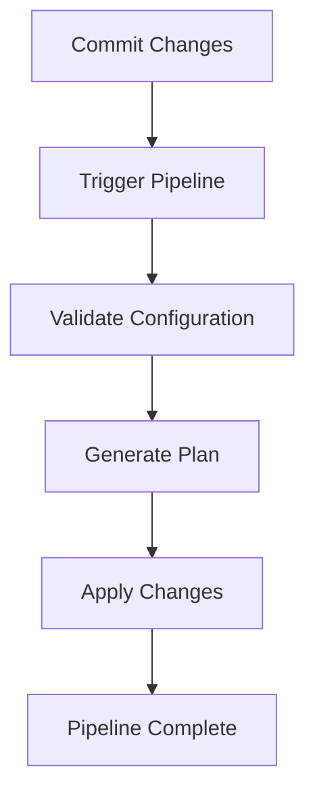

## Configuring Remote State for Terraform

Terraform uses a state file to keep track of the resources it manages. By default, this state file is stored locally. However, for a multi-user environment, it is essential to store the state file remotely to avoid conflicts and ensure consistency.

### Setting Up a Remote State Backend

To configure a remote state backend, you need to specify the backend configuration in your `main.tf` file. Here’s an example of setting up a remote state backend using an S3 bucket:

```hcl
terraform {
  backend "s3" {
    bucket = "my-tf-state-bucket"
    key    = "state/production.tfstate"
    region = "eu-west-3"
  }
}
```

### Creating the S3 Bucket

Before configuring the backend, you need to create the S3 bucket. You can do this using the AWS Management Console or the AWS CLI. Here’s an example using the AWS CLI:

```bash
aws s3api create-bucket --bucket my-tf-state-bucket --region eu-west-3 --create-bucket-configuration LocationConstraint=eu-west-3
```

### Initializing Terraform with Remote State

Once the backend is configured, you need to initialize Terraform to use the remote state:

```bash
terraform init
```

This command will initialize the backend and download any necessary plugins.

### GitLab CI/CD Pipeline Configuration

To integrate Terraform with a CI/CD pipeline, you need to configure a `.gitlab-ci.yml` file. Here’s an example configuration:

```yaml
stages:
  - validate
  - plan
  - apply

validate:
  stage: validate
  script:
    - terraform validate

plan:
  stage: plan
  script:
    - terraform plan -out=tfplan

apply:
  stage: apply
  script:
    - terraform apply -auto-approve tfplan
  when: manual
```

### Explanation of the Pipeline Stages

- **Validate**: Checks the syntax and structure of the Terraform configuration files.
- **Plan**: Generates a plan of the changes that will be applied.
- **Apply**: Applies the changes based on the generated plan.

### GitLab Runner Configuration

A GitLab Runner is required to execute the CI/CD pipeline. You can register a new runner using the following command:

```bash
sudo gitlab-runner register
```

Follow the prompts to configure the runner, including specifying the URL of your GitLab instance and a registration token.

### Centralized State Management

By using a remote state backend, you can manage the state centrally. This ensures that all team members are working with the same state and reduces the risk of conflicts.

### Handling Deleted Runners

If you delete a GitLab runner, you need to recreate it. This involves registering a new runner and updating the runner token in your configuration.

### Updating the Runner Token

When you recreate a runner, you need to update the token in your configuration. Here’s an example of updating the token in the `.gitlab-ci.yml` file:

```yaml
variables:
  GITLAB_RUNNER_TOKEN: "your-new-token"
```

### Pushing Changes and Triggering the Pipeline

After making changes to your configuration, you need to push the changes to the GitLab repository. This will trigger the pipeline automatically.

```bash
git add .
git commit -m "Add pipeline and terraform state"
git push
```

### Monitoring the Pipeline

You can monitor the pipeline execution by navigating to the GitLab project and checking the "Builds & Pipelines" section.

### Mermaid Diagram: Pipeline Flow

Here’s a mermaid diagram illustrating the pipeline flow:



### Common Pitfalls and How to Prevent Them

#### Pitfall: Misconfigured State Backend

**What Goes Wrong**: If the state backend is misconfigured, Terraform may fail to initialize or apply changes.

**How to Prevent**: Always double-check the backend configuration and ensure that the S3 bucket exists and is accessible.

#### Pitfall: Manual Approval Required

**What Goes Wrong**: Without proper configuration, the apply stage may require manual approval, leading to delays.

**How to Prevent**: Ensure that the `when: manual` directive is used appropriately and that team members are aware of the approval process.

### Secure Coding Practices

#### Vulnerable Pattern

```yaml
apply:
  stage: apply
  script:
    - terraform apply tfplan
```

#### Secure Pattern

```yaml
apply:
  stage: apply
  script:
    - terraform apply -auto-approve tfplan
  when: manual
```

### Detection and Prevention

#### Detection

- **Automated Testing**: Use automated testing tools to detect misconfigurations.
- **Logging and Monitoring**: Implement logging and monitoring to detect unauthorized changes.

#### Prevention

- **Access Controls**: Implement strict access controls to limit who can modify the state.
- **Regular Audits**: Conduct regular audits to ensure compliance with security policies.

### Real-World Example: CVE-2021-21277

In 2021, a vulnerability in Terraform allowed unauthorized users to manipulate the state file. This highlights the importance of securing the state file and implementing proper access controls.

### Practice Labs

For hands-on practice with Terraform and GitOps, consider the following labs:

- **PortSwigger Web Security Academy**: Offers a variety of labs related to web application security.
- **OWASP Juice Shop**: A deliberately insecure web application for practicing security skills.
- **DVWA (Damn Vulnerable Web Application)**: A PHP/MySQL web application that is riddled with vulnerabilities.

These labs provide practical experience in managing infrastructure using IaC and GitOps principles.

### Conclusion

By integrating IaC and GitOps practices, you can improve the reliability, security, and efficiency of your infrastructure management. Proper configuration of remote state and CI/CD pipelines ensures that your infrastructure is consistently managed and audited.

---
<!-- nav -->
[[04-Introduction to Infrastructure as Code (IaC) and GitOps|Introduction to Infrastructure as Code (IaC) and GitOps]] | [[DevSecOps/DevSecOps Bootcamp/04-Infrastructure Security/02-IaC and GitOps for DevSecOps/Configure Remote State for Terraform/00-Overview|Overview]] | [[06-Infrastructure as Code (IaC) and GitOps for DevSecOps|Infrastructure as Code (IaC) and GitOps for DevSecOps]]
