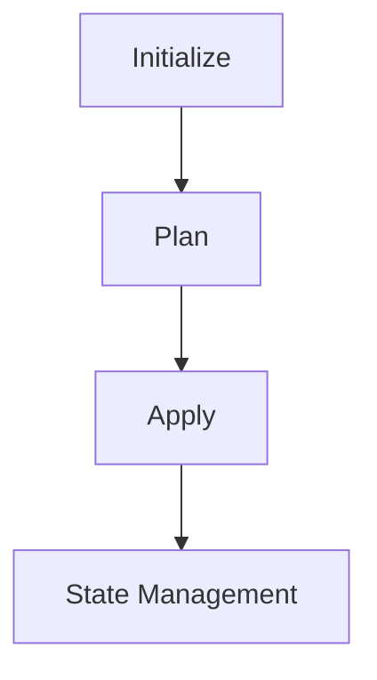

## Infrastructure as Code (IaC) and GitOps for DevSecOps

### Introduction to Infrastructure as Code (IaC)

Infrastructure as Code (IaC) is a practice where infrastructure is defined using declarative configuration files rather than being manually provisioned and managed. This approach allows developers and operations teams to manage infrastructure changes in a consistent, repeatable manner, similar to how application code is managed. Tools like Terraform, Ansible, and CloudFormation are commonly used for IaC.

#### Why Use IaC?

- **Consistency**: Ensures that environments are consistently deployed across different stages (development, testing, production).
- **Version Control**: Infrastructure configurations can be stored in version control systems, allowing tracking of changes and rollbacks.
- **Automation**: Automates the provisioning and management of infrastructure, reducing manual errors and improving efficiency.
- **Reproducibility**: Makes it easy to reproduce environments, which is crucial for testing and disaster recovery.

### Terraform Basics

Terraform is an open-source tool for building, changing, and versioning infrastructure safely and efficiently. It uses a declarative language called HCL (HashiCorp Configuration Language) to define infrastructure resources.

#### Terraform Workflow

1. **Initialization**: Downloads and installs the necessary provider plugins and initializes the backend.
2. **Planning**: Generates an execution plan based on the current state and the desired state defined in the configuration files.
3. **Applying**: Applies the changes to the infrastructure according to the execution plan.
4. **State Management**: Manages the state of the infrastructure, ensuring consistency between the actual and desired states.



### Configuring Remote State for Terraform

Remote state storage is essential for managing the state of Terraform-managed infrastructure. By default, Terraform stores the state locally in a file named `terraform.tfstate`. However, for multi-user and multi-environment setups, remote state storage is preferred.

#### Setting Up Remote State Storage

To set up remote state storage, you need to configure a backend in your Terraform configuration. Common backends include S3 buckets, Azure Blob Storage, and Google Cloud Storage.

##### Example: Using S3 Bucket for Remote State

1. **Create an S3 Bucket**:
   - Ensure the bucket is in a region accessible to your Terraform environment.
   - Set appropriate permissions for the bucket.

2. **Configure Backend in Terraform**:
   - Add a `backend` block to your `main.tf` file.

```hcl
terraform {
  backend "s3" {
    bucket = "my-tf-state-bucket"
    key    = "path/to/statefile"
    region = "us-west-2"
  }
}
```

3. **Initialize Terraform with Backend**:
   - Run `terraform init` to initialize the backend.

```bash
terraform init
```

### Permissions for S3 Bucket

For Terraform to interact with the S3 bucket, the IAM user or role must have the necessary permissions. The required permissions include:

- `s3:PutObject`
- `s3:GetObject`
- `s3:DeleteObject`
- `s3:ListBucket`

#### Example IAM Policy

Here is an example IAM policy that grants these permissions:

```json
{
    "Version": "2012-10-17",
    "Statement": [
        {
            "Effect": "Allow",
            "Action": [
                "s3:PutObject",
                "s3:GetObject",
                "s3:DeleteObject",
                "s3:ListBucket"
            ],
            "Resource": [
                "arn:aws:s3:::my-tf-state-bucket",
                "arn:aws:s3:::my-tf-state-bucket/*"
            ]
        }
    ]
}
```

### Handling Initialization Failures

During initialization, Terraform attempts to download provider plugins and initialize the backend. If the initialization fails, it could be due to insufficient permissions or other issues.

#### Example Error: Access Denied

```plaintext
Initializing the backend...
╷
│ Error: error configuring S3 Backend: Put "https://s3.amazonaws.com/my-tf-state-bucket/path/to/statefile?versioning=true&uploads=": Forbidden
```

This error indicates that the IAM user does not have the necessary permissions to access the S3 bucket.

#### How to Prevent / Defend

1. **Check IAM Policy**:
   - Ensure the IAM policy attached to the user or role includes the required permissions.
   - Verify the resource ARNs match the S3 bucket and path.

2. **Review S3 Bucket Policies**:
   - Check if there are any bucket policies that might restrict access.
   - Ensure the bucket policy allows the IAM user to perform the required actions.

3. **Secure-Coding Fixes**:
   - Always validate IAM policies and bucket policies before deploying.
   - Use least privilege principles to minimize exposure.

#### Secure-Coding Example

```json
{
    "Version": "2012-10-17",
    "Statement": [
        {
            "Effect": "Deny",
            "Action": [
                "s3:*"
            ],
            "NotResource": [
                "arn:aws:s3:::my-tf-state-bucket",
                "arn:aws:s3:::my-tf-state-bucket/*"
            ]
        },
        {
            "Effect": "Allow",
            "Action": [
                "s3:PutObject",
                "s3:GetObject",
                "s-3:DeleteObject",
                "s3:ListBucket"
            ],
            "Resource": [
                "arn:aws:s3:::my-tf-state-bucket",
                "arn:aws:s3:::my-tf-state-bucket/*"
            ]
        }
    ]
}
```

### Pipeline Integration

In a CI/CD pipeline, Terraform commands are typically executed as part of a pipeline job. The pipeline ensures that the infrastructure is consistently managed and updated.

#### Example Pipeline Steps

1. **Initialize Terraform**:
   - Run `terraform init` to initialize the backend.
   
2. **Plan Changes**:
   - Run `terraform plan` to generate an execution plan.
   
3. **Apply Changes**:
   - Run `terraform apply` to apply the changes.

```bash
# Initialize Terraform
terraform init

# Plan changes
terraform plan

# Apply changes
terraform apply --auto-approve
```

### Real-World Examples and Breaches

#### Recent CVEs and Breaches

- **CVE-2021-3278**: A vulnerability in Terraform's state locking mechanism allowed unauthorized users to modify the state file.
- **AWS S3 Bucket Exposure**: In 2020, several companies exposed their S3 buckets, leading to data breaches. Proper IAM policies and bucket policies are crucial to prevent such exposures.

#### How to Detect and Mitigate

1. **Regular Audits**:
   - Perform regular audits of IAM policies and S3 bucket policies.
   - Use tools like AWS Trusted Advisor to identify misconfigurations.

2. **Monitoring**:
   - Enable CloudTrail to monitor API calls made to S3.
   - Set up alerts for unauthorized access attempts.

3. **Least Privilege Principle**:
   - Grant the minimum necessary permissions to IAM users and roles.
   - Regularly review and revoke unnecessary permissions.

### Hands-On Labs

For practical experience with IaC and GitOps, consider the following labs:

- **PortSwigger Web Security Academy**: Focuses on web application security but includes sections on IaC and GitOps.
- **OWASP Juice Shop**: A deliberately insecure web application for learning about web security.
- **CloudGoat**: A series of labs designed to teach cloud security concepts using AWS.

These labs provide a comprehensive understanding of IaC and GitOps practices in a controlled environment.

### Conclusion

By understanding and implementing proper IaC and GitOps practices, organizations can significantly improve the security and reliability of their infrastructure. Proper configuration of remote state storage, careful management of permissions, and integration with CI/CD pipelines are critical components of a robust DevSecOps strategy.

---
<!-- nav -->
[[05-Configuring Remote State for Terraform|Configuring Remote State for Terraform]] | [[DevSecOps/DevSecOps Bootcamp/04-Infrastructure Security/02-IaC and GitOps for DevSecOps/Configure Remote State for Terraform/00-Overview|Overview]] | [[07-Managing Terraform State Locally|Managing Terraform State Locally]]
