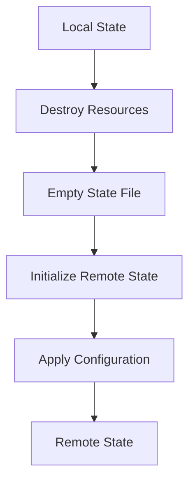

## Moving to Remote State Management

### Why Move to Remote State Management?

Moving to remote state management addresses the issues associated with local state management. By storing the state file in a centralized location, you ensure:

- **Consistency**: All team members access the same state file, reducing the risk of inconsistencies.
- **Version Control**: The state file can be version-controlled, allowing you to track changes and roll back to previous states.
- **Collaboration**: Multiple users can work on the same infrastructure without conflicts.

### How to Set Up Remote State in Terraform

To set up remote state in Terraform, you need to configure a backend. Terraform supports various backends, including Amazon S3, Azure Blob Storage, and Google Cloud Storage. In this example, we will use Amazon S3.

#### Step 1: Create an S3 Bucket

First, create an S3 bucket to store the Terraform state file. You can do this using the AWS Management Console or the AWS CLI.

```bash
aws s3api create-bucket --bucket my-tf-state-bucket --region us-west-2
```

#### Step 2: Configure Terraform Backend

Next, configure the Terraform backend to use the S3 bucket. Add the following configuration to your `main.tf` file:

```hcl
terraform {
  backend "s3" {
    bucket = "my-tf-state-bucket"
    key    = "terraform.tfstate"
    region = "us-west-2"
  }
}
```

#### Step 3: Initialize Terraform

After configuring the backend, initialize Terraform to set up the remote state.

```bash
terraform init
```

This command initializes the backend and sets up the remote state.

### Destroying the Current State

Before moving to the remote state, you need to destroy the current state. This ensures that the new state is created from scratch.

#### Step 1: Destroy the Current Resources

Run the `terraform destroy` command to delete the current resources.

```bash
terraform destroy -var-file="variables.tfvars"
```

This command destroys all the resources defined in your Terraform configuration.

#### Step 2: Verify the State File

After destroying the resources, verify that the state file is empty.

```bash
cat .terraform/terraform.tfstate
```

The state file should be empty, indicating that the current state has been destroyed.

### Migrating to Remote State

Now that the current state has been destroyed, you can migrate to the remote state.

#### Step 1: Initialize Terraform with Remote State

Initialize Terraform with the remote state backend.

```bash
terraform init
```

This command initializes the backend and sets up the remote state.

#### Step 2: Apply the Configuration

Apply the Terraform configuration to create the resources in the remote state.

```bash
terraform apply -var-file="variables.tfvars"
```

This command applies the configuration and creates the resources in the remote state.

### Mermaid Diagram: Terraform State Migration



### Pitfalls and Common Mistakes

#### Pitfall 1: Forgetting to Initialize the Backend

Forgetting to initialize the backend can lead to errors. Always run `terraform init` after configuring the backend.

#### Pitfall 2: Not Destroying the Current State

Not destroying the current state can result in conflicts and corrupted state files. Always destroy the current state before migrating to the remote state.

#### Pitfall 3: Incorrect Permissions

Incorrect permissions on the S3 bucket can prevent Terraform from accessing the state file. Ensure that the necessary permissions are set.

### How to Prevent / Defend

#### Detection

Regularly review the state file to ensure that it is consistent and up-to-date. Use tools like `terraform state list` to list the resources in the state file.

#### Prevention

- **Use Version Control**: Store the state file in a version-controlled repository to track changes and roll back to previous states.
- **Automate Initialization**: Automate the initialization of the backend to ensure that it is always set up correctly.
- **Set Correct Permissions**: Ensure that the necessary permissions are set on the S3 bucket to allow Terraform to access the state file.

#### Secure Coding Fixes

**Vulnerable Code**

```hcl
terraform {
  backend "local" {}
}
```

**Secure Code**

```hcl
terraform {
  backend "s3" {
    bucket = "my-tf-state-bucket"
    key    = "terraform.tfstate"
    region = "us-west-2"
  }
}
```

### Real-World Example: Recent Breach

In a recent breach, a company experienced significant downtime due to a misconfiguration in their infrastructure. The root cause was that multiple developers were managing the state locally, leading to conflicting changes and a corrupted state file. This incident highlights the importance of centralizing the Terraform state.

### Conclusion

Centralizing the Terraform state is crucial for managing infrastructure consistently and efficiently. By moving to remote state management, you ensure that all team members access the same state file, reducing the risk of inconsistencies and conflicts. This approach also enables version control and collaboration, making it easier to manage complex environments.

### Practice Labs

- **PortSwigger Web Security Academy**: Focuses on web application security but includes modules on IaC and GitOps.
- **OWASP Juice Shop**: A deliberately insecure web application for security training.
- **DVWA (Damn Vulnerable Web Application)**: A PHP/MySQL web application that is riddled with vulnerabilities.
- **WebGoat**: An interactive, gamified security training application.

These labs provide hands-on experience with IaC and GitOps principles, helping you to apply the concepts learned in this chapter.

---
<!-- nav -->
[[07-Managing Terraform State Locally|Managing Terraform State Locally]] | [[DevSecOps/DevSecOps Bootcamp/04-Infrastructure Security/02-IaC and GitOps for DevSecOps/Configure Remote State for Terraform/00-Overview|Overview]] | [[DevSecOps/DevSecOps Bootcamp/04-Infrastructure Security/02-IaC and GitOps for DevSecOps/Configure Remote State for Terraform/09-Practice Questions & Answers|Practice Questions & Answers]]
