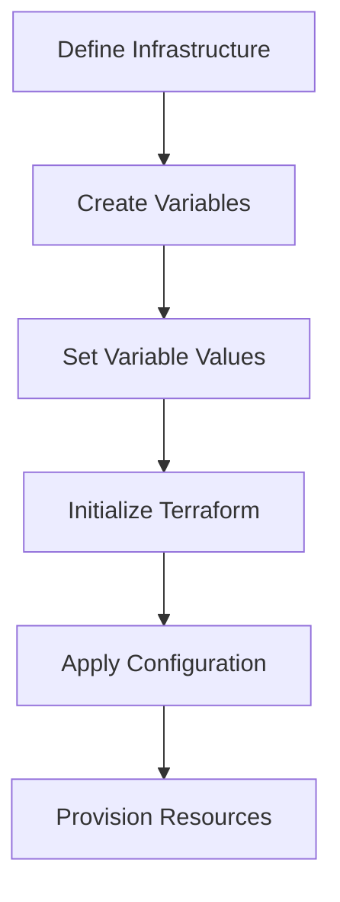
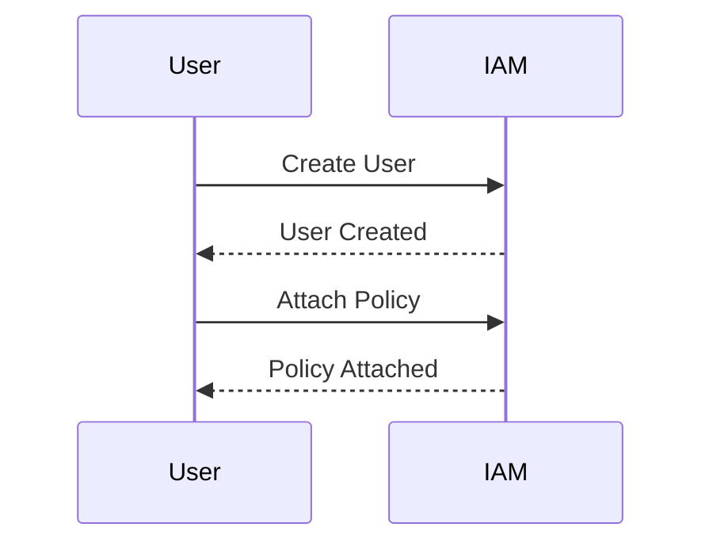

## Introduction to IaC and GitOps for DevSecOps

Infrastructure as Code (IaC) and GitOps are two fundamental concepts in modern DevSecOps practices. IaC allows infrastructure to be defined and managed through code, enabling reproducibility, version control, and automation. GitOps extends this by using Git as the single source of truth for all infrastructure changes, ensuring that the desired state of the infrastructure is always reflected in the repository.

### What is IaC?

Infrastructure as Code (IaC) is the practice of managing and provisioning computer data centers through machine-readable definition files, rather than physical hardware configuration or interactive configuration tools. This approach enables developers and operations teams to manage infrastructure in a consistent and repeatable manner, reducing human error and improving efficiency.

#### Why Use IaC?

1. **Reproducibility**: IaC ensures that environments can be consistently replicated across different stages (development, testing, production).
2. **Version Control**: Using version control systems like Git allows tracking changes, rollbacks, and collaboration among team members.
3. **Automation**: Automating infrastructure provisioning reduces manual errors and speeds up deployment processes.
4. **Consistency**: Ensures that all environments are configured identically, reducing the risk of configuration drift.

#### How Does IaC Work?

IaC typically involves defining infrastructure configurations in declarative files using domain-specific languages (DSLs). These files are then processed by IaC tools to provision and manage the infrastructure. Common IaC tools include Terraform, Ansible, Puppet, and Chef.

### What is GitOps?

GitOps is an operational framework that uses Git as the single source of truth for all infrastructure and application configurations. It leverages Git's powerful features such as branching, merging, and pull requests to manage and deploy infrastructure changes.

#### Why Use GitOps?

1. **Single Source of Truth**: All infrastructure and application configurations are stored in a Git repository, providing a centralized and auditable record.
2. **Collaboration**: Teams can collaborate on infrastructure changes using familiar Git workflows.
3. **Auditability**: Every change is tracked and can be reviewed, ensuring transparency and accountability.
4. **Automated Rollouts**: Changes can be automatically deployed based on Git commits, ensuring consistency and reducing manual intervention.

#### How Does GitOps Work?

In GitOps, the desired state of the infrastructure is defined in Git repositories. Operators use tools like Flux, Argo CD, or GitOps operators to continuously reconcile the actual state with the desired state. This ensures that the infrastructure remains in sync with the Git repository.

### Terraform Basics

Terraform is an open-source IaC tool developed by HashiCorp. It allows you to define and provision infrastructure using declarative configuration files written in the HashiCorp Configuration Language (HCL).

#### Key Concepts in Terraform

1. **Providers**: Terraform providers are plugins that allow Terraform to interact with different cloud platforms and services. Each provider corresponds to a specific cloud service or API.
2. **Resources**: Resources represent the components of your infrastructure, such as virtual machines, databases, or storage buckets.
3. **Variables**: Variables allow you to parameterize your Terraform configuration, making it more flexible and reusable.
4. **Outputs**: Outputs allow you to export values from your Terraform configuration, which can be used in other parts of your infrastructure or in other Terraform configurations.

### Setting Up Terraform for AWS

To set up Terraform for AWS, you need to define your infrastructure in Terraform configuration files and configure the necessary variables.

#### Example Terraform Configuration

```hcl
provider "aws" {
  region = var.region
}

resource "aws_instance" "example" {
  ami           = "ami-0c55b159cbfafe1f0"
  instance_type = "t2.micro"

  tags = {
    Name = "example-instance"
  }
}
```

#### Variables in Terraform

Variables in Terraform allow you to parameterize your configuration. You can define variables in a `variables.tf` file and set their values in a `terraform.tfvars` file.

```hcl
variable "region" {
  description = "The AWS region to deploy resources."
  type        = string
}

variable "access_key" {
  description = "AWS access key."
  type        = string
}

variable "secret_key" {
  description = "AWS secret key."
  type        = string
}
```

#### Setting Variable Values

You can set the values of these variables in a `terraform.tfvars` file:

```hcl
region = "us-west-2"
access_key = "your-access-key"
secret_key = "your-secret-key"
```

### Creating a New User in AWS

To create a new user in AWS for Terraform, follow these steps:

1. Log in to the AWS Management Console.
2. Navigate to the IAM (Identity and Access Management) service.
3. Click on "Users" and then "Add user".
4. Provide a username (e.g., `TF_user`).
5. Select "Programmatic access" and click "Next".
6. Attach the necessary policies (e.g., `AmazonEC2FullAccess`).
7. Review and create the user.

#### Example IAM Policy

```json
{
  "Version": "2012-10-17",
  "Statement": [
    {
      "Effect": "Allow",
      "Action": "ec2:*",
      "Resource": "*"
    }
  ]
}
```

### Terraform Execution

Once the user is created and the necessary variables are set, you can execute the Terraform project.

#### Initializing Terraform

```sh
terraform init
```

#### Applying the Configuration

```sh
terraform apply
```

### Real-World Examples and CVEs

#### CVE-2021-20225: AWS IAM Policy Misconfiguration

A misconfigured IAM policy allowed unauthorized access to sensitive resources. This could have been prevented by using IaC to ensure consistent and secure configurations.

#### Example Vulnerable IAM Policy

```json
{
  "Version": "2012-10-17",
  "Statement": [
    {
      "Effect": "Allow",
      "Action": "*",
      "Resource": "*"
    }
  ]
}
```

#### Secure IAM Policy

```json
{
  "Version": "2012-10-17",
  "Statement": [
    {
      "Effect": "Allow",
      "Action": "ec2:*",
      "Resource": "*"
    }
  ]
}
```

### How to Prevent / Defend

#### Detection

Use tools like AWS Config and AWS Trusted Advisor to monitor and detect misconfigurations.

#### Prevention

1. **Use IaC**: Ensure all infrastructure is defined and managed through IaC.
2. **Enforce Policies**: Use IAM policies to restrict access and enforce least privilege.
3. **Regular Audits**: Conduct regular audits of IAM policies and configurations.

### Mermaid Diagrams

#### Terraform Workflow



#### IAM User Creation Flow



### Conclusion

By leveraging IaC and GitOps, organizations can achieve greater consistency, automation, and security in their infrastructure management. Terraform is a powerful tool for defining and provisioning infrastructure, and using it effectively requires careful planning and execution. By following best practices and using tools like AWS Config and IAM policies, you can ensure that your infrastructure remains secure and compliant.

### Practice Labs

For hands-on experience with Terraform and AWS, consider the following labs:

- **PortSwigger Web Security Academy**: Offers a variety of labs related to web application security, including some that involve IaC and GitOps.
- **OWASP Juice Shop**: A deliberately insecure web application for security training.
- **DVWA (Damn Vulnerable Web Application)**: Another popular web application for security training.
- **WebGoat**: An interactive web application designed to teach web application security lessons.

These labs provide practical experience in applying IaC and GitOps principles to real-world scenarios.

---
<!-- nav -->
[[DevSecOps/DevSecOps Bootcamp/04-Infrastructure Security/02-IaC and GitOps for DevSecOps/Terraform Script for AWS Infrastructure Provisioning/00-Overview|Overview]] | [[DevSecOps/DevSecOps Bootcamp/04-Infrastructure Security/02-IaC and GitOps for DevSecOps/Terraform Script for AWS Infrastructure Provisioning/02-Introduction to IaC and GitOps for DevSecOps|Introduction to IaC and GitOps for DevSecOps]]
