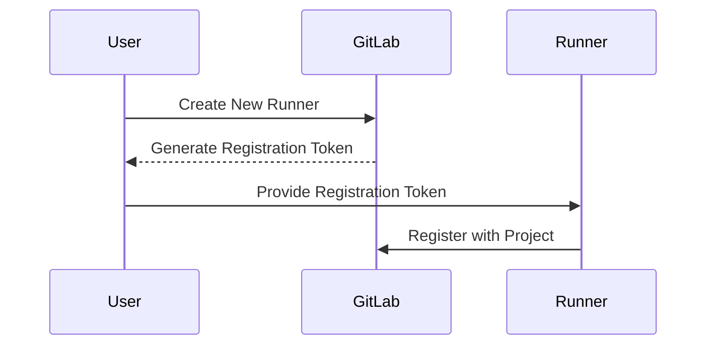
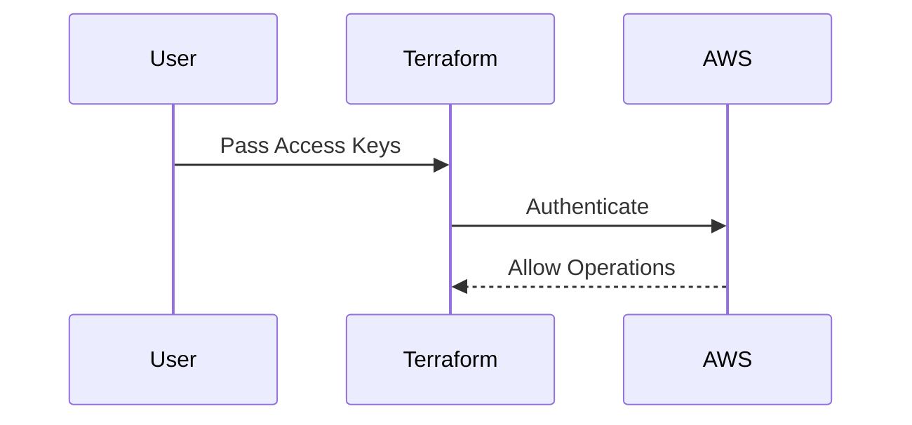

## Introduction to IaC and GitOps for DevSecOps

Infrastructure as Code (IaC) and GitOps are two fundamental concepts in modern DevSecOps practices. IaC allows infrastructure to be defined and managed through code, enabling automation, consistency, and version control. GitOps extends this by using Git as the single source of truth for infrastructure and application deployment. This chapter will focus on using Terraform for AWS infrastructure provisioning, including the necessary steps, variables, and security considerations.

### Terraform Basics

Terraform is an open-source infrastructure as code software tool created by HashiCorp. It allows you to define and provision your infrastructure using declarative configuration files written in the HashiCorp Configuration Language (HCL). Terraform supports a wide range of cloud providers, including AWS, Azure, Google Cloud Platform, and many others.

#### Why Use Terraform?

- **Consistency**: Terraform ensures that your infrastructure is consistent across different environments.
- **Automation**: Automates the provisioning and management of infrastructure.
- **Version Control**: Allows you to track changes to your infrastructure using version control systems like Git.
- **Multi-cloud Support**: Supports multiple cloud providers, making it easier to manage hybrid cloud environments.

### Registering Runners with Terraform

In the context of CI/CD pipelines, runners are agents that execute jobs. In GitLab, for example, runners are responsible for executing the build, test, and deploy stages of a pipeline. To register a runner with Terraform, you need to provide a registration token.

#### Registration Token

A registration token is a unique identifier used to register a runner with a specific project or group in GitLab. This token is generated when you create a new runner and is required to ensure that only authorized runners can register with the project.



### Passing Variables to Terraform Scripts

Terraform scripts often require variables to be passed during execution. These variables can include sensitive information such as access keys, regions, and other configuration details.

#### Access Keys

Access keys are used to authenticate with AWS services. They consist of an access key ID and a secret access key. These keys are essential for Terraform to communicate with AWS and perform operations.



#### AWS Region

The AWS region specifies the geographical location where your resources will be deployed. Terraform allows you to specify the region as a variable, providing flexibility in choosing the appropriate region based on your requirements.

```mermarkdown
graph LR
    A[User] --> B[Terraform]
    B --> C[AWS]
    C --> D[Region]
    D --> E[Resources]
```

### Example Terraform Script

Here is a complete example of a Terraform script that provisions an AWS EC2 instance:

```hcl
provider "aws" {
  region = var.aws_region
}

resource "aws_instance" "example" {
  ami           = "ami-0c55b159cbfafe1f0"
  instance_type = "t2.micro"

  tags = {
    Name = "example-instance"
  }
}
```

#### Variables File (`variables.tf`)

```hcl
variable "aws_access_key" {
  description = "AWS Access Key"
  type        = string
}

variable "aws_secret_key" {
  description = "AWS Secret Key"
  type        = string
}

variable "aws_region" {
  description = "AWS Region"
  type        = string
  default     = "us-west-2"
}
```

#### Example Usage

To run the Terraform script, you would use the following commands:

```sh
terraform init
terraform apply -var="aws_access_key=YOUR_ACCESS_KEY" -var="aws_secret_key=YOUR_SECRET_KEY" -var="aws_region=us-west-2"
```

### Security Considerations

When working with Terraform and AWS, it is crucial to consider security best practices to protect your infrastructure and data.

#### Secure Handling of Access Keys

Access keys should be handled securely to prevent unauthorized access. Here are some best practices:

- **Use IAM Roles**: Instead of using access keys, use IAM roles to grant permissions to EC2 instances.
- **Rotate Access Keys**: Regularly rotate access keys to minimize the risk of exposure.
- **Least Privilege Principle**: Grant only the minimum necessary permissions to access keys.

#### Example of IAM Role Configuration

```hcl
resource "aws_iam_role" "example" {
  name = "example-role"

  assume_role_policy = jsonencode({
    Version = "2012-10-17"
    Statement = [
      {
        Action = "sts:AssumeRole"
        Effect = "Allow"
        Principal = {
          Service = "ec2.amazonaws.com"
        }
      },
    ]
  })
}

resource "aws_iam_role_policy_attachment" "example" {
  policy_arn = "arn:aws:iam::aws:policy/AmazonEC2FullAccess"
  role       = aws_iam_role.example.name
}
```

### How to Prevent / Defend

#### Detection

- **Monitor API Calls**: Use AWS CloudTrail to monitor API calls and detect unauthorized access attempts.
- **Audit Logs**: Regularly review audit logs to identify any suspicious activity.

#### Prevention

- **IAM Policies**: Implement strict IAM policies to limit access to only necessary resources.
- **Multi-Factor Authentication (MFA)**: Enable MFA for IAM users to add an extra layer of security.

#### Secure Coding Fixes

**Vulnerable Code**

```hcl
resource "aws_instance" "example" {
  ami           = "ami-0c55b159cbfafe1f0"
  instance_type = "t2.micro"

  tags = {
    Name = "example-instance"
  }

  iam_instance_profile = "default-profile"
}
```

**Secure Code**

```hcl
resource "aws_instance" "example" {
  ami           = "ami-0c55b159cbfafe1f0"
  instance_type = "t2.micro"

  tags = {
    Name = "example-instance"
  }

  iam_instance_profile = aws_iam_instance_profile.example.name
}

resource "aws_iam_instance_profile" "example" {
  name = "example-profile"

  roles = [aws_iam_role.example.name]
}
```

### Real-World Examples

#### Recent Breaches

- **Capital One Data Breach (2019)**: A misconfigured AWS S3 bucket allowed unauthorized access to sensitive customer data. This breach highlights the importance of proper access controls and monitoring.

#### CVEs

- **CVE-2020-14771**: A vulnerability in AWS Elastic Load Balancing (ELB) allowed attackers to bypass security groups and access internal resources. This CVE underscores the need for regular security audits and updates.

### Hands-On Labs

For practical experience with Terraform and AWS, consider the following labs:

- **PortSwigger Web Security Academy**: Offers hands-on labs for web application security.
- **OWASP Juice Shop**: A deliberately insecure web application for practicing web security skills.
- **CloudGoat**: A series of labs designed to help you practice securing AWS environments.

### Conclusion

This chapter covered the basics of using Terraform for AWS infrastructure provisioning, including the use of variables, access keys, and regions. It also emphasized the importance of security best practices and provided examples of secure coding practices. By following these guidelines, you can ensure that your infrastructure is both efficient and secure.

---
<!-- nav -->
[[DevSecOps/DevSecOps Bootcamp/04-Infrastructure Security/02-IaC and GitOps for DevSecOps/Terraform Script for AWS Infrastructure Provisioning/01-Introduction to IaC and GitOps for DevSecOps Part 1|Introduction to IaC and GitOps for DevSecOps Part 1]] | [[DevSecOps/DevSecOps Bootcamp/04-Infrastructure Security/02-IaC and GitOps for DevSecOps/Terraform Script for AWS Infrastructure Provisioning/00-Overview|Overview]] | [[DevSecOps/DevSecOps Bootcamp/04-Infrastructure Security/02-IaC and GitOps for DevSecOps/Terraform Script for AWS Infrastructure Provisioning/03-Introduction to Infrastructure as Code (IaC) and GitOps for DevSecOps Part 1|Introduction to Infrastructure as Code (IaC) and GitOps for DevSecOps Part 1]]
