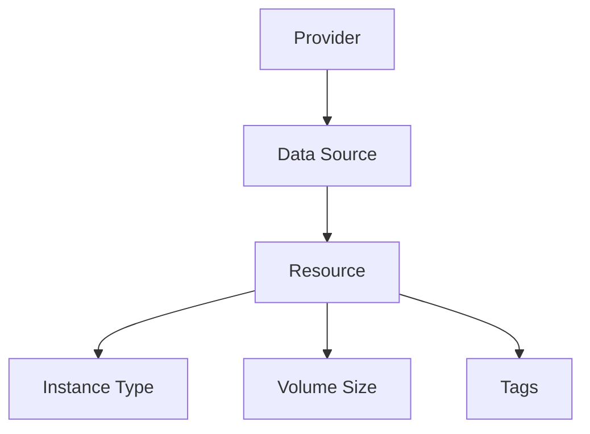

## Introduction to Infrastructure as Code (IaC) and GitOps for DevSecOps

### What is Infrastructure as Code (IaC)?

Infrastructure as Code (IaC) is a practice where infrastructure is managed and provisioned through code rather than manual processes. This means that the configuration and deployment of infrastructure components such as servers, networks, and storage are defined in code files, which can be version-controlled, tested, and deployed automatically. This approach brings several benefits:

- **Reproducibility**: Infrastructure can be consistently replicated across different environments.
- **Version Control**: Changes to infrastructure can be tracked and rolled back if necessary.
- **Automation**: Deployment and management tasks can be automated, reducing human error and increasing efficiency.

### What is GitOps?

GitOps is an operational framework that uses Git as a single source of truth for declarative infrastructure and application configurations. It extends the principles of IaC by using Git repositories to store and manage the desired state of the infrastructure. Key aspects of GitOps include:

- **Declarative Configuration**: Infrastructure and applications are described in declarative manifests.
- **Pull Requests**: Changes are proposed via pull requests, allowing for review and approval processes.
- **Automated Convergence**: Tools like Flux or Argo CD ensure that the actual state of the infrastructure matches the desired state in the Git repository.

### Why Use IaC and GitOps in DevSecOps?

In the context of DevSecOps, IaC and GitOps provide a robust foundation for integrating security practices into the continuous delivery pipeline. By treating infrastructure and configurations as code, teams can apply the same rigor to infrastructure as they do to application code, ensuring consistency, security, and compliance.

### Example: Terraform Script for AWS Infrastructure Provisioning

Let's dive into a detailed example using Terraform to provision AWS infrastructure. Terraform is a popular IaC tool that allows you to define and manage your infrastructure using declarative configuration files.

#### Background Theory

Before diving into the code, let's understand the key concepts involved:

- **Terraform**: An open-source IaC tool developed by HashiCorp. It uses a declarative language called HCL (HashiCorp Configuration Language) to describe infrastructure.
- **AWS Resources**: In AWS, various resources such as EC2 instances, VPCs, and S3 buckets can be provisioned using Terraform.
- **Modules**: Terraform modules are reusable components that encapsulate related resources and configurations. They help in maintaining clean and modular code.

#### Step-by-Step Mechanics

Let's walk through the process of creating an EC2 instance using Terraform:

1. **Define the Data Sources**:
   Before creating the EC2 instance, we need to fetch the required data from AWS. This includes the AMI (Amazon Machine Image), availability zones, and other configurations.

2. **Create the EC2 Instance**:
   Using the fetched data, we can now create the EC2 instance with the desired specifications.

3. **Configure the Instance**:
   Additional configurations such as volume size, instance type, and security groups can be set up.

#### Complete Example

Here is a complete example of a Terraform script to create an EC2 instance in AWS:

```hcl
provider "aws" {
  region = "us-west-2"
}

data "aws_ami" "example" {
  most_recent = true

  filter {
    name   = "name"
    values = ["amzn2-ami-hvm*"]
  }

  filter {
    name   = "virtualization-type"
    values = ["hvm"]
  }

  owners = ["amazon"]
}

resource "aws_instance" "example" {
  ami           = data.aws_ami.example.id
  instance_type = "t2.micro"

  tags = {
    Name = "example-instance"
  }
}
```

#### Explanation of Each Component

- **Provider Block**: Specifies the AWS provider and the region where the resources will be created.
- **Data Source**: Fetches the latest Amazon Linux 2 AMI.
- **Resource Block**: Creates an EC2 instance using the fetched AMI and sets the instance type and tags.

### Advanced Configuration

Now, let's add more advanced configurations such as volume size and instance type:

```hcl
resource "aws_instance" "example" {
  ami           = data.aws_ami.example.id
  instance_type = var.instance_type

  root_block_device {
    volume_size = var.volume_size
  }

  tags = {
    Name = "example-instance"
  }
}
```

#### Variables

To make the configuration more flexible, we can use variables:

```hcl
variable "instance_type" {
  description = "The EC2 instance type."
  default     = "t2.micro"
}

variable "volume_size" {
  description = "The size of the root volume in GB."
  default     = 16
}
```

### Real-World Example: Docker Image Size Issue

In the given transcript, there was a mention of Docker image size issues. Let's explore this scenario in detail:

#### Problem Description

When building Docker images on an EC2 instance, insufficient storage space can lead to build failures. To address this, we need to increase the volume size of the EC2 instance.

#### Solution

We can modify the Terraform script to increase the volume size:

```hcl
resource "aws_instance" "example" {
  ami           = data.aws_ami.example.id
  instance_type = var.instance_type

  root_block_device {
    volume_size = var.volume_size
  }

  tags = {
    Name = "example-instance"
  }
}
```

#### Variables

Update the variables to reflect the new volume size:

```hcl
variable "instance_type" {
  description = "The EC2 instance type."
  default     = "t2.micro"
}

variable "volume_size" {
  description = "The size of the root volume in GB."
  default     = 24
}
```

### Mermaid Diagrams

Let's visualize the architecture using a mermaid diagram:



### Common Pitfalls and How to Avoid Them

#### Pitfall: Hardcoding Values

Hardcoding values in the Terraform script can lead to maintenance issues and inconsistencies.

#### How to Avoid

Use variables and environment-specific configuration files to manage different environments.

#### Example

```hcl
variable "instance_type" {
  description = "The EC2 instance type."
  default     = "t2.micro"
}

variable "volume_size" {
  description = "The size of the root volume in GB."
  default     = 24
}
```

### Secure Coding Practices

#### Vulnerability: Insufficient Storage Space

Insufficient storage space can lead to build failures and downtime.

#### How to Prevent

Increase the volume size of the EC2 instance to accommodate larger Docker images.

#### Secure Code Example

```hcl
# Vulnerable code
resource "aws_instance" "example" {
  ami           = data.aws_ami.example.id
  instance_type = "t2.micro"

  root_block_device {
    volume_size = 16
  }

  tags = {
    Name = "example-instance"
  }
}

# Secure code
resource "aws_instance" "example" {
  ami           = data.aws_ami.example.id
  instance_type = var.instance_type

  root_block_device {
    volume_size = var.volume_size
  }

  tags = {
    Name = "example-instance"
  }
}
```

### Detection and Prevention

#### Detection

Regularly monitor the storage usage of EC2 instances to identify potential issues.

#### Prevention

- Increase the volume size based on the expected workload.
- Use auto-scaling groups to dynamically adjust the number of instances based on demand.

### Real-World Breach Examples

#### Example: CVE-2021-20225

This CVE highlights the importance of securing infrastructure configurations. In this case, a misconfigured AWS S3 bucket led to unauthorized access to sensitive data.

#### How to Prevent

- Use IAM roles and policies to restrict access to S3 buckets.
- Enable bucket policies to enforce encryption and logging.

### Hands-On Labs

For practical experience with IaC and GitOps, consider the following labs:

- **PortSwigger Web Security Academy**: Focuses on web application security but also covers IaC and GitOps principles.
- **OWASP Juice Shop**: A deliberately insecure web application for practicing security skills.
- **DVWA (Damn Vulnerable Web Application)**: Another web application for learning security concepts.

### Conclusion

By integrating IaC and GitOps into your DevSecOps workflow, you can achieve greater consistency, security, and automation in your infrastructure management. Terraform provides a powerful toolset for defining and managing your AWS infrastructure, and by following best practices, you can ensure that your infrastructure remains secure and compliant.

---
<!-- nav -->
[[DevSecOps/DevSecOps Bootcamp/04-Infrastructure Security/02-IaC and GitOps for DevSecOps/Terraform Script for AWS Infrastructure Provisioning/03-Introduction to Infrastructure as Code (IaC) and GitOps for DevSecOps Part 1|Introduction to Infrastructure as Code (IaC) and GitOps for DevSecOps Part 1]] | [[DevSecOps/DevSecOps Bootcamp/04-Infrastructure Security/02-IaC and GitOps for DevSecOps/Terraform Script for AWS Infrastructure Provisioning/00-Overview|Overview]] | [[05-Introduction to Infrastructure as Code (IaC) and GitOps for DevSecOps Part 3|Introduction to Infrastructure as Code (IaC) and GitOps for DevSecOps Part 3]]
