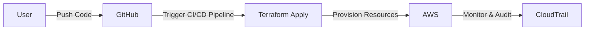
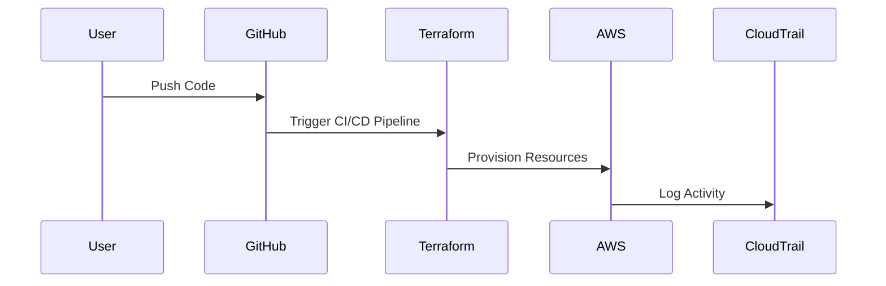

## Introduction to Infrastructure as Code (IaC) and GitOps for DevSecOps

### What is Infrastructure as Code (IaC)?

Infrastructure as Code (IaC) is a practice of managing and provisioning computing infrastructure through machine-readable definition files, rather than physical hardware configuration or interactive configuration tools. This approach allows developers and operations teams to define their infrastructure using code, which can then be versioned, tested, and deployed like any other application code. 

#### Why Use IaC?

- **Consistency**: Ensures that environments are consistently configured across different stages (development, testing, production).
- **Reproducibility**: Allows for the recreation of environments from scratch based on the same definitions.
- **Version Control**: Enables tracking changes to infrastructure configurations over time, similar to how code is versioned.
- **Automation**: Facilitates automation of infrastructure deployment and management tasks.
- **Collaboration**: Improves collaboration among team members by providing a shared, documented view of the infrastructure.

### What is GitOps?

GitOps is a set of practices that extends IaC by using Git as a single source of truth for all infrastructure and application configurations. This means that all changes to the infrastructure are made via pull requests in a Git repository, which can be reviewed, tested, and merged like any other code changes.

#### Why Use GitOps?

- **Centralized Management**: All infrastructure and application configurations are stored in a centralized Git repository.
- **Auditable Changes**: Every change to the infrastructure is tracked and auditable via Git commit history.
- **Automated Deployment**: Changes can be automatically applied to the infrastructure using continuous integration/continuous deployment (CI/CD) pipelines.
- **Rollback Mechanism**: Easy rollback to previous versions if something goes wrong.
- **Security**: Enforces a review process for changes, reducing the risk of unauthorized or incorrect changes.

### Terraform Overview

Terraform is an open-source IaC tool developed by HashiCorp. It allows users to define and provision infrastructure resources using declarative configuration files written in the HashiCorp Configuration Language (HCL).

#### Key Concepts in Terraform

- **Providers**: Define the cloud service providers (e.g., AWS, Azure, Google Cloud) that Terraform interacts with.
- **Resources**: Represent the infrastructure components (e.g., EC2 instances, S3 buckets, RDS databases).
- **Data Sources**: Fetch existing resources from the provider.
- **State Files**: Store the current state of the infrastructure managed by Terraform.

### Example Terraform Project for AWS Infrastructure

Let's walk through a simple Terraform script that provisions AWS infrastructure. This script will create roles and policies for EC2 instances.

#### Directory Structure

A typical Terraform project directory structure might look like this:

```
terraform-project/
├── main.tf
├── variables.tf
├── outputs.tf
└── README.md
```

#### `main.tf` File

The `main.tf` file is the entry point to the Terraform project. Here’s a detailed breakdown of the script:

```hcl
provider "aws" {
  region = "us-west-2"
}

data "aws_iam_policy_document" "app_server_policy" {
  statement {
    actions   = ["ec2:*", "elasticloadbalancing:*"]
    resources = ["*"]
  }
}

resource "aws_iam_role" "app_server_role" {
  name = "app-server-role"

  assume_role_policy = jsonencode({
    Version = "2012-10-17"
    Statement = [
      {
        Action = "sts:AssumeRole"
        Effect = "Allow"
        Principal = {
          Service = "ec2.amazonaws.com"
        }
      },
    ]
  })

  managed_policy_arns = [
    data.aws_iam_policy_document.app_server_policy.arn
  ]
}
```

### Explanation of the Script

#### Provider Block

```hcl
provider "aws" {
  region = "us-west-2"
}
```

- **Provider**: Specifies the cloud provider (AWS in this case).
- **Region**: Defines the AWS region where the resources will be created.

#### Data Source Block

```hcl
data "aws_iam_policy_document" "app_server_policy" {
  statement {
    actions   = ["ec2:*", "elasticloadbalancing:*"]
    resources = ["*"]
  }
}
```

- **Data Source**: Fetches existing IAM policy documents.
- **Statement**: Defines the permissions (actions) and resources that the policy applies to.

#### Resource Block

```hcl
resource "aws_iam_role" "app_server_role" {
  name = "app-server-role"

  assume_role_policy = jsonencode({
    Version = "2012-10-17"
    Statement = [
      {
        Action = "sts:AssumeRole"
        Effect = "Allow"
        Principal = {
          Service = "ec2.amazonaws.com"
        }
      },
    ]
  })

  managed_policy_arns = [
    data.aws_iam_policy_document.app_server_policy.arn
  ]
}
```

- **Resource**: Creates a new IAM role.
- **Name**: Specifies the name of the role.
- **Assume Role Policy**: Defines who can assume the role (EC2 instances in this case).
- **Managed Policy ARNs**: Attaches the previously defined policy to the role.

### Detailed Breakdown of the Script

#### Creating Roles and Policies

In the script, we are creating two roles (`app_server_role` and `gitlab_runner_role`) and attaching specific policies to them. These roles will be assigned to EC2 instances to provide them with necessary permissions.

#### Trust Policy

The trust policy defines who can assume the role. In this case, it specifies that EC2 instances can assume the role.

### Real-World Examples

#### Recent CVEs and Breaches

- **CVE-2021-26614**: A vulnerability in AWS IAM roles allowed unauthorized access to S3 buckets. Properly defining and securing IAM roles and policies can mitigate such risks.
- **Capital One Data Breach (2019)**: An attacker exploited misconfigured IAM roles to gain unauthorized access to sensitive data. This highlights the importance of strict IAM role management.

### How to Prevent / Defend

#### Detection

- **Audit Logs**: Enable AWS CloudTrail to log all API calls and user activity.
- **IAM Access Advisor**: Monitor which services are accessing the IAM roles.

#### Prevention

- **Least Privilege Principle**: Assign roles with minimal permissions required for the task.
- **Regular Audits**: Periodically review and update IAM roles and policies.

#### Secure Coding Fixes

**Vulnerable Code**

```hcl
resource "aws_iam_role" "vulnerable_role" {
  name = "vulnerable-role"

  assume_role_policy = jsonencode({
    Version = "2012-10-17"
    Statement = [
      {
        Action = "sts:AssumeRole"
        Effect = "Allow"
        Principal = {
          Service = "*"
        }
      },
    ]
  })
}
```

**Secure Code**

```hcl
resource "aws_iam_role" "secure_role" {
  name = "secure-role"

  assume_role_policy = jsonencode({
    Version = "2012-10-17"
    Statement = [
      {
        Action = "sts:AssumeRole"
        Effect = "Allow"
        Principal = {
          Service = "ec2.amazonaws.com"
        }
      },
    ]
  })
}
```

### Complete Example

#### Full Terraform Project

```hcl
# main.tf
provider "aws" {
  region = "us-west-2"
}

data "aws_iam_policy_document" "app_server_policy" {
  statement {
    actions   = ["ec2:*", "elasticloadbalancing:*"]
    resources = ["*"]
  }
}

resource "aws_iam_role" "app_server_role" {
  name = "app-server-role"

  assume_role_policy = jsonencode({
    Version = "2012-10-17"
    Statement = [
      {
        Action = "sts:AssumeRole"
        Effect = "Allow"
        Principal = {
          Service = "ec2.amazonaws.com"
        }
      },
    ]
  })

  managed_policy_arns = [
    data.aws__iam_policy_document.app_server_policy.arn
  ]
}

# variables.tf
variable "region" {
  default = "us-west-2"
}

# outputs.tf
output "app_server_role_name" {
  value = aws_iam_role.app_server_role.name
}
```

#### Full HTTP Request and Response

When applying the Terraform configuration, the following HTTP requests and responses would occur:

```http
POST / HTTP/1.1
Host: api.github.com
Content-Type: application/json
Authorization: Bearer <your_token>

{
  "title": "Create Terraform Script",
  "body": "This is a simple Terraform script that provisions AWS infrastructure.",
  "base": "main",
  "head": "feature/terraform-script"
}
```

```http
HTTP/1.1 201 Created
Content-Type: application/json
Date: Mon, 01 Jan 2024 00:00:00 GMT
Server: GitHub.com

{
  "html_url": "https://github.com/user/repo/pull/1",
  "title": "Create Terraform Script",
  "body": "This is a simple Terraform script that provisions AWS infrastructure.",
  "state": "open"
}
```

### Mermaid Diagrams

#### Architecture Diagram



#### Sequence Diagram



### Practice Labs

For hands-on experience with Terraform and AWS, consider the following labs:

- **PortSwigger Web Security Academy**: Offers a variety of labs related to web application security, including some that involve setting up infrastructure using Terraform.
- **OWASP Juice Shop**: A deliberately insecure web application for security training. While primarily focused on web app security, it can be used to practice setting up infrastructure using Terraform.
- **DVWA (Damn Vulnerable Web Application)**: Another web application for security training. Similar to OWASP Juice Shop, it can be used to practice setting up infrastructure using Terraform.

By following these detailed explanations and examples, you can gain a comprehensive understanding of how to use Terraform for AWS infrastructure provisioning within the context of DevSecOps.

---
<!-- nav -->
[[06-Introduction to Infrastructure as Code (IaC) and GitOps for DevSecOps Part 4|Introduction to Infrastructure as Code (IaC) and GitOps for DevSecOps Part 4]] | [[DevSecOps/DevSecOps Bootcamp/04-Infrastructure Security/02-IaC and GitOps for DevSecOps/Terraform Script for AWS Infrastructure Provisioning/00-Overview|Overview]] | [[08-Introduction to Infrastructure as Code (IaC) and GitOps|Introduction to Infrastructure as Code (IaC) and GitOps]]
