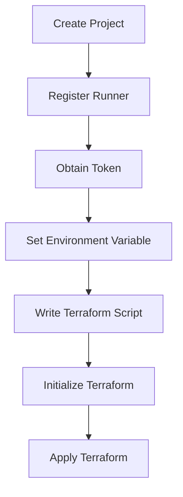

## Introduction to Infrastructure as Code (IaC) and GitOps

Infrastructure as Code (IaC) is a practice where infrastructure is defined using code, rather than being manually configured through graphical interfaces or command-line tools. This approach allows for automation, consistency, and version control of infrastructure configurations. GitOps is an extension of IaC that leverages Git as the single source of truth for infrastructure state and uses pull requests to manage changes. This ensures that all infrastructure changes go through a review process, improving collaboration and reducing errors.

### Terraform Basics

Terraform is one of the most popular tools for implementing IaC. It allows you to define your infrastructure using declarative configuration files written in the HashiCorp Configuration Language (HCL). Terraform supports a wide range of cloud providers, including AWS, Azure, Google Cloud, and many others.

#### Setting Up a Terraform Project

To start a Terraform project, you first need to initialize the directory by running:

```sh
terraform init
```

This command initializes the Terraform working directory, downloading necessary plugins and modules.

### Creating a Terraform Runner

In the context of the provided transcript, a "runner" typically refers to a service or agent that executes Terraform scripts. This could be a CI/CD pipeline runner, such as those used in GitLab, Jenkins, or GitHub Actions.

#### Example: Creating a Runner in GitLab

Let's walk through creating a runner in GitLab:

1. **Create a New Project**: First, create a new project in GitLab.
2. **Add a Runner**: In the project settings, navigate to the CI/CD section and click on Runners.
3. **Register a Runner**: Click on "Add a runner" and follow the instructions to register a new runner. You will need to provide a description and tags for the runner.

Here is an example of registering a runner via the command line:

```sh
sudo gitlab-runner register --non-interactive \
  --url "https://gitlab.com/" \
  --registration-token "YOUR_REGISTRATION_TOKEN" \
  --executor "shell" \
  --description "My Terraform Runner" \
  --tag-list "terraform"
```

### Obtaining the Token

Once the runner is registered, you will receive a token. This token is crucial for authenticating the runner with the GitLab server. You need to store this token securely and reference it in your Terraform scripts.

#### Storing Tokens Securely

It is essential to store tokens securely to prevent unauthorized access. One way to manage secrets is by using environment variables or secret management tools like HashiCorp Vault.

Example of setting an environment variable:

```sh
export TF_VAR_runner_token="your_runner_token_here"
```

### Executing the Terraform Script

With the runner and token in place, you can now execute your Terraform script. Here is an example of a simple Terraform script that provisions an AWS S3 bucket:

```hcl
provider "aws" {
  region = "us-west-2"
}

resource "aws_s3_bucket" "example" {
  bucket = "my-example-bucket"
}
```

To apply this configuration, run:

```sh
terraform init
terraform apply
```

### Mermaid Diagram: Terraform Workflow

A visual representation of the Terraform workflow can help understand the process better.



### Real-World Examples and Recent Breaches

Recent breaches involving misconfigured infrastructure highlight the importance of proper IaC practices. For instance, the Capital One breach in 2019 was partly due to misconfigured AWS S3 buckets. Proper use of IaC and GitOps can help prevent such issues by ensuring consistent and secure configurations.

### Common Pitfalls and How to Prevent Them

#### Misconfiguration of Resources

One common pitfall is misconfiguring resources, leading to security vulnerabilities. For example, leaving an S3 bucket publicly accessible can expose sensitive data.

**Vulnerable Code:**

```hcl
resource "aws_s3_bucket" "example" {
  bucket = "my-example-bucket"
  acl    = "public-read"
}
```

**Secure Code:**

```hcl
resource "aws_s3_bucket" "example" {
  bucket = "my-example-bucket"
  acl    = "private"
}
```

#### Lack of Version Control

Another issue is the lack of version control for infrastructure changes. Without version control, it becomes difficult to track changes and roll back to previous states.

**How to Prevent:**

Use GitOps principles to ensure all infrastructure changes are tracked in a Git repository. This allows for easy auditing and rollback.

### Detection and Prevention Strategies

#### Detection

Regular audits and scans can help detect misconfigurations. Tools like AWS Config and Terraform Sentinel can be used to enforce compliance rules.

**Example: Using AWS Config**

```sh
aws configservice describe-compliance-by-config-rule --config-rule-names my-config-rule
```

#### Prevention

Implementing strict policies and using automated tools can prevent misconfigurations. For example, using Terraform modules and enforcing best practices can reduce human error.

**Example: Enforcing Best Practices**

```hcl
module "s3_bucket" {
  source = "terraform-aws-modules/s3-bucket/aws"

  bucket = "my-example-bucket"
  acl    = "private"
}
```

### Hands-On Labs

For practical experience, consider the following labs:

- **PortSwigger Web Security Academy**: Offers exercises on securing web applications.
- **OWASP Juice Shop**: A deliberately insecure web application for practicing security skills.
- **DVWA (Damn Vulnerable Web Application)**: Another web application for learning about web application security.
- **WebGoat**: An interactive training application for learning about web application security.

These labs provide a safe environment to practice and learn about IaC and GitOps principles.

### Conclusion

Implementing Infrastructure as Code and GitOps principles can significantly improve the security and reliability of your infrastructure. By automating and versioning your infrastructure configurations, you can reduce human error and ensure consistent, secure deployments. Always remember to store secrets securely and regularly audit your configurations to catch and correct any misconfigurations.

---
<!-- nav -->
[[07-Introduction to Infrastructure as Code (IaC) and GitOps for DevSecOps|Introduction to Infrastructure as Code (IaC) and GitOps for DevSecOps]] | [[DevSecOps/DevSecOps Bootcamp/04-Infrastructure Security/02-IaC and GitOps for DevSecOps/Terraform Script for AWS Infrastructure Provisioning/00-Overview|Overview]] | [[09-Infrastructure as Code (IaC) and GitOps for DevSecOps Part 1|Infrastructure as Code (IaC) and GitOps for DevSecOps Part 1]]
