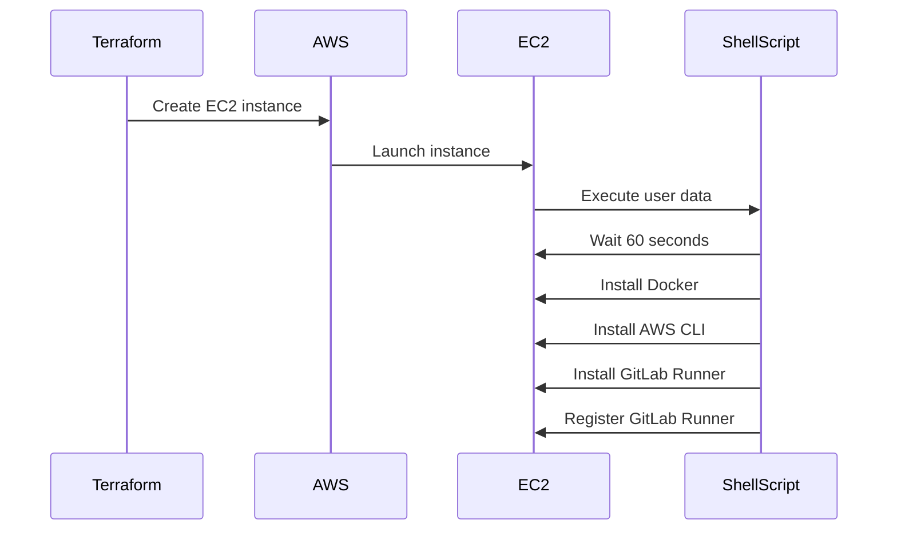

## Infrastructure as Code (IaC) and GitOps for DevSecOps

### Introduction to IaC and GitOps

Infrastructure as Code (IaC) is a practice where infrastructure is defined using declarative configuration files rather than manual processes. This approach allows developers and operations teams to manage infrastructure changes in a consistent, repeatable manner. GitOps extends this concept by treating the infrastructure configuration as code stored in a Git repository, enabling version control, collaboration, and automated deployment pipelines.

### Terraform Basics

Terraform is an open-source tool developed by HashiCorp that allows you to define and provision infrastructure using declarative configuration files written in the HashiCorp Configuration Language (HCL). Terraform supports various cloud providers, including AWS, Azure, Google Cloud Platform, and more.

#### Example Terraform Configuration for AWS

Here is a basic example of a Terraform configuration file (`main.tf`) that provisions an EC2 instance on AWS:

```hcl
provider "aws" {
  region = "us-west-2"
}

resource "aws_instance" "example" {
  ami           = "ami-0c55b159cbfafe1f0"
  instance_type = "t2.micro"

  tags = {
    Name = "example-instance"
  }
}
```

This configuration specifies the AWS provider, the region, and the details of the EC2 instance to be created.

### Understanding EC2 Instance States and Status Checks

When provisioning an EC2 instance using Terraform, it's important to understand the different states and status checks associated with the instance. These states help you track the lifecycle of the instance and ensure it is properly initialized before executing further commands.

#### EC2 Instance States

EC2 instances go through several states during their lifecycle:

- **pending**: The instance is being prepared for launch.
- **running**: The instance is running and ready to accept connections.
- **shutting-down**: The instance is shutting down.
- **terminated**: The instance has been terminated and is no longer available.

#### EC2 Status Checks

In addition to the instance states, EC2 instances also undergo status checks:

- **System status check**: Verifies the integrity of the underlying hardware supporting the instance.
- **Instance status check**: Verifies the health of the instance itself.

These status checks help ensure that the instance is fully initialized and ready for use.

### Waiting for Initialization with `sleep` Command

In the provided transcript, the `sleep` command is used to wait for 60 seconds before executing further commands. This is necessary because the EC2 instance might not be fully initialized even though it is in the `running` state. By waiting for a short period, you allow the server to complete its initialization process.

#### Example Terraform Configuration with `sleep` Command

Here is an extended example of a Terraform configuration that includes a `sleep` command:

```hcl
provider "aws" {
  region = "us-west-2"
}

resource "aws_instance" "example" {
  ami           = "ami-0c55b159cbfafe1f0"
  instance_type = "t2.micro"

  user_data = <<-EOF
    #!/bin/bash
    sleep 60
    # Additional commands can be added here
  EOF

  tags = {
    Name = "example-instance"
  }
}
```

In this example, the `user_data` field contains a shell script that waits for 60 seconds before executing additional commands.

### User Data and Initialization

User data is a feature in AWS that allows you to pass scripts or commands to an EC2 instance when it is launched. These scripts are executed once the instance is up and running. By using user data, you can automate the initialization process, such as installing software, configuring services, or setting up environment variables.

#### Example User Data Script

Here is an example user data script that installs Docker and AWS CLI:

```bash
#!/bin/bash
sleep 60
sudo apt-get update
sudo apt-get install -y docker.io
curl "https://awscli.amazonaws.com/awscli-exe-linux-x86_64.zip" -o "awscliv2.zip"
unzip awscliv2.zip
sudo ./aws/install
```

This script waits for 60 seconds, updates the package list, installs Docker, downloads and installs the AWS CLI.

### GitLab Runner Installation and Registration

GitLab Runner is a component of GitLab that runs CI/CD jobs. To set up a GitLab Runner on an EC2 instance, you need to install it and register it with your GitLab project.

#### Example GitLab Runner Installation and Registration

Here is an example script that installs GitLab Runner and registers it with a GitLab project:

```bash
#!/bin/bash
sleep 60
sudo apt-get update
sudo apt-get install -y curl
curl -L https://packages.gitlab.com/install/repositories/runner/gitlab-runner/script.deb.sh | sudo bash
sudo apt-get install -y gitlab-runner
sudo gitlab-runner register --non-interactive \
  --url "https://gitlab.example.com/" \
  --registration-token "your_registration_token" \
  --executor "shell" \
  --description "My Runner" \
  --tag-list "docker,aws"
```

This script waits for 60 seconds, updates the package list, installs necessary packages, installs GitLab Runner, and registers it with the GitLab project.

### Full Terraform Configuration Example

Here is a complete Terraform configuration example that includes the installation of Docker, AWS CLI, and GitLab Runner:

```hcl
provider "aws" {
  region = "us-west-2"
}

resource "aws_instance" "example" {
  ami           = "ami-0c55b159cbfafe1f0"
  instance_type = "t2.micro"

  user_data = <<-EOF
    #!/bin/bash
    sleep 60
    sudo apt-get update
    sudo apt-get install -y docker.io
    curl "https://awscli.amazonaws.com/awscli-exe-linux-x86_64.zip" -o "awscliv2.zip"
    unzip awscliv2.zip
    sudo ./aws/install
    sudo apt-get install -y curl
    curl -L https://packages.gitlab.com/install/repositories/runner/gitlab-runner/script.deb.sh | sudo bash
    sudo apt-get install -y gitlab-runner
    sudo gitlab-runner register --non-interactive \
      --url "https://gitlab.example.com/" \
      --registration-token "your_registration_token" \
      --executor "shell" \
      --description "My Runner" \
      --tag-list "docker,aws"
  EOF

  tags = {
    Name = "example-instance"
  }
}
```

### Mermaid Diagrams

To visualize the process of provisioning an EC2 instance and initializing it with user data, we can use a mermaid diagram:



### Pitfalls and Best Practices

#### Common Pitfalls

- **Insufficient waiting time**: Not waiting long enough for the instance to fully initialize can lead to errors.
- **Incorrect user data**: Incorrect or incomplete user data scripts can cause the initialization process to fail.
- **Security vulnerabilities**: Failing to secure the instance and the software installed on it can expose it to attacks.

#### Best Practices

- **Use version control**: Store your Terraform configurations in a Git repository to enable version control and collaboration.
- **Automate testing**: Use automated testing tools to verify the correctness of your Terraform configurations.
- **Secure configurations**: Ensure that your configurations follow security best practices, such as using secure passwords and enabling security features.

### How to Prevent / Defend

#### Detection

- **Monitoring**: Use monitoring tools to track the state and status checks of your EC2 instances.
- **Logging**: Enable logging to capture any errors or issues during the initialization process.

#### Prevention

- **Use secure configurations**: Follow security best practices when defining your Terraform configurations.
- **Automate security checks**: Use tools like `tfsec` to automatically check your Terraform configurations for security issues.

#### Secure Coding Fixes

Here is an example of a vulnerable Terraform configuration and its secure version:

**Vulnerable Configuration**

```hcl
resource "aws_instance" "example" {
  ami           = "ami-0c55b159cbfafe1f0"
  instance_type = "t2.micro"

  user_data = <<-EOF
    #!/bin/bash
    sudo apt-get update
    sudo apt-get install -y docker.io
    curl "https://awscli.amazonaws.com/awscli-exe-linux-x86_64.zip" -o "awscliv2.zip"
    unzip awscliv2.zip
    sudo ./aws/install
  EOF

  tags = {
    Name = "example-instance"
  }
}
```

**Secure Configuration**

```hcl
resource "aws_instance" "example" {
  ami           = "ami-0c55b159cbfafe1f0"
  instance_type = "t2.micro"

  user_data = <<-EOF
    #!/bin/bash
    sleep 60
    sudo apt-get update
    sudo apt-get install -y docker.io
    curl "https://awscli.amazonaws.com/awscli-exe-linux-x86_64.zip" -o "awscliv2.zip"
    unzip awscliv2.zip
    sudo ./aws/install
  EOF

  tags = {
    Name = "example-instance"
  }
}
```

### Real-World Examples

#### Recent CVEs and Breaches

- **CVE-2021-21277**: A vulnerability in the AWS CLI allowed attackers to execute arbitrary code on the system.
- **Breaches involving misconfigured EC2 instances**: Several high-profile breaches have occurred due to misconfigured EC2 instances that were exposed to the internet.

### Practice Labs

For hands-on experience with Terraform and GitOps, consider the following labs:

- **PortSwigger Web Security Academy**: Offers a variety of labs related to web application security.
- **OWASP Juice Shop**: A deliberately insecure web application for security training.
- **DVWA (Damn Vulnerable Web Application)**: Another popular web application for security training.
- **WebGoat**: An interactive web application security training tool.

By following these guidelines and best practices, you can effectively use Terraform and GitOps to manage your infrastructure in a secure and efficient manner.

---
<!-- nav -->
[[09-Infrastructure as Code (IaC) and GitOps for DevSecOps Part 1|Infrastructure as Code (IaC) and GitOps for DevSecOps Part 1]] | [[DevSecOps/DevSecOps Bootcamp/04-Infrastructure Security/02-IaC and GitOps for DevSecOps/Terraform Script for AWS Infrastructure Provisioning/00-Overview|Overview]] | [[11-Infrastructure as Code (IaC) and GitOps for DevSecOps|Infrastructure as Code (IaC) and GitOps for DevSecOps]]
