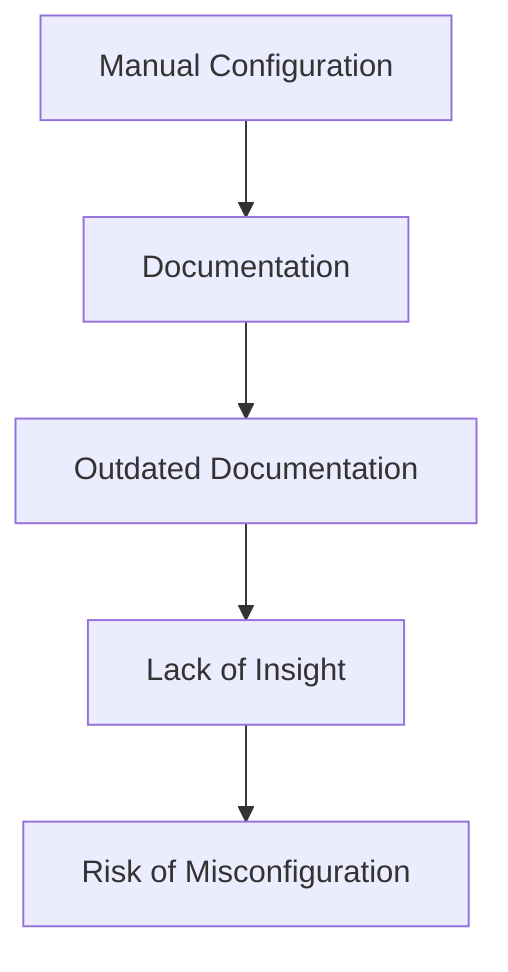
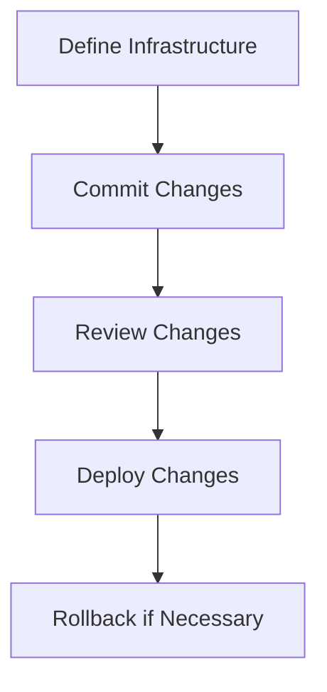
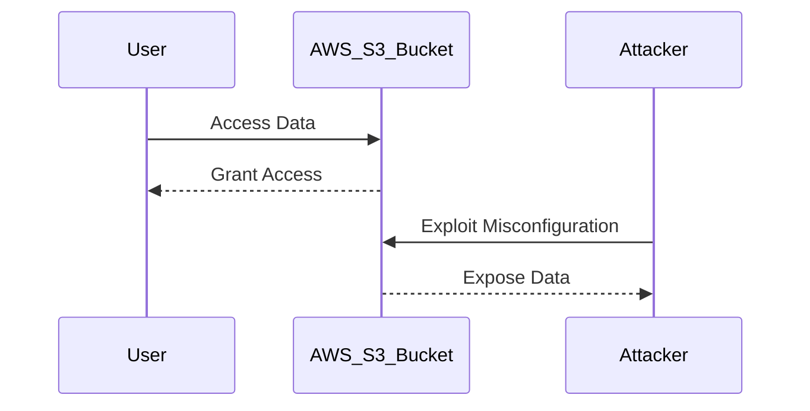
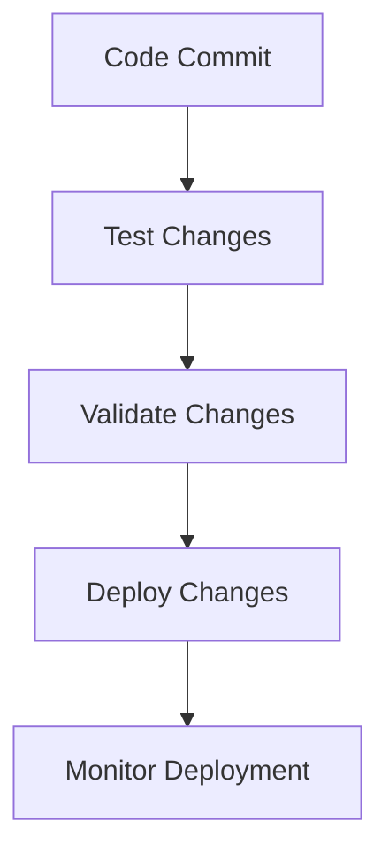
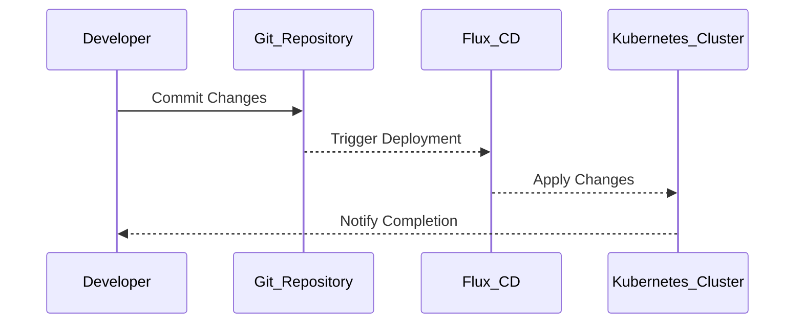

## Infrastructure as Code (IaC) and GitOps for DevSecOps

### Introduction to Infrastructure as Code (IaC)

Infrastructure as Code (IaC) is a practice in which infrastructure is defined using code rather than being manually configured. This approach allows for the automation of infrastructure deployment and management, making it more consistent, repeatable, and easier to manage. Traditionally, infrastructure was managed through manual processes, which required detailed documentation to keep track of configurations. However, maintaining such documentation is challenging and often leads to inconsistencies and outdated information.

#### Traditional Manual Configuration

In traditional environments, every change made to the infrastructure had to be meticulously documented. For example, if a new server was added to an environment, the documentation had to be updated to reflect this change. This process was time-consuming and prone to human error. As a result, the overall view of the infrastructure became fragmented and inaccurate over time.



#### Risks of Manual Configuration

The lack of proper documentation and oversight led to several risks:

1. **Infrastructure Misconfiguration**: Without a clear understanding of the infrastructure, it was easy to overlook misconfigurations. For instance, a forgotten open port could expose the system to unauthorized access.
   
2. **Human Error**: Manual processes are inherently error-prone. For example, an AWS user might be left with active credentials even after their role is no longer needed, leading to potential security vulnerabilities.

3. **Security Issues**: Junior operations engineers might introduce security issues through manual configurations without proper oversight. This lack of transparency made it difficult to identify and address these issues.

### Infrastructure as Code (IaC) Benefits

IaC addresses these challenges by providing a structured and automated way to manage infrastructure. By defining infrastructure using code, organizations can ensure consistency and reduce the risk of human error. Additionally, IaC enables version control, allowing changes to be tracked and reviewed.

#### Version Control and Change Management

Version control systems like Git are integral to IaC practices. They allow teams to track changes to infrastructure definitions, review changes before deployment, and roll back to previous versions if necessary. This ensures that the infrastructure remains consistent and secure.



### Real-World Examples of IaC

Recent real-world examples highlight the importance of IaC in maintaining secure infrastructure. For instance, the Capital One data breach in 2019 exposed sensitive customer data due to misconfigured AWS S3 buckets. This incident underscores the risks associated with manual configuration and the benefits of using IaC to enforce consistent and secure configurations.

#### Capital One Data Breach

In July 2019, Capital One disclosed a data breach that exposed personal information of approximately 100 million customers. The breach occurred due to a misconfigured AWS S3 bucket, which allowed unauthorized access to the data. This incident highlights the critical importance of proper configuration management and the potential risks of manual configuration.



### GitOps for DevSecOps

GitOps extends the principles of IaC by using Git as the single source of truth for infrastructure and application deployments. This approach leverages Git's version control capabilities to manage infrastructure and application configurations. GitOps emphasizes continuous integration and delivery (CI/CD) practices, ensuring that infrastructure and applications are deployed consistently and securely.

#### Continuous Integration and Delivery (CI/CD)

GitOps integrates seamlessly with CI/CD pipelines, enabling automated testing, validation, and deployment of infrastructure and applications. This ensures that changes are thoroughly tested before being deployed to production environments.



### Real-World Example of GitOps

A notable example of GitOps in action is the use of Flux CD, an open-source GitOps operator. Flux CD automates the deployment and management of Kubernetes clusters based on Git repositories. This ensures that the cluster's state is always aligned with the desired state defined in the Git repository.

#### Flux CD Example

Flux CD is a popular GitOps tool that automates the deployment and management of Kubernetes clusters. By using Git as the single source of truth, Flux CD ensures that the cluster's state is always consistent with the desired state defined in the Git repository.



### How to Prevent / Defend Against Misconfigurations

To mitigate the risks associated with infrastructure misconfigurations, organizations should adopt the following best practices:

1. **Implement IaC**: Define infrastructure using code and use version control systems like Git to manage changes.
   
2. **Automate Testing and Validation**: Integrate automated testing and validation into CI/CD pipelines to ensure that changes are thoroughly tested before deployment.
   
3. **Use Security Tools**: Utilize security tools like Trivy, tfsec, and kube-bench to scan for security vulnerabilities and misconfigurations.
   
4. **Regular Audits**: Conduct regular audits of infrastructure configurations to identify and address potential security issues.

#### Secure Coding Practices

Secure coding practices are essential for preventing misconfigurations. For example, using Terraform to define AWS resources ensures that configurations are consistent and secure.

```terraform
resource "aws_s3_bucket" "secure_bucket" {
  bucket = "secure-bucket"
  acl    = "private"

  lifecycle {
    prevent_destroy = true
  }
}
```

#### Vulnerable vs. Secure Configuration

Here is an example of a vulnerable configuration versus a secure configuration:

**Vulnerable Configuration:**
```terraform
resource "aws_s3_bucket" "vulnerable_bucket" {
  bucket = "vulnerable-bucket"
  acl    = "public-read"
}
```

**Secure Configuration:**
```terraform
resource "aws_s3_bucket" "secure_bucket" {
  bucket = "secure-bucket"
  acl    = "private"

  lifecycle {
    prevent_destroy = true
  }
}
```

### Conclusion

Infrastructure as Code (IaC) and GitOps are powerful practices that enhance the security and reliability of DevSecOps environments. By automating infrastructure management and leveraging version control systems, organizations can reduce the risk of misconfigurations and human errors. Adopting these practices ensures that infrastructure remains consistent, secure, and aligned with organizational goals.

### Hands-On Labs

For practical experience with IaC and GitOps, consider the following labs:

- **PortSwigger Web Security Academy**: Offers hands-on labs for web application security.
- **OWASP Juice Shop**: Provides a vulnerable web application for learning security concepts.
- **CloudGoat**: Focuses on cloud security and provides scenarios for practicing IaC and GitOps.
- **Pacu**: A penetration testing framework for AWS that includes IaC and GitOps scenarios.

These labs provide real-world scenarios and challenges to help you master IaC and GitOps in a DevSecOps context.

---
<!-- nav -->
[[DevSecOps/DevSecOps Bootcamp/04-Infrastructure Security/02-IaC and GitOps for DevSecOps/Understand Impact of IaC in Security DevSecOps/00-Overview|Overview]] | [[02-Infrastructure as Code (IaC) and GitOps for DevSecOps Part 2|Infrastructure as Code (IaC) and GitOps for DevSecOps Part 2]]
