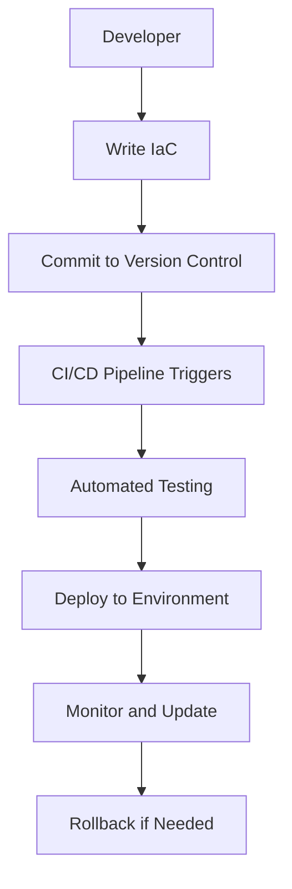

## Infrastructure as Code (IaC) and GitOps for DevSecOps

### Introduction to Infrastructure as Code (IaC)

Infrastructure as Code (IaC) is a practice where infrastructure is defined and managed through machine-readable files, typically written in a high-level language like YAML or JSON. This approach allows developers and operations teams to treat infrastructure configurations as code, enabling version control, automated testing, and continuous integration/continuous delivery (CI/CD) practices.

#### Why Use IaC?

1. **Consistency**: Ensures that all environments (development, staging, production) are consistently configured.
2. **Speed**: Automates the creation and modification of infrastructure, reducing manual effort and time.
3. **Scalability**: Facilitates scaling infrastructure up or down based on demand.
4. **Version Control**: Allows tracking changes to infrastructure configurations, making it easier to roll back to previous states if needed.
5. **Reproducibility**: Ensures that the same environment can be recreated multiple times, which is crucial for testing and disaster recovery.

### Challenges of Manual Configuration

Imagine an organization with a large infrastructure consisting of multiple environments (development, staging, production), multiple GitLab runners, database servers, and other AWS resources for secrets management and domain access. Manually configuring all these resources would be extremely time-consuming and error-prone. Here are some specific issues:

1. **Slow Deployment**: Manually creating and configuring numerous resources is slow and inefficient.
2. **Difficulty in Scaling**: Scaling infrastructure up or down based on load is challenging without automation.
3. **Inconsistent Configurations**: Ensuring that different environments (dev, test, prod) are consistently configured is nearly impossible without IaC.
4. **Error Prone**: Manual configuration increases the likelihood of human errors, leading to inconsistent and potentially insecure setups.

### Example: Manual Configuration vs. IaC

Consider a scenario where an organization needs to set up a new environment with an EC2 instance, a database server, and a secrets manager. Let’s compare manual configuration with IaC.

#### Manual Configuration

```plaintext
Step 1: Log into AWS console.
Step 2: Create an EC2 instance.
Step 3: Configure security groups and IAM roles.
Step 4: Launch the instance.
Step 5: Set up a database server.
Step 6: Configure the database server.
Step 7: Set up a secrets manager.
Step 8: Configure the secrets manager.
```

This process is slow, error-prone, and difficult to replicate consistently.

#### IaC Configuration

Using tools like AWS CloudFormation or Terraform, the entire setup can be defined in a single configuration file.

```yaml
# Example CloudFormation Template
Resources:
  EC2Instance:
    Type: 'AWS::EC2::Instance'
    Properties:
      ImageId: 'ami-0c55b159cbfafe1f0'
      InstanceType: 't2.micro'
      SecurityGroupIds:
        - !Ref SecurityGroup
      IamInstanceProfile: 'MyInstanceProfile'

  SecurityGroup:
    Type: 'AWS::EC2::SecurityGroup'
    Properties:
      GroupDescription: 'Allow SSH access'
      VpcId: 'vpc-12345678'
      SecurityGroupIngress:
        - IpProtocol: 'tcp'
          FromPort: '22'
          ToPort: '22'
          CidrIp: '0.0.0.0/0'

  DatabaseServer:
    Type: 'AWS::RDS::DBInstance'
    Properties:
      Engine: 'mysql'
      EngineVersion: '5.7.22'
      DBInstanceClass: 'db.t2.micro'
      AllocatedStorage: '20'
      MasterUsername: 'admin'
      MasterUserPassword: 'password'
      VpcSecurityGroupIds:
        - !Ref SecurityGroup

  SecretsManager:
    Type: 'AWS::SecretsManager::Secret'
    Properties:
      Name: 'MySecret'
      SecretString: '{"username": "admin", "password": "password"}'
```

This configuration file can be version-controlled, tested, and deployed automatically, ensuring consistency and speed.

### Mermaid Diagram: IaC Workflow



### Consistency Across Environments

Ensuring consistency across different environments (dev, test, prod) is critical for maintaining a reliable and secure infrastructure. With IaC, the same configuration can be applied to all environments, reducing the risk of configuration drift.

#### Example: Consistent Configuration

```yaml
# Example Terraform Configuration
provider "aws" {
  region = var.region
}

resource "aws_instance" "example" {
  ami           = "ami-0c55b159cbfafe1f0"
  instance_type = "t2.micro"

  tags = {
    Name = "example-instance"
  }
}
```

This configuration can be used across different environments by simply changing the `region` variable.

### Real-World Examples and Breaches

#### Example: Capital One Data Breach (CVE-2019-11510)

In 2019, Capital One suffered a data breach due to misconfigured AWS S3 buckets. The breach exposed sensitive customer data. This incident highlights the importance of consistent and secure configuration across all environments.

#### Example: Equifax Data Breach (CVE-2017-5638)

Equifax suffered a massive data breach in 2017 due to a vulnerability in Apache Struts. The breach exposed personal information of millions of customers. This incident underscores the need for consistent and secure configurations across all environments to prevent such vulnerabilities.

### How to Prevent / Defend

#### Secure Configuration Management

1. **Use IaC Tools**: Utilize tools like Terraform, CloudFormation, or Ansible to define and manage infrastructure configurations.
2. **Version Control**: Store IaC files in version control systems like Git to track changes and maintain history.
3. **Automated Testing**: Implement automated testing to validate configurations before deployment.
4. **CI/CD Integration**: Integrate IaC with CI/CD pipelines to ensure consistent and secure deployments.
5. **Least Privilege Principle**: Ensure that IAM roles and permissions are granted with the least privilege necessary.

#### Example: Secure IaC Configuration

```yaml
# Example Secure IaC Configuration
provider "aws" {
  region = var.region
}

resource "aws_instance" "example" {
  ami           = "ami-0c55b159cbfafe1f0"
  instance_type = "t2.micro"

  iam_instance_profile = aws_iam_instance_profile.example.name

  tags = {
    Name = "example-instance"
  }
}

resource "aws_iam_instance_profile" "example" {
  name = "example-profile"

  roles = [aws_iam_role.example.name]
}

resource "aws_iam_role" "example" {
  name = "example-role"

  assume_role_policy = jsonencode({
    Version = "2012-10-17"
    Statement = [
      {
        Action = "sts:AssumeRole"
        Effect = "Allow"
        Principal = {
          Service = "ec2.amazonaws.com"
        }
      },
    ]
  })

  managed_policy_arns = [
    "arn:aws:iam::aws:policy/AmazonSSMManagedInstanceCore",
  ]
}
```

#### Vulnerable vs. Secure Configuration

**Vulnerable Configuration**

```yaml
resource "aws_instance" "example" {
  ami           = "ami-0c55b159cbfafe1f0"
  instance_type = "t2.micro"

  tags = {
    Name = "example-instance"
  }
}
```

**Secure Configuration**

```yaml
resource "aws_instance" "example" {
  ami           = "ami-0c55b159cbfafe1f0"
  instance_type = "t2.micro"

  iam_instance_profile = aws_iam_instance_profile.example.name

  tags = {
   Name = "example-instance"
  }
}

resource "aws_iam_instance_profile" "example" {
  name = "example-profile"

  roles = [aws_iam_role.example.name]
}

resource "aws_iam_role" "example" {
  name = "example-role"

  assume_role_policy = jsonencode({
    Version = "2012-10-17"
    Statement = [
      {
        Action = "sts:AssumeRole"
        Effect = "Allow"
        Principal = {
          Service = "ec2.amazonaws.com"
        }
      },
    ]
  })

  managed_policy_arns = [
    "arn:aws:iam::aws:policy/AmazonSSMManagedInstanceCore",
  ]
}
```

### Hardening IaC Configurations

1. **Least Privilege**: Ensure IAM roles and permissions are granted with the least privilege necessary.
2. **Encryption**: Enable encryption for sensitive data stored in S3 buckets or databases.
3. **Monitoring**: Implement monitoring and logging to detect and respond to security incidents.
4. **Regular Audits**: Conduct regular audits of IaC configurations to identify and remediate vulnerabilities.

### Practice Labs

For hands-on experience with IaC and GitOps, consider the following labs:

- **Terraform Workshop**: Official Terraform workshop provided by HashiCorp.
- **CloudFormation Lab**: AWS CloudFormation lab provided by AWS.
- **GitOps Workshop**: GitOps workshop provided by Weaveworks.

These labs provide practical experience in defining, deploying, and managing infrastructure using IaC and GitOps principles.

### Conclusion

Infrastructure as Code (IaC) is a critical practice for DevSecOps teams to ensure consistent, secure, and scalable infrastructure configurations. By leveraging IaC tools and integrating them with CI/CD pipelines, organizations can significantly reduce the risk of configuration drift and security vulnerabilities. Regular audits and hardening practices further enhance the security posture of the infrastructure.

---
<!-- nav -->
[[02-Infrastructure as Code (IaC) and GitOps for DevSecOps Part 2|Infrastructure as Code (IaC) and GitOps for DevSecOps Part 2]] | [[DevSecOps/DevSecOps Bootcamp/04-Infrastructure Security/02-IaC and GitOps for DevSecOps/Understand Impact of IaC in Security DevSecOps/00-Overview|Overview]] | [[04-Infrastructure as Code (IaC) in DevSecOps|Infrastructure as Code (IaC) in DevSecOps]]
