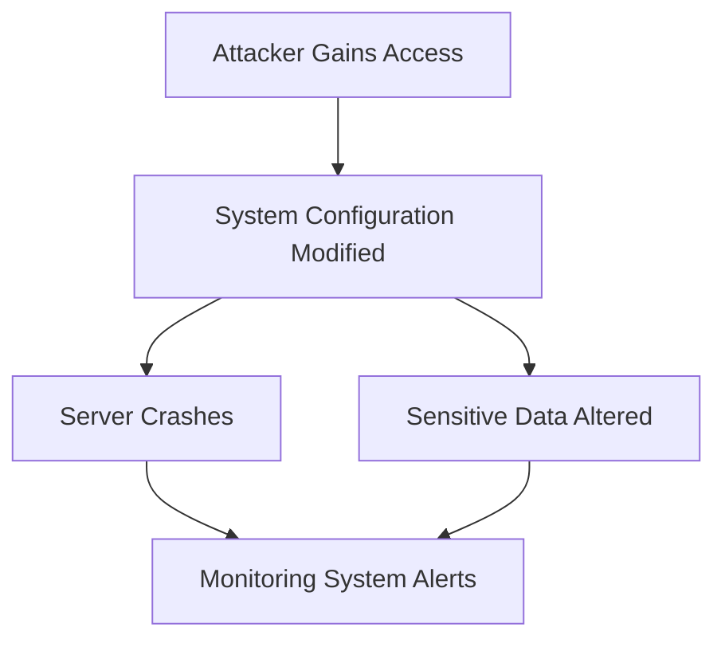
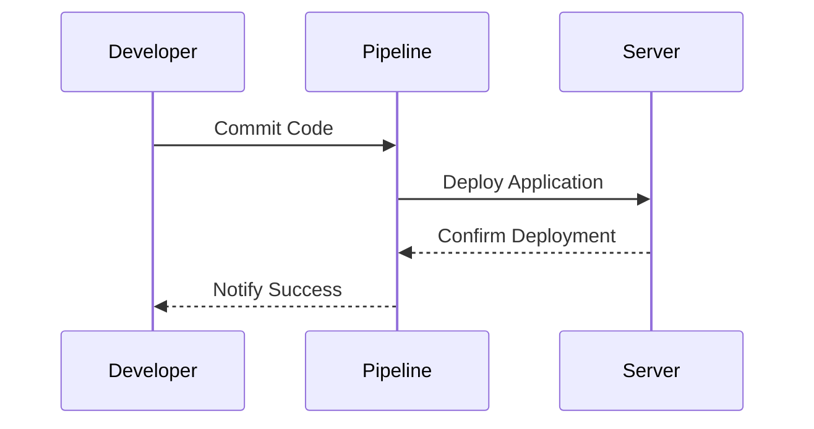
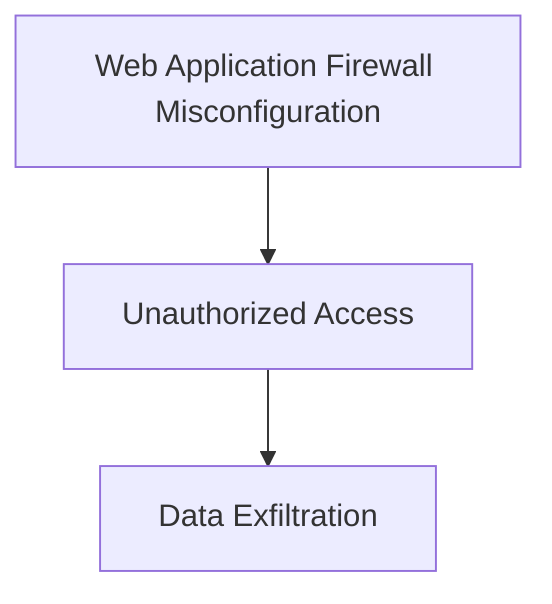
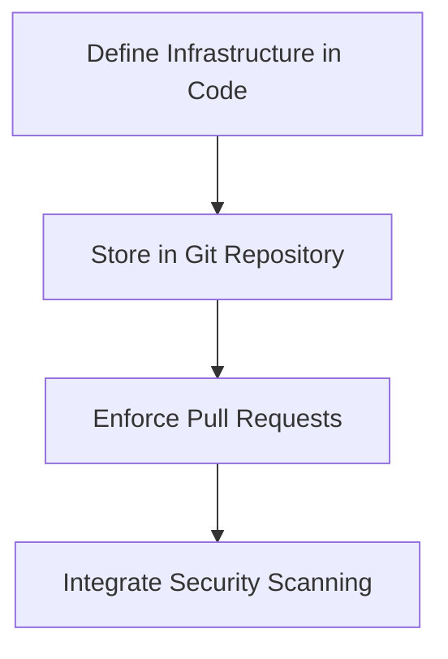

## Understanding the Impact of Infrastructure as Code (IaC) in Security DevSecOps

### Introduction to IaC and GitOps

Infrastructure as Code (IaC) is a practice in which infrastructure is defined using declarative configuration files rather than being set up manually. This approach allows for the automation of infrastructure deployment and management, making it more consistent, repeatable, and manageable. GitOps is an extension of IaC principles, where the desired state of the infrastructure is stored in a Git repository, and changes are made through pull requests, following the same workflow used for application code.

#### Why IaC Matters in Security DevSecOps

In the context of DevSecOps, IaC plays a crucial role in ensuring that security practices are integrated into the continuous integration and delivery (CI/CD) pipeline. By defining infrastructure in code, organizations can:

1. **Ensure Consistency**: Manual configurations can lead to inconsistencies across different environments, which can introduce security vulnerabilities. With IaC, the same configuration is applied consistently across all environments.
2. **Enable Version Control**: Storing infrastructure definitions in a version control system like Git allows teams to track changes, roll back to previous states, and audit changes for security compliance.
3. **Facilitate Automation**: Automated deployment pipelines can enforce security policies and checks at every stage, reducing the risk of human error and ensuring that security measures are consistently applied.

### Monitoring and Tracking System Changes

Monitoring is a critical component of DevSecOps, as it helps teams detect and respond to security incidents promptly. Without proper monitoring, organizations may not be aware of security issues until significant damage has been done.

#### Importance of Monitoring

Imagine a scenario where an attacker gains unauthorized access to a system and modifies the configuration. This could result in various adverse effects, such as crashing servers or altering sensitive data. Without monitoring, the organization might not realize that something is amiss until it's too late.



#### Challenges Without Monitoring

Without monitoring, it becomes extremely difficult to revert to the pre-attack state. Manually documenting and remembering all the configurations can be error-prone and time-consuming. This is where IaC comes into play, providing a centralized and auditable record of all infrastructure changes.

### Centralized View of Release Steps

In traditional manual processes, building applications, creating images, deploying to servers, and running tasks are often done ad hoc, leading to a lack of visibility and consistency. This can result in security vulnerabilities due to inconsistent configurations and manual errors.

#### Benefits of Automation

Automating these processes through IaC provides several advantages:

1. **Centralized View**: All steps in the release pipeline are documented and executed in a consistent manner, providing a clear and centralized view of the entire process.
2. **Auditability**: Every change is tracked and can be audited, ensuring that security policies are followed.
3. **Consistency**: Automated pipelines ensure that the same steps are executed every time, reducing the risk of human error.



### Real-World Examples and Breaches

Recent breaches and vulnerabilities highlight the importance of IaC and GitOps in maintaining security.

#### Example: Capital One Data Breach (CVE-2019-11510)

In 2019, Capital One suffered a data breach where an attacker gained unauthorized access to customer data. The breach was partly due to misconfigured web application firewall rules, which could have been prevented with better IaC practices.



#### How to Prevent / Defend

To prevent such breaches, organizations should implement the following:

1. **Use IaC Tools**: Utilize tools like Terraform, Ansible, or CloudFormation to define infrastructure in code.
2. **Implement GitOps Practices**: Store infrastructure definitions in a Git repository and enforce pull requests for changes.
3. **Automate Security Checks**: Integrate security scanning tools into the CI/CD pipeline to detect vulnerabilities early.



### Complete Example: Automated Release Pipeline

Let's walk through a complete example of an automated release pipeline using IaC and GitOps.

#### Step 1: Define Infrastructure in Code

Using Terraform, we can define the infrastructure in a `main.tf` file:

```hcl
provider "aws" {
  region = "us-west-2"
}

resource "aws_instance" "example" {
  ami           = "ami-0c55b159cbfafe1f0"
  instance_type = "t2.micro"

  tags = {
    Name = "example-instance"
  }
}
```

#### Step 2: Store in Git Repository

Push the `main.tf` file to a Git repository:

```bash
git init
git add main.tf
git commit -m "Initial commit"
git push origin master
```

#### Step 3: Enforce Pull Requests

Configure the Git repository to require pull requests for all changes. This ensures that every change is reviewed and tested before being merged.

#### Step 4: Integrate Security Scanning

Integrate a security scanning tool like Trivy into the CI/CD pipeline to scan for vulnerabilities in the infrastructure code.

```yaml
# .github/workflows/ci.yml
name: CI

on:
  push:
    branches:
      - master
  pull_request:
    branches:
      - master

jobs:
  build:
    runs-on: ubuntu-latest

    steps:
    - name: Checkout code
      uses: actions/checkout@v2

    - name: Install Terraform
      run: |
        wget https://releases.hashicorp.com/terraform/0.14.3/terraform_0.14.3_linux_amd64.zip
        unzip terraform_0.14.3_linux_amd64.zip
        mv terraform /usr/local/bin/

    - name: Run Terraform Validate
      run: terraform validate

    - name: Run Trivy Scan
      run: trivy iac .
```

### Common Pitfalls and Best Practices

#### Pitfall: Inconsistent Configurations

One common pitfall is having inconsistent configurations across different environments. This can lead to security vulnerabilities due to differences in settings.

**Best Practice**: Use IaC to ensure that the same configuration is applied consistently across all environments.

#### Pitfall: Lack of Monitoring

Another pitfall is the lack of monitoring, which can make it difficult to detect and respond to security incidents.

**Best Practice**: Implement comprehensive monitoring and logging to detect and respond to security incidents promptly.

### Conclusion

By integrating IaC and GitOps practices into the DevSecOps pipeline, organizations can significantly enhance their security posture. The benefits of automation, consistency, and auditability provided by IaC and GitOps cannot be overstated. Real-world examples and recent breaches underscore the importance of these practices in preventing and mitigating security risks.

### Hands-On Labs

For practical experience with IaC and GitOps, consider the following labs:

- **Terraform and Ansible**: Use Terraform and Ansible to define and deploy infrastructure in a controlled environment.
- **GitOps with Flux**: Set up a GitOps workflow using Flux to manage Kubernetes clusters.
- **Trivy Integration**: Integrate Trivy into a CI/CD pipeline to scan for vulnerabilities in infrastructure code.

These labs provide a hands-on approach to mastering IaC and GitOps in the context of DevSecOps.

---
<!-- nav -->
[[04-Infrastructure as Code (IaC) in DevSecOps|Infrastructure as Code (IaC) in DevSecOps]] | [[DevSecOps/DevSecOps Bootcamp/04-Infrastructure Security/02-IaC and GitOps for DevSecOps/Understand Impact of IaC in Security DevSecOps/00-Overview|Overview]] | [[DevSecOps/DevSecOps Bootcamp/04-Infrastructure Security/02-IaC and GitOps for DevSecOps/Understand Impact of IaC in Security DevSecOps/06-Practice Questions & Answers|Practice Questions & Answers]]
