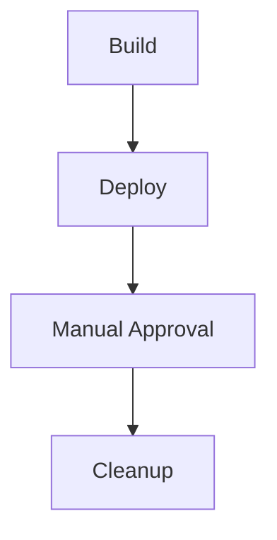
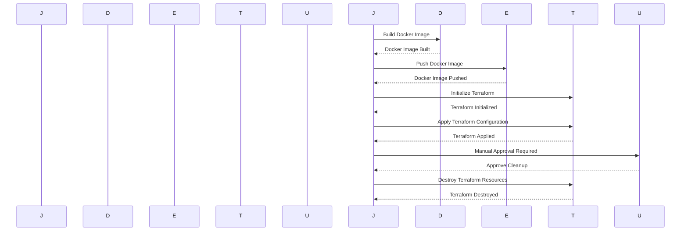

## Secure IaC Pipeline for EKS Provisioning

### Introduction to Infrastructure as Code (IaC)

Infrastructure as Code (IaC) is a practice of managing and provisioning infrastructure through machine-readable definition files, rather than physical hardware configuration or interactive configuration tools. This approach allows for automation, consistency, and version control of infrastructure configurations. In the context of DevSecOps, IaC plays a crucial role in ensuring that infrastructure is provisioned securely and consistently across environments.

### EKS (Elastic Kubernetes Service) Overview

Amazon Elastic Kubernetes Service (EKS) is a managed service that makes it easy to run Kubernetes on AWS without needing expertise in Kubernetes cluster setup and management. EKS eliminates the need to install and operate your own Kubernetes control plane, and provides scaling, availability, and security out-of-the-box.

### IaC Tools for EKS

Several tools are commonly used for IaC in EKS environments:

- **Terraform**: A popular IaC tool that allows you to define and provision infrastructure using declarative configuration files.
- **AWS CloudFormation**: An AWS-native service that allows you to create and manage AWS resources using templates.
- **Kubernetes Manifests**: YAML files that describe the desired state of Kubernetes resources.

### Setting Up an IaC Pipeline for EKS

To set up a secure IaC pipeline for EKS provisioning, you need to define stages for building, deploying, and cleaning up resources. Let's break down each stage and discuss the necessary steps.

#### Build Stage

The build stage typically involves compiling code, running tests, and preparing artifacts for deployment. For EKS, this might involve building Docker images and pushing them to a container registry like Amazon ECR.

```yaml
# Example Jenkinsfile for Build Stage
pipeline {
    agent any
    stages {
        stage('Build') {
            steps {
                script {
                    // Build Docker image
                    sh 'docker build -t myapp .'
                    // Push Docker image to ECR
                    withCredentials([usernamePassword(credentialsId: 'ecr-credentials', usernameVariable: 'AWS_ACCESS_KEY_ID', passwordVariable: 'AWS_SECRET_ACCESS_KEY')]) {
                        sh 'aws ecr get-login-password --region us-west-2 | docker login --username AWS --password-stdin <account-id>.dkr.ecr.us-west-2.amazonaws.com'
                        sh 'docker tag myapp:latest <account-id>.dkr.ecr.us-west-2.amazonaws.com/myapp:latest'
                        sh 'docker push <account-id>.dkr.ecr.us-west-2.amazonaws.com/myapp:latest'
                    }
                }
            }
        }
    }
}
```

#### Deploy Stage

The deploy stage involves applying the IaC definitions to provision the infrastructure and deploy the application. For EKS, this might involve creating Kubernetes resources using manifests or Terraform.

```yaml
# Example Jenkinsfile for Deploy Stage
pipeline {
    agent any
    stages {
        stage('Deploy') {
            steps {
                script {
                    // Apply Terraform configuration
                    sh 'terraform init'
                    sh 'terraform apply -auto-approve'
                }
            }
        }
    }
}
```

### Cleanup Job

A cleanup job is essential to ensure that resources are properly cleaned up after testing or development cycles. This prevents unnecessary costs and resource bloat. The cleanup job should be executed in a separate stage to ensure it runs independently of the deploy stage.

#### Adding a Cleanup Job

To add a cleanup job, you can modify your pipeline configuration to include a new stage for cleanup. This stage will execute `terraform destroy` to remove the resources created during the deploy stage.

```yaml
# Example Jenkinsfile with Cleanup Job
pipeline {
    agent any
    stages {
        stage('Build') {
            steps {
                script {
                    // Build Docker image
                    sh 'docker build -t myapp .'
                    // Push Docker image to ECR
                    withCredentials([usernamePassword(credentialsId: 'ecr-credentials', usernameVariable: 'AWS_ACCESS_KEY_ID', passwordVariable: 'AWS_SECRET_ACCESS_KEY')]) {
                        sh 'aws ecr get-login-password --region us-west-2 | docker login --username AWS --password-stdin <account-id>.dkr.ecr.us-west-2.amazonaws.com'
                        sh 'docker tag myapp:latest <account-id>.dkr.ecr.us-west-2.amazonaws.com/myapp:latest'
                        sh 'docker push <account-id>.dkr.ecr.us-west-2.amazonaws.com/myapp:latest'
                    }
                }
            }
        }
        stage('Deploy') {
            steps {
                script {
                    // Apply Terraform configuration
                    sh 'terraform init'
                    sh 'terraform apply -auto-approve'
                }
            }
        }
        stage('Cleanup') {
            steps {
                script {
                    // Destroy Terraform resources
                    sh 'terraform destroy -auto-approve'
                }
            }
        }
    }
}
```

### Manual Trigger for Cleanup

To ensure that the cleanup job is only executed manually, you can configure the pipeline to require a manual trigger. This can be done using a manual approval step in your CI/CD tool.

```yaml
# Example Jenkinsfile with Manual Approval for Cleanup
pipeline {
    agent any
    stages {
        stage('Build') {
            steps {
                script {
                    // Build Docker image
                    sh 'docker build -t myapp .'
                    // Push Docker image to ECR
                    withCredentials([usernamePassword(credentialsId: 'ecr-credentials', usernameVariable: 'AWS_ACCESS_KEY_ID', passwordVariable: 'AWS_SECRET_ACCESS_KEY')]) {
                        sh 'aws ecr get-login-password --region us-west-2 | docker login --username AWS --password-stdin <account-id>.dkr.ecr.us-west-2.amazonaws.com'
                        sh 'docker tag myapp:latest <account-id>.dkr.ecr.us-west-2.amazonaws.com/myapp:latest'
                        sh 'docker push <account-id>.dkr.ecr.us-west-2.amazonaws.com/myapp:latest'
                    }
                }
            }
        }
        stage('Deploy') {
            steps {
                script {
                    // Apply Terraform configuration
                    sh 'terraform init'
                    sh 'terraform apply -auto-approve'
                }
            }
        }
        stage('Manual Approval') {
            steps {
                input message: 'Approve cleanup?', ok: 'Approve'
            }
        }
        stage('Cleanup') {
            steps {
                script {
                    // Destroy Terraform resources
                    sh 'terraform destroy -auto-approve'
                }
            }
        }
    }
}
```

### Full Example of Pipeline Execution

Let's walk through a full example of how the pipeline would execute:

1. **Build Stage**:
   - Compiles the application code.
   - Builds the Docker image.
   - Pushes the Docker image to ECR.

2. **Deploy Stage**:
   - Initializes Terraform.
   - Applies the Terraform configuration to provision the EKS cluster and deploy the application.

3. **Manual Approval Stage**:
   - Waits for a manual approval to proceed with the cleanup.

4. **Cleanup Stage**:
   - Destroys the Terraform resources to clean up the environment.

### Real-World Examples and CVEs

#### Example: Cost Overruns Due to Unmanaged Resources

In a real-world scenario, unmanaged resources can lead to significant cost overruns. For instance, a company might spin up numerous test environments without proper cleanup procedures, leading to a large number of unused resources. This was highlighted in a breach where an organization was found to have left hundreds of EC2 instances running unnecessarily, resulting in a significant financial loss.

#### Example: CVE-2021-39288

CVE-2021-39288 is a vulnerability in Terraform that could allow an attacker to execute arbitrary code on the host system. This highlights the importance of securing your IaC pipeline and ensuring that all tools and dependencies are kept up-to-date.

### How to Prevent / Defend

#### Detection

To detect unmanaged resources, you can use AWS Cost Explorer to monitor your spending and identify unexpected charges. Additionally, you can use AWS Config to track changes to your resources and detect any unauthorized modifications.

#### Prevention

To prevent unmanaged resources, ensure that your IaC pipeline includes a cleanup stage that is triggered manually. This ensures that resources are only cleaned up when explicitly approved.

#### Secure Coding Fixes

Here is an example of a vulnerable pipeline configuration and the corresponding secure version:

**Vulnerable Configuration**:
```yaml
pipeline {
    agent any
    stages {
        stage('Build') {
            steps {
                script {
                    // Build Docker image
                    sh 'docker build -t myapp .'
                    // Push Docker image to ECR
                    withCredentials([usernamePassword(credentialsId: 'ecr-credentials', usernameVariable: 'AWS_ACCESS_KEY_ID', passwordVariable: 'AWS_SECRET_ACCESS_KEY')]) {
                        sh 'aws ecr get-login-password --region us-west-2 | docker login --username AWS --password-stdin <account-id>.dkr.ecr.us-west-2.amazonaws.com'
                        sh 'docker tag myapp:latest <account-id>.dkr.ecr.us-west-2.amazonaws.com/myapp:latest'
                        sh 'docker push <account-id>.dkr.ecr.us-west-2.amazonaws.com/myapp:latest'
                    }
                }
            }
        }
        stage('Deploy') {
            steps {
                script {
                    // Apply Terraform configuration
                    sh 'terraform init'
                    sh 'terraform apply -auto-approve'
                }
            }
        }
    }
}
```

**Secure Configuration**:
```yaml
pipeline {
    agent any
    stages {
        stage('Build') {
            steps {
                script {
                    // Build Docker image
                    sh 'docker build -t myapp .'
                    // Push Docker image to ECR
                    withCredentials([usernamePassword(credentialsId: 'ecr-credentials', usernameVariable: 'AWS_ACCESS_KEY_ID', passwordVariable: 'AWS_SECRET_ACCESS_KEY')]) {
                        sh 'aws ecr get-login-password --region us-west-2 | docker login --username AWS --password-stdin <account-id>.dkr.ecr.us-west-2.amazonaws.com'
                        sh 'docker tag myapp:latest <account-id>.dkr.ecr.us-west-2.amazonaws.com/myapp:latest'
                        sh 'docker push <account-id>.dkr.ecr.us-west-2.amazonaws.com/myapp:latest'
                    }
                }
            }
        }
        stage('Deploy') {
            steps {
                script {
                    // Apply Terraform configuration
                    sh 'terraform init'
                    sh 'terraform apply -auto-approve'
                }
            }
        }
        stage('Manual Approval') {
            steps {
                input message: 'Approve cleanup?', ok: 'Approve'
            }
        }
        stage('Cleanup') {
            steps {
                script {
                    // Destroy Terraform resources
                    sh 'terraform destroy -auto-approve'
                }
            }
        }
    }
}
```

### Diagrams

#### Pipeline Topology



#### Request/Response Flow



### Conclusion

By implementing a secure IaC pipeline for EKS provisioning, you can ensure that your infrastructure is provisioned consistently and securely. The addition of a cleanup job helps prevent unnecessary resource bloat and cost overruns. By following best practices and using tools like Terraform and Jenkins, you can create a robust and secure pipeline that meets the needs of your DevSecOps team.

### Practice Labs

For hands-on experience with secure IaC pipelines for EKS, consider the following labs:

- **PortSwigger Web Security Academy**: Focuses on web application security but can provide valuable insights into secure coding practices.
- **OWASP Juice Shop**: A deliberately insecure web application for security training.
- **CloudGoat**: A series of labs designed to help you understand and mitigate cloud security risks.
- **Pacu**: A framework for automating AWS security assessments.

These labs will help you gain practical experience in setting up and securing IaC pipelines for EKS environments.

---
<!-- nav -->
[[DevSecOps/DevSecOps Bootcamp/04-Infrastructure Security/03-Secure IaC Pipeline for EKS Provisioning/05-Summary and Wrap Up/00-Overview|Overview]] | [[02-Secure Infrastructure as Code (IaC) Pipeline for Amazon EKS Provisioning|Secure Infrastructure as Code (IaC) Pipeline for Amazon EKS Provisioning]]
