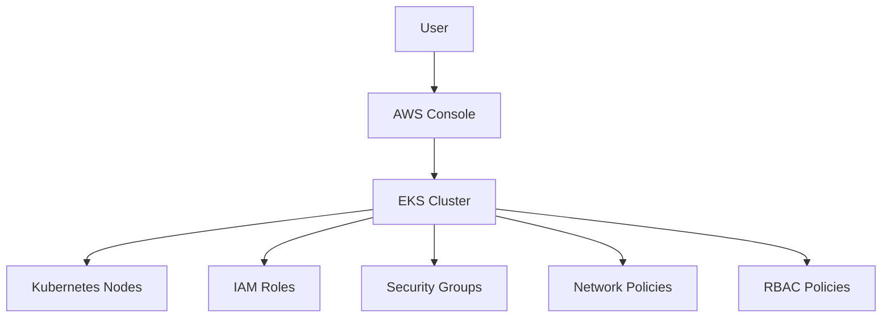
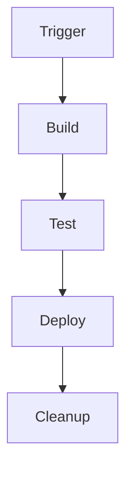

## Secure Infrastructure as Code (IaC) Pipeline for Amazon EKS Provisioning

In this section, we will delve into the details of creating a secure Infrastructure as Code (IaC) pipeline for Amazon Elastic Kubernetes Service (EKS) cluster provisioning and configuration. We will cover the entire process, including the theoretical background, practical implementation, and security considerations. By the end of this chapter, you should have a comprehensive understanding of how to automate EKS cluster provisioning securely and effectively.

### Background Theory

#### What is Infrastructure as Code (IaC)?

Infrastructure as Code (IaC) is a practice of managing and provisioning computer data centers through machine-readable definition files, rather than physical hardware configuration or interactive configuration tools. This approach allows for automation, consistency, and version control of infrastructure configurations.

#### Why Use IaC?

Using IaC offers several benefits:

- **Consistency**: Ensures that environments are consistently provisioned across different stages (development, testing, production).
- **Automation**: Reduces manual errors and speeds up deployment processes.
- **Version Control**: Allows tracking changes to infrastructure configurations, similar to source code.
- **Reproducibility**: Makes it easy to recreate environments, which is crucial for disaster recovery and scaling.

#### What is Amazon EKS?

Amazon Elastic Kubernetes Service (EKS) is a managed service that makes it easy to run Kubernetes on AWS without needing expertise in Kubernetes cluster setup and management. EKS supports the Kubernetes API, allowing you to use existing tools and plugins.

### Automating EKS Cluster Provisioning Using IaC

To automate EKS cluster provisioning, we typically use tools like Terraform, AWS CloudFormation, or even custom scripts. In this example, we will use Terraform, a popular IaC tool.

#### Step-by-Step Process

1. **Define the Infrastructure**: Write Terraform configuration files to define the EKS cluster and associated resources.
2. **Initialize Terraform**: Set up the necessary providers and dependencies.
3. **Plan the Deployment**: Review the proposed changes before applying them.
4. **Apply the Configuration**: Deploy the infrastructure as defined in the configuration files.
5. **Verify the Deployment**: Ensure that the EKS cluster and resources are correctly deployed.

#### Example Terraform Configuration

```hcl
provider "aws" {
  region = "us-west-2"
}

resource "aws_eks_cluster" "example" {
  name     = "example-cluster"
  role_arn = aws_iam_role.example.arn
  vpc_config {
    subnet_ids = [aws_subnet.example.id]
  }
}

resource "aws_iam_role" "example" {
  name = "example-role"

  assume_role_policy = jsonencode({
    Version = "2012-10-17"
    Statement = [
      {
        Action = "sts:AssumeRole"
        Effect = "Allow"
        Principal = {
          Service = "eks.amazonaws.com"
        }
      },
    ]
  })
}
```

### Adding Additional Steps to the Pipeline

Once the basic EKS cluster is provisioned, you can add additional steps to the pipeline for validation, security scans, and other tasks.

#### Validation Steps

- **Configuration Validation**: Use tools like `kubectl` to verify the cluster configuration.
- **Security Scans**: Integrate security scanning tools like Trivy or Aqua Security to scan the cluster for vulnerabilities.

#### Example Validation Script

```bash
#!/bin/bash

# Validate EKS cluster configuration
kubectl get nodes

# Run security scans
trivy image --severity CRITICAL,HIGH <your-image>
```

### Access Management in EKS

Access management is critical for securing the EKS cluster. We need to ensure that there are no static credentials and that access is controlled via roles and policies.

#### Role-Based Access Control (RBAC)

RBAC is a method of controlling access to resources based on the roles of individual users within the organization. In EKS, RBAC is implemented using Kubernetes roles and role bindings.

#### Example RBAC Configuration

```yaml
apiVersion: rbac.authorization.k8s.io/v1
kind: Role
metadata:
  namespace: default
  name: pod-reader
rules:
- apiGroups: [""]
  resources: ["pods"]
  verbs: ["get", "watch", "list"]

---
apiVersion: rbac.authorization.k8s.io/v1
kind: RoleBinding
metadata:
  name: read-pods
  namespace: default
subjects:
- kind: User
  name: jdoe
  apiGroup: rbac.authorization.k8s.io
roleRef:
  kind: Role
  name: pod-reader
  apiGroup: rbac.authorization.k8s.io
```

### Secure Access Permissions in the Pipeline

To ensure that the pipeline itself is secure, we need to manage access permissions carefully.

#### Temporary Credentials

Instead of using static credentials, we can use temporary credentials that are valid only for the duration of the job execution.

#### Example Job Execution with Temporary Credentials

```yaml
stages:
  - build
  - deploy

build:
  stage: build
  script:
    - echo "Building the application..."
    - docker build -t myapp .

deploy:
  stage: deploy
  script:
    - echo "Deploying the application..."
    - kubectl apply -f deployment.yaml
  environment:
    name: production
    url: http://myapp.com
  only:
    - master
```

### Preventing Credential Exposure

To prevent accidental exposure of credentials, we should avoid storing them in plain text in the pipeline configuration.

#### Example Secure Credential Usage

```yaml
variables:
  AWS_ACCESS_KEY_ID: $AWS_ACCESS_KEY_ID
  AWS_SECRET_ACCESS_KEY: $AWS_SECRET_ACCESS_KEY

stages:
  - build
  - deploy

build:
  stage: build
  script:
    - echo "Building the application..."
    - docker build -t myapp .

deploy:
  stage: deploy
  script:
    - echo "Deploying the application..."
    - kubectl apply -f deployment.yaml
  environment:
    name: production
    url: http://myapp.com
  only:
    - master
```

### Cleaning Up Resources

After completing the demo, it is essential to clean up the resources to avoid unnecessary costs.

#### Example Cleanup Script

```bash
#!/bin/bash

# Delete the EKS cluster
terraform destroy

# Verify that the resources are deleted
aws eks list-clusters
```

### Real-World Examples and Recent Breaches

#### Example: CVE-2021-20225

CVE-2021-20225 is a vulnerability in Kubernetes that allows an attacker to escalate privileges and gain unauthorized access to the cluster. This highlights the importance of keeping your Kubernetes clusters and related tools up to date.

#### Example: AWS S3 Bucket Exposure

A recent breach involved an S3 bucket being exposed due to misconfigured IAM roles and permissions. This emphasizes the need for proper access management and regular security audits.

### How to Prevent / Defend

#### Detection

- **Regular Audits**: Conduct regular security audits to identify and mitigate vulnerabilities.
- **Monitoring Tools**: Use monitoring tools like AWS CloudTrail and AWS Config to track changes and detect unauthorized access.

#### Prevention

- **Least Privilege Principle**: Ensure that users and services have only the minimum permissions required to perform their tasks.
- **IAM Policies**: Use IAM policies to restrict access to specific resources and actions.

#### Secure Coding Fixes

**Vulnerable Code**

```yaml
apiVersion: v1
kind: Pod
metadata:
  name: vulnerable-pod
spec:
  containers:
  - name: container1
    image: myimage
    securityContext:
      privileged: true
```

**Fixed Code**

```yaml
apiVersion: v1
kind: Pod
metadata:
  name: secure-pod
spec:
  containers:
  - name: container1
    image: myimage
    securityContext:
      privileged: false
```

### Diagrams and Topologies

#### Mermaid Diagram: EKS Cluster Architecture



#### Mermaid Diagram: Pipeline Flow



### Practice Labs

For hands-on experience with secure IaC pipelines for EKS, consider the following labs:

- **PortSwigger Web Security Academy**: Offers modules on Kubernetes security and IaC.
- **OWASP Juice Shop**: Provides a vulnerable web application for practicing security audits.
- **Kubernetes Goat**: A vulnerable Kubernetes cluster for penetration testing.

By following these guidelines and practices, you can ensure that your EKS cluster provisioning and configuration pipeline is both efficient and secure.

---
<!-- nav -->
[[01-Secure IaC Pipeline for EKS Provisioning|Secure IaC Pipeline for EKS Provisioning]] | [[DevSecOps/DevSecOps Bootcamp/04-Infrastructure Security/03-Secure IaC Pipeline for EKS Provisioning/05-Summary and Wrap Up/00-Overview|Overview]] | [[03-Secure Infrastructure as Code (IaC) Pipeline for EKS Provisioning|Secure Infrastructure as Code (IaC) Pipeline for EKS Provisioning]]
