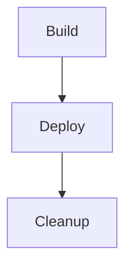

## Secure Infrastructure as Code (IaC) Pipeline for EKS Provisioning

### Introduction to IaC and EKS

Infrastructure as Code (IaC) is a practice of managing and provisioning infrastructure through machine-readable definition files, rather than physical hardware configuration or interactive configuration tools. This approach allows for automation, consistency, and version control of infrastructure configurations. Amazon Elastic Kubernetes Service (EKS) is a managed service that makes it easy to run Kubernetes on AWS without needing expertise in Kubernetes orchestration.

### Managing Resources in an IaC Pipeline

In an IaC pipeline, resources such as EKS clusters, Virtual Private Clouds (VPCs), and IAM roles are defined and provisioned using tools like Terraform. These definitions are stored in version-controlled repositories, ensuring that the infrastructure can be consistently deployed and updated.

#### Cleaning Up Resources

When working with IaC pipelines, it is essential to understand how to manage and clean up resources effectively. In many real-world scenarios, once the infrastructure is set up, it remains active to support ongoing workloads. However, there are situations where you might need to destroy or remove resources, either due to cost-saving measures or other operational requirements.

### Real-Life Scenarios for Resource Management

In a typical production environment, you would not frequently destroy and recreate the entire infrastructure. Instead, you would make adjustments and configuration changes as needed. However, during development, testing, or proof-of-concept phases, it is common to need to clean up resources to avoid unnecessary costs.

#### Example: Cost-Saving Measures

Consider a scenario where you are testing an EKS cluster setup and want to ensure that the resources are not left running indefinitely. In such cases, you can implement a cleanup process within your IaC pipeline to automatically destroy the resources after testing.

### Using Terraform for Resource Management

Terraform is a popular IaC tool that allows you to define your infrastructure in declarative configuration files. These files describe the desired state of your infrastructure, and Terraform ensures that the actual state matches the desired state.

#### Deleting Resources via Terraform Configuration

To delete resources, you can modify the Terraform configuration files to remove the corresponding resource definitions. For example, if you want to remove an EKS cluster, you would delete the `aws_eks_cluster` resource from your Terraform configuration.

```hcl
resource "aws_eks_cluster" "example" {
  name     = "example-cluster"
  role_arn = aws_iam_role.example.arn
  vpc_config {
    subnet_ids = [aws_subnet.example.id]
  }
}
```

After removing the resource definition, you would run `terraform destroy` to remove the resources from the cloud.

### Implementing Cleanup Jobs in the Pipeline

For scenarios where you need to clean up resources automatically, you can add a cleanup job to your CI/CD pipeline. This job would execute after the deployment phase and ensure that the resources are destroyed.

#### Example Pipeline with Cleanup Job

Here is an example of a GitLab CI/CD pipeline configuration that includes a cleanup job:

```yaml
stages:
  - build
  - deploy
  - cleanup

build_job:
  stage: build
  script:
    - echo "Building the application..."
  artifacts:
    paths:
      - dist/

deploy_job:
  stage: deploy
  script:
    - echo "Deploying the application..."
    - terraform init
    - terraform apply -auto-approve

cleanup_job:
  stage: cleanup
  script:
    - echo "Cleaning up resources..."
    - terraform destroy -auto-approve
```

### Detailed Steps for Cleanup Job Implementation

1. **Define the Cleanup Job**: Add a new job to your pipeline configuration that runs the cleanup commands.
2. **Access Terraform State**: Ensure that the cleanup job has access to the Terraform state file, which is typically stored in an S3 bucket.
3. **Execute Cleanup Commands**: Run the necessary Terraform commands to destroy the resources.

#### Example Terraform Destroy Command

The `terraform destroy` command is used to remove resources from the cloud. Here is an example of how you might configure this in a shell script:

```sh
#!/bin/bash

# Initialize Terraform
terraform init

# Destroy resources
terraform destroy -auto-approve
```

### Mermaid Diagrams for Pipeline Topology

A visual representation of the pipeline topology can help understand the flow of jobs and their dependencies.



### Pitfalls and Common Mistakes

1. **Forgetting to Update Terraform State**: Always ensure that the Terraform state is updated after making changes to the infrastructure.
2. **Running `terraform destroy` Without `-auto-approve`**: This can lead to unexpected prompts during automated processes.
3. **Incorrect Permissions**: Ensure that the cleanup job has the necessary permissions to destroy resources.

### How to Prevent / Defend

#### Detection

1. **Monitoring Tools**: Use AWS CloudTrail and CloudWatch to monitor changes to your infrastructure.
2. **Regular Audits**: Perform regular audits of your infrastructure to ensure that no unauthorized changes have been made.

#### Prevention

1. **Role-Based Access Control (RBAC)**: Implement RBAC to restrict who can make changes to the infrastructure.
2. **Immutable Infrastructure**: Design your infrastructure to be immutable, where changes are made by deploying new instances rather than modifying existing ones.

#### Secure Coding Fixes

Compare the insecure and secure versions of a Terraform configuration for deleting an EKS cluster.

**Insecure Version**

```hcl
resource "aws_eks_cluster" "example" {
  name     = "example-cluster"
  role_arn = aws_iam_role.example.arn
  vpc_config {
    subnet_ids = [aws_subnet.example.id]
  }
}
```

**Secure Version**

```hcl
resource "aws_eks_cluster" "example" {
  name     = "example-cluster"
  role_arn = aws_iam_role.example.arn
  vpc_config {
    subnet_ids = [aws_subnet.example.id]
  }

  lifecycle {
    ignore_changes = [name, role_arn, vpc_config]
  }
}
```

### Recent Real-World Examples

#### Example: CVE-2021-20225

CVE-2021-20225 is a vulnerability in Terraform that could allow an attacker to bypass certain validation checks. This highlights the importance of keeping your IaC tools up-to-date and implementing proper validation and verification steps.

### Hands-On Labs

For practical experience with securing IaC pipelines for EKS provisioning, consider the following labs:

- **PortSwigger Web Security Academy**: Offers modules on IaC and cloud security.
- **OWASP Juice Shop**: Provides a vulnerable web application for learning about various security concepts.
- **CloudGoat**: A lab for practicing cloud security on AWS.

By thoroughly understanding and implementing these practices, you can ensure that your IaC pipeline for EKS provisioning is both efficient and secure.

---
<!-- nav -->
[[02-Secure Infrastructure as Code (IaC) Pipeline for Amazon EKS Provisioning|Secure Infrastructure as Code (IaC) Pipeline for Amazon EKS Provisioning]] | [[DevSecOps/DevSecOps Bootcamp/04-Infrastructure Security/03-Secure IaC Pipeline for EKS Provisioning/05-Summary and Wrap Up/00-Overview|Overview]] | [[DevSecOps/DevSecOps Bootcamp/04-Infrastructure Security/03-Secure IaC Pipeline for EKS Provisioning/05-Summary and Wrap Up/04-Practice Questions & Answers|Practice Questions & Answers]]
