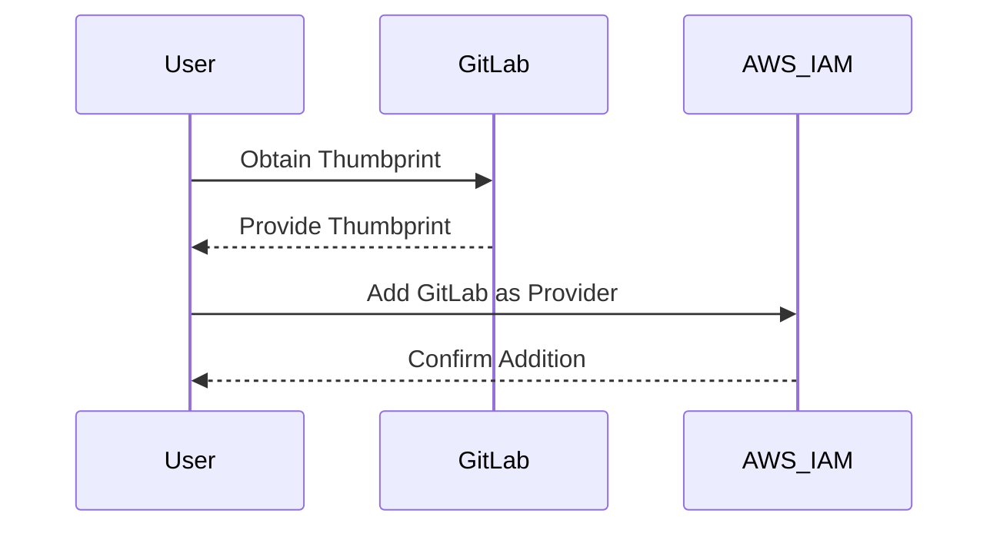
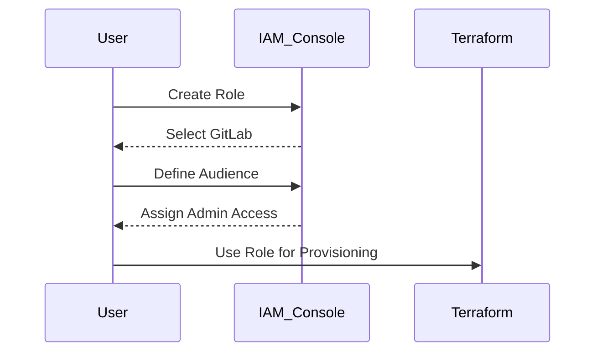

## Configuring Authentication with GitLab Identity Provider for EKS Provisioning

### Background Theory

In DevSecOps, Infrastructure as Code (IaC) is a critical component for automating the provisioning and management of infrastructure. One popular tool for IaC is Terraform, which allows developers to define and manage infrastructure using declarative configuration files. When working with Amazon Elastic Kubernetes Service (EKS), it is essential to ensure that the authentication mechanisms are properly configured to maintain security and compliance.

One common approach to authenticate users and services is through an Identity Provider (IdP). In this context, we will focus on configuring GitLab as an IdP for EKS provisioning. This setup ensures that only authorized users and services can interact with the EKS cluster and perform actions such as creating, updating, or deleting resources.

### GitLab Identity Provider Configuration Guide

GitLab provides a detailed guide on how to configure it as an IdP for AWS. This guide is essential because different IdPs have their own specific configurations and requirements. By following GitLab’s guide, you ensure that the setup is correct and secure.

#### Step-by-Step Configuration

1. **Obtain the Thumbprint**: The thumbprint is a unique identifier for the certificate used by GitLab. This is crucial because it ensures that only GitLab can assume the role using web identity. The thumbprint is auto-generated and can be found in the GitLab documentation.

2. **Add the Provider**: Once you have the thumbprint, you can add the GitLab provider to your AWS Identity and Access Management (IAM) console. This step involves navigating to the IAM console, selecting "Identity Providers," and then adding GitLab as a new provider.



3. **Verify the Thumbprint**: After adding the provider, it is important to verify the thumbprint to ensure that the configuration is correct. This verification step helps prevent unauthorized access by confirming that only GitLab can assume the role.

### Creating a Role for Terraform

Once the GitLab provider is added, you can create a role that will be used by Terraform to provision infrastructure. This role needs to have the necessary permissions to create, update, and delete resources in the EKS cluster.

#### Step-by-Step Role Creation

1. **Select GitLab as Web Identity Provider**: Navigate to the IAM console and select "Create Role." Choose "Web Identity" as the type of trusted entity. Then, select GitLab from the list of available providers.

2. **Define the Audience**: The audience is a unique identifier that specifies the intended recipient of the token. This value needs to be defined correctly to ensure that the role is only assumed by the intended service.

3. **Assign Permissions**: For simplicity, we will assign admin access to this role. However, in a production environment, it is recommended to follow the principle of least privilege and assign only the necessary permissions.



### Example Configuration

Here is a complete example of how to configure the role using Terraform:

#### Terraform Configuration

```hcl
provider "aws" {
  region = "us-west-2"
}

resource "aws_iam_role" "eks_provisioner" {
  name = "eks-provisioner"

  assume_role_policy = jsonencode({
    Version = "2012-10-17"
    Statement = [
      {
        Effect = "Allow"
        Principal = {
          Federated = "arn:aws:iam::123456789012:saml-provider/GitLab"
        }
        Action = "sts:AssumeRoleWithSAML"
        Condition = {
          StringEquals = {
            "SAML:aud" = "https://example.gitlab.com"
          }
        }
      }
    ]
  })
}

resource "aws_iam_role_policy_attachment" "admin_access" {
  role       = aws_iam_role.eks_provisioner.name
  policy_arn = "arn:aws:iam::aws:policy/AdministratorAccess"
}
```

### HTTP Requests and Responses

When setting up the role and assigning permissions, you will interact with the AWS API. Here is an example of the HTTP request and response for creating a role:

#### HTTP Request

```http
POST /role HTTP/1.1
Host: iam.amazonaws.com
Content-Type: application/json

{
  "RoleName": "eks-provisioner",
  "AssumeRolePolicyDocument": {
    "Version": "2012-10-17",
    "Statement": [
      {
        "Effect": "Allow",
        "Principal": {
          "Federated": "arn:aws:iam::123456789012:saml-provider/GitLab"
        },
        "Action": "sts:AssumeRoleWithSAML",
        "Condition": {
          "StringEquals": {
            "SAML:aud": "https://example.gitlab.com"
          }
        }
      }
    ]
  }
}
```

#### HTTP Response

```http
HTTP/1.1 200 OK
Content-Type: application/json

{
  "Role": {
    "Path": "/",
    "RoleName": "eks-provisioner",
    "RoleId": "AROAJDQEXAMPLE",
    "Arn": "arn:aws:iam::123456789012:role/eks-provisioner",
    "CreateDate": "2023-10-01T12:00:00Z",
    "AssumeRolePolicyDocument": {
      "Version": "2012-10-17",
      "Statement": [
        {
          "Effect": "Allow",
          "Principal": {
            "Federated": "arn:aws:iam::123456789012:saml-provider/GitLab"
          },
          "Action": "sts:AssumeRoleWithSAML",
          "Condition": {
            "StringEquals": {
              "SAML:aud": "https://example.gitlab.com"
            }
          }
        }
      ]
    }
  }
}
```

### Pitfalls and Common Mistakes

1. **Incorrect Thumbprint**: Using an incorrect thumbprint can lead to authentication failures. Always double-check the thumbprint provided by GitLab.
2. **Insufficient Permissions**: Assigning insufficient permissions to the role can result in Terraform failing to perform necessary actions. Ensure that the role has the required permissions.
3. **Misconfigured Audience**: Incorrectly configuring the audience can cause the role to be assumed by unintended services. Double-check the audience value.

### How to Prevent / Defend

#### Detection

To detect misconfigurations, regularly audit IAM roles and policies. Use tools like AWS Trusted Advisor and AWS Config to monitor and alert on any changes to IAM roles and policies.

#### Prevention

1. **Least Privilege Principle**: Follow the principle of least privilege and assign only the necessary permissions to the role.
2. **Regular Audits**: Conduct regular audits of IAM roles and policies to ensure that they are correctly configured.
3. **Multi-Factor Authentication (MFA)**: Enable MFA for all users and services that interact with the EKS cluster.

#### Secure Coding Fixes

Here is an example of a vulnerable role configuration and the corresponding secure configuration:

##### Vulnerable Configuration

```hcl
resource "aws_iam_role" "eks_provisioner" {
  name = "eks-provisioner"

  assume_role_policy = jsonencode({
    Version = "2012-10-17"
    Statement = [
      {
        Effect = "Allow"
        Principal = {
          Federated = "arn:aws:iam::123456789012:saml-provider/GitLab"
        }
        Action = "sts:AssumeRoleWithSAML"
      }
    ]
  })
}

resource "aws_iam_role_policy_attachment" "admin_access" {
  role       = aws_iam_role.eks_provisioner.name
  policy_arn = "arn:aws:iam::aws:policy/AdministratorAccess"
}
```

##### Secure Configuration

```hcl
resource "aws_iam_role" "eks_provisioner" {
  name = "eks-provisioner"

  assume_role_policy = jsonencode({
    Version = "2012-10-17"
    Statement = [
      {
        Effect = "Allow"
        Principal = {
          Federated = "arn:aws:iam::123456789012:saml-provider/GitLab"
        }
        Action = "sts:AssumeRoleWithSAML"
        Condition = {
          StringEquals = {
            "SAML:aud" = "https://example.gitlab.com"
          }
        }
      }
    ]
  })
}

resource "aws_iam_role_policy_attachment" "least_privilege" {
  role       = aws_iam_role.eks_provisioner.name
  policy_arn = "arn:aws:iam::aws:policy/AmazonEKSClusterPolicy"
}
```

### Real-World Examples

#### Recent CVEs and Breaches

1. **CVE-2021-44228 (Log4Shell)**: Although not directly related to IAM roles, this vulnerability highlights the importance of securing all aspects of your infrastructure. Ensure that your IAM roles and policies are correctly configured to prevent unauthorized access.
2. **AWS S3 Bucket Exposure**: In 2021, several high-profile breaches occurred due to misconfigured S3 buckets. These incidents emphasize the need to follow best practices for IAM roles and policies to prevent unauthorized access.

### Hands-On Labs

For hands-on practice, consider the following labs:

- **PortSwigger Web Security Academy**: Offers a comprehensive set of labs for web application security.
- **OWASP Juice Shop**: A deliberately insecure web application for practicing web security skills.
- **DVWA (Damn Vulnerable Web Application)**: Another popular web application for learning web security.
- **CloudGoat**: A cloud security training platform that includes labs for AWS security.
- **flaws.cloud**: Provides a set of cloud security challenges for practicing cloud security skills.

These labs provide practical experience in configuring IAM roles and policies securely.

### Conclusion

Configuring authentication with GitLab as an IdP for EKS provisioning is a critical step in ensuring the security and compliance of your infrastructure. By following the steps outlined in this chapter, you can ensure that your IAM roles and policies are correctly configured to prevent unauthorized access. Regular audits and following best practices such as the principle of least privilege are essential for maintaining a secure infrastructure.

---
<!-- nav -->
[[DevSecOps/DevSecOps Bootcamp/04-Infrastructure Security/03-Secure IaC Pipeline for EKS Provisioning/Configure Authentication with GitLab Identity Provider/01-Introduction to Secure IaC Pipeline for EKS Provisioning|Introduction to Secure IaC Pipeline for EKS Provisioning]] | [[DevSecOps/DevSecOps Bootcamp/04-Infrastructure Security/03-Secure IaC Pipeline for EKS Provisioning/Configure Authentication with GitLab Identity Provider/00-Overview|Overview]] | [[03-Configuring Authentication with GitLab Identity Provider for EKS Provisioning Part 2|Configuring Authentication with GitLab Identity Provider for EKS Provisioning Part 2]]
