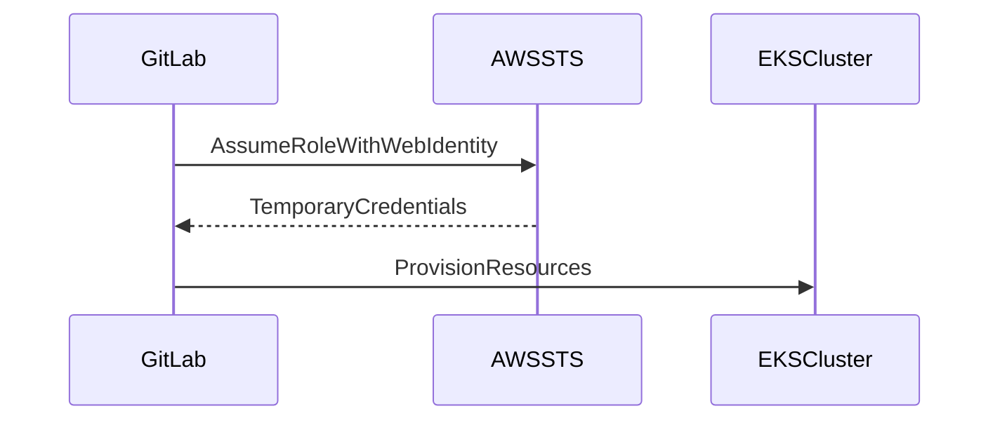
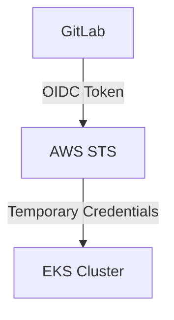

## Configuring Authentication with GitLab Identity Provider for EKS Provisioning

### Background Theory

In the context of DevSecOps, Infrastructure as Code (IaC) is a critical practice that enables teams to manage their infrastructure through code. This approach ensures consistency, reproducibility, and security across environments. One of the most popular tools for managing IaC is Terraform, which can provision resources on various cloud platforms, including Amazon Web Services (AWS).

When provisioning resources on AWS using Terraform, authentication is a crucial aspect to ensure that only authorized entities can perform actions. In this scenario, we will configure authentication using GitLab as an OpenID Connect (OIDC) identity provider. This setup allows GitLab to authenticate and authorize users to assume roles within an AWS account.

### Understanding Trust Policies

A trust policy in AWS is a JSON document that defines the conditions under which an entity (such as a user, role, or service) can assume a role. The trust policy is associated with an IAM role and specifies the principal (the entity that can assume the role) and the conditions under which the assumption is allowed.

#### Traditional Trust Policy

Traditionally, trust policies for AWS roles might look something like this:

```json
{
    "Version": "2012-10-17",
    "Statement": [
        {
            "Effect": "Allow",
            "Principal": {
                "Service": "ec2.amazonaws.com"
            },
            "Action": "sts:AssumeRole"
        }
    ]
}
```

This policy allows EC2 instances to assume the role.

#### External Web Identity Provider Trust Policy

For external web identity providers like GitLab, the trust policy looks different. Here’s an example of a trust policy for a role that can be assumed by GitLab:

```json
{
    "Version": "2012-10-17",
    "Statement": [
        {
            "Effect": "Allow",
            "Principal": {
                "Federated": "arn:aws:iam::123456789012:saml-provider/GitLab"
            },
            "Action": "sts:AssumeRoleWithWebIdentity",
            "Condition": {
                "StringEquals": {
                    "oidc-provider:GitLab:sub": "gitlab|1234567890"
                }
            }
        }
    ]
}
```

### Key Concepts

#### Federated Principal

The `Federated` principal indicates that the role can be assumed by an external identity provider. In our case, this is GitLab.

#### AssumeRoleWithWebIdentity

The `sts:AssumeRoleWithWebIdentity` action is used for assuming a role with a web identity provider. This action is necessary when using OIDC providers like GitLab.

#### Conditions

Conditions in the trust policy specify additional requirements that must be met for the role to be assumed. In our example, the condition checks for a specific claim in the OIDC token.

### Creating the Role

To create the role, follow these steps:

1. **Create the IAM Role**:
   - Navigate to the IAM console in the AWS Management Console.
   - Click on "Roles" and then "Create role".
   - Choose "Web identity" as the trusted entity type.
   - Select "OpenID Connect" as the provider type.
   - Enter the ARN of the OIDC provider created for GitLab.
   - Add the necessary permissions to the role (e.g., `AmazonEKSClusterPolicy` for EKS cluster management).

2. **Define the Trust Policy**:
   - Edit the trust policy to include the `Federated` principal and the necessary conditions.

Here is a complete example of the trust policy:

```json
{
    "Version": "2012-10-17",
    "Statement": [
        {
            "Effect": "Allow",
            "Principal": {
                "Federated": "arn:aws:iam::123456789012:oidc-provider/gitlab.com"
            },
            "Action": "sts:AssumeRoleWithWebIdentity",
            "Condition": {
                "StringEquals": {
                    "gitlab.com:aud": "https://gitlab.com/api/v4/jwt/keys",
                    "gitlab.com:sub": "gitlab|1234567890"
                }
            }
        }
    ]
}
```

### Full Example of HTTP Request and Response

When GitLab attempts to assume the role, it sends an HTTP request to AWS STS (Security Token Service):

```http
POST / HTTP/1.1
Host: sts.amazonaws.com
Content-Type: application/x-www-form-urlencoded
Content-Length: 1234

Action=AssumeRoleWithWebIdentity&Version=2011-06-15&RoleArn=arn:aws:iam::123456789012:role/GitLabCI&RoleSessionName=GitLabSession&WebIdentityToken=<JWT_TOKEN>
```

The response from AWS STS includes temporary credentials:

```http
HTTP/1.1 200 OK
Content-Type: application/json
Content-Length: 1234

{
    "AssumedRoleUser": {
        "Arn": "arn:aws:sts::123456789012:assumed-role/GitLabCI/GitLabSession",
        "AssumedRoleId": "AROAXXXXXXX:GitLabSession"
    },
    "Credentials": {
        "AccessKeyId": "ASIAXXXXXXXXXXXXX",
        "SecretAccessKey": "wJalrXUtnFEMI/K7MDENG/bPxRfiCYEXAMPLEKEY",
        "SessionToken": "AQoDYXdzEPT//////////wEXAMPLETOKEN",
        "Expiration": "2023-10-10T12:34:56Z"
    }
}
```

### Pitfalls and Common Mistakes

1. **Incorrect ARN**: Ensure that the ARN for the OIDC provider and the role are correct.
2. **Missing Conditions**: Omitting necessary conditions in the trust policy can lead to unauthorized access.
3. **Temporary Credentials**: Temporary credentials are only valid for a limited time. Ensure that the pipeline completes within the validity period.

### How to Prevent / Defend

#### Detection

- **Audit Logs**: Enable AWS CloudTrail to log all API calls, including those related to role assumptions.
- **IAM Access Advisor**: Use IAM Access Advisor to monitor which services are accessing the role.

#### Prevention

- **Least Privilege**: Limit the permissions granted to the role to only what is necessary for the pipeline.
- **Regular Audits**: Regularly review the trust policies and permissions associated with the role.

#### Secure Coding Fixes

**Vulnerable Code**:

```json
{
    "Version": "2012-10-17",
    "Statement": [
        {
            "Effect": "Allow",
            "Principal": "*",
            "Action": "sts:AssumeRoleWithWebIdentity"
        }
    ]
}
```

**Secure Code**:

```json
{
    "Version": "2012-10-17",
    "Statement": [
        {
            "Effect": "Allow",
            "Principal": {
                "Federated": "arn:aws:iam::123456789012:oidc-provider/gitlab.com"
            },
            "Action": "sts:AssumeRoleWithWebIdentity",
            "Condition": {
                "StringEquals": {
                    "gitlab.com:aud": "https://gitlab.com/api/v4/jwt/keys",
                    "gitlab.com:sub": "gitlab|1234567890"
                }
            }
        }
    ]
}
```

### Real-World Examples

#### Recent Breaches

- **CVE-2021-39296**: A misconfigured IAM role allowed unauthorized access to AWS resources. Ensuring proper trust policies and least privilege principles can prevent such issues.
- **GitHub Actions Incident (2021)**: An attacker exploited a misconfigured GitHub Actions workflow to gain unauthorized access. Proper configuration of identity providers and trust policies can mitigate such risks.

### Mermaid Diagrams

#### Trust Relationship Diagram



#### Network Topology



### Practice Labs

For hands-on experience with configuring authentication using GitLab as an OIDC identity provider, consider the following labs:

- **PortSwigger Web Security Academy**: Offers modules on IAM and identity management.
- **OWASP Juice Shop**: Provides a vulnerable web application for practicing security configurations.
- **CloudGoat**: Focuses on cloud security and provides scenarios for configuring IAM roles and policies.

By thoroughly understanding and implementing these concepts, you can ensure a secure IaC pipeline for EKS provisioning using GitLab as an identity provider.

---
<!-- nav -->
[[02-Configuring Authentication with GitLab Identity Provider for EKS Provisioning Part 1|Configuring Authentication with GitLab Identity Provider for EKS Provisioning Part 1]] | [[DevSecOps/DevSecOps Bootcamp/04-Infrastructure Security/03-Secure IaC Pipeline for EKS Provisioning/Configure Authentication with GitLab Identity Provider/00-Overview|Overview]] | [[04-Configuring Authentication with GitLab Identity Provider for EKS Provisioning|Configuring Authentication with GitLab Identity Provider for EKS Provisioning]]
