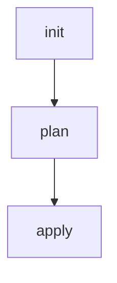

## Configuring Authentication with GitLab Identity Provider for EKS Provisioning

### Background Theory

In the context of DevSecOps, Infrastructure as Code (IaC) is a critical practice that ensures consistency, reliability, and security in infrastructure management. One of the key components of IaC is the ability to automate the provisioning and management of resources, such as Amazon Elastic Kubernetes Service (EKS) clusters, using tools like Terraform. To ensure that these automated processes are secure, proper authentication mechanisms must be in place.

GitLab is a popular DevOps platform that provides a robust set of tools for managing code repositories, continuous integration/continuous deployment (CI/CD) pipelines, and identity and access management (IAM). In this chapter, we will focus on configuring authentication using GitLab as the identity provider for an EKS cluster provisioning pipeline.

### Setting Up a Feature Branch

Before diving into the configuration details, it's essential to organize your codebase properly. This includes creating a dedicated feature branch for the IaC pipeline configuration. This approach helps maintain a clean and manageable codebase, especially when working on complex projects.

#### Creating a Feature Branch

To start, we'll create a new feature branch in Git. This branch will host all the code related to the infrastructure release pipeline.

```bash
git checkout -b IAC-pipeline
```

This command creates a new branch named `IAC-pipeline` and switches to it. Now, all changes made in this branch will be isolated from the main branch until they are merged.

### Configuring GitLab CI/CD Pipeline

Next, we need to configure a GitLab CI/CD pipeline for our project. This pipeline will automate the process of provisioning the EKS cluster using Terraform.

#### GitLab CI/CD Configuration File

The GitLab CI/CD pipeline is defined in a `.gitlab-ci.yml` file located at the root of your repository. This file specifies the stages, jobs, and dependencies required to build, test, and deploy your application.

Here is an example of a basic `.gitlab-ci.yml` file:

```yaml
stages:
  - init
  - plan
  - apply

init:
  stage: init
  script:
    - terraform init -input=false -no-color
  artifacts:
    paths:
      - .terraform/

plan:
  stage: plan
  script:
    - terraform plan -out=tfplan -input=false -no-color
  dependencies:
    - init

apply:
  stage: apply
  script:
    - terraform apply -auto-approve tfplan -input=false -no-color
  dependencies:
    - plan
```

This configuration defines three stages: `init`, `plan`, and `apply`. Each stage corresponds to a specific Terraform command:

- **Init**: Initializes the Terraform environment.
- **Plan**: Generates a plan of the changes to be applied.
- **Apply**: Applies the changes to the infrastructure.

### Managing AWS Credentials

To interact with AWS services, including EKS, Terraform requires AWS credentials. These credentials can be managed using environment variables or AWS credentials files. In this example, we will use environment variables to store the AWS access key and secret key.

#### Storing AWS Credentials in Environment Variables

In the `.gitlab-ci.yml` file, we can define environment variables to store the AWS credentials. These variables should be kept confidential and stored securely.

```yaml
variables:
  AWS_ACCESS_KEY_ID: $AWS_ACCESS_KEY_ID
  AWS_SECRET_ACCESS_KEY: $AWS_SECRET_ACCESS_KEY
```

These variables are referenced in the Terraform commands within the pipeline.

### Caching Terraform Modules

To improve the efficiency of the pipeline, we can cache the Terraform modules and providers. This caching mechanism reduces the time required to download and initialize the modules in subsequent runs.

#### Caching Terraform Modules

In the `init` stage, we can define artifacts to cache the downloaded modules and providers.

```yaml
init:
  stage: init
  script:
    - terraform init -input=false -no-color
  artifacts:
    paths:
      - .terraform/
```

This configuration caches the `.terraform` directory, which contains the downloaded modules and providers.

### Real-World Example: Recent Breaches

Recent breaches have highlighted the importance of securing IaC pipelines. For instance, the SolarWinds breach in 2020 demonstrated how compromised supply chain components could lead to widespread security issues. In this case, attackers gained access to SolarWinds' build system and injected malicious code into their software updates.

To prevent similar attacks, it's crucial to implement robust security measures in your IaC pipeline, including:

- **Secure Credential Management**: Ensure that AWS credentials are stored securely and rotated regularly.
- **Least Privilege Principle**: Grant the minimum necessary permissions to the IAM roles used in the pipeline.
- **Regular Audits**: Conduct regular audits of your IaC configurations to identify and mitigate potential security risks.

### How to Prevent / Defend

#### Detecting and Preventing Unauthorized Access

To detect and prevent unauthorized access to your IaC pipeline, consider implementing the following measures:

- **Audit Logs**: Enable audit logs for your GitLab and AWS accounts to track access and changes.
- **IAM Policies**: Define strict IAM policies to limit the permissions granted to the IAM roles used in the pipeline.
- **Multi-Factor Authentication (MFA)**: Require MFA for accessing sensitive systems and resources.

#### Secure Coding Practices

When writing Terraform configurations, follow secure coding practices to minimize the risk of introducing vulnerabilities:

- **Use Modules**: Organize your Terraform configurations into reusable modules to reduce redundancy and improve maintainability.
- **Avoid Hardcoding Secrets**: Use environment variables or secrets management tools to store sensitive information.
- **Validate Inputs**: Validate all inputs to your Terraform configurations to prevent injection attacks.

### Complete Example: Full Pipeline Configuration

Here is a complete example of a `.gitlab-ci.yml` file that includes all the necessary stages and configurations:

```yaml
stages:
  - init
  - plan
  - apply

variables:
  AWS_ACCESS_KEY_ID: $AWS_ACCESS_KEY_ID
  AWS_SECRET_ACCESS_KEY: $AWS_SECRET_ACCESS_KEY

init:
  stage: init
  script:
    - terraform init -input=false -no-color
  artifacts:
    paths:
      - .terraform/

plan:
  stage: plan
  script:
    - terraform plan -out=tfplan -input=false -no-color
  dependencies:
    - init

apply:
  stage: apply
  script:
    - terraform apply -auto-approve tfplan -input=false -no-color
  dependencies:
    - plan
```

### Mermaid Diagrams

To visualize the pipeline stages and dependencies, we can use a mermaid diagram:



This diagram shows the flow of the pipeline, with each stage depending on the previous one.

### Conclusion

In this chapter, we covered the essential steps for configuring a secure IaC pipeline for EKS provisioning using GitLab as the identity provider. By following best practices for credential management, caching, and auditing, you can ensure that your pipeline remains secure and efficient.

### Practice Labs

For hands-on practice, consider the following labs:

- **PortSwigger Web Security Academy**: Offers a variety of labs focused on web application security, including IaC and CI/CD pipelines.
- **OWASP Juice Shop**: A deliberately insecure web application for practicing web security skills.
- **CloudGoat**: A series of labs designed to help you learn about cloud security best practices using AWS.

By completing these labs, you can gain practical experience in securing IaC pipelines and applying the concepts learned in this chapter.

---
<!-- nav -->
[[03-Configuring Authentication with GitLab Identity Provider for EKS Provisioning Part 2|Configuring Authentication with GitLab Identity Provider for EKS Provisioning Part 2]] | [[DevSecOps/DevSecOps Bootcamp/04-Infrastructure Security/03-Secure IaC Pipeline for EKS Provisioning/Configure Authentication with GitLab Identity Provider/00-Overview|Overview]] | [[05-Secure IaC Pipeline for EKS Provisioning Configuring Authentication with GitLab Identity Provider|Secure IaC Pipeline for EKS Provisioning Configuring Authentication with GitLab Identity Provider]]
