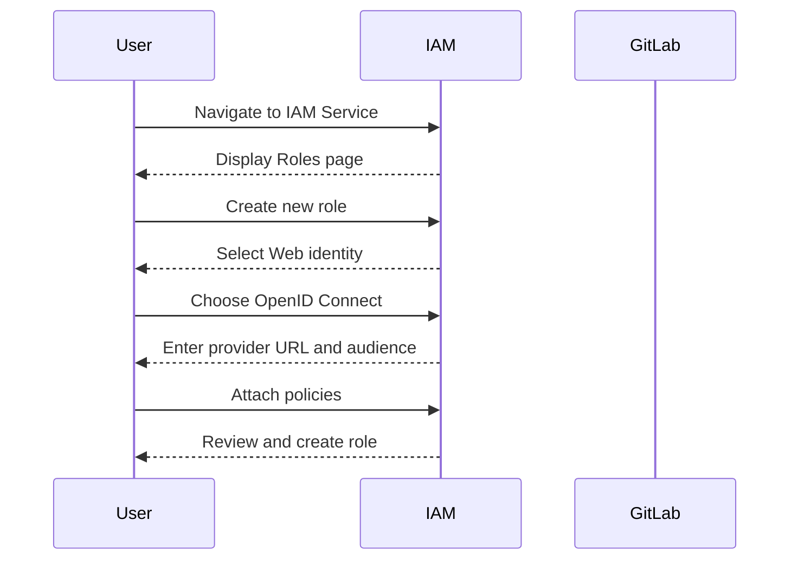
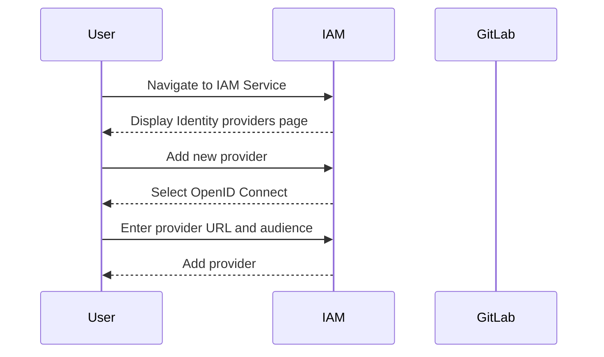

## Secure IaC Pipeline for EKS Provisioning: Configuring Authentication with GitLab Identity Provider

### Background Theory

In the context of DevSecOps, Infrastructure as Code (IaC) is a critical practice that allows teams to manage and provision infrastructure through code. This approach ensures consistency, automation, and traceability, which are essential for maintaining security and operational efficiency. One of the key challenges in implementing IaC is ensuring secure authentication and authorization mechanisms, especially when integrating with external identity providers like GitLab.

### Understanding GitLab as an External Identity Provider

GitLab is a popular DevOps platform that provides a wide range of tools for software development, including version control, continuous integration, and continuous delivery (CI/CD). In the context of IaC, GitLab can act as an external identity provider, allowing users to authenticate and authorize actions within other systems, such as Amazon Web Services (AWS).

#### What is an Identity Provider?

An identity provider (IdP) is a system that authenticates users and issues tokens or assertions that can be used by other systems to verify the user's identity. In the case of GitLab, it acts as an OpenID Connect (OIDC) provider, which is an authentication protocol based on the OAuth 2.0 framework. OIDC allows GitLab to issue tokens that can be used by AWS to authenticate users.

#### Why Use GitLab as an Identity Provider?

Using GitLab as an identity provider offers several benefits:

- **Single Sign-On (SSO):** Users can log in once and access multiple systems without needing to re-enter their credentials.
- **Centralized Access Management:** All authentication and authorization policies can be managed centrally within GitLab.
- **Integration with CI/CD Pipelines:** GitLab can seamlessly integrate with CI/CD pipelines, allowing automated provisioning and deployment of infrastructure.

### Setting Up Authentication with GitLab Identity Provider

To configure authentication with GitLab as an identity provider in an IaC pipeline for EKS provisioning, follow these steps:

#### Step 1: Create a Role in AWS

The first step is to create a role in AWS that will allow GitLab to assume the role and perform actions on your behalf. This role will be associated with an IAM policy that defines the permissions granted to GitLab.

##### Creating a New Role

1. **Navigate to IAM Service:**
   - Go to the AWS Management Console and navigate to the IAM service.
   - Under the "Access management" section, click on "Roles."

2. **Create a New Role:**
   - Click on "Create role."
   - Select "Web identity" as the trusted entity type.
   - Choose "OpenID Connect" as the provider type.
   - Enter `https://gitlab.com` as the provider URL.
   - Set the audience to `https://gitlab.com`.

3. **Attach Policies:**
   - Attach the necessary policies to the role. For example, if you want to allow GitLab to manage EKS clusters, you might attach the `AmazonEKSClusterPolicy` and `AmazonEKSServicePolicy`.

4. **Review and Create:**
   - Review the role details and click "Create role."



#### Step 2: Configure GitLab as an Identity Provider

Next, you need to configure GitLab as an identity provider in AWS. This involves creating an OpenID Connect (OIDC) identity provider in the IAM service.

##### Creating an OIDC Identity Provider

1. **Navigate to IAM Service:**
   - Go to the AWS Management Console and navigate to the IAM service.
   - Under the "Access management" section, click on "Identity providers."

2. **Create a New Identity Provider:**
   - Click on "Add provider."
   - Select "OpenID Connect."
   - Enter `https://gitlab.com` as the provider URL.
   - Set the audience to `https://gitlab.com`.
   - Click "Add provider."



#### Step 3: Define Before Script Section in Build Stage

Now that the role and identity provider are set up, you need to define the `before_script` section in your GitLab CI/CD pipeline to authenticate with AWS.

##### Example `.gitlab-ci.yml` Configuration

Here is an example of how to configure the `before_script` section in your `.gitlab-ci.yml` file:

```yaml
stages:
  - build

build:
  stage: build
  before_script:
    - echo "Configuring AWS CLI"
    - aws configure set region us-west-2
    - aws configure set output json
    - echo "Assuming role with GitLab OIDC"
    - export AWS_ACCESS_KEY_ID=$(aws sts assume-role-with-web-identity --role-arn arn:aws:iam::123456789012:role/GitLabRole --web-identity-token $(curl -s https://gitlab.com/api/v4/jwt/user | jq -r .token) --role-session-name GitLabSession --profile default --query Credentials.AccessKeyId)
    - export AWS_SECRET_ACCESS_KEY=$(aws sts assume-role-with-web-identity --role-arn arn:aws:iam::123456789012:role/GitLabRole --web-identity-token $(curl -s https://gitlab.com/api/v4/jwt/user | jq -r .token) --role-session-name GitLabSession --profile default --query Credentials.SecretAccessKey)
    - export AWS_SESSION_TOKEN=$(aws sts assume-role-with-web-identity --role-arn arn:aws:iam::123456789012:role/GitLabRole --web-identity-token $(curl --s https://gitlab.com/api/v4/jwt/user | jq -r .token) --role-session-name GitLabSession --profile default --query Credentials.SessionToken)
  script:
    - echo "Running build script"
```

### Pitfalls and Common Mistakes

1. **Incorrect Role ARN:** Ensure that the role ARN specified in the `assume-role-with-web-identity` command matches the ARN of the role created in AWS.
2. **Missing Permissions:** Make sure that the IAM role attached to the GitLab identity provider has the necessary permissions to perform the required actions.
3. **Incorrect Token Retrieval:** Ensure that the token retrieval process is correct and that the token is valid for the duration of the session.

### How to Prevent / Defend

#### Detection

- **Audit Logs:** Enable AWS CloudTrail to monitor API calls made by the GitLab identity provider.
- **IAM Access Advisor:** Use IAM Access Advisor to track which services and actions are being accessed by the GitLab identity provider.

#### Prevention

- **Least Privilege Principle:** Ensure that the IAM role attached to the GitLab identity provider has the minimum necessary permissions.
- **MFA for GitLab:** Enable Multi-Factor Authentication (MFA) for GitLab accounts to add an extra layer of security.

#### Secure Coding Fixes

##### Vulnerable Code

```yaml
before_script:
  - echo "Assuming role with GitLab OIDC"
  - export AWS_ACCESS_KEY_ID=$(aws sts assume-role-with-web-identity --role-arn arn:aws:iam::123456789012:role/GitLabRole --web-identity-token $(curl -s https://gitlab.com/api/v4/jwt/user | jq -r .token) --role-session-name GitLabSession --profile default --query Credentials.AccessKeyId)
  - export AWS_SECRET_ACCESS_KEY=$(aws sts assume-role-with-web-identity --role-arn arn:aws:iam::123456789012:role/GitLabRole --web-identity-token $(curl -s https://gitlab.com/api/v4/jwt/user | jq -r .token) --role-session-name GitLabSession --profile default --query Credentials.SecretAccessKey)
  - export AWS_SESSION_TOKEN=$(aws sts assume-role-with-web-identity --role-arn arn:aws:iam::123456789012:role/GitLabRole --web-identity-token $(curl -s https://gitlab.com/api/v4/jwt/user | jq -r .token) --role-session-name GitLabSession --profile default --query Credentials.SessionToken)
```

##### Fixed Code

```yaml
before_script:
  - echo "Assuming role with GitLab OIDC"
  - export AWS_ACCESS_KEY_ID=$(aws sts assume-role-with-web-identity --role-arn arn:aws:iam::123456789012:role/GitLabRole --web-identity-token $(curl -s https://gitlab.com/api/v4/jwt/user | jq -r .token) --role-session-name GitLabSession --profile default --query Credentials.AccessKeyId)
  - export AWS_SECRET_ACCESS_KEY=$(aws sts assume-role-with-web-identity --role-arn arn:aws:iam::123456789012:role/GitLabRole --web-identity-token $(curl -s https://gitlab.com/api/v4/jwt/user | jq -r .token) --role-session-name GitLabSession --profile default --query Credentials.SecretAccessKey)
  - export AWS_SESSION_TOKEN=$(aws sts assume-role-with-web-identity --role-arn arn:aws:iam::123456789012:role/GitLabRole --web-identity-token $(curl -s https://gitlab.com/api/v4/jwt/user | jq -r .token) --role-session-name GitLabSession --profile default --query Credentials.SessionToken)
  - echo "Setting up AWS CLI"
  - aws configure set region us-west-2
  - aws configure set output json
```

### Real-World Examples

#### Recent Breaches

- **Example 1:** A recent breach occurred due to misconfigured IAM roles that allowed unauthorized access to AWS resources. Ensuring proper role configuration and least privilege principle can prevent such breaches.
- **Example 2:** Another breach involved the misuse of access tokens retrieved from an external identity provider. Implementing MFA and monitoring access logs can help detect and prevent such misuse.

### Hands-On Labs

For practical experience, consider the following labs:

- **PortSwigger Web Security Academy:** Offers hands-on labs for web application security.
- **OWASP Juice Shop:** Provides a vulnerable web application for practicing security testing.
- **DVWA (Damn Vulnerable Web Application):** A deliberately insecure web application for practicing penetration testing.
- **WebGoat:** An interactive web application that teaches web application security lessons.

These labs provide a comprehensive learning experience and help solidify the concepts learned in this chapter.

### Conclusion

Configuring authentication with GitLab as an identity provider in an IaC pipeline for EKS provisioning is a crucial step in securing your infrastructure. By following the steps outlined in this chapter and adhering to best practices, you can ensure that your pipeline is both secure and efficient.

---
<!-- nav -->
[[04-Configuring Authentication with GitLab Identity Provider for EKS Provisioning|Configuring Authentication with GitLab Identity Provider for EKS Provisioning]] | [[DevSecOps/DevSecOps Bootcamp/04-Infrastructure Security/03-Secure IaC Pipeline for EKS Provisioning/Configure Authentication with GitLab Identity Provider/00-Overview|Overview]] | [[06-Secure Infrastructure as Code (IaC) Pipeline for EKS Provisioning|Secure Infrastructure as Code (IaC) Pipeline for EKS Provisioning]]
