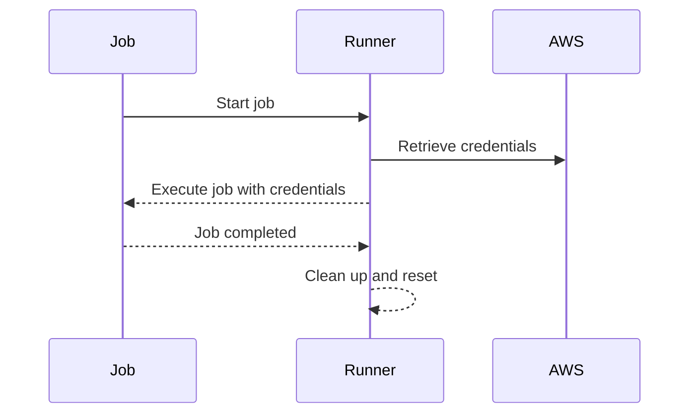
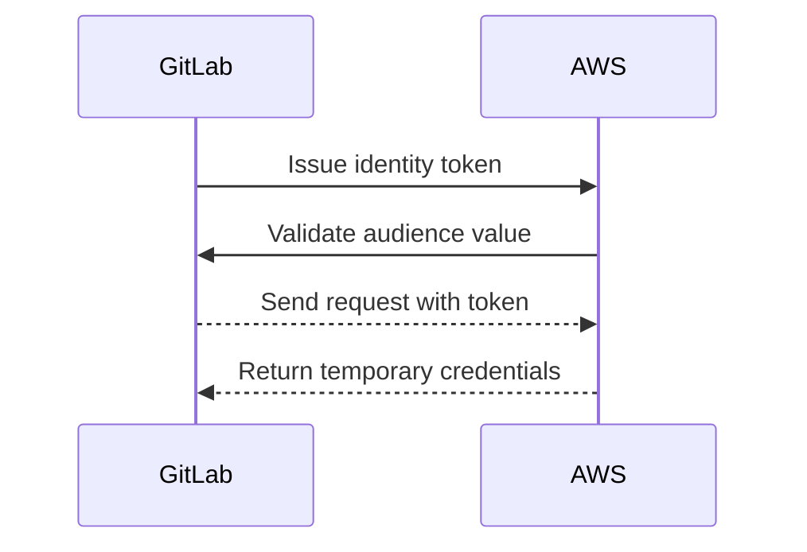
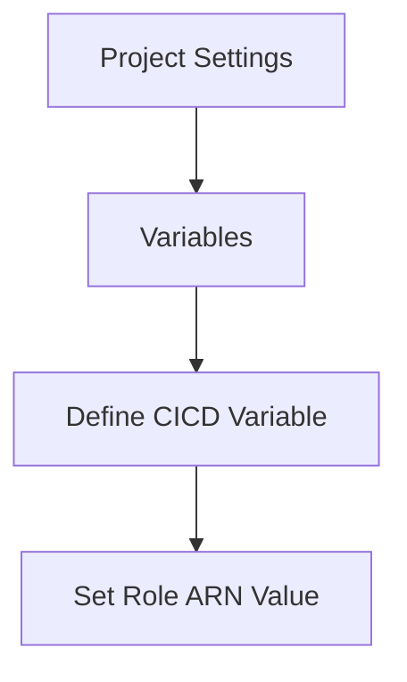

## Secure Infrastructure as Code (IaC) Pipeline for EKS Provisioning

### Introduction to IaC and EKS

Infrastructure as Code (IaC) is a practice of managing and provisioning infrastructure through machine-readable definition files, rather than physical hardware configuration or interactive configuration tools. In the context of Kubernetes, specifically Amazon Elastic Kubernetes Service (EKS), IaC allows you to define your cluster and its resources using declarative configuration files. This ensures consistency, reproducibility, and version control for your infrastructure.

Amazon EKS is a managed service that makes it easy to run Kubernetes on AWS without needing expertise in Kubernetes orchestration. EKS manages the availability and scalability of the Kubernetes control plane, allowing you to focus on deploying and managing applications.

### Shared Runners and Credential Management

In a CI/CD pipeline, shared runners are commonly used to execute jobs. These runners are typically virtual machines or containers that are provisioned dynamically and destroyed after the job completes. This ephemeral nature of shared runners is crucial for security because it ensures that any sensitive information stored locally during the job execution is removed once the job is done.

#### How Credentials Are Managed

When a job runs on a shared runner, it may need to access external services like AWS. To achieve this, credentials are often retrieved from a secure store and temporarily stored on the runner. Once the job is completed, the runner is cleaned up, ensuring that these credentials are not left behind.



### GitLab OIDC Provider Configuration

To securely authenticate and authorize jobs running on shared runners, GitLab provides an OpenID Connect (OIDC) identity provider. This allows GitLab to issue an identity token that can be used to authenticate requests to AWS.

#### Understanding OIDC

OpenID Connect (OIDC) is an authentication layer built on top of the OAuth 2.0 protocol. It enables clients to verify the identity of users based on the authentication performed by an authorization server, as well as to obtain basic profile information about them.

#### Configuring GitLab OIDC Provider

When configuring the GitLab OIDC provider, you need to ensure that AWS trusts the identity token issued by GitLab. This involves setting up the correct audience value in the OIDC configuration.



#### Example Configuration

Here is an example of how you might configure the OIDC provider in GitLab:

```yaml
# .gitlab-ci.yml
stages:
  - deploy

deploy:
  stage: deploy
  script:
    - aws sts assume-role-with-web-identity --role-arn $ROLE_ARN --role-session-name MySession --web-identity-token $(curl -s http://localhost:8080/oauth2/token) --oidc-client-id <client_id> --oidc-issuer-url https://gitlab.com
```

### Creating Environment Variables in GitLab

To use the OIDC provider effectively, you need to define environment variables in GitLab that reference the AWS role ARN. This allows the pipeline to assume the role and retrieve temporary credentials.

#### Setting Up Environment Variables

Navigate to your GitLab project settings and create a new environment variable. This variable should contain the ARN of the AWS role that the pipeline will assume.



#### Example Variable Definition

```yaml
# GitLab project settings
variables:
  ROLE_ARN: arn:aws:iam::123456789012:role/my-role
```

### Pitfalls and Best Practices

#### Common Mistakes

1. **Hardcoding Credentials**: Avoid hardcoding AWS credentials directly in your pipeline scripts. Instead, use environment variables or secure stores.
2. **Incorrect Audience Value**: Ensure that the audience value in the OIDC configuration matches the expected value in AWS.
3. **Insufficient Permissions**: Make sure the assumed role has the necessary permissions to perform the required actions in AWS.

#### Best Practices

1. **Use IAM Roles**: Utilize IAM roles to grant least privilege access to your pipeline.
2. **Regularly Rotate Credentials**: Regularly rotate your AWS credentials to minimize exposure.
3. **Monitor and Audit**: Implement monitoring and auditing to detect unauthorized access or suspicious activity.

### Real-World Examples

#### Recent Breaches

One notable breach involving misconfigured IAM roles occurred in 2021, where an attacker gained unauthorized access to a company's AWS account due to a misconfigured IAM role. This highlights the importance of proper configuration and monitoring.

#### CVEs

CVE-2021-3929 is an example of a vulnerability in AWS IAM roles that allowed attackers to escalate privileges. This underscores the need for regular updates and patches to your IAM configurations.

### How to Prevent / Defend

#### Detection

Implement logging and monitoring to detect unauthorized access attempts. Use AWS CloudTrail to log API calls and AWS Config to track changes to your infrastructure.

#### Prevention

1. **Least Privilege Principle**: Grant roles the minimum permissions necessary to perform their tasks.
2. **IAM Policies**: Use IAM policies to restrict access to specific resources and actions.
3. **MFA**: Enable Multi-Factor Authentication (MFA) for additional security.

#### Secure Coding Fixes

Compare the vulnerable and secure versions of your pipeline configuration:

**Vulnerable Version**

```yaml
# Vulnerable .gitlab-ci.yml
stages:
  - deploy

deploy:
  stage: deploy
  script:
    - aws sts assume-role --role-arn arn:aws:iam::123456789012:role/my-role --role-session-name MySession
```

**Secure Version**

```yaml
# Secure .gitlab-ci.yml
stages:
  - deploy

deploy:
  stage: deploy
  script:
    - aws sts assume-role-with-web-identity --role-arn $ROLE_ARN --role-session-name MySession --web-identity-token $(curl -s http://localhost:8080/oauth2/token) --oidc-client-id <client_id> --oidc-issuer-url https://gitlab.com
```

### Hands-On Labs

For practical experience with securing IaC pipelines for EKS provisioning, consider the following labs:

- **PortSwigger Web Security Academy**: Offers modules on secure coding practices and IAM configurations.
- **OWASP Juice Shop**: Provides a vulnerable application to practice securing IaC pipelines.
- **CloudGoat**: Focuses on cloud security and IAM configurations, including EKS.

By following these detailed steps and best practices, you can ensure that your IaC pipeline for EKS provisioning is secure and robust against potential threats.

---
<!-- nav -->
[[05-Secure IaC Pipeline for EKS Provisioning Configuring Authentication with GitLab Identity Provider|Secure IaC Pipeline for EKS Provisioning Configuring Authentication with GitLab Identity Provider]] | [[DevSecOps/DevSecOps Bootcamp/04-Infrastructure Security/03-Secure IaC Pipeline for EKS Provisioning/Configure Authentication with GitLab Identity Provider/00-Overview|Overview]] | [[DevSecOps/DevSecOps Bootcamp/04-Infrastructure Security/03-Secure IaC Pipeline for EKS Provisioning/Configure Authentication with GitLab Identity Provider/07-Practice Questions & Answers|Practice Questions & Answers]]
