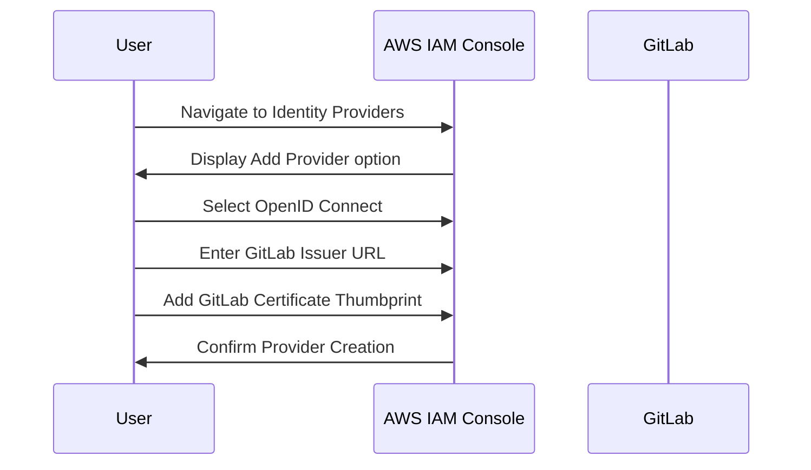

## Introduction to Secure IaC Pipeline for EKS Provisioning

In the realm of DevSecOps, ensuring the security of Infrastructure as Code (IaC) pipelines is paramount. This chapter delves into the process of establishing a secure connection between GitLab and Amazon Web Services (AWS) for Elastic Kubernetes Service (EKS) provisioning. We will cover the theoretical foundations, practical implementation steps, and security considerations involved in setting up this connection.

### Background Theory

#### What is IaC?

Infrastructure as Code (IaC) is the practice of managing and provisioning computer data centers through machine-readable definition files, rather than physical hardware configuration or interactive configuration tools. This approach allows infrastructure to be treated like software, enabling developers to use familiar tools and practices such as version control, testing, and continuous integration/continuous deployment (CI/CD).

#### What is EKS?

Amazon Elastic Kubernetes Service (EKS) is a managed service that makes it easy to run Kubernetes on AWS without needing expertise in Kubernetes cluster setup and management. EKS supports the Kubernetes API, so you can use existing tools and plugins to interact with your cluster and applications.

#### What is GitLab?

GitLab is a web-based DevOps lifecycle tool that provides a full set of features for project planning, source code management, CI/CD, and monitoring. GitLab integrates these capabilities into a single application, allowing teams to manage their entire software development lifecycle from a single interface.

### Establishing Trust Between GitLab and AWS

To ensure a secure connection between GitLab and AWS, we need to establish trust using OpenID Connect (OIDC). OIDC is an open standard based on OAuth 2.0 that allows clients to verify the identity of users based on the authentication performed by an authorization server, as well as to obtain basic profile information about them.

#### Setting Up the External Identity Provider

1. **Create an OIDC Identity Provider in AWS IAM**
   - Navigate to the AWS Identity and Access Management (IAM) console.
   - Go to the "Identity Providers" section and click "Add provider."
   - Select "OpenID Connect" as the provider type.
   - Enter the issuer URL provided by GitLab (e.g., `https://gitlab.com`).
   - Add the thumbprint of the certificate used by GitLab to sign tokens.



#### Configuring the Trust Policy

Once the OIDC provider is set up, we need to configure the trust policy in AWS IAM to allow GitLab to assume a specific role.

1. **Create an IAM Role**
   - In the IAM console, go to the "Roles" section and click "Create role."
   - Choose "AWS service" as the trusted entity and select "Elastic Kubernetes Service" as the service that will use this role.
   - Attach the necessary permissions policies to the role (e.g., `AmazonEKSClusterPolicy`, `AmazonEKSServicePolicy`).

2. **Set Up the Trust Relationship**
   - Edit the trust relationship policy document for the role.
   - Add a condition to trust the OIDC provider created earlier.

```json
{
    "Version": "2012-10-17",
    "Statement": [
        {
            "Effect": "Allow",
            "Principal": {
                "Federated": "arn:aws:iam::123456789012:oidc-provider/gitlab.com"
            },
            "Action": "sts:AssumeRoleWithWebIdentity",
            "Condition": {
                "StringEquals": {
                    "gitlab:aud": "https://gitlab.com/api/v4/jwt/keys"
                }
            }
        }
    ]
}
```

### Configuring GitLab to Generate ID Tokens

Next, we need to configure GitLab to generate ID tokens that can be used to authenticate with AWS.

1. **Enable OIDC in GitLab**
   - Go to the GitLab settings and enable the OIDC feature.
   - Configure the issuer URL and client ID to match the values used in AWS IAM.

2. **Generate ID Tokens in GitLab Jobs**
   - In the GitLab CI/CD pipeline, configure jobs to generate ID tokens using the OIDC provider.
   - Set the necessary environment variables to include the required claims.

```yaml
stages:
  - build
  - deploy

build_job:
  stage: build
  script:
    - echo "Building the application..."
    - echo "Generating OIDC token..."
    - export GITLAB_OIDC_TOKEN=$(curl -X POST https://gitlab.com/oauth/token \
      -d grant_type=client_credentials \
      -d client_id=<your-client-id> \
      -d client_secret=<your-client-secret> \
      -d audience=https://gitlab.com/api/v4/jwt/keys | jq -r '.access_token')
    - echo "Using OIDC token for AWS authentication..."

deploy_job:
  stage: deploy
  script:
    - echo "Deploying to AWS EKS..."
    - aws eks update-kubeconfig --name <cluster-name> --region <region>
    - kubectl apply -f <deployment-file>
```

### Full Example of HTTP Request and Response

When GitLab generates an ID token and uses it to authenticate with AWS, the following HTTP request and response occur:

**HTTP Request**

```http
POST /oauth/token HTTP/1.1
Host: gitlab.com
Content-Type: application/x-www-form-urlencoded

grant_type=client_credentials&client_id=<your-client-id>&client_secret=<your-client-secret>&audience=https://gitlab.com/api/v4/jwt/keys
```

**HTTP Response**

```http
HTTP/1.1 200 OK
Content-Type: application/json

{
  "access_token": "<generated-token>",
  "token_type": "bearer",
  "expires_in": 3600,
  "refresh_token": "<refresh-token>"
}
```

### Common Pitfalls and How to Avoid Them

#### Incorrect Configuration of OIDC Provider

One common pitfall is incorrectly configuring the OIDC provider in AWS IAM. Ensure that the issuer URL and certificate thumbprint are correctly entered.

**Secure Configuration**

```json
{
    "Version": "2012-10-17",
    "Statement": [
        {
            "Effect": "Allow",
            "Principal": {
                "Federated": "arn:aws:iam::123456789012:oidc-provider/gitlab.com"
            },
            "Action": "sts:AssumeRoleWithWebIdentity",
            "Condition": {
                "StringEquals": {
                    "gitlab:aud": "https://gitlab.com/api/v4/jwt/keys"
                }
            }
        }
    ]
}
```

#### Missing Environment Variables in GitLab Jobs

Another common issue is forgetting to set the necessary environment variables in GitLab jobs. Ensure that the `GITLAB_OIDC_TOKEN` variable is correctly set.

**Secure Configuration**

```yaml
script:
  - export GITLAB_OID_ TOKEN=$(curl -X POST https://gitlab.com/oauth/token \
    -d grant_type=client_credentials \
    -d client_id=<your-client-id> \
    -d client_secret=<your-client-secret> \
    -d audience=https://gitlab.com/api/v4/jwt/keys | jq -r '.access_token')
```

### Real-World Examples and Recent Breaches

#### CVE-2021-20225: AWS IAM Roles Misconfiguration

In 2021, a misconfiguration in AWS IAM roles allowed unauthorized access to sensitive resources. This breach highlights the importance of properly configuring trust relationships and ensuring that only authorized entities can assume roles.

**Secure Configuration**

Ensure that the trust policy is correctly configured to only allow trusted OIDC providers.

```json
{
    "Version": "2012-10-17",
    "Statement": [
        {
            "Effect": "Allow",
            "Principal": {
                "Federated": "arn:aws:iam::123456789012:oidc-provider/gitlab.com"
            },
            "Action": "sts:AssumeRoleWithWebIdentity",
            "Condition": {
                "StringEquals": {
                    "gitlab:aud": "https://gitlab.com/api/v4/jwt/keys"
                }
            }
        }
    ]
}
```

### How to Prevent / Defend

#### Detection

Regularly audit IAM roles and trust policies to ensure they are correctly configured. Use AWS CloudTrail to monitor API calls related to IAM roles and trust policies.

#### Prevention

1. **Use Strong Authentication Mechanisms**
   - Enable multi-factor authentication (MFA) for all IAM users.
   - Use strong password policies and enforce regular password changes.

2. **Limit Permissions**
   - Follow the principle of least privilege by granting only the minimum necessary permissions to IAM roles.
   - Regularly review and revoke unused permissions.

3. **Secure Configuration Management**
   - Use tools like AWS Config to manage and audit IAM configurations.
   - Implement automated compliance checks to ensure IAM roles are correctly configured.

#### Secure Coding Fixes

Compare the vulnerable and secure versions of the trust policy configuration:

**Vulnerable Version**

```json
{
    "Version": "2012-10-17",
    "Statement": [
        {
            "Effect": "Allow",
            "Principal": "*",
            "Action": "sts:AssumeRoleWithWebIdentity"
        }
    ]
}
```

**Secure Version**

```json
{
    "Version": "2012-10-17",
    "Statement": [
        {
            "Effect": "Allow",
            "Principal": {
                "Federated": "arn:aws:iam::123456789012:oidc-provider/gitlab.com"
            },
            "Action": "sts:AssumeRoleWithWebIdentity",
            "Condition": {
                "StringEquals": {
                    "gitlab:aud": "https://gitlab.com/api/v4/jwt/keys"
                }
            }
        }
    ]
}
```

### Conclusion

Establishing a secure connection between GitLab and AWS for EKS provisioning involves setting up an OIDC identity provider, configuring trust policies, and generating ID tokens in GitLab jobs. By following the steps outlined in this chapter, you can ensure a robust and secure IaC pipeline for your EKS clusters.

### Practice Labs

For hands-on experience with this topic, consider the following labs:

- **PortSwigger Web Security Academy**: Offers a variety of labs covering web security concepts, including secure IaC pipelines.
- **OWASP Juice Shop**: A deliberately insecure web application for security training purposes.
- **DVWA (Damn Vulnerable Web Application)**: A PHP/MySQL web application that is riddled with vulnerabilities for educational purposes.
- **WebGoat**: An interactive, gamified training application designed to teach web application security.

These labs provide practical scenarios to reinforce the concepts learned in this chapter.

---
<!-- nav -->
[[DevSecOps/DevSecOps Bootcamp/04-Infrastructure Security/03-Secure IaC Pipeline for EKS Provisioning/Pipeline Configuration for establishing a secure connection/01-Introduction to Secure IaC Pipeline for EKS Provisioning Part 1|Introduction to Secure IaC Pipeline for EKS Provisioning Part 1]] | [[DevSecOps/DevSecOps Bootcamp/04-Infrastructure Security/03-Secure IaC Pipeline for EKS Provisioning/Pipeline Configuration for establishing a secure connection/00-Overview|Overview]] | [[03-Introduction to Secure IaC Pipeline for EKS Provisioning|Introduction to Secure IaC Pipeline for EKS Provisioning]]
