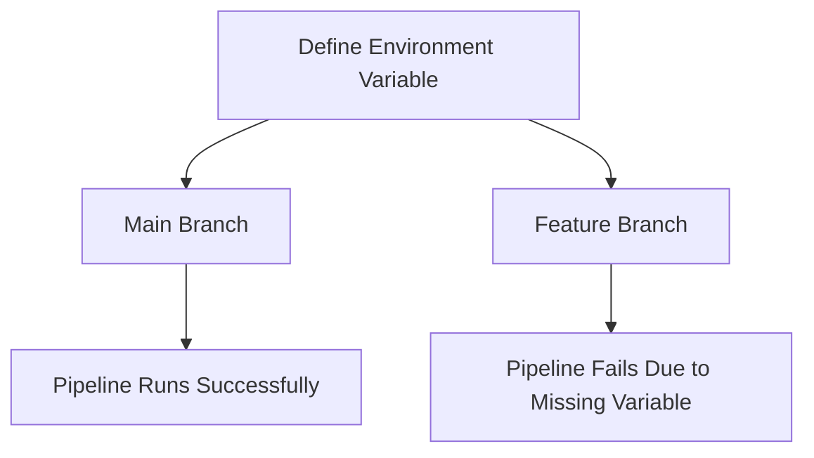

## Introduction to Secure IaC Pipeline for EKS Provisioning

In the realm of DevSecOps, Infrastructure as Code (IaC) plays a pivotal role in automating and securing the provisioning of resources in a cloud environment. This chapter focuses on setting up a secure IaC pipeline specifically for Amazon Elastic Kubernetes Service (EKS). We will delve into the intricacies of configuring the pipeline, ensuring that it establishes a secure connection to AWS services, and discuss common pitfalls and their solutions.

### Understanding the Problem

The transcript chunk highlights a common issue encountered during the setup of an IaC pipeline for EKS provisioning. Specifically, it mentions that an environment variable (`AWS_ACCESS_KEY_ID` or `AWS_SECRET_ACCESS_KEY`) did not work as expected, leading to the failure of subsequent commands such as `aws sts get-caller-identity`. This failure is due to the fact that the environment variables were not accessible in the feature branches of the repository.

### Environment Variables and Branch Access

#### What Are Environment Variables?

Environment variables are dynamic-named values that can affect the way running processes will behave on a computer. They are used to store sensitive information like API keys, access tokens, and other credentials. In the context of CI/CD pipelines, these variables are often used to authenticate with cloud services like AWS.

#### Why Are They Important?

Environment variables are crucial for securely managing sensitive data within a CI/CD pipeline. By storing credentials as environment variables, you can avoid hardcoding them into your scripts or configuration files, thereby reducing the risk of exposure.

#### How Do They Work?

When you define environment variables in your CI/CD system (e.g., GitLab, Jenkins, CircleCI), they are typically stored in a secure manner and are made available to the pipeline during execution. However, the accessibility of these variables can vary based on the branch protection settings.

### Branch Protection Settings

#### Default Behavior

By default, when you create environment variables in a CI/CD system, they are often restricted to the main branch. This means that if you try to access these variables from a feature branch, they will not be available, leading to errors in your pipeline.

#### Example Scenario

Consider the following scenario:

- You have defined an environment variable `AWS_ACCESS_KEY_ID` in your GitLab project settings.
- Your pipeline is configured to run on both the main branch and feature branches.
- When you push a change to a feature branch, the pipeline fails because the `AWS_ACCESS_KEY_ID` is not accessible.

This behavior is illustrated in the following mermaid diagram:



### Solution: Unprotecting Variables

To resolve this issue, you need to ensure that the environment variables are accessible in all branches where the pipeline runs. This can be achieved by unprotecting the variables.

#### Steps to Unprotect Variables

1. **Navigate to Project Settings**: Go to your CI/CD project settings.
2. **Locate Environment Variables**: Find the section where environment variables are defined.
3. **Uncheck Protection**: Uncheck the option that restricts the variable to protected branches.

Here is an example of how to configure this in GitLab:

```yaml
# .gitlab-ci.yml
stages:
  - build
  - test
  - deploy

variables:
  AWS_ACCESS_KEY_ID: $AWS_ACCESS_KEY_ID
  AWS_SECRET_ACCESS_KEY: $AWS_SECRET_ACCESS_KEY

build_job:
  stage: build
  script:
    - echo "Building the application..."
    - aws sts get-caller-identity
```

### Repository Structure and Production Environment

#### Repository Structure

In a typical development workflow, you might have multiple branches (main, feature, etc.) to manage different stages of development. Each branch can contain different versions of your infrastructure configuration.

#### Production Environment

In contrast, the production environment typically consists of a single main branch that contains the final, stable version of your infrastructure configuration. Feature branches are used to make small changes and are merged into the main branch once they are tested and validated.

### Real-World Examples

#### Recent Breaches and CVEs

One notable breach related to insecure IaC pipelines is the incident involving a misconfigured AWS S3 bucket. In this case, sensitive data was exposed due to incorrect permissions set via IaC templates. This highlights the importance of securing your IaC pipeline to prevent such vulnerabilities.

#### Example: CVE-2021-39299

CVE-2021-39299 is a vulnerability in the AWS CLI that could allow an attacker to execute arbitrary commands if the user's credentials are compromised. This underscores the need to ensure that your environment variables are properly secured and accessible only to authorized branches.

### Complete Example: Secure IaC Pipeline

Let's walk through a complete example of setting up a secure IaC pipeline for EKS provisioning.

#### Step 1: Define Environment Variables

First, define the necessary environment variables in your CI/CD system. Ensure they are unprotected so they are accessible in all branches.

```yaml
# .gitlab-ci.yml
variables:
  AWS_ACCESS_KEY_ID: $AWS_ACCESS_KEY_ID
  AWS_SECRET_ACCESS_KEY: $AWS_SECRET_ACCESS_KEY
```

#### Step 2: Configure Pipeline Stages

Next, configure the pipeline stages to include build, test, and deploy steps.

```yaml
stages:
  - build
  - test
  - deploy

build_job:
  stage: build
  script:
    - echo "Building the application..."
    - aws sts get-caller-identity

test_job:
  stage: test
  script:
    - echo "Running tests..."

deploy_job:
  stage: deploy
  script:
    - echo "Deploying to EKS..."
    - kubectl apply -f deployment.yaml
```

#### Step 3: Secure Configuration Files

Ensure that your configuration files (e.g., `deployment.yaml`) are also secured. Use tools like `kubectl` to apply the configurations securely.

```yaml
# deployment.yaml
apiVersion: apps/v1
kind: Deployment
metadata:
  name: my-app
spec:
  replicas: 3
  selector:
    matchLabels:
      app: my-app
  template:
    metadata:
      labels:
        app: my-app
    spec:
      containers:
      - name: my-app
        image: my-app-image:latest
        ports:
        - containerPort: 80
```

### Pitfalls and Common Mistakes

#### Hardcoding Credentials

One of the most common mistakes is hardcoding credentials directly into your scripts or configuration files. This exposes sensitive information and increases the risk of unauthorized access.

#### Incorrect Branch Protection

Another pitfall is incorrectly configuring branch protection settings, leading to inaccessible environment variables in certain branches.

### How to Prevent / Defend

#### Detection

Use tools like `trivy` or `tfsec` to scan your IaC files for security vulnerabilities. These tools can help identify issues like hardcoded credentials or misconfigured permissions.

```bash
# Using trivy to scan IaC files
trivy iac --iaca --severity CRITICAL,HIGH,MEDIUM deployment.yaml
```

#### Prevention

1. **Secure Environment Variables**: Store sensitive data as environment variables and ensure they are unprotected across all branches.
2. **Use IAM Roles**: Instead of using static credentials, consider using IAM roles for service accounts (IRSA) to grant permissions dynamically.
3. **Regular Audits**: Conduct regular audits of your IaC files to ensure they are secure and up-to-date.

#### Secure-Coding Fixes

Compare the vulnerable and secure versions of your `.gitlab-ci.yml` file:

**Vulnerable Version**

```yaml
# Vulnerable .gitlab-ci.yml
variables:
  AWS_ACCESS_KEY_ID: <hardcoded_key>
  AWS_SECRET_ACCESS_KEY: <hardcoded_secret>

build_job:
  stage: build
  script:
    - echo "Building the application..."
    - aws sts get-caller-identity
```

**Secure Version**

```yaml
# Secure .gitlab-ci.yml
variables:
  AWS_ACCESS_KEY_ID: $AWS_ACCESS_KEY_ID
  AWS_SECRET_ACCESS_KEY: $AWS_SECRET_ACCESS_KEY

build_job:
  stage: build
  script:
    - echo "Building the application..."
    - aws sts get-caller-identity
```

### Conclusion

Setting up a secure IaC pipeline for EKS provisioning requires careful consideration of environment variables, branch protection settings, and secure coding practices. By following the steps outlined in this chapter, you can ensure that your pipeline is robust and secure against common vulnerabilities.

### Practice Labs

For hands-on practice, consider the following labs:

- **PortSwigger Web Security Academy**: Focuses on web application security but can provide valuable insights into secure coding practices.
- **OWASP Juice Shop**: A deliberately insecure web application for security training.
- **CloudGoat**: Provides a series of challenges to learn about securing AWS environments.
- **Pacu**: A framework for AWS security testing and penetration testing.

These labs will help you apply the concepts learned in this chapter and gain practical experience in setting up secure IaC pipelines.

---
<!-- nav -->
[[DevSecOps/DevSecOps Bootcamp/04-Infrastructure Security/03-Secure IaC Pipeline for EKS Provisioning/Pipeline Configuration for establishing a secure connection/02-Introduction to Secure IaC Pipeline for EKS Provisioning Part 2|Introduction to Secure IaC Pipeline for EKS Provisioning Part 2]] | [[DevSecOps/DevSecOps Bootcamp/04-Infrastructure Security/03-Secure IaC Pipeline for EKS Provisioning/Pipeline Configuration for establishing a secure connection/00-Overview|Overview]] | [[DevSecOps/DevSecOps Bootcamp/04-Infrastructure Security/03-Secure IaC Pipeline for EKS Provisioning/Pipeline Configuration for establishing a secure connection/04-JSON Web Tokens (JWT)|JSON Web Tokens (JWT)]]
