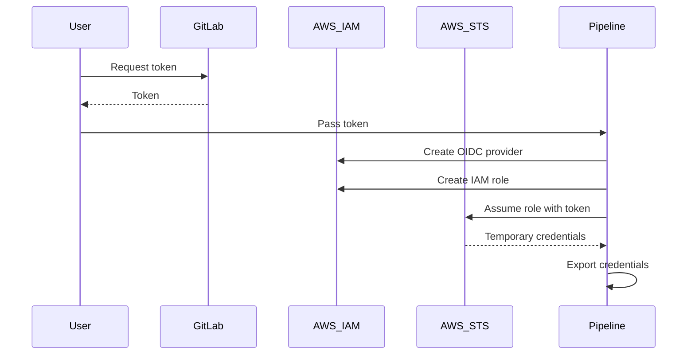

## Secure IaC Pipeline for EKS Provisioning

### Pipeline Configuration for Establishing a Secure Connection

In the context of DevSecOps, Infrastructure as Code (IaC) plays a crucial role in ensuring that infrastructure is provisioned securely and consistently. This chapter focuses on configuring a secure pipeline for provisioning Amazon Elastic Kubernetes Service (EKS) clusters using IaC tools such as Terraform and AWS CLI. Specifically, we will delve into the process of establishing a secure connection between your CI/CD pipeline and AWS services using GitLab as the identity provider.

#### Background Theory

Before diving into the specifics, let's understand the underlying concepts:

1. **Identity Provider (IdP)**: An IdP is a system entity that authenticates the identity of an entity (user or service) and provides attributes about that entity to a relying party (RP). In this case, GitLab acts as the IdP.
   
2. **Web Identity Federation**: This is a method for granting access to AWS resources using temporary credentials based on an external identity provider. AWS supports web identity federation through OAuth 2.0 tokens issued by providers like Google, Facebook, and custom providers like GitLab.

3. **AWS Identity and Access Management (IAM)**: IAM is a web service that helps you securely control access to AWS resources. You can use IAM to create and manage AWS users and groups, and to grant permissions to them.

4. **Assume Role with Web Identity**: This is an AWS CLI command that allows you to assume an IAM role using a web identity token. This is particularly useful in CI/CD pipelines where you want to automate the provisioning of resources without hardcoding AWS credentials.

#### Step-by-Step Mechanics

Let's break down the process of configuring a secure connection using GitLab as the identity provider:

1. **Configure GitLab as an Identity Provider**:
   - First, you need to configure GitLab as an identity provider in AWS. This involves creating an IAM OIDC provider in AWS that points to your GitLab instance.
   - Example command to create an IAM OIDC provider:
     ```bash
     aws iam create-open-id-connect-provider \
       --url https://gitlab.com \
       --thumbprint-list <THUMBPRINT>
     ```
   - Replace `<THUMBPRINT>` with the actual thumbprint of the SSL certificate for your GitLab instance.

2. **Create an IAM Role**:
   - Next, create an IAM role that trusts the OIDC provider you just created. This role will allow the GitLab user to assume the role and gain access to AWS resources.
   - Example IAM role trust policy:
     ```json
     {
       "Version": "2012-10-17",
       "Statement": [
         {
           "Effect": "Allow",
           "Principal": {
             "Federated": "arn:aws:iam::<ACCOUNT_ID>:oidc-provider/gitlab.com"
           },
           "Action": "sts:AssumeRoleWithWebIdentity",
           "Condition": {
             "StringEquals": {
               "gitlab:aud": "sts.amazonaws.com",
               "gitlab:sub": "system:serviceaccount:<NAMESPACE>:<SERVICE_ACCOUNT>"
             }
           }
         }
       ]
     }
     ```

3. **Issue a Token from GitLab**:
   - Once the role is created, you need to issue a token from GitLab. This token will be used to assume the IAM role.
   - Example command to get a token from GitLab:
     ```bash
     curl --silent --header "PRIVATE-TOKEN: <YOUR_GITLAB_TOKEN>" "https://gitlab.com/api/v4/jobs/token?scope=repository&name=<JOB_NAME>"
     ```

4. **Assume the IAM Role Using the Token**:
   - Now, use the token to assume the IAM role using the `assume-role-with-web-identity` command.
   - Example command:
     ```bash
     aws sts assume-role-with-web-identity \
       --role-arn arn:aws:iam::<ACCOUNT_ID>:role/<ROLE_NAME> \
       --role-session-name <SESSION_NAME> \
       --web-identity-token <TOKEN> \
       --duration-seconds 3600
     ```

5. **Extract and Export Credentials**:
   - The `assume-role-with-web-identity` command returns temporary credentials. These credentials need to be extracted and exported as environment variables.
   - Example command to extract and export credentials:
     ```bash
     export AWS_ACCESS_KEY_ID=$(aws sts assume-role-with-web-identity --role-arn arn:aws:iam::<ACCOUNT_ID>:role/<ROLE_NAME> --role-session-name <SESSION_NAME> --web-identity-token <TOKEN> --duration-seconds 3600 --query 'Credentials.AccessKeyId' --output text)
     export AWS_SECRET_ACCESS_KEY=$(aws sts assume-role-with-web-identity --role-arn arn:aws:iam::<ACCOUNT_ID>:role/<ROLE_NAME> --role-session-name <SESSION_NAME> --web-identity-token <TOKEN> --duration--seconds 3600 --query 'Credentials.SecretAccessKey' --output text)
     export AWS_SESSION_TOKEN=$(aws sts assume-role-with-web-identity --role-arn arn:aws:iam::<ACCOUNT_ID>:role/<ROLE_NAME> --role-session-name <SESSION_NAME> --web-identity-token <TOKEN> --duration-seconds 3600 --query 'Credentials.SessionToken' --output text)
     ```

#### Full Example

Let's put it all together with a complete example:

```bash
# Step 1: Create IAM OIDC provider
aws iam create-open-id-connect-provider \
  --url https://gitlab.com \
  --thumbprint-list <THUMBPRINT>

# Step 2: Create IAM role
aws iam create-role \
  --role-name <ROLE_NAME> \
  --assume-role-policy-document file://trust-policy.json

# Step 3: Issue token from GitLab
TOKEN=$(curl --silent --header "PRIVATE-TOKEN: <YOUR_GITLAB_TOKEN>" "https://gitlab.com/api/v4/jobs/token?scope=repository&name=<JOB_NAME>")

# Step 4: Assume IAM role using the token
aws sts assume-role-with-web-identity \
  --role-arn arn:aws:iam::<ACCOUNT_ID>:role/<ROLE_NAME> \
  --role-session-name <SESSION_NAME> \
  --web-identity-token $TOKEN \
  --duration-seconds 3600

# Step 5: Extract and export credentials
export AWS_ACCESS_KEY_ID=$(aws sts assume-role-with-web-identity --role-arn arn:aws:iam::<ACCOUNT_ID>:role/<ROLE_NAME> --role-session-name <SESSION_NAME> --web-identity-token $TOKEN --duration-seconds 3600 --query 'Credentials.AccessKeyId' --output text)
export AWS_SECRET_ACCESS_KEY=$(aws sts assume-role-with-web-identity --role-arn arn:aws:iam::<ACCOUNT_ID>:role/<ROLE_NAME> --role-session-name <SESSION_NAME> --web-identity-token $TOKEN --duration-seconds 3600 --query 'Credentials.SecretAccessKey' --output text)
export AWS_SESSION_TOKEN=$(aws sts assume-role-with-web-identity --role-arn arn:aws:iam::<ACCOUNT_ID>:role/<ROLE_NAME> --role-session-name <SESSION_NAME> --web-identity-token $TOKEN --duration-seconds 3600 --query 'Credentials.SessionToken' --output text)
```

#### Mermaid Diagrams

To visualize the flow, consider the following mermaid diagrams:



#### Common Pitfalls

1. **Incorrect Thumbprint**: Ensure that the thumbprint provided in the OIDC provider creation matches the SSL certificate of your GitLab instance.
2. **Insufficient Permissions**: Make sure the IAM role has the necessary permissions to perform the required actions.
3. **Token Expiry**: Tokens have a limited lifespan. Ensure that the token is refreshed before it expires.

#### How to Prevent / Defend

1. **Detection**:
   - Monitor IAM roles and policies for unauthorized changes.
   - Use AWS CloudTrail to log and audit API calls related to IAM roles and web identity federation.

2. **Prevention**:
   - Use least privilege principles when assigning permissions to IAM roles.
   - Regularly review and update IAM policies to ensure they are up-to-date with security best practices.

3. **Secure Coding Fixes**:
   - **Vulnerable Code**:
     ```bash
     export AWS_ACCESS_KEY_ID=$(aws sts assume-role-with-web-identity --role-arn arn:aws:iam::<ACCOUNT_ID>:role/<ROLE_NAME> --role-session-name <SESSION_NAME> --web-identity-token $TOKEN --duration-seconds 3600 --query 'Credentials.AccessKeyId' --output text)
     ```
   - **Fixed Code**:
     ```bash
     export AWS_ACCESS_KEY_ID=$(aws sts assume-role-with-web-identity --role-arn arn:aws:iam::<ACCOUNT_ID>:role/<ROLE_NAME> --role-session-name <SESSION_NAME> --web-identity-token $TOKEN --duration-seconds 3600 --query 'Credentials.AccessKeyId' --output text)
     export AWS_SECRET_ACCESS_KEY=$(aws sts assume-role-with-web-identity --role-arn arn:aws:iam::<ACCOUNT_ID>:role/<ROLE_NAME> --role-session-name <SESSION_NAME> --web-identity-token $TOKEN --duration-seconds 3600 --query 'Credentials.SecretAccessKey' --output text)
     export AWS_SESSION_TOKEN=$(aws sts assume-role-with-web-identity --role-arn arn:aws:iam::<ACCOUNT_ID>:role/<ROLE_NAME> --role-session-name <SESSION_NAME> --web-identity-token $TOKEN --duration-seconds 3600 --query 'Credentials.SessionToken' --output text)
     ```

4. **Configuration Hardening**:
   - Enable multi-factor authentication (MFA) for IAM users.
   - Use IAM policies to restrict access to specific resources and actions.

#### Real-World Examples

Consider the following real-world examples:

1. **CVE-2021-20225**: This vulnerability affected AWS IAM roles and web identity federation. It allowed attackers to bypass certain security controls and gain unauthorized access to AWS resources. By following the steps outlined above, you can mitigate such risks.

2. **Breaches**: In 2021, several organizations experienced breaches due to misconfigured IAM roles and insufficient monitoring. Ensuring that IAM roles are properly configured and monitored can help prevent such incidents.

#### Practice Labs

For hands-on practice, consider the following labs:

- **CloudGoat**: A cloud security training platform that includes exercises on IAM roles and web identity federation.
- **flaws.cloud**: A cloud security training platform that includes exercises on securing CI/CD pipelines with AWS IAM roles.

By following the steps and best practices outlined in this chapter, you can establish a secure connection between your CI/CD pipeline and AWS services, ensuring that your infrastructure is provisioned securely and consistently.

---
<!-- nav -->
[[05-Secure IaC Pipeline for EKS Provisioning Pipeline Configuration for Establishing a Secure Connection|Secure IaC Pipeline for EKS Provisioning Pipeline Configuration for Establishing a Secure Connection]] | [[DevSecOps/DevSecOps Bootcamp/04-Infrastructure Security/03-Secure IaC Pipeline for EKS Provisioning/Pipeline Configuration for establishing a secure connection/00-Overview|Overview]] | [[07-Secure IaC Pipeline for EKS Provisioning|Secure IaC Pipeline for EKS Provisioning]]
