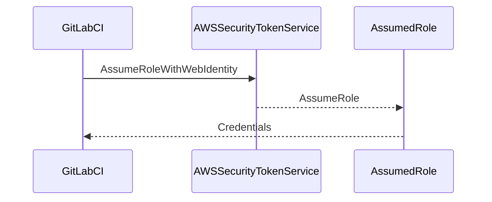

## Secure IaC Pipeline for EKS Provisioning

### Background Theory

In the context of DevSecOps, Infrastructure as Code (IaC) is a critical practice that ensures infrastructure is managed and provisioned through code rather than manual processes. This approach enhances consistency, reliability, and security. One of the key challenges in implementing IaC pipelines is ensuring secure access to cloud resources, particularly when using external entities like GitLab CI/CD pipelines.

### External Entities and Role Assumption

When integrating external entities such as GitLab CI/CD pipelines with AWS services, it is essential to establish a secure connection. This involves assuming an AWS role, which grants temporary permissions to perform specific actions within the AWS environment. The process of assuming a role is facilitated through the AWS Security Token Service (STS).

#### AWS Security Token Service (STS)

The AWS Security Token Service (STS) provides temporary credentials for AWS users or roles. These credentials are used to securely access AWS resources. STS supports several operations, including `AssumeRole`, `GetFederationToken`, and `AssumeRoleWithWebIdentity`.

### Role Assumption Process

To allow external entities like GitLab to make requests to assume an AWS role, we use the `AssumeRoleWithWebIdentity` operation. This operation requires a web identity token, which authenticates the external entity and allows AWS to trust the request.

#### Step-by-Step Mechanics

1. **Define the Role**: First, define the AWS role that the external entity will assume. This role should have the necessary permissions to perform the required actions in the AWS environment.

2. **Environment Variable**: Reference the role using an environment variable. This variable holds the ARN (Amazon Resource Name) of the role.

3. **Role Session Name**: Provide a unique role session name. This name helps identify the specific session and can be useful for logging and auditing purposes.

4. **Web Identity Token**: Generate a web identity token. This token is used to authenticate the external entity and prove its identity to AWS.

5. **AWS STS Command**: Use the `AssumeRoleWithWebIdentity` command to assume the role. This command requires the role ARN, role session name, and the web identity token.

### Detailed Example

Let's walk through a detailed example of how to configure the pipeline to assume an AWS role using GitLab CI/CD.

#### Environment Setup

1. **Define the Role**: Create an IAM role in AWS with the necessary permissions. For example, let's create a role named `GitLabCI_Role` with the following permissions:

    ```json
    {
        "Version": "2012-10-17",
        "Statement": [
            {
                "Effect": "Allow",
                "Action": [
                    "eks:*",
                    "ec2:*",
                    "iam:*",
                    "cloudformation:*"
                ],
                "Resource": "*"
            }
        ]
    }
    ```

2. **Environment Variable**: Set the environment variable `AWS_ROLE_ARN` in your GitLab CI/CD pipeline to reference the role ARN:

    ```yaml
    variables:
      AWS_ROLE_ARN: arn:aws:iam::123456789012:role/GitLabCI_Role
    ```

3. **Role Session Name**: Define a unique role session name. In this example, we'll use a combination of the project ID and pipeline ID:

    ```yaml
    variables:
      ROLE_SESSION_NAME: "kubernetes-session-${CI_PROJECT_ID}-${CI_PIPELINE_ID}"
    ```

4. **Web Identity Token**: Generate a web identity token. This token is typically obtained from an external identity provider (IDP) that is trusted by AWS. For simplicity, let's assume the token is stored in an environment variable `WEB_IDENTITY_TOKEN`:

    ```yaml
    variables:
      WEB_IDENTITY_TOKEN: "your-web-identity-token"
    ```

5. **AWS STS Command**: Use the `aws sts assume-role-with-web-identity` command to assume the role:

    ```sh
    aws sts assume-role-with-web-identity \
      --role-arn $AWS_ROLE_ARN \
      --role-session-name $ROLE_SESSION_NAME \
      --web-identity-token $WEB_IDENTITY_TOKEN
    ```

### Full Raw HTTP Message Example

Here is a full raw HTTP message example for the `AssumeRoleWithWebIdentity` request and response:

```http
POST / HTTP/1.1
Host: sts.amazonaws.com
Content-Type: application/x-www-form-urlencoded
Content-Length: 123

Action=AssumeRoleWithWebIdentity&Version=2011-06-15&RoleArn=arn:aws:iam::123456789012:role/GitLabCI_Role&RoleSessionName=kubernetes-session-12345-67890&WebIdentityToken=your-web-identity-token
```

Response:

```http
HTTP/1.1 200 OK
Content-Type: application/xml
Content-Length: 1234

<?xml version="1.0"?>
<AssumeRoleWithWebIdentityResponse xmlns="https://sts.amazonaws.com/doc/2011-06-15/">
  <AssumeRoleWithWebIdentityResult>
    <SubjectFromWebIdentityToken>your-subject</SubjectFromWebIdentityToken>
    <Audience>sts.amazonaws.com</Audience>
    <AssumedRoleUser>
      <Arn>arn:aws:sts::123456789012:assumed-role/GitLabCI_Role/kubernetes-session-12345-67890</Arn>
      <AssumedRoleId>AROACLKJHGFEDCBA987654321:kubernetes-session-12345-67890</AssumedRoleId>
    </AssumedRoleUser>
    <Credentials>
      <AccessKeyId>ASIAKJHGFEDCBA987654321</AccessKeyId>
      <SecretAccessKey>your-secret-access-key</SecretAccessKey>
      <SessionToken>your-session-token</SessionToken>
      <Expiration>2023-10-10T12:00:00Z</Expiration>
    </Credentials>
  </AssumeRoleWithWebIdentityResult>
  <ResponseMetadata>
    <RequestId>12345678-90ab-cdef-ghij-klmnopqrstuvwx</RequestId>
  </ResponseMetadata>
</AssumeRoleWithWebIdentityResponse>
```

### Mermaid Diagrams

#### Sequence Diagram

A sequence diagram illustrating the interaction between GitLab CI/CD, AWS STS, and the assumed role:



### Common Pitfalls and Detection

#### Pitfalls

1. **Incorrect Role Permissions**: Ensure the role has the correct permissions to perform the required actions. Incorrect permissions can lead to failures in provisioning infrastructure.

2. **Expired Tokens**: Web identity tokens have a limited lifespan. Ensure the token is valid and not expired before making the request.

3. **Incorrect Environment Variables**: Double-check that the environment variables are correctly set and referenced in the pipeline configuration.

#### Detection

1. **Logging and Monitoring**: Enable detailed logging and monitoring for the pipeline and AWS resources. This helps in identifying any issues or unauthorized access attempts.

2. **Audit Trails**: Regularly review audit trails to ensure that the role assumption process is being used as intended.

### How to Prevent / Defend

#### Secure Coding Fixes

**Vulnerable Code**:

```yaml
variables:
  AWS_ROLE_ARN: arn:aws:iam::123456789012:role/GitLabCI_Role
  ROLE_SESSION_NAME: kubernetes-session
  WEB_IDENTITY_TOKEN: your-web-identity-token

script:
  - aws sts assume-role-with-web-identity --role-arn $AWS_ROLE_ARN --role-session-name $ROLE_SESSION_NAME --web-identity-token $WEB_IDENTITY_TOKEN
```

**Secure Code**:

```yaml
variables:
  AWS_ROLE_ARN: arn:aws:iam::123456789012:role/GitLabCI_Role
  ROLE_SESSION_NAME: kubernetes-session-${CI_PROJECT_ID}-${CI_PIPELINE_ID}
  WEB_IDENTITY_TOKEN: your-web-identity-token

script:
  - aws sts assume-role-with-web-identity --role-arn $AWS_ROLE_ARN --role-session-name $ROLE_SESSION_NAME --web-identity-token $WEB_IDENTITY_TOKEN
```

#### Configuration Hardening

1. **IAM Policies**: Ensure IAM policies are least privilege and only grant necessary permissions.

2. **Web Identity Provider Configuration**: Configure the web identity provider to trust only authorized entities.

3. **Token Expiry**: Set appropriate expiry times for web identity tokens to minimize the window of opportunity for misuse.

### Real-World Examples

#### Recent Breaches

One notable breach involving misconfigured IAM roles was the Capital One data breach in 2019. The attacker exploited a misconfigured IAM role to gain unauthorized access to sensitive data. This highlights the importance of securing IAM roles and ensuring proper role assumption mechanisms are in place.

### Practice Labs

For hands-on practice with secure IaC pipelines for EKS provisioning, consider the following labs:

- **PortSwigger Web Security Academy**: Offers a comprehensive set of labs covering various aspects of web security, including secure IaC practices.
- **OWASP Juice Shop**: A deliberately insecure web application for practicing web security skills, including secure IaC configurations.
- **CloudGoat**: Provides a series of labs focused on cloud security, including IAM role management and secure IaC pipelines.

By thoroughly understanding and implementing these concepts, you can ensure a secure and reliable IaC pipeline for EKS provisioning.

---
<!-- nav -->
[[06-Secure IaC Pipeline for EKS Provisioning Part 1|Secure IaC Pipeline for EKS Provisioning Part 1]] | [[DevSecOps/DevSecOps Bootcamp/04-Infrastructure Security/03-Secure IaC Pipeline for EKS Provisioning/Pipeline Configuration for establishing a secure connection/00-Overview|Overview]] | [[08-Secure Infrastructure as Code (IaC) Pipeline for EKS Provisioning Part 1|Secure Infrastructure as Code (IaC) Pipeline for EKS Provisioning Part 1]]
