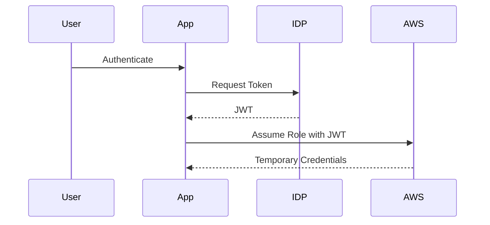

## Secure Infrastructure as Code (IaC) Pipeline for EKS Provisioning

### Introduction to Secure IaC Pipelines

Infrastructure as Code (IaC) is a practice of managing and provisioning infrastructure through machine-readable definition files, rather than physical hardware configuration or interactive configuration tools. In the context of DevSecOps, ensuring that these definitions are secure is paramount. This chapter focuses on setting up a secure IaC pipeline specifically for Amazon Elastic Kubernetes Service (EKS) provisioning.

### Understanding Web Identity Tokens

In the traditional approach, AWS resources are accessed using AWS Access Key ID and Secret Access Key pairs. However, this method poses significant security risks, especially when these keys are stored locally or in version control systems. To mitigate these risks, AWS provides Web Identity Tokens, which allow applications to assume roles using OAuth 2.0 tokens.

#### What is a Web Identity Token?

A Web Identity Token is a JSON Web Token (JWT) issued by an identity provider (IDP) such as Amazon Cognito, Google, or Facebook. These tokens contain claims about the authenticated user and can be used to assume an IAM role within AWS.

#### Why Use Web Identity Tokens?

Using Web Identity Tokens offers several advantages:
- **Reduced Risk**: Eliminates the need to store long-lived AWS credentials locally.
- **Fine-grained Access Control**: Allows for more granular permissions based on the assumed role.
- **Auditability**: Provides better audit trails and logging capabilities.

#### How Web Identity Tokens Work

When an application uses a Web Identity Token to assume an IAM role, the following steps occur:



### Configuring the Pipeline

To establish a secure connection using Web Identity Tokens in an IaC pipeline, we need to configure the pipeline to use these tokens for authentication. This involves setting up the necessary environment variables and scripts within the pipeline.

#### Setting Up the Environment Variables

The pipeline needs to set environment variables that will hold the temporary credentials obtained from assuming the role. These variables are typically `AWS_ACCESS_KEY_ID`, `AWS_SECRET_ACCESS_KEY`, and `AWS_SESSION_TOKEN`.

#### Example Configuration

Here is an example of how to configure the pipeline using a GitLab CI/CD `.gitlab-ci.yml` file:

```yaml
stages:
  - build
  - deploy

variables:
  AWS_ROLE_ARN: "arn:aws:iam::123456789012:role/web-identity-role"
  AWS_WEB_IDENTITY_TOKEN_FILE: "/path/to/token"

build:
  stage: build
  script:
    - echo "Building the application..."
    - aws sts assume-role-with-web-identity --role-arn $AWS_ROLE_ARN --web-identity-token-file $AWS_WEB_IDENTITY_TOKEN_FILE --role-session-name "pipeline-session" > temp_credentials.json
    - export AWS_ACCESS_KEY_ID=$(jq -r '.Credentials.AccessKeyId' temp_credentials.json)
    - export AWS_SECRET_ACCESS_KEY=$(jq -r '.Credentials.SecretAccessKey' temp_credentials.json)
    - export AWS_SESSION_TOKEN=$(jq -r '.Credentials.SessionToken' temp_credentials.json)

deploy:
  stage: deploy
  script:
    - echo "Deploying to EKS..."
    - kubectl apply -f deployment.yaml
```

### Explanation of the Configuration

- **Variables Section**: Defines the `AWS_ROLE_ARN` and `AWS_WEB_IDENTITY_TOKEN_FILE` variables.
- **Build Stage**: Uses the `aws sts assume-role-with-web-identity` command to assume the role and obtain temporary credentials. These credentials are then exported as environment variables.
- **Deploy Stage**: Uses the exported credentials to deploy to EKS.

### Verifying the Configuration

To verify that the pipeline is working correctly, we can add a step to check the assumed role using the `aws sts get-caller-identity` command.

#### Example Verification Script

```yaml
verify:
  stage: deploy
  script:
    - echo "Verifying the assumed role..."
    - aws sts get-caller-identity
```

### Full Raw HTTP Messages

Here is an example of the full raw HTTP messages involved in the process:

#### HTTP Request to Assume Role

```http
POST / HTTP/1.1
Host: sts.amazonaws.com
Content-Type: application/x-www-form-urlencoded
X-Amz-Target: AWSSecurityTokenService.AssumeRoleWithWebIdentity
Content-Length: 123

Action=AssumeRoleWithWebIdentity&Version=2011-06-15&RoleArn=arn:aws:iam::123456789012:role/web-identity-role&RoleSessionName=pipeline-session&WebIdentityToken=<JWT>
```

#### HTTP Response with Temporary Credentials

```http
HTTP/1.1 200 OK
Content-Type: application/json
Content-Length: 456

{
  "Credentials": {
    "AccessKeyId": "ASIA...",
    "SecretAccessKey": "wJalrXUtnFEMI/K7Dd...",
    "SessionToken": "FwoGZXIvY...==",
    "Expiration": "2023-10-10T12:34:56Z"
  },
  "AssumedRoleUser": {
    "Arn": "arn:aws:sts::123456789012:assumed-role/web-identity-role/pipeline-session",
    "AssumedRoleId": "AROAJQPLRKQ..."
  }
}
```

### Common Pitfalls and How to Avoid Them

#### Storing Long-Lived Credentials

One common pitfall is storing long-lived AWS credentials in the pipeline configuration. This can lead to unauthorized access if the credentials are compromised.

**How to Prevent / Defend**

- **Use Short-Lived Credentials**: Always use short-lived credentials obtained via Web Identity Tokens.
- **Environment Variable Management**: Ensure that environment variables containing sensitive information are properly managed and not exposed in logs or version control.

#### Incorrect Role Assumption

Another pitfall is incorrectly configuring the role assumption process, leading to failures in the pipeline.

**How to Prevent / Defend**

- **Verify Role Configuration**: Ensure that the role ARN and session name are correctly specified.
- **Logging and Monitoring**: Implement logging and monitoring to detect and respond to failures quickly.

### Real-World Examples and Recent Breaches

#### Example: AWS Credentials Exposure in GitHub

In 2021, a breach occurred where AWS credentials were exposed in a public GitHub repository. This led to unauthorized access to AWS resources.

**Impact**: Significant financial loss and data exposure.

**Prevention**: Use Web Identity Tokens and ensure that sensitive information is not stored in version control systems.

### Conclusion

Setting up a secure IaC pipeline for EKS provisioning involves using Web Identity Tokens to manage authentication securely. By following the steps outlined in this chapter, you can ensure that your pipeline is robust and secure against common vulnerabilities.

### Practice Labs

For hands-on experience with securing IaC pipelines, consider the following labs:
- **PortSwigger Web Security Academy**: Offers modules on securing cloud infrastructure.
- **OWASP Juice Shop**: Provides scenarios for practicing secure coding and pipeline management.
- **CloudGoat**: A series of labs designed to help users understand and mitigate cloud security issues.

By completing these labs, you can gain practical experience in implementing secure IaC pipelines for EKS provisioning.

---
<!-- nav -->
[[07-Secure IaC Pipeline for EKS Provisioning|Secure IaC Pipeline for EKS Provisioning]] | [[DevSecOps/DevSecOps Bootcamp/04-Infrastructure Security/03-Secure IaC Pipeline for EKS Provisioning/Pipeline Configuration for establishing a secure connection/00-Overview|Overview]] | [[09-Secure Infrastructure as Code (IaC) Pipeline for EKS Provisioning Part 2|Secure Infrastructure as Code (IaC) Pipeline for EKS Provisioning Part 2]]
