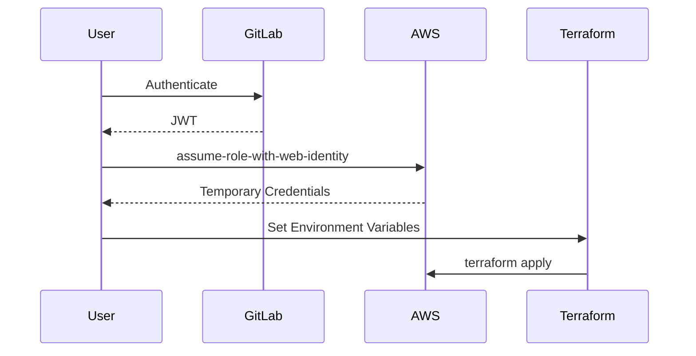

## Secure Infrastructure as Code (IaC) Pipeline for EKS Provisioning

### Introduction to Secure IaC Pipeline for EKS Provisioning

In the realm of DevSecOps, ensuring the security of your Infrastructure as Code (IaC) pipeline is paramount, especially when provisioning resources in Amazon Elastic Kubernetes Service (EKS). This chapter delves into the intricacies of setting up a secure IaC pipeline for EKS provisioning, focusing on the critical steps involved in assuming roles and executing Terraform commands securely.

### Role Assumption from External Entities

One of the key aspects of securing your IaC pipeline is the ability to assume roles from external entities, such as GitLab, which is not an AWS entity. This process involves using the `sts assume-role-with-web-identity` command, which requires a web identity token issued by GitLab.

#### Understanding Web Identity Tokens

A web identity token is a JSON Web Token (JWT) that is signed by an identity provider (IDP) and contains claims about the authenticated user. In the context of GitLab, this token is issued to authenticate users and allow them to assume roles within AWS.

**Why Web Identity Tokens Matter:**
Web identity tokens are crucial because they enable non-AWS entities to securely interact with AWS services. By using these tokens, you can ensure that only authorized users can assume specific roles and perform actions within your AWS environment.

**How Web Identity Tokens Work:**
When a user authenticates through GitLab, GitLab generates a JWT that includes the necessary claims to identify the user. This token is then passed to AWS, which verifies the signature and the claims to determine whether the user is allowed to assume the specified role.

#### Role Assumption Process

To assume a role from an external entity, you use the `sts assume-role-with-web-identity` command. This command requires several parameters:

- **Role ARN:** The Amazon Resource Name (ARN) of the role you want to assume.
- **Session Name:** A unique identifier for the session.
- **Web Identity Token:** The JWT issued by GitLab.

Here is an example of how to use this command:

```bash
aws sts assume-role-with-web-identity \
    --role-arn arn:aws:iam::123456789012:role/GitLabRole \
    --role-session-name MySessionName \
    --web-identity-token <JWT>
```

#### Temporary Credentials

Once the role assumption request is fulfilled by AWS, it returns temporary credentials for the assumed role. These credentials include:

- **Access Key ID**
- **Secret Access Key**
- **Session Token**

These credentials are valid for a limited time and must be used within that timeframe.

#### Setting Environment Variables

The temporary credentials returned by AWS are typically set as environment variables so that subsequent AWS commands can use them. Here is an example of how to set these environment variables:

```bash
export AWS_ACCESS_KEY_ID=<AccessKeyId>
export AWS_SECRET_ACCESS_KEY=<SecretAccessKey>
export AWS_SESSION_TOKEN=<SessionToken>
```

### Executing Terraform Commands

With the environment variables set, you can now execute Terraform commands to provision resources in EKS. Terraform uses these environment variables to authenticate with AWS and execute the `terraform apply` command.

#### Example Terraform Configuration

Here is an example of a Terraform configuration for provisioning an EKS cluster:

```hcl
provider "aws" {
  region = "us-west-2"
}

resource "aws_eks_cluster" "example" {
  name     = "example-cluster"
  role_arn = aws_iam_role.example.arn

  vpc_config {
    subnet_ids = [aws_subnet.example.id]
  }
}

resource "aws_iam_role" "example" {
  name = "example-role"

  assume_role_policy = jsonencode({
    Version = "2012-10-17"
    Statement = [
      {
        Action = "sts:AssumeRole"
        Effect = "Allow"
        Principal = {
          Service = "eks.amazonaws.com"
        }
      },
    ]
  })
}
```

### Full HTTP Request and Response

When you execute the `assume-role-with-web-identity` command, AWS returns a full HTTP response containing the temporary credentials. Here is an example of the full HTTP response:

```http
HTTP/1.1 200 OK
Content-Type: application/json
Date: Tue, 01 Mar 2022 12:00:00 GMT
Content-Length: 320

{
  "Credentials": {
    "AccessKeyId": "<AccessKeyId>",
    "SecretAccessKey": "<SecretAccessKey>",
    "SessionToken": "<SessionToken>",
    "Expiration": "2022-03-01T13:00:00Z"
  },
  "AssumedRoleUser": {
    "Arn": "arn:aws:sts::123456789012:assumed-role/GitLabRole/MySessionName",
    "AssumedRoleId": "AROACLKIQJEXAMPLE:MySessionName"
  }
}
```

### Diagramming the Role Assumption Process

To visualize the role assumption process, consider the following mermaid diagram:



### Common Pitfalls and How to Avoid Them

#### Pitfall 1: Exposing Web Identity Tokens

Exposing web identity tokens can lead to unauthorized access to your AWS resources. Ensure that these tokens are securely stored and transmitted.

**How to Prevent:**
- Use secure channels (HTTPS) to transmit tokens.
- Store tokens securely using encryption.
- Limit the scope of the tokens to the minimum necessary permissions.

#### Pitfall 2: Using Expired Credentials

Using expired credentials can result in failed operations and security vulnerabilities.

**How to Prevent:**
- Regularly refresh credentials before they expire.
- Implement automated processes to renew credentials.

### Real-World Examples and Recent Breaches

#### Example 1: CVE-2021-44228 (Log4Shell)

While not directly related to role assumption, the Log4Shell vulnerability highlights the importance of securing all aspects of your infrastructure. Ensure that all dependencies and libraries are up-to-date and free from known vulnerabilities.

#### Example 2: AWS IAM Policy Misconfiguration

Misconfigured IAM policies can lead to unauthorized access. Ensure that your IAM policies are strictly defined and reviewed regularly.

### How to Prevent / Defend

#### Detection

- Monitor AWS CloudTrail logs for unauthorized access attempts.
- Use AWS Config to audit IAM policies and roles.

#### Prevention

- Implement least privilege access.
- Use AWS Organizations to manage IAM policies across accounts.
- Enable multi-factor authentication (MFA) for all users.

#### Secure Coding Fixes

Compare the vulnerable and secure versions of IAM policies:

**Vulnerable Policy:**

```json
{
  "Version": "2012-10-17",
  "Statement": [
    {
      "Effect": "Allow",
      "Action": "*",
      "Resource": "*"
    }
  ]
}
```

**Secure Policy:**

```json
{
  "Version": "2012-10-17",
  "Statement": [
    {
      "Effect": "Allow",
      "Action": [
        "eks:*",
        "iam:GetRole",
        "iam:PassRole"
      ],
      "Resource": [
        "arn:aws:eks:us-west-2:123456789012:cluster/example-cluster",
        "arn:aws:iam::123456789012:role/example-role"
      ]
    }
  ]
}
```

### Conclusion

Setting up a secure IaC pipeline for EKS provisioning involves careful management of role assumptions and execution of Terraform commands. By understanding the role assumption process, using web identity tokens, and securing your environment variables, you can ensure that your pipeline remains robust and secure.

### Practice Labs

For hands-on practice, consider the following labs:

- **PortSwigger Web Security Academy:** Focuses on web application security but can provide valuable insights into secure coding practices.
- **OWASP Juice Shop:** A deliberately insecure web application for practicing security skills.
- **CloudGoat:** Provides a series of labs to practice securing AWS environments.

By following these guidelines and practicing with real-world scenarios, you can master the art of securing your IaC pipeline for EKS provisioning.

---
<!-- nav -->
[[08-Secure Infrastructure as Code (IaC) Pipeline for EKS Provisioning Part 1|Secure Infrastructure as Code (IaC) Pipeline for EKS Provisioning Part 1]] | [[DevSecOps/DevSecOps Bootcamp/04-Infrastructure Security/03-Secure IaC Pipeline for EKS Provisioning/Pipeline Configuration for establishing a secure connection/00-Overview|Overview]] | [[10-Secure Infrastructure as Code (IaC) Pipeline for EKS Provisioning|Secure Infrastructure as Code (IaC) Pipeline for EKS Provisioning]]
