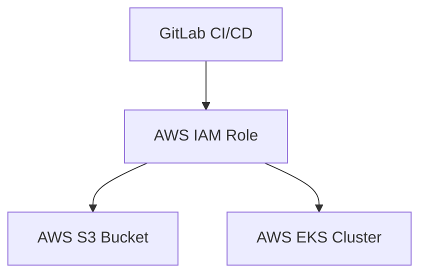

## Introduction to Secure IaC Pipeline for EKS Provisioning

In the realm of DevSecOps, Infrastructure as Code (IaC) plays a pivotal role in automating the provisioning and management of infrastructure resources. One of the most popular tools for IaC is Terraform, which allows you to define your infrastructure in declarative configuration files. In this chapter, we will delve into the process of securely provisioning an Amazon Elastic Kubernetes Service (EKS) cluster using Terraform within a GitLab CI/CD pipeline.

### Background Theory

#### What is Infrastructure as Code (IaC)?

Infrastructure as Code (IaC) is the practice of managing and provisioning computer data centers through machine-readable definition files, rather than physical hardware configuration or interactive configuration tools. This approach enables developers and operations teams to manage infrastructure changes in a consistent and repeatable manner.

#### What is Terraform?

Terraform is an open-source infrastructure as code software tool created by HashiCorp. It allows you to safely and predictably create, change, and improve infrastructure. It is an infrastructure as code tool that codifies APIs into declarative configuration files that can be versioned, treated as code, edited, reviewed, and reused.

#### What is Amazon Elastic Kubernetes Service (EKS)?

Amazon Elastic Kubernetes Service (EKS) is a managed service that makes it easy to run Kubernetes on AWS without needing to stand up or maintain your own Kubernetes control plane. EKS supports the Kubernetes API, so you can use any Kubernetes-compliant tool with EKS.

### Setting Up the Environment

To set up the environment for provisioning an EKS cluster using Terraform within a GitLab CI/CD pipeline, we need to ensure that the necessary configurations and permissions are in place.

#### Prerequisites

- **AWS Account**: You need an AWS account with the necessary permissions to create and manage EKS clusters.
- **GitLab Repository**: A GitLab repository where the Terraform configuration files will be stored.
- **GitLab CI/CD Pipeline**: A configured GitLab CI/CD pipeline to automate the provisioning process.

#### Permissions and Roles

The GitLab CI/CD pipeline requires appropriate permissions to interact with AWS services. Specifically, it needs access to the S3 bucket where Terraform state files are stored and the ability to create and manage EKS clusters.



### Terraform Configuration for EKS Provisioning

Let's walk through the steps to configure Terraform for EKS provisioning within a GitLab CI/CD pipeline.

#### Step 1: Define the Terraform Configuration

Create a `main.tf` file to define the EKS cluster and related resources.

```hcl
provider "aws" {
  region = "us-west-2"
}

resource "aws_eks_cluster" "example" {
  name     = "example-cluster"
  role_arn = aws_iam_role.example.arn

  vpc_config {
    subnet_ids = [aws_subnet.example.id]
  }
}

resource "aws_iam_role" "example" {
  name = "example-role"

  assume_role_policy = jsonencode({
    Version = "2012-10-17"
    Statement = [
      {
        Action = "sts:AssumeRole"
        Effect = "Allow"
        Principal = {
          Service = "eks.amazonaws.com"
        }
      },
    ]
  })
}
```

#### Step 2: Configure the GitLab CI/CD Pipeline

Define a `.gitlab-ci.yml` file to automate the Terraform workflow.

```yaml
stages:
  - init
  - plan
  - apply

variables:
  TF_VAR_aws_access_key_id: $AWS_ACCESS_KEY_ID
  TF_VAR_aws_secret_access_key: $AWS_SECRET_ACCESS_KEY

init:
  stage: init
  script:
    - terraform init
  artifacts:
    paths:
      - .terraform/

plan:
  stage: plan
  script:
    - terraform plan -out=tfplan
  dependencies:
    - init
  artifacts:
    paths:
      - tfplan

apply:
  stage: apply
  script:
    - terraform apply -auto-approve tfplan
  dependencies:
    - plan
```

### Detailed Workflow Execution

When the pipeline runs, several steps occur behind the scenes:

1. **Initialization**: The `init` job initializes Terraform and sets up the backend configuration.
2. **Planning**: The `plan` job generates a plan file (`tfplan`) that outlines the changes to be made.
3. **Application**: The `apply` job applies the changes defined in the plan file.

#### Logging and Debugging

During the execution, detailed logs are generated to help debug any issues. Here is an example of the logs:

```plaintext
Running with gitlab-runner 14.1.0 (00000000)
  on runner 00000000
Preparing the "shell" executor
Using Shell executor...
Preparing environment
00:01
Running on runner...
Getting source from Git repository
00:01
Fetching changes with git depth set to 20...
Initialized empty Git repository in /builds/project/.git/
Created fresh repository.
Checking out 00000000 as initial commit...
Skipping Git submodules setup
Executing "step_script" stage of the job script
00:02
$ terraform init
Initializing the backend...
Successfully configured the backend "s3"! Terraform will automatically
use this backend unless the backend configuration changes.
Initializing provider plugins...
Terraform has been successfully initialized!
```

### Handling Credentials and Permissions

The pipeline uses credentials stored in GitLab CI/CD variables to authenticate with AWS. These credentials are typically associated with an IAM role that has the necessary permissions.

#### IAM Role Configuration

Here is an example of an IAM role configuration:

```json
{
  "Version": "2012-10-17",
  "Statement": [
    {
      "Effect": "Allow",
      "Action": [
        "eks:*",
        "ec2:*",
        "iam:PassRole",
        "iam:GetRole",
        "iam:ListRoles",
        "iam:CreateServiceLinkedRole",
        "cloudformation:DescribeStackEvents",
        "cloudformation:DescribeStacks",
        "cloudformation:GetTemplateSummary",
        "cloudformation:ListStackResources",
        "cloudformation:UpdateStack",
        "cloudformation:ValidateTemplate",
        "cloudformation:CreateStack",
        "cloudformation:DeleteStack",
        "cloudformation:DescribeStackResource",
        "cloudformation:DescribeStackResources",
        "cloudformation:EstimateTemplateCost",
        "cloudformation:GetStackPolicy",
        "cloudformation:SetStackPolicy",
        "cloudformation:TestType",
        "cloudformation:UpdateTerminationProtection",
        "cloudformation:ValidateTemplate",
        "cloudformation:DescribeChangeSet",
        "cloudformation:ExecuteChangeSet",
        "cloudformation:CreateChangeSet",
        "cloudformation:DeleteChangeSet",
        "cloudformation:ListChangeSets",
        "cloudformation:DescribeTypeRegistration",
        "cloudformation:RegisterType",
        "cloudformation:DeregisterType",
        "cloudformation:DescribeType",
        "cloudformation:PublishType",
        "cloudformation:DeprecateType",
        "cloudformation:UndeprecateType",
        "cloudformation:DescribeTypeRegistration",
        "cloudformation:RegisterType",
        "cloudformation:DeregisterType",
        "cloudformation:DescribeType",
        "cloudformation:PublishType",
        "cloudformation:DeprecateType",
        "cloudformation:UndeprecateType",
        "cloudformation:DescribeTypeRegistration",
        "cloudformation:RegisterType",
        "cloudformation:DeregisterType",
        "cloudS3:*",
        "sqs:*",
        "sns:*",
        "logs:*",
        "lambda:*",
        "route53:*",
        "acm:*",
        "elasticloadbalancing:*",
        "autoscaling:*",
        "cloudwatch:*",
        "cloudtrail:*",
        "config:*",
        "directconnect:*",
        "ds:*",
        "ecr:*",
        "efs:*",
        "elasticache:*",
        "elasticbeanstalk:*",
        "events:*",
        "firehose:*",
        "glacier:*",
        "glue:*",
        "inspector:*",
        "kinesis:*",
        "kms:*",
        "mediaconvert:*",
        "mediapackage:*",
        "mediastore:*",
        "opsworks:*",
        "rds:*",
        "redshift:*",
        "route53domains:*",
        "sagemaker:*",
        "storagegateway:*",
        "waf:*",
        "workspaces:*",
        "xray:*"
      ],
      "Resource": "*"
    }
  ]
}
```

### Security Considerations

#### Vulnerabilities and Risks

One of the primary risks in this setup is the exposure of sensitive credentials. If the credentials are compromised, an attacker could gain unauthorized access to AWS resources.

#### Real-World Example

A notable breach involving compromised credentials occurred in 2021 when a misconfigured S3 bucket exposed sensitive data, including AWS access keys. This incident highlights the importance of securing credentials and limiting their scope.

#### How to Prevent / Defend

1. **Least Privilege Principle**: Ensure that the IAM role used by the pipeline has the minimum necessary permissions.
2. **Secure Credential Storage**: Use GitLab CI/CD variable secrets to store credentials securely.
3. **Regular Audits**: Conduct regular audits of IAM roles and permissions to ensure compliance with least privilege principles.
4. **Monitoring and Alerts**: Set up monitoring and alerts for unusual activity in the AWS console.

### Complete Example

Here is a complete example of the Terraform configuration and GitLab CI/CD pipeline:

#### Terraform Configuration (`main.tf`)

```hcl
provider "aws" {
  region = "us-west-2"
}

resource "aws_eks_cluster" "example" {
  name     = "example-cluster"
  role_arn = aws_iam_role.example.arn

  vpc_config {
    subnet_ids = [aws_subnet.example.id]
  }
}

resource "aws_iam_role" "example" {
  name = "example-role"

  assume_role_policy = jsonencode({
    Version = "2012-10-17"
    Statement = [
      {
        Action = "sts:AssumeRole"
        Effect = "Allow"
        Principal = {
          Service = "eks.amazonaws.com"
        }
      },
    ]
  })
}
```

#### GitLab CI/CD Pipeline Configuration (`gitlab-ci.yml`)

```yaml
stages:
  - init
  - plan
  - apply

variables:
  TF_VAR_aws_access_key_id: $AWS_ACCESS_KEY_ID
  TF_VAR_aws_secret_access_key: $AWS_SECRET_ACCESS_KEY

init:
  stage: init
  script:
    - terraform init
  artifacts:
    paths:
      - .terraform/

plan:
  stage: plan
  script:
    - terraform plan -out=tfplan
  dependencies:
    - init
  artifacts:
    paths:
      - tfplan

apply:
  stage: apply
  script:
    - terraform apply -auto-approve tfplan
  dependencies:
    - plan
```

### Pitfalls and Common Mistakes

1. **Overly Permissive IAM Roles**: Ensure that IAM roles are not overly permissive and follow the principle of least privilege.
2. **Hardcoded Credentials**: Avoid hardcoding credentials in Terraform configuration files. Use environment variables or secrets management tools instead.
3. **Incomplete State Management**: Ensure that Terraform state files are properly managed and backed up to avoid loss of state information.

### Conclusion

Provisioning an EKS cluster using Terraform within a GitLab CI/CD pipeline requires careful planning and configuration. By following the steps outlined in this chapter, you can ensure that your infrastructure is provisioned securely and efficiently. Remember to adhere to best practices for security and to regularly audit and review your configurations to maintain a robust and secure environment.

### Practice Labs

For hands-on experience with this topic, consider the following labs:

- **PortSwigger Web Security Academy**: Focuses on web application security but can provide valuable context for understanding secure coding practices.
- **OWASP Juice Shop**: Another web application security lab that can help reinforce secure coding principles.
- **CloudGoat**: Provides a series of labs focused on cloud security, including AWS-specific scenarios.
- **Pacu**: A penetration testing framework for AWS that can help you understand and test the security of your AWS infrastructure.

By engaging with these labs, you can deepen your understanding of the concepts covered in this chapter and apply them in practical scenarios.

---
<!-- nav -->
[[DevSecOps/DevSecOps Bootcamp/04-Infrastructure Security/03-Secure IaC Pipeline for EKS Provisioning/Terraform Configuration for EKS provisioning/01-Introduction to Secure IaC Pipeline for EKS Provisioning Part 1|Introduction to Secure IaC Pipeline for EKS Provisioning Part 1]] | [[DevSecOps/DevSecOps Bootcamp/04-Infrastructure Security/03-Secure IaC Pipeline for EKS Provisioning/Terraform Configuration for EKS provisioning/00-Overview|Overview]] | [[03-Introduction to Secure IaC Pipeline for EKS Provisioning Part 3|Introduction to Secure IaC Pipeline for EKS Provisioning Part 3]]
