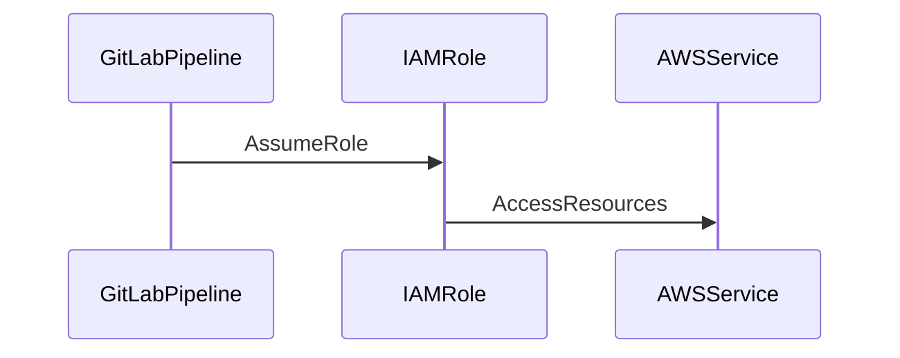

## Introduction to Secure IaC Pipeline for EKS Provisioning

In the realm of DevSecOps, Infrastructure as Code (IaC) plays a pivotal role in ensuring that infrastructure is managed and deployed in a consistent, repeatable, and secure manner. This chapter delves into the process of setting up a secure IaC pipeline specifically for provisioning Amazon Elastic Kubernetes Service (EKS) clusters using Terraform. We will cover the entire workflow, from establishing a secure connection between GitLab and AWS to configuring remote state storage and executing Terraform commands within a pipeline.

### Background Theory

#### What is Infrastructure as Code (IaC)?

Infrastructure as Code (IaC) is a practice in which infrastructure is defined and managed using code rather than manual processes. This approach allows for version control, automated testing, and consistent deployment across environments. Tools like Terraform, Ansible, and CloudFormation are commonly used for IaC.

#### Why Use IaC?

Using IaC provides several benefits:
- **Consistency**: Ensures that infrastructure is deployed consistently across different environments.
- **Repeatability**: Allows for the recreation of infrastructure from scratch at any time.
- **Version Control**: Enables tracking changes to infrastructure configurations.
- **Automation**: Facilitates automation of infrastructure management tasks.

#### What is Amazon Elastic Kubernetes Service (EKS)?

Amazon Elastic Kubernetes Service (EKS) is a managed service that makes it easy to run Kubernetes on AWS without needing to install and operate your own Kubernetes control plane. EKS supports the Kubernetes API, allowing you to use existing tools and plugins.

### Establishing a Secure Connection Between GitLab and AWS

Before we can start provisioning EKS clusters using Terraform, we need to establish a secure connection between GitLab and AWS. This involves setting up an IAM role and assuming that role within the GitLab pipeline.

#### Setting Up an IAM Role

An IAM role is an entity that defines a set of permissions that can be assumed by other entities, such as EC2 instances or Lambda functions. In this context, we will create an IAM role that the GitLab pipeline can assume to access AWS resources.



#### Creating the IAM Role

To create an IAM role, follow these steps:

1. **Create a Policy**: Define a policy that grants the necessary permissions to the role.
2. **Attach the Policy to the Role**: Attach the policy to the IAM role.
3. **Trust Relationship**: Set up a trust relationship that allows the GitLab pipeline to assume the role.

Here is an example of creating an IAM role using the AWS Management Console:

1. Navigate to the IAM console.
2. Click on "Roles" and then "Create role".
3. Select "AWS service" and choose "EC2" as the service that will use this role.
4. Attach the necessary policies (e.g., `AmazonEKSClusterPolicy`).
5. Add a trust relationship to allow the GitLab pipeline to assume the role.

The trust relationship policy might look like this:

```json
{
  "Version": "2012-10-17",
  "Statement": [
    {
      "Effect": "Allow",
      "Principal": {
        "Service": "ec2.amazonaws.com"
      },
      "Action": "sts:AssumeRole"
    }
  ]
}
```

### Configuring Remote State Storage

Remote state storage is crucial for managing Terraform state files in a centralized and secure manner. This ensures that multiple users or pipelines can access and update the state without conflicts.

#### Why Use Remote State Storage?

Using remote state storage provides several advantages:
- **Centralized Management**: All state files are stored in a single location.
- **Concurrency Control**: Multiple users can safely modify the state without conflicts.
- **Backup and Recovery**: Centralized state storage simplifies backup and recovery processes.

#### Configuring Remote State Storage with Terraform

Terraform supports various backends for remote state storage, including S3, Consul, and Azure Blob Storage. For this example, we will use S3.

1. **Create an S3 Bucket**: Create an S3 bucket to store the Terraform state files.
2. **Configure the Backend**: Configure the backend in your Terraform configuration.

Here is an example of configuring the S3 backend in `backend.tf`:

```hcl
terraform {
  backend "s3" {
    bucket = "my-terraform-state-bucket"
    key    = "state/eks-cluster.tfstate"
    region = "us-west-2"
  }
}
```

### Executing Terraform Commands Within the Pipeline

Now that we have established a secure connection and configured remote state storage, we can proceed to execute Terraform commands within the GitLab pipeline.

#### Setting Up the GitLab Pipeline

A GitLab pipeline is a series of jobs that are executed in a specific order. Each job can run a script or a set of commands.

1. **Define the Pipeline**: Define the pipeline in `.gitlab-ci.yml`.
2. **Install Terraform**: Ensure that Terraform is installed in the pipeline environment.
3. **Execute Terraform Commands**: Run Terraform commands to initialize, plan, and apply the configuration.

Here is an example of a `.gitlab-ci.yml` file:

```yaml
stages:
  - init
  - plan
  - apply

variables:
  TF_VAR_aws_access_key_id: $AWS_ACCESS_KEY_ID
  TF_VAR_aws_secret_access_key: $AWS_SECRET_ACCESS_KEY
  TF_VAR_aws_region: us-west-2

init:
  stage: init
  script:
    - terraform init -backend-config="bucket=my-terraform-state-bucket" -backend-config="key=state/eks-cluster.tfstate" -backend-config="region=us-west-2"

plan:
  stage: plan
  script:
    - terraform plan -out=tfplan

apply:
  stage: apply
  script:
    - terraform apply tfplan
```

### Complete Example of Terraform Configuration for EKS Provisioning

Let's walk through a complete example of provisioning an EKS cluster using Terraform.

#### Step 1: Initialize Terraform

Initialize Terraform to download the necessary providers and modules.

```sh
terraform init -backend-config="bucket=my-terraform-state-bucket" -backend-config="key=state/eks-cluster.tfstate" -backend-config="region=us-west-2"
```

#### Step 2: Define the EKS Cluster

Define the EKS cluster in `main.tf`.

```hcl
provider "aws" {
  region = var.aws_region
}

resource "aws_eks_cluster" "example" {
  name     = "example-cluster"
  role_arn = aws_iam_role.example.arn

  vpc_config {
    subnet_ids = [aws_subnet.example.id]
  }
}

resource "aws_iam_role" "example" {
  name = "example-role"

  assume_role_policy = jsonencode({
    Version = "2012-10-17"
    Statement = [
      {
        Action = "sts:AssumeRole"
        Effect = "Allow"
        Principal = {
          Service = "eks.amazonaws.com"
        }
      }
    ]
  })
}

resource "aws_iam_role_policy_attachment" "example" {
  policy_arn = "arn:aws:iam::aws:policy/AmazonEKSClusterPolicy"
  role_arn   = aws_iam_role.example.arn
}

resource "aws_subnet" "example" {
  availability_zone = "us-west-2a"
  cidr_block        = "10.0.1.0/24"
  vpc_id            = aws_vpc.example.id
}

resource "aws_vpc" "example" {
  cidr_block = "10.0.0.0/16"
}
```

#### Step 3: Plan and Apply the Configuration

Plan and apply the configuration using Terraform.

```sh
terraform plan -out=tfplan
terraform apply tfplan
```

### Common Pitfalls and How to Avoid Them

#### Pitfall 1: Incorrect Permissions

**What Goes Wrong**: If the IAM role does not have the correct permissions, Terraform may fail to execute commands.

**How to Prevent**: Ensure that the IAM role has the necessary permissions by attaching the appropriate policies.

#### Pitfall 2: State File Conflicts

**What Goes Wrong**: If multiple users or pipelines access the state file simultaneously, conflicts may occur.

**How to Prevent**: Use a remote state storage backend and configure concurrency control.

### Real-World Examples and Recent Breaches

#### Example: CVE-2021-20225

CVE-2021-20225 is a vulnerability in AWS IAM roles that could allow unauthorized access to resources. This highlights the importance of properly securing IAM roles and permissions.

#### Example: Capital One Data Breach

The Capital One data breach in 2019 involved unauthorized access to sensitive data due to misconfigured IAM roles. This underscores the need for strict IAM role management and least privilege principles.

### How to Prevent / Defend

#### Detection

- **Audit Logs**: Enable and monitor audit logs to detect unauthorized access attempts.
- **Security Groups**: Use security groups to restrict access to resources.

#### Prevention

- **Least Privilege**: Grant only the minimum necessary permissions to IAM roles.
- **MFA**: Require multi-factor authentication (MFA) for accessing sensitive resources.

#### Secure Coding Fixes

Compare the vulnerable and secure versions of IAM role configuration:

**Vulnerable Version**:

```json
{
  "Version": "2012-10-17",
  "Statement": [
    {
      "Effect": "Allow",
      "Action": "*",
      "Resource": "*"
    }
  ]
}
```

**Secure Version**:

```json
{
  "Version": "2012-10-17",
  "Statement": [
    {
      "Effect": "Allow",
      "Action": [
        "eks:*"
      ],
      "Resource": "*"
    }
  ]
}
```

### Conclusion

This chapter has provided a comprehensive guide to setting up a secure IaC pipeline for EKS provisioning using Terraform. By following the steps outlined, you can ensure that your infrastructure is managed securely and consistently. Remember to always adhere to best practices for IAM role management and state file storage to prevent unauthorized access and conflicts.

### Practice Labs

For hands-on experience with this topic, consider the following labs:
- **PortSwigger Web Security Academy**: Focuses on web application security but includes relevant IaC concepts.
- **OWASP Juice Shop**: A deliberately insecure web application for practicing security skills.
- **DVWA (Damn Vulnerable Web Application)**: Another web application for learning security practices.
- **CloudGoat**: A lab for practicing cloud security on AWS.
- **flaws.cloud**: A lab for practicing cloud security on AWS.
- **Kubernetes Goat**: A lab for practicing Kubernetes security.

These labs provide practical experience in setting up and securing IaC pipelines for EKS provisioning.

---
<!-- nav -->
[[03-Introduction to Secure IaC Pipeline for EKS Provisioning Part 3|Introduction to Secure IaC Pipeline for EKS Provisioning Part 3]] | [[DevSecOps/DevSecOps Bootcamp/04-Infrastructure Security/03-Secure IaC Pipeline for EKS Provisioning/Terraform Configuration for EKS provisioning/00-Overview|Overview]] | [[05-Introduction to Secure Infrastructure as Code (IaC) Pipeline for EKS Provisioning Part 1|Introduction to Secure Infrastructure as Code (IaC) Pipeline for EKS Provisioning Part 1]]
