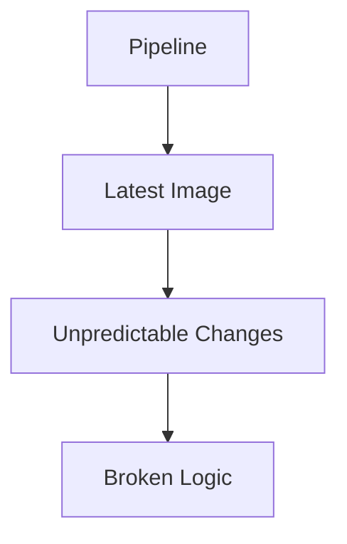
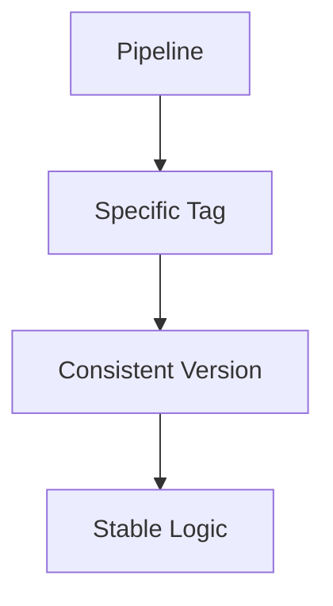
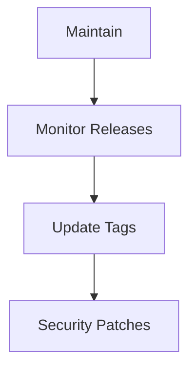
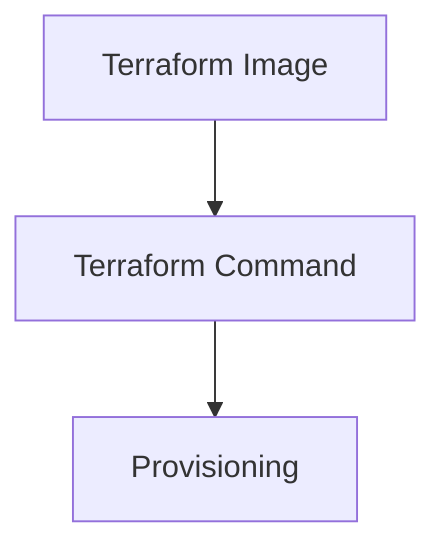
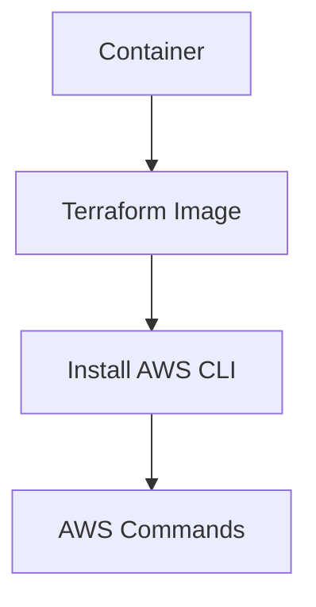
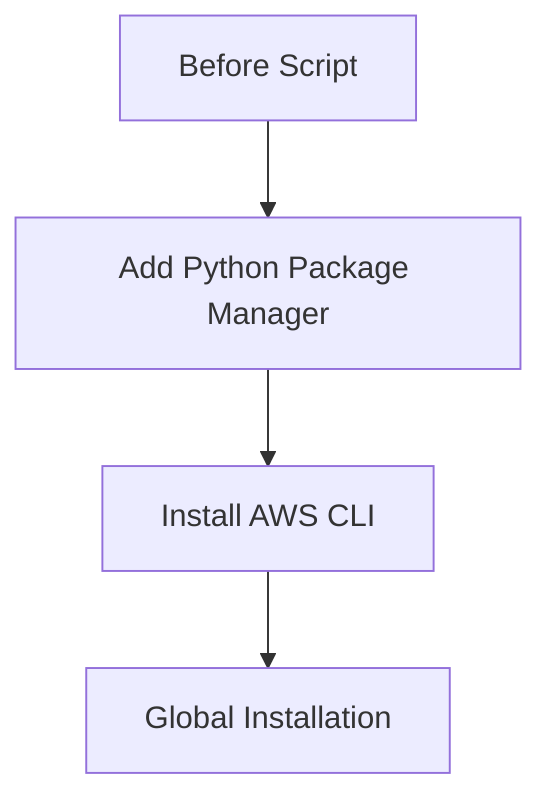

## Introduction to Secure Infrastructure as Code (IaC) Pipeline for EKS Provisioning

In the realm of DevSecOps, Infrastructure as Code (IaC) plays a pivotal role in automating and securing infrastructure management. One of the most popular tools for IaC is Terraform, which allows you to define and provision your infrastructure using declarative configuration files. This chapter focuses on setting up a secure IaC pipeline specifically for Amazon Elastic Kubernetes Service (EKS) provisioning using Terraform.

### Why Secure IaC Matters

Secure IaC ensures that your infrastructure is provisioned consistently and securely across different environments. This is crucial because infrastructure misconfigurations can lead to significant security vulnerabilities. For instance, a misconfigured EKS cluster could expose sensitive data or allow unauthorized access to critical resources.

### Key Concepts

- **Infrastructure as Code (IaC)**: A practice where infrastructure is defined using code rather than manual processes. This allows for version control, automated testing, and consistent deployment.
- **Terraform**: An open-source tool for building, changing, and combining infrastructure safely and efficiently. Terraform can manage a wide range of cloud services and on-premises infrastructure.
- **Amazon Elastic Kubernetes Service (EKS)**: A managed service that makes it easy to run Kubernetes on AWS without needing expertise in Kubernetes orchestration or cluster management.

### Challenges in IaC Pipelines

One of the primary challenges in IaC pipelines is ensuring that the infrastructure is provisioned correctly and securely. This includes managing dependencies, ensuring that the correct versions of tools are used, and maintaining the integrity of the pipeline.

#### Dependency Management

When using Docker images in your IaC pipeline, it is essential to manage dependencies carefully. Using the `latest` tag for Docker images can introduce risks because the image might change unexpectedly, leading to inconsistencies in your pipeline.



**Example**: In 2021, a company using the `latest` tag for their Docker images experienced a sudden failure in their CI/CD pipeline due to an unexpected update in the base image. This led to downtime and required immediate intervention to revert to a stable version.

### Fixating Specific Image Tags

To mitigate the risks associated with using the `latest` tag, it is recommended to fixate specific image tags. This ensures that the same version of the image is used consistently across different runs of the pipeline.



**Example**: A company using Terraform for EKS provisioning decided to fixate specific image tags for their Docker images. This allowed them to maintain consistency and avoid unexpected changes that could break their pipeline.

### Maintaining Regular Updates

While fixating specific image tags provides stability, it also requires regular maintenance to ensure that you are using the latest security patches and features. This involves monitoring for new releases and updating the image tags accordingly.



**Example**: In 2022, a security vulnerability was discovered in a widely used Docker image. Companies that had fixated specific image tags were able to quickly update to the patched version, whereas those using the `latest` tag were more susceptible to the vulnerability.

### Terraform Official Image

For EKS provisioning, the Terraform official image is commonly used. This image comes pre-installed with the Terraform command, making it ready to use out-of-the-box.



### Adding AWS CLI to the Build Environment

In addition to Terraform, the build environment often requires the AWS CLI to interact with AWS services. To achieve this, you can install the AWS CLI within the container.



### Installation Steps

The installation process involves adding Python's package manager and using `pip3` to install the AWS CLI globally.



### Complete Example

Here is a complete example of how to set up the Terraform image with the AWS CLI installed:

```yaml
# Dockerfile
FROM hashicorp/terraform:latest

# Install Python and pip
RUN apt-get update && apt-get install -y python3 python3-pip

# Install AWS CLI
RUN pip3 install --upgrade awscli

# Set up entrypoint
ENTRYPOINT ["sh", "-c"]
CMD ["terraform init && terraform apply"]
```

### Full HTTP Request and Response

When interacting with AWS services via the AWS CLI, the full HTTP request and response would look something like this:

```http
POST / HTTP/1.1
Host: eks.amazonaws.com
Content-Type: application/json
Authorization: Bearer <your-token>

{
  "Action": "CreateCluster",
  "Version": "2017-11-01",
  "Name": "my-cluster",
  "RoleArn": "arn:aws:iam::123456789012:role/EKSRole",
  "ResourcesVpcConfig": {
    "SubnetIds": ["subnet-12345678", "subnet-23456789"],
    "SecurityGroupIds": ["sg-12345678"]
  }
}

HTTP/1.1 200 OK
Content-Type: application/json

{
  "cluster": {
    "name": "my-cluster",
    "arn": "arn:aws:eks:us-west-2:123456789012:cluster/my-cluster",
    "createdAt": "2023-01-01T00:00:00Z",
    "version": "1.21"
  }
}
```

### Common Pitfalls and How to Avoid Them

#### Using Unsecured Docker Images

Using unsecured Docker images can introduce vulnerabilities into your pipeline. Always verify the source of your Docker images and use trusted repositories.

**How to Prevent / Defend**:
- Use verified Docker images from trusted sources.
- Implement image scanning tools like Aqua Security or Clair to detect vulnerabilities.

#### Missing Security Patches

Failing to keep your Docker images up-to-date with the latest security patches can leave your pipeline vulnerable to attacks.

**How to Prevent / Defend**:
- Regularly monitor for new releases and update your image tags.
- Use automated tools to notify you of available updates.

### Real-World Examples

#### CVE-2021-44228 (Log4Shell)

In 2021, the Log4Shell vulnerability (CVE-2021-44228) affected many Docker images. Companies that had fixated specific image tags were able to quickly update to the patched version, whereas those using the `latest` tag were more susceptible to the vulnerability.

#### Recent Breaches

In 2022, a company experienced a breach due to an outdated Docker image used in their CI/CD pipeline. The image contained a known vulnerability that was exploited by attackers. By fixing specific image tags and regularly updating them, such breaches can be prevented.

### Hands-On Labs

To gain practical experience with setting up a secure IaC pipeline for EKS provisioning, consider the following labs:

- **PortSwigger Web Security Academy**: Offers a comprehensive set of labs covering various aspects of web security, including IaC.
- **OWASP Juice Shop**: A deliberately insecure web application for security training purposes.
- **Kubernetes Goat**: A hands-on lab for learning Kubernetes security.

### Conclusion

Setting up a secure IaC pipeline for EKS provisioning using Terraform involves careful management of dependencies, regular updates, and consistent use of specific image tags. By following best practices and using the right tools, you can ensure that your infrastructure is provisioned securely and consistently.

---
<!-- nav -->
[[05-Introduction to Secure Infrastructure as Code (IaC) Pipeline for EKS Provisioning Part 1|Introduction to Secure Infrastructure as Code (IaC) Pipeline for EKS Provisioning Part 1]] | [[DevSecOps/DevSecOps Bootcamp/04-Infrastructure Security/03-Secure IaC Pipeline for EKS Provisioning/Terraform Configuration for EKS provisioning/00-Overview|Overview]] | [[07-Introduction to Terraform State Management|Introduction to Terraform State Management]]
