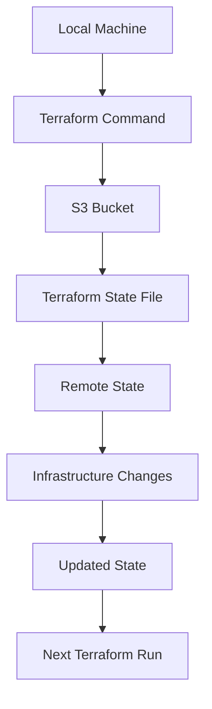

## Introduction to Terraform State Management

In the context of Infrastructure as Code (IaC), managing the state of your infrastructure is crucial for ensuring consistency, reliability, and traceability. Terraform, one of the most popular IaC tools, uses a state file to keep track of the resources it manages. This state file contains metadata about the resources, their current state, and any dependencies between them. Proper management of this state file is essential to avoid conflicts, data loss, and other issues that can arise during infrastructure changes.

### Why Remote Storage for Terraform State?

Managing the Terraform state locally poses several risks:

1. **Data Loss**: If the local machine fails or is lost, the state file could be lost, leading to inconsistencies in the infrastructure.
2. **Concurrency Issues**: Multiple users working on the same infrastructure might overwrite each other's changes if they are using different local state files.
3. **Traceability**: Without a centralized state, it becomes difficult to track changes and understand the history of the infrastructure.

To mitigate these risks, it is recommended to use a remote storage solution for the Terraform state. This ensures that the state is accessible to all team members and is backed up automatically.

### Choosing a Remote Storage Solution

For this discussion, we will focus on using Amazon S3 as the remote storage solution for Terraform state. S3 is a highly available and durable object storage service provided by AWS, making it an ideal choice for storing Terraform state files.

#### Setting Up an S3 Bucket for Terraform State

To set up an S3 bucket for storing the Terraform state, follow these steps:

1. **Create an S3 Bucket**:
    - Ensure the bucket name is globally unique across all AWS accounts.
    - Set appropriate permissions to allow access to the bucket.

2. **Configure the S3 Backend in Terraform**:
    - Define the backend configuration in your `main.tf` file.

Here is an example of how to configure the S3 backend in Terraform:

```hcl
terraform {
  backend "s3" {
    bucket = "infra-bucket-11"
    key    = "infra/state.tfstate"
    region = "eu-central-1"
  }
}
```

### Detailed Explanation of the Configuration

- **bucket**: Specifies the name of the S3 bucket where the state file will be stored.
- **key**: Specifies the path and filename within the bucket where the state file will be stored.
- **region**: Specifies the AWS region where the S3 bucket is located.

### Creating the S3 Bucket

To create the S3 bucket, you can use the AWS Management Console or the AWS CLI. Here is an example using the AWS CLI:

```bash
aws s3api create-bucket --bucket infra-bbucket-11 --region eu-central-1 --create-bucket-configuration LocationConstraint=eu-central-1
```

### Configuring Permissions

Ensure that the S3 bucket has the correct permissions to allow Terraform to read and write the state file. You can achieve this by attaching an IAM policy to the role used by Terraform.

Here is an example IAM policy:

```json
{
    "Version": "2012-10-17",
    "Statement": [
        {
            "Effect": "Allow",
            "Action": [
                "s3:GetObject",
                "s3:PutObject",
                "s3:DeleteObject",
                "s3:ListBucket"
            ],
            "Resource": [
                "arn:aws:s3:::infra-bucket-11",
                "arn:aws:s3:::infra-bucket-11/*"
            ]
        }
    ]
}
```

### Initializing Terraform with the S3 Backend

Once the S3 bucket is set up, you need to initialize Terraform with the S3 backend. Run the following command:

```bash
terraform init
```

This command initializes the backend and sets up the necessary configurations.

### Example of Full Terraform Configuration

Here is a complete example of a Terraform configuration file (`main.tf`) with the S3 backend setup:

```hcl
provider "aws" {
  region = "eu-central-1"
}

resource "aws_s3_bucket" "state_bucket" {
  bucket = "infra-bucket-11"
  acl    = "private"
  region = "eu-central-1"

  tags = {
    Name = "Terraform State Bucket"
  }
}

terraform {
  backend "s3" {
    bucket = aws_s3_bucket.state_bucket.bucket
    key    = "infra/state.tfstate"
    region = "eu-central-1"
  }
}
```

### Mermaid Diagram for Terraform State Management

A mermaid diagram can help visualize the flow of state management in Terraform:



### Common Pitfalls and How to Avoid Them

1. **Incorrect Permissions**: Ensure that the IAM role has the correct permissions to read and write to the S3 bucket.
2. **Region Mismatch**: Make sure the region specified in the Terraform configuration matches the region where the S3 bucket is located.
3. **Bucket Naming Conflicts**: Ensure the bucket name is unique across all AWS accounts.

### Real-World Examples and CVEs

Recent breaches involving misconfigured S3 buckets highlight the importance of proper state management:

- **CVE-2021-20223**: A misconfigured S3 bucket led to the exposure of sensitive data, including Terraform state files. This underscores the need for strict access controls and encryption.

### How to Prevent / Defend

#### Detection

- **Regular Audits**: Conduct regular audits of your S3 buckets to ensure they are properly configured.
- **Monitoring**: Use AWS CloudTrail to monitor access to the S3 bucket and detect any unauthorized access attempts.

#### Prevention

- **IAM Policies**: Apply strict IAM policies to limit access to the S3 bucket.
- **Encryption**: Enable server-side encryption for the S3 bucket to protect the state file.

#### Secure Coding Fixes

Compare the insecure and secure versions of the IAM policy:

**Insecure Version**:
```json
{
    "Version": "2012-10-17",
    "Statement": [
        {
            "Effect": "Allow",
            "Action": [
                "s3:*"
            ],
            "Resource": "*"
        }
    ]
}
```

**Secure Version**:
```json
{
    "Version": "2012-10-17",
    "Statement": [
        {
            "Effect": "Allow",
            "Action": [
                "s3:GetObject",
                "s3:PutObject",
                "s3:DeleteObject",
                "s3:ListBucket"
            ],
            "Resource": [
                "arn:aws:s3:::infra-bucket-11",
                "arn:aws:s3:::infra-bucket-11/*"
            ]
        }
    ]
}
```

### Conclusion

Proper management of the Terraform state is critical for maintaining a reliable and secure infrastructure. By using a remote storage solution like S3, you can ensure that the state is accessible, backed up, and protected against concurrency issues and data loss. Always follow best practices for configuring permissions and monitoring access to your S3 buckets.

### Practice Labs

For hands-on practice with Terraform and EKS provisioning, consider the following labs:

- **PortSwigger Web Security Academy**: Focuses on web application security but includes modules on IaC and cloud security.
- **OWASP Juice Shop**: A deliberately insecure web application for practicing web security skills.
- **Kubernetes Goat**: A hands-on lab for learning Kubernetes security.
- **CloudGoat**: A cloud security lab for practicing AWS security.

These labs provide practical experience in setting up and securing IaC pipelines for EKS provisioning.

---
<!-- nav -->
[[06-Introduction to Secure Infrastructure as Code (IaC) Pipeline for EKS Provisioning|Introduction to Secure Infrastructure as Code (IaC) Pipeline for EKS Provisioning]] | [[DevSecOps/DevSecOps Bootcamp/04-Infrastructure Security/03-Secure IaC Pipeline for EKS Provisioning/Terraform Configuration for EKS provisioning/00-Overview|Overview]] | [[08-Infrastructure Pipeline with Terraform|Infrastructure Pipeline with Terraform]]
