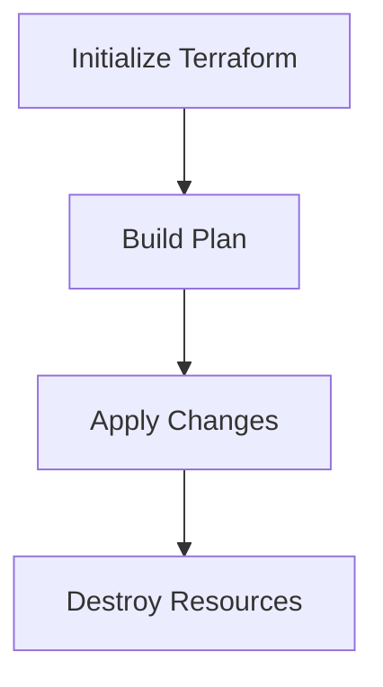

## Infrastructure Pipeline with Terraform

### What is an Infrastructure Pipeline?

An infrastructure pipeline is a series of automated steps that manage the lifecycle of your infrastructure resources. These steps typically include initialization, planning, applying, and destroying resources. By automating these steps, you can ensure consistency and reduce the risk of human error.

### Why Automate the Pipeline?

Automating the infrastructure pipeline helps in maintaining consistency across different environments, reduces the risk of errors, and enables faster deployment cycles. It also ensures that all team members follow the same processes, leading to better collaboration and productivity.

### Steps in an Infrastructure Pipeline

1. **Initialization**: Initializes the Terraform project and downloads the necessary providers.
2. **Planning**: Generates a plan of the changes to be made to the infrastructure.
3. **Applying**: Applies the changes to the infrastructure.
4. **Destroying**: Destroys the infrastructure resources.

### Example: Infrastructure Pipeline with GitLab CI/CD

Let's walk through an example of setting up an infrastructure pipeline using GitLab CI/CD.

#### Step 1: Initialize Terraform Project

The first step is to initialize the Terraform project and download the necessary providers. This step is typically done once and the results are saved as an artifact.

```yaml
stages:
  - init
  - build
  - deploy

init_state:
  stage: init
  script:
    - terraform init
  artifacts:
    paths:
      - .terraform/
```

#### Step 2: Build Stage

In the build stage, we execute the `terraform plan` command to generate a plan of the changes to be made to the infrastructure. This step requires AWS credentials to be configured in the environment.

```yaml
build_stage:
  stage: build
  script:
    - terraform plan
  environment:
    name: aws
    url: https://console.aws.amazon.com/
  dependencies:
    - init_state
```

#### Step 3: Deploy Stage

In the deploy stage, we apply the changes to the infrastructure using the `terraform apply` command.

```yaml
deploy_stage:
  stage: deploy
  script:
    - terraform apply -auto-approve
  environment:
    name: aws
    url: https://console.aws.amazon.com/
  dependencies:
    - build_stage
```

### Mermaid Diagram: Infrastructure Pipeline



### Potential Pitfalls

1. **Manual Interventions**: Manual interventions can introduce errors and inconsistencies. Ensure that all steps are automated.
2. **Environment Consistency**: Ensure that the environment used for each stage is consistent to avoid unexpected behavior.
3. **Dependency Management**: Properly manage dependencies between stages to ensure that each stage has access to the necessary artifacts.

### How to Prevent / Defend

1. **Automate Everything**: Automate all steps in the pipeline to ensure consistency and reduce the risk of errors.
2. **Use Artifacts**: Use artifacts to share necessary files between stages, ensuring that each stage has access to the required information.
3. **Strict Environment Control**: Ensure that the environment used for each stage is consistent and properly configured.

---
<!-- nav -->
[[07-Introduction to Terraform State Management|Introduction to Terraform State Management]] | [[DevSecOps/DevSecOps Bootcamp/04-Infrastructure Security/03-Secure IaC Pipeline for EKS Provisioning/Terraform Configuration for EKS provisioning/00-Overview|Overview]] | [[DevSecOps/DevSecOps Bootcamp/04-Infrastructure Security/03-Secure IaC Pipeline for EKS Provisioning/Terraform Configuration for EKS provisioning/09-Practice Labs|Practice Labs]]
