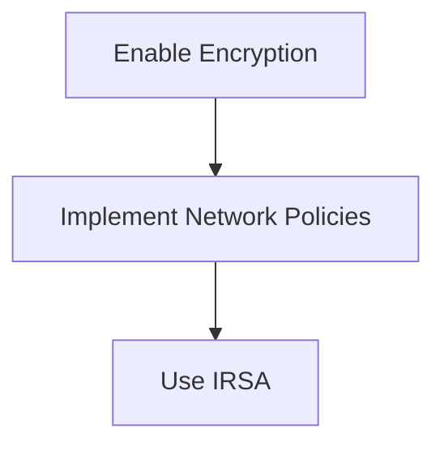

## Real-World Examples and CVEs

### Recent Breaches and CVEs

Recent breaches and CVEs related to EKS and Terraform include:

1. **CVE-2021-44228 (Log4j)**: This vulnerability affected many applications, including those running on EKS clusters. Ensure that all dependencies are up to date and patched.
2. **CVE-2022-39252 (Terraform)**: This vulnerability allowed unauthorized access to Terraform state files. Ensure that your state files are properly secured and access controls are in place.

### Example: Securing EKS Cluster with Terraform

To secure an EKS cluster with Terraform, you can implement the following measures:

1. **Enable Encryption**: Enable encryption for all EKS resources.
2. **Implement Network Policies**: Implement network policies to restrict traffic between pods.
3. **Use IAM Roles for Service Accounts (IRSA)**: Use IRSA to grant permissions to pods based on their service account.

### Example: Terraform Configuration for Securing EKS Cluster

Here is an example of a Terraform configuration for securing an EKS cluster:

```hcl
resource "aws_eks_cluster" "example" {
  name     = "example-cluster"
  role_arn = aws_iam_role.example.arn

  vpc_config {
    subnet_ids = [aws_subnet.example.id]
  }

  encryption_config {
    provider = "aws"
    key_arn = aws_kms_key.example.arn
  }

  depends_on = [aws_iam_role_policy_attachment.example]
}

resource "aws_iam_role" "example" {
  name = "example-role"

  assume_role_policy = jsonencode({
    Version = "2012-10-17"
    Statement = [
      {
        Action = "sts:AssumeRole"
        Effect = "Allow"
        Principal = {
          Service = "eks.amazonaws.com"
        }
      },
    ]
  })
}

resource "aws_iam_role_policy_attachment" "example" {
  policy_arn = "arn:aws:iam::aws:policy/AmazonEKSClusterPolicy"
  role_arn   = aws__iam_role.example.arn
}

resource "aws_subnet" "example" {
  availability_zone = "us-west-2a"
  cidr_block        = "10.0.1.0/24"
  vpc_id            = aws_vpc.example.id
}

resource "aws_vpc" "example" {
  cidr_block = "1_10.0.0.0/16"
}

resource "aws_kms_key" "example" {
  description = "Example KMS Key"
}
```

### Mermaid Diagram: Securing EKS Cluster with Terraform



### Potential Pitfalls

1. **Encryption Keys**: Ensure that encryption keys are properly managed and rotated.
2. **Network Policies**: Ensure that network policies are correctly configured to restrict traffic.
3. **IAM Roles**: Ensure that IAM roles are correctly configured to grant permissions to pods.

### How to Prevent / Defend

1. **Manage Encryption Keys**: Ensure that encryption keys are properly managed and rotated.
2. **Configure Network Policies**: Ensure that network policies are correctly configured to restrict traffic.
3. **Configure IAM Roles**: Ensure that IAM roles are correctly configured to grant permissions to pods.

---
<!-- nav -->
[[DevSecOps/DevSecOps Bootcamp/04-Infrastructure Security/03-Secure IaC Pipeline for EKS Provisioning/Terraform Configuration for EKS provisioning/09-Practice Labs|Practice Labs]] | [[DevSecOps/DevSecOps Bootcamp/04-Infrastructure Security/03-Secure IaC Pipeline for EKS Provisioning/Terraform Configuration for EKS provisioning/00-Overview|Overview]] | [[11-Secure IaC Pipeline for EKS Provisioning Using Terraform Part 1|Secure IaC Pipeline for EKS Provisioning Using Terraform Part 1]]
