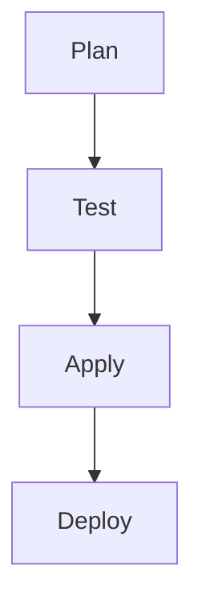
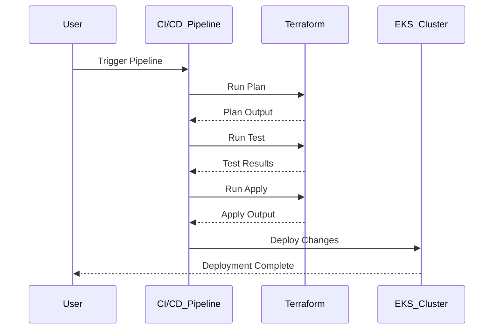

## Terraform Configuration for EKS Provisioning

### Background Theory

Infrastructure as Code (IaC) is a practice of managing and provisioning infrastructure through machine-readable definition files, rather than physical hardware configuration or interactive configuration tools. Terraform is one of the most popular IaC tools, allowing users to define and manage their infrastructure using declarative configuration files written in the HashiCorp Configuration Language (HCL).

Elastic Kubernetes Service (EKS) is a managed Kubernetes service provided by Amazon Web Services (AWS). It allows users to run Kubernetes clusters in the AWS cloud without having to install and maintain their own Kubernetes control plane. EKS handles the provisioning and management of the control plane, while users are responsible for managing worker nodes and applications running on those nodes.

### Terraform Apply Command

The `terraform apply` command is used to execute the actions specified in the Terraform configuration files. This command reads the configuration files, plans the necessary changes, and then applies those changes to the actual infrastructure. The process typically involves the following steps:

1. **Initialization**: Terraform initializes the working directory, downloading any necessary plugins and providers.
2. **Planning**: Terraform generates a plan based on the current state and the desired state defined in the configuration files.
3. **Applying**: Terraform applies the planned changes to the infrastructure.

#### Example Configuration

Here is a simple example of a Terraform configuration for provisioning an EKS cluster:

```hcl
provider "aws" {
  region = "us-west-2"
}

resource "aws_eks_cluster" "example" {
  name     = "example-cluster"
  role_arn = aws_iam_role.example.arn

  vpc_config {
    subnet_ids = [aws_subnet.example.id]
  }
}

resource "aws_iam_role" "example" {
  name = "example-role"

  assume_role_policy = jsonencode({
    Version = "2012-10-17"
    Statement = [
      {
        Action = "sts:AssumeRole"
        Effect = "Allow"
        Principal = {
          Service = "eks.amazonaws.com"
        }
      },
    ]
  })
}
```

### Plan File

Before applying the changes, Terraform creates a plan file that outlines the proposed changes. This plan file can be exported as an artifact in a continuous integration (CI) pipeline. The plan file is then downloaded and applied in subsequent stages of the pipeline.

#### Exporting and Applying the Plan

To export the plan file, you can use the `terraform plan` command with the `-out` flag:

```sh
terraform plan -out=planfile
```

This command generates a binary plan file named `planfile`. To apply the plan, you can use the `terraform apply` command with the `-input=false` flag to prevent interactive prompts:

```sh
terraform apply -input=false planfile
```

### Manual Approval Step

In many projects, especially when dealing with production environments, it is common to include a manual approval step before applying infrastructure changes. This step allows for a final review and verification before making any changes that could potentially affect the production environment.

#### Example with Manual Approval

Here is an example of a CI/CD pipeline configuration that includes a manual approval step:

```yaml
jobs:
  - name: plan
    steps:
      - run: terraform init
      - run: terraform plan -out=planfile
      - store_artifacts:
          path: planfile

  - name: apply
    steps:
      - get_artifact: planfile
      - run: terraform apply -input=false planfile
    requires:
      - manual_approval

  - name: manual_approval
    type: approval
```

### Automated Testing and Security Scanning

While manual approval steps are useful, the ultimate goal is to automate as much of the testing and security scanning as possible. Automated testing ensures that the infrastructure changes meet the required standards and security policies.

#### Example with Automated Testing

Here is an example of a CI/CD pipeline configuration that includes automated testing and security scanning:

```yaml
jobs:
  - name: plan
    steps:
      - run: terraform init
      - run: terraform plan -out=planfile
      - store_artifacts:
          path: planfile

  - name: test
    steps:
      - get_artifact: planfile
      - run: terraform validate planfile
      - run: tfsec planfile

  - name: apply
    steps:
      - get_artifact: planfile
      - run: terraform apply -input=false planfile
    requires:
      - test
```

### Deployment Job

The deployment job is responsible for applying the infrastructure changes. In the context of EKS provisioning, this job would involve creating and configuring the EKS cluster and its associated resources.

#### Example Deployment Job

Here is an example of a deployment job configuration:

```yaml
jobs:
  - name: deploy
    steps:
      - run: terraform init
      - run: terraform apply -auto-approve
```

### Automating the Pipeline

In a fully automated pipeline, the manual approval step is removed, and the pipeline runs from start to finish without human intervention. This approach is suitable for development environments where the risk of unintended consequences is lower.

#### Example Fully Automated Pipeline

Here is an example of a fully automated CI/CD pipeline configuration:

```yaml
jobs:
  - name: plan
    steps:
      - run: terraform init
      - run: terraform plan -out=planfile
      - store_artifacts:
          path: planfile

  - name: test
    steps:
      - get_artifact: planfile
      - run: terraform validate planfile
      - run: tfsec planfile

  - name: apply
    steps:
      - get_artifact: planfile
      - run: terraform apply -input=false planfile
    requires:
      - test
```

### How to Prevent / Defend

#### Detection

To detect potential issues in your IaC pipeline, you can use various tools and techniques:

1. **Static Analysis Tools**: Tools like `tfsec`, `checkov`, and `tflint` can analyze your Terraform configuration files for security vulnerabilities and compliance issues.
2. **Automated Testing**: Automated testing can verify that the infrastructure changes meet the required standards and security policies.
3. **Logging and Monitoring**: Logging and monitoring tools can help detect any unexpected changes or issues in the infrastructure.

#### Prevention

To prevent issues in your IaC pipeline, you can implement the following best practices:

1. **Manual Approval Steps**: Include manual approval steps for critical changes, especially in production environments.
2. **Automated Testing**: Ensure that all changes are tested and validated before being applied.
3. **Security Policies**: Implement security policies and guidelines for your IaC configurations.
4. **Regular Audits**: Regularly audit your IaC configurations to ensure they remain secure and compliant.

#### Secure Coding Fixes

Here is an example of a vulnerable Terraform configuration and its secure counterpart:

**Vulnerable Configuration**

```hcl
resource "aws_security_group" "example" {
  name        = "example-sg"
  description = "Example security group"

  ingress {
    from_port   = 22
    to_port     = 22
    protocol    = "tcp"
    cidr_blocks = ["0.0.0.0/0"]
  }
}
```

**Secure Configuration**

```hcl
resource "aws_security_group" "example" {
  name        = "example-sg"
  description = "Example security group"

  ingress {
    from_port   = 22
    to_port     = 22
    protocol    = "tcp"
    cidr_blocks = ["10.0.0.0/24"]
  }
}
```

### Real-World Examples

#### Recent CVEs and Breaches

One notable example of a security issue related to IaC is the `CVE-2021-20225` vulnerability in Terraform. This vulnerability allowed attackers to execute arbitrary code on the host machine by manipulating the Terraform configuration files.

#### Example Exploit

Here is an example of how an attacker might exploit this vulnerability:

```hcl
resource "null_resource" "exploit" {
  provisioner "local-exec" {
    command = "echo 'Exploited!' > /tmp/exploit.txt"
  }
}
```

#### Secure Configuration

To prevent such exploits, you should:

1. **Validate Inputs**: Validate all inputs to ensure they are safe and do not contain malicious code.
2. **Use Least Privilege**: Ensure that the Terraform process runs with the least privilege necessary to perform its tasks.
3. **Regular Audits**: Regularly audit your IaC configurations to identify and mitigate potential security issues.

### Mermaid Diagrams

#### Pipeline Topology



#### Request/Response Flow



### Hands-On Labs

For hands-on practice with Terraform and EKS provisioning, consider the following labs:

- **PortSwigger Web Security Academy**: Offers a variety of labs focused on web application security, including some that touch on IaC and Kubernetes.
- **OWASP Juice Shop**: A deliberately insecure web application for security training.
- **Kubernetes Goat**: A hands-on lab for learning Kubernetes security.
- **CloudGoat**: A set of labs for learning AWS security.

These labs provide practical experience with the concepts covered in this chapter, helping you to master the skills needed for secure IaC pipeline management.

### Conclusion

By understanding the principles of IaC and the specific details of Terraform configuration for EKS provisioning, you can build robust and secure infrastructure pipelines. Incorporating manual approval steps, automated testing, and regular audits can help prevent security issues and ensure that your infrastructure remains secure and compliant.

---
<!-- nav -->
[[14-Terraform Configuration for EKS Provisioning Part 1|Terraform Configuration for EKS Provisioning Part 1]] | [[DevSecOps/DevSecOps Bootcamp/04-Infrastructure Security/03-Secure IaC Pipeline for EKS Provisioning/Terraform Configuration for EKS provisioning/00-Overview|Overview]] | [[16-Terraform Configuration for EKS Provisioning|Terraform Configuration for EKS Provisioning]]
