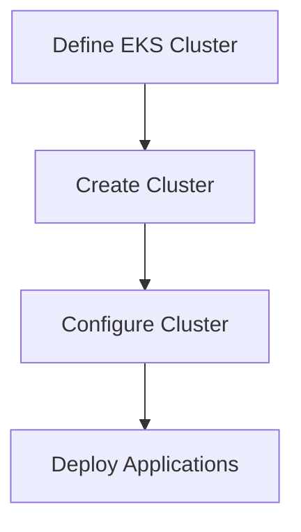

## Terraform Configuration for EKS Provisioning

### What is EKS?

EKS (Elastic Kubernetes Service) is a managed Kubernetes service provided by AWS. It allows you to run Kubernetes clusters without having to manage the underlying infrastructure.

### Why Use Terraform for EKS Provisioning?

Using Terraform for EKS provisioning provides several benefits, including:

1. **Infrastructure as Code (IaC)**: Terraform allows you to define your infrastructure as code, making it easier to manage and version control.
2. **Consistency**: Terraform ensures that your infrastructure is consistent across different environments.
3. **Automation**: Terraform can automate the provisioning and management of your EKS cluster.

### Steps to Provision EKS Cluster with Terraform

1. **Define the EKS Cluster**: Define the EKS cluster in your Terraform configuration.
2. **Create the Cluster**: Use Terraform to create the EKS cluster.
3. **Configure the Cluster**: Configure the EKS cluster with the necessary settings.
4. **Deploy Applications**: Deploy applications to the EKS cluster.

### Example: Terraform Configuration for EKS Provisioning

Here is an example of a Terraform configuration for provisioning an EKS cluster:

```hcl
provider "aws" {
  region = "us-west-2"
}

resource "aws_eks_cluster" "example" {
  name     = "example-cluster"
  role_arn = aws_iam_role.example.arn

  vpc_config {
    subnet_ids = [aws_subnet.example.id]
  }

  depends_on = [aws_iam_role_policy_attachment.example]
}

resource "aws_iam_role" "example" {
  name = "example-role"

  assume_role_policy = jsonencode({
    Version = "2012-10-17"
    Statement = [
      {
        Action = "sts:AssumeRole"
        Effect = "Allow"
        Principal = {
          Service = "eks.amazonaws.com"
        }
      },
    ]
  })
}

resource "aws_iam_role_policy_attachment" "example" {
  policy_arn = "arn:aws:iam::aws:policy/AmazonEKSClusterPolicy"
  role_arn   = aws_iam_role.example.arn
}

resource "aws_subnet" "example" {
  availability_zone = "us-west-2a"
  cidr_block        = "10.0.1.0/24"
  vpc_id            = aws_vpc.example.id
}

resource "aws_vpc" "example" {
  cidr_block = "10.0.0.0/16"
}
```

### Mermaid Diagram: EKS Provisioning with Terraform



### Potential Pitfalls

1. **Resource Dependencies**: Ensure that all resource dependencies are properly defined to avoid conflicts.
2. **IAM Permissions**: Ensure that the IAM roles and policies have the necessary permissions to create and manage the EKS cluster.
3. **Network Configuration**: Ensure that the network configuration is correct to avoid connectivity issues.

### How to Prevent / Defend

1. **Define Dependencies**: Properly define resource dependencies to ensure that all resources are created in the correct order.
2. **Manage IAM Permissions**: Ensure that the IAM roles and policies have the necessary permissions to create and manage the EKS cluster.
3. **Validate Network Configuration**: Validate the network configuration to ensure that all resources are correctly connected.

---
<!-- nav -->
[[15-Terraform Configuration for EKS Provisioning Part 2|Terraform Configuration for EKS Provisioning Part 2]] | [[DevSecOps/DevSecOps Bootcamp/04-Infrastructure Security/03-Secure IaC Pipeline for EKS Provisioning/Terraform Configuration for EKS provisioning/00-Overview|Overview]] | [[DevSecOps/DevSecOps Bootcamp/04-Infrastructure Security/03-Secure IaC Pipeline for EKS Provisioning/Terraform Configuration for EKS provisioning/17-Practice Questions & Answers|Practice Questions & Answers]]
