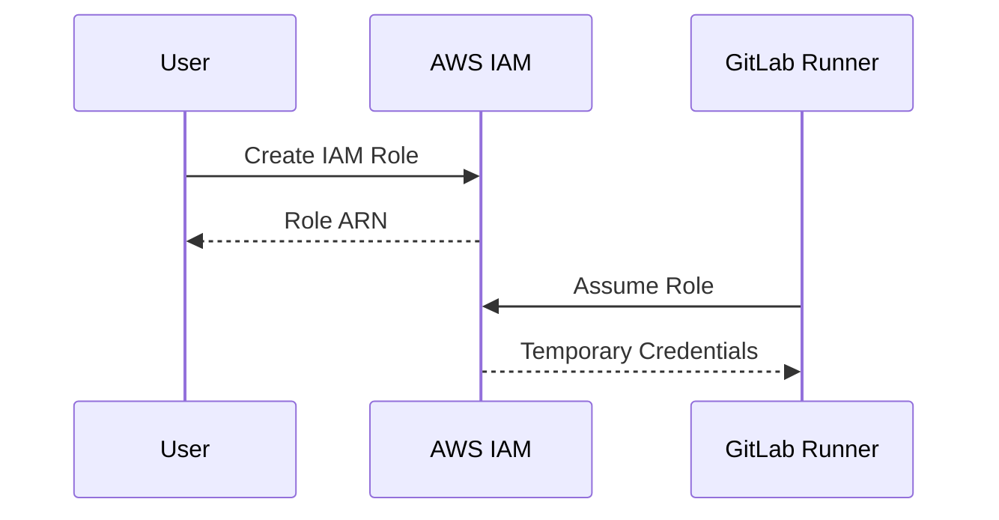

## Introduction to Secure IaC Pipeline for EKS Provisioning Using GitLab OIDC in AWS

In the realm of DevSecOps, Infrastructure as Code (IaC) plays a pivotal role in automating the provisioning and management of infrastructure. This chapter delves into the secure provisioning of Amazon Elastic Kubernetes Service (EKS) using GitLab's OpenID Connect (OIDC) integration with AWS. We will explore the intricacies of setting up a secure IaC pipeline that leverages GitLab runners and AWS Identity and Access Management (IAM) roles to manage access to AWS resources.

### Background Theory

#### What is Infrastructure as Code (IaC)?

Infrastructure as Code (IaC) is the practice of managing and provisioning computer data centers through machine-readable definition files, rather than physical hardware configuration or interactive configuration tools. IaC allows developers and operations teams to define their infrastructure in code, making it easier to manage, version control, and automate.

#### Why Use IaC?

- **Consistency**: Ensures that environments are consistently deployed across development, testing, and production stages.
- **Version Control**: Allows tracking changes to infrastructure configurations, facilitating rollbacks and audits.
- **Automation**: Enables automated deployment and scaling of infrastructure, reducing human error and improving efficiency.

#### What is Amazon Elastic Kubernetes Service (EKS)?

Amazon Elastic Kubernetes Service (EKS) is a managed service that makes it easy to run Kubernetes on AWS without needing expertise in Kubernetes cluster setup and management. EKS supports the Kubernetes API, so you can use existing tools and plugins to interact with your cluster and applications.

### Challenges in Securing IaC Pipelines

When provisioning AWS resources through IaC pipelines, one of the primary challenges is ensuring secure access to AWS services. Traditional methods often involve embedding AWS credentials directly into the pipeline, which poses significant security risks. To address these challenges, we will leverage GitLab's OIDC integration with AWS IAM roles.

### Setting Up GitLab OIDC with AWS IAM Roles

To securely provision EKS and other AWS services through a GitLab CI/CD pipeline, we need to configure GitLab OIDC and assign appropriate IAM roles to the GitLab runners.

#### Step 1: Create an IAM Role for GitLab OIDC

First, we need to create an IAM role that will be assumed by the GitLab runner. This role should have permissions to perform the necessary actions on AWS resources.



**Creating the IAM Role**

1. **Navigate to IAM Console**: Go to the AWS Management Console and navigate to the IAM section.
2. **Create New Role**: Click on "Roles" and then "Create role".
3. **Select Trusted Entity Type**: Choose "Web identity" as the trusted entity type.
4. **Configure Web Identity**: Select "OpenID Connect provider" and choose the GitLab OIDC provider you have configured.
5. **Attach Permissions Policy**: Attach the necessary policies to grant permissions to the role. For example, `AmazonEKSClusterPolicy` and `AmazonEKSServicePolicy`.
6. **Name the Role**: Provide a name for the role, such as `GitLabRunnerRole`.

```json
{
    "Version": "2012-10-17",
    "Statement": [
        {
            "Effect": "Allow",
            "Action": [
                "eks:DescribeCluster",
                "eks:UpdateClusterConfig",
                "eks:ListClusters"
            ],
            "Resource": "*"
        }
    ]
}
```

#### Step 2: Configure GitLab OIDC Provider

Next, we need to configure the GitLab OIDC provider in AWS to allow the GitLab runner to assume the IAM role.

1. **Navigate to IAM Console**: Go to the IAM section in the AWS Management Console.
2. **Create OIDC Provider**: Click on "Identity providers" and then "Add provider".
3. **Enter Provider Details**: Enter the details for the GitLab OIDC provider, including the issuer URL and client ID.
4. **Save the Provider**: Save the provider configuration.

#### Step 3: Assign IAM Role to GitLab Runner

Once the IAM role and OIDC provider are set up, we need to assign the IAM role to the GitLab runner.

1. **Navigate to GitLab Settings**: Go to the GitLab project settings and navigate to the CI/CD section.
2. **Configure Runner**: Set up a new runner or modify an existing one to use the IAM role.
3. **Assign IAM Role**: In the runner configuration, specify the IAM role ARN and the OIDC provider URL.

```yaml
stages:
  - deploy

deploy:
  stage: deploy
  script:
    - aws eks update-kubeconfig --name my-cluster --region us-west-2
    - kubectl apply -f deployment.yaml
  environment:
    name: production
    url: https://myapp.com
  only:
    - main
```

### Example: Full Raw HTTP Request and Response

Here is an example of a full raw HTTP request and response for assuming an IAM role using OIDC:

```http
POST /sts/assume-role-with-web-identity HTTP/1.1
Host: sts.amazonaws.com
Content-Type: application/x-www-form-urlencoded
Content-Length: 150

Action=AssumeRoleWithWebIdentity&RoleArn=arn:aws:iam::123456789012:role/GitLabRunnerRole&RoleSessionName=GitLabSession&WebIdentityToken=<oidc_token>&DurationSeconds=3600
```

```http
HTTP/1.1 200 OK
Content-Type: text/xml
Content-Length: 1024

<?xml version="1.0"?>
<AssumeRoleWithWebIdentityResponse xmlns="https://sts.amazonaws.com/doc/2011-06-15/">
  <AssumeRoleWithWebIdentityResult>
    <SubjectFromWebIdentityToken>gitlab-user@example.com</SubjectFromWebIdentityToken>
    <AssumedRoleUser>
      <Arn>arn:aws:sts::123456789012:assumed-role/GitLabRunnerRole/gitlab-user@example.com</Arn>
      <AssumedRoleId>AROAJQDQEXAMPLE:gitlab-user@example.com</AssumedRoleId>
    </AssumedRoleUser>
    <Credentials>
      <AccessKeyId>ASIAJQDQEXAMPLE</AccessKeyId>
      <SecretAccessKey>XXXXXXXXXXXXXXXXXXXXXXXXXXXXXXXXXXXXXX</SecretAccessKey>
      <SessionToken>AgoGb3JpZ2luKDY0MDAwMzUwNDYyNjg5NjIwNjA0NjIwNjA0NjIwNjA0NjIwNjA0NjIwNjA0NjIwNjA0NjIwNjA0NjIwNjA0NjIwNjA0NjIwNjA0NjIwNjA0NjIwNjA0NjIwNjA0NjIwNjA0NjIwNjA0NjIwNjA0NjIwNjA0NjIwNjA0NjIwNjA0NjIwNjA0NjIwNjA0NjIwNjA0NjIwNjA0NjIwNjA0NjIwNjA0NjIwNjA0NjIwNjA0NjIwNjA0NjIwNjA0NjIwNjA0NjIwNjA0NjIwNjA0NjIwNjA0NjIwNjA0NjIwNjA0NjIwNjA0NjIwNjA0NjIwNjA0NjIwNjA0NjIwNjA0NjIwNjA0NjIwNjA0NjIwNjA0NjIwNjA0NjIwNjA0NjIwNjA0NjIwNjA0NjIwNjA0NjIwNjA0NjIwNjA0NjIwNjA0NjIwNjA0NjIwNjA0NjIwNjA0NjIwNjA0NjIwNjA0NjIwNjA0NjIwNjA0NjIwNjA0NjIwNjA0NjIwNjA0NjIwNjA0NjIwNjA0NjIwNjA0NjIwNjA0NjIwNjA0NjIwNjA0NjIwNjA0NjIwNjA0NjIwNjA0NjIwNjA0NjIwNjA0NjIwNjA0NjIwNjA0NjIwNjA0NjIwNjA0NjIwNjA0NjIwNjA0NjIwNjA0NjIwNjA0NjIwNjA0NjIwNjA0NjIwNjA0NjIwNjA0NjIwNjA0NjIwNjA0NjIwNjA0NjIwNjA0NjIwNjA0NjIwNjA0NjIwNjA0NjIwNjA0NjIwNjA0NjIwNjA0NjIwNjA0NjIwNjA0NjIwNjA0NjIwNjA0NjIwNjA0NjIwNjA0NjIwNjA0NjIwNjA0NjIwNjA0NjIwNjA0NjIwNjA0NjIwNjA0NjIwNjA0NjIwNjA0NjIwNjA0NjIwNjA0NjIwNjA0NjIwNjA0NjIwNjA0NjIwNjA0NjIwNjA0NjIwNjA0NjIwNjA0NjIwNjA0NjIwNjA0NjIwNjA0NjIwNjA0NjIwNjA0NjIwNjA0NjIwNjA0NjIwNjA0NjIwNjA0NjIwNjA0NjIwNjA0NjIwNjA0NjIwNjA0NjIwNjA0NjIwNjA0NjIwNjA0NjIwNjA0NjIwNjA0NjIwNjA0NjIwNjA0NjIwNjA0NjIwNjA0NjIwNjA0NjIwNjA0NjIwNjA0NjIwNjA0NjIwNjA0NjIwNjA0NjIwNjA0NjIwNjA0NjIwNjA0NjIwNjA0NjIwNjA0NjIwNjA0NjIwNjA0NjIwNjA0NjIwNjA0NjIwNjA0NjIwNjA0NjIwNjA0NjIwNjA0NjIwNjA0NjIwNjA0NjIwNjA0NjIwNjA0NjIwNjA0NjIwNjA0NjIwNjA0NjIwNjA0NjIwNjA0NjIwNjA0NjIwNjA0NjIwNjA0NjIwNjA0NjIwNjA0NjIwNjA0NjIwNjA0NjIwNjA0NjIwNjA0NjIwNjA0NjIwNjA0NjIwNjA0NjIwNjA0NjIwNjA0NjIwNjA0NjIwNjA0NjIwNjA0NjIwNjA0NjIwNjA0NjIwNjA0NjIwNjA0NjIwNjA0NjIwNjA0NjIwNjA0NjIwNjA0NjIwNjA0NjIwNjA0NjIwNjA0NjIwNjA0NjIwNjA0NjIwNjA0NjIwNjA0NjIwNjA0NjIwNjA0NjIwNjA0NjIwNjA0NjIwNjA0NjIwNjA0NjIwNjA0NjIwNjA0NjIwNjA0NjIwNjA0NjIwNjA0NjIwNjA0NjIwNjA0NjIwNjA0NjIwNjA0NjIwNjA0NjIwNjA0NjIwNjA0NjIwNjA0NjIwNjA0NjIwNjA0NjIwNjA0NjIwNjA0NjIwNjA0NjIwNjA0NjIwNjA0NjIwNjA0NjIwNjA0NjIwNjA0NjIwNjA0NjIwNjA0NjIwNjA0NjIwNjA0NjIwNjA0NjIwNjA0NjIwNjA0NjIwNjA0NjIwNjA0NjIwNjA0NjIwNjA0NjIwNjA0NjIwNjA0NjIwNjA0NjIwNjA0NjIwNjA0NjIwNjA0NjIwNjA0NjIwNjA0NjIwNjA0NjIwNjA0NjIwNjA0NjIwNjA0NjIwNjA0NjIwNjA0NjIwNjA0NjIwNjA0NjIwNjA0NjIwNjA0NjIwNjA0NjIwNjA0NjIwNjA0NjIwNjA0NjIwNjA0NjIwNjA0NjIwNjA0NjIwNjA0NjIwNjA0NjIwNjA0NjIwNjA0NjIwNjA0NjIwNjA0NjIwNjA0NjIwNjA0NjIwNjA0NjIwNjA0NjIwNjA0NjIwNjA0NjIwNjA0NjIwNjA0NjIwNjA0NjIwNjA0NjIwNjA0NjIwNjA0NjIwNjA0NjIwNjA0NjIwNjA0NjIwNjA0NjIwNjA0NjIwNjA0NjIwNjA0NjIwNjA0NjIwNjA0NjIwNjA0NjIwNjA0NjIwNjA0NjIwNjA0NjIwNjA0NjIwNjA0NjIwNjA0NjIwNjA0NjIwNjA0NjIwNjA0NjIwNjA0NjIwNjA0NjIwNjA0NjIwNjA0NjIwNjA0NjIwNjA0NjIwNjA0NjIwNjA0NjIwNjA0NjIwNjA0NjIwNjA0NjIwNjA0NjIwNjA0NjIwNjA0NjIwNjA0NjIwNjA0NjIwNjA0NjIwNjA0NjIwNjA0NjIwNjA0NjIwNjA0NjIwNjA0NjIwNjA0NjIwNjA0NjIwNjA0NjIwNjA0NjIwNjA0NjIwNjA0NjIwNjA0NjIwNjA0NjIwNjA0NjIwNjA0NjIwNjA0NjIwNjA0NjIwNjA0NjIwNjA0NjIwNjA0NjIwNjA0NjIwNjA0NjIwNjA0NjIwNjA0NjIwNjA0NjIwNjA0NjIwNjA0NjIwNjA0NjIwNjA0NjIwNjA0NjIwNjA0NjIwNjA0NjIwNjA0NjIwNjA0NjIwNjA0NjIwNjA0NjIwNjA0NjIwNjA0NjIwNjA0NjIwNjA0NjIwNjA0NjIwNjA0NjIwNjA0NjIwNjA0NjIwNjA0NjIwNjA0NjIwNjA0NjIwNjA0NjIwNjA0NjIwNjA0NjIwNjA0NjIwNjA0NjIwNjA0NjIwNjA0NjIwNjA0NjIwNjA0NjIwNjA0NjIwNjA0NjIwNjA0NjIwNjA0NjIwNjA0NjIwNjA0NjIwNjA0NjIwNjA0NjIwNjA0NjIwNjA0NjIwNjA0NjIwNjA0NjIwNjA0NjIwNjA0NjIwNjA0NjIwNjA0NjIwNjA0NjIwNjA0NjIwNjA0NjIwNjA0NjIwNjA0NjIwNjA0NjIwNjA0NjIwNjA0NjIwNjA0NjIwNjA0NjIwNjA0NjIwNjA0NjIwNjA0NjIwNjA0NjIwNjA0NjIwNjA0NjIwNjA0NjIwNjA0NjIwNjA0NjIwNjA0NjIwNjA0NjIwNjA0NjIwNjA0NjIwNjA0NjIwNjA0NjIwNjA0NjIwNjA0NjIwNjA0NjIwNjA0NjIwNjA0NjIwNjA0NjIwNjA0NjIwNjA0NjIwNjA0NjIwNjA0NjIwNjA0NjIwNjA0NjIwNjA0NjIwNjA0NjIwNjA0NjIwNjA0NjIwNjA0NjIwNjA0NjIwNjA0NjIwNjA0NjIwNjA0NjIwNjA0NjIwNjA0NjIwNjA0NjIwNjA0NjIwNjA0NjIwNjA0NjIwNjA0NjIwNjA0NjIwNjA0NjIwNjA0NjIwNjA0NjIwNjA0NjIwNjA0NjIwNjA0NjIwNjA0NjIwNjA0NjIwNjA0NjIwNjA0NjIwNjA0NjIwNjA0NjIwNjA0NjIwNjA0NjIwNjA0NjIwNjA0NjIwNjA0NjIwNjA0NjIwNjA0NjIwNjA0NjIwNjA0NjIwNjA0NjIwNjA0NjIwNjA0NjIwNjA0NjIwNjA0NjIwNjA0NjIwNjA0NjIwNjA0NjIwNjA0NjIwNjA0NjIwNjA0NjIwNjA0NjIwNjA0NjIwNjA0NjIwNjA0NjIwNjA0NjIwNjA0NjIwNjA0NjIwNjA0NjIwNjA0NjIwNjA0NjIwNjA0NjIwNjA0NjIwNjA0NjIwNjA0NjIwNjA0NjIwNjA0NjIwNjA0NjIwNjA0NjIwNjA0NjIwNjA0NjIwNjA0NjIwNjA0NjIwNjA0NjIwNjA0NjIwNjA0NjIwNjA0NjIwNjA0NjIwNjA0NjIwNjA0NjIwNjA0NjIwNjA0NjIwNjA0NjIwNjA0NjIwNjA0NjIwNjA0NjIwNjA0NjIwNjA0NjIwNjA0NjIwNjA0NjIwNjA0NjIwNjA0NjIwNjA0NjIwNjA0NjIwNjA0NjIwNjA0NjIwNjA0NjIwNjA0NjIwNjA0NjIwNjA0NjIwNjA0NjIwNjA0NjIwNjA0NjIwNjA0NjIwNjA0NjIwNjA0NjIwNjA0NjIwNjA0NjIwNjA0NjIwNjA0NjIwNjA0NjIwNjA0NjIwNjA0NjIwNjA0NjIwNjA0NjIwNjA0NjIwNjA0NjIwNjA0NjIwNjA0NjIwNjA0NjIwNjA0NjIwNjA0NjIwNjA0NjIwNjA0NjIwNjA0NjIwNjA0NjIwNjA0NjIwNjA0NjIwNjA0NjIwNjA0NjIwNjA0NjIwNjA0NjIwNjA0NjIwNjA0NjIwNjA0NjIwNjA0NjIwNjA0NjIwNjA0NjIwNjA0NjIwNjA0NjIwNjA0NjIwNjA0NjIwNjA0NjIwNjA0NjIwNjA0NjIwNjA0NjIwNjA0NjIwNjA0NjIwNjA0NjIwNjA0NjIwNjA0NjIwNjA0NjIwNjA0NjIwNjA0NjIwNjA0NjIwNjA0NjIwNjA0NjIwNjA0NjIwNjA0NjIwNjA0NjIwNjA0NjIwNjA0NjIwNjA0NjIwNjA0NjIwNjA0NjIwNjA0NjIwNjA0NjIwNjA0NjIwNjA0NjIwNjA0NjIwNjA0NjIwNjA0NjIwNjA0NjIwNjA0NjIwNjA0NjIwNjA0NjIwNjA0NjIwNjA0NjIwNjA0NjIwNjA0NjIwNjA0NjIwNjA0NjIwNjA0NjIwNjA0NjIwNjA0NjIwNjA0NjIwNjA0NjIwNjA0NjIwNjA0NjIwNjA0NjIwNjA0NjIwNjA0NjIwNjA0NjIwNjA0NjIwNjA0NjIwNjA0NjIwNjA0NjIwNjA0NjIwNjA0NjIwNjA0NjIwNjA0NjIwNjA0NjIwNjA0NjIwNjA0NjIwNjA0NjIwNjA0NjIwNjA0NjIwNjA0NjIwNjA0NjIwNjA0NjIwNjA0NjIwNjA0NjIwNjA0NjIwNjA0NjIwNjA0NjIwNjA0NjIwNjA0NjIwNjA0NjIwNjA0NjIwNjA0NjIwNjA0NjIwNjA0NjIwNjA0NjIwNjA0NjIwNjA0NjIwNjA0NjIwNjA0NjIwNjA0NjIwNjA0NjIwNjA0NjIwNjA0NjIwNjA0NjIwNjA0NjIwNjA0NjIwNjA0NjIwNjA0NjIwNjA0NjIwNjA0NjIwNjA0NjIwNjA0NjIwNjA0NjIwNjA0NjIwNjA0NjIwNjA0NjIwNjA0NjIwNjA0NjIwNjA0NjIwNjA0NjIwNjA0NjIwNjA0NjIwNjA0NjIwNjA0NjIwNjA0NjIwNjA0NjIwNjA0NjIwNjA0NjIwNjA0NjIwNjA0NjIwNjA0NjIwNjA0NjIwNjA0NjIwNjA0NjIwNjA0NjIwNjA0NjIwNjA0NjIwNjA0NjIwNjA0NjIwNjA0NjIwNjA0NjIwNjA0NjIwNjA0NjIwNjA0NjIwNjA0NjIwNjA0NjIwNjA0NjIwNjA0NjIwNjA0NjIwNjA0NjIwNjA0NjIwNjA0NjIwNjA0NjIwNjA0NjIwNjA0NjIwNjA0NjIwNjA0NjIwNjA0NjIwNjA0NjIwNjA0NjIwNjA0NjIwNjA0NjIwNjA0NjIwNjA0NjIwNjA0NjIwNjA0NjIwNjA0NjIwNjA0NjIwNjA0NjIwNjA0NjIwNjA0NjIwNjA0NjIwNjA0NjIwNjA0NjIwNjA0NjIwNjA0NjIwNjA0NjIwNjA0NjIwNjA0NjIwNjA0NjIwNjA0NjIwNjA0NjIwNjA0NjIwNjA0NjIwNjA0NjIwNjA0NjIwNjA0NjIwNjA0NjIwNjA0NjIwNjA0NjIwNjA0NjIwNjA0NjIwNjA0NjIwNjA0NjIwNjA0NjIwNjA0NjIwNjA0NjIwNjA0NjIwNjA0NjIwNjA0NjIwNjA0NjIwNjA0NjIwNjA0NjIwNjA0NjIwNjA0NjIwNjA0NjIwNjA0NjIwNjA0NjIwNjA0NjIwNjA0NjIwNjA0NjIwNjA0NjIwNjA0NjIwNjA0NjIwNjA0NjIwNjA0NjIwNjA0NjIwNjA0NjIwNjA0NjIwNjA0NjIwNjA0NjIwNjA0NjIwNjA0NjIwNjA0NjIwNjA0NjIwNjA0NjIwNjA0NjIwNjA0NjIwNjA0NjIwNjA0NjIwNjA0NjIwNjA0NjIwNjA0NjIwNjA0NjIwNjA0NjIwNjA0NjIwNjA0NjIwNjA0NjIwNjA0NjIwNjA0NjIwNjA0NjIwNjA0NjIwNjA0NjIwNjA0NjIwNjA0NjIwNjA0NjIwNjA0NjIwNjA0NjIwNjA0NjIwNjA0NjIwNjA0NjIwNjA0NjIwNjA0NjIwNjA0NjIwNjA0NjIwNjA0NjIwNjA0NjIwNjA0NjIwNjA0NjIwNjA0NjIwNjA0NjIwNjA0NjIwNjA0NjIwNjA0NjIwNjA0NjIwNjA0NjIwNjA0NjIwNjA0NjIwNjA0NjIwNjA0NjIwNjA0NjIwNjA0NjIwNjA0NjIwNjA0NjIwNjA0NjIwNjA0NjIwNjA0NjIwNjA0NjIwNjA0NjIwNjA0NjIwNjA0NjIwNjA0NjIwNjA0NjIwNjA0NjIwNjA0NjIwNjA0NjIwNjA0NjIwNjA0NjIwNjA0NjIwNjA0NjIwNjA0NjIwNjA0NjIwNjA0NjIwNjA0NjIwNjA0NjIwNjA0NjIwNjA0NjIwNjA0NjIwNjA0NjIwNjA0NjIwNjA0NjIwNjA0NjIwNjA0NjIwNjA0NjIwNjA0NjIwNjA0NjIwNjA0NjIwNjA0NjIwNjA0NjIwNjA0NjIwNjA0NjIwNjA0NjIwNjA0NjIwNjA0NjIwNjA0NjIwNjA0NjIwNjA0NjIwNjA0NjIwNjA0NjIwNjA0NjIwNjA0NjIwNjA0NjIwNjA0NjIwNjA0NjIwNjA0NjIwNjA0NjIwNjA0NjIwNjA0NjIwNjA0NjIwNjA0NjIwNjA0NjIwNjA0NjIwNjA0NjIwNjA0NjIwNjA0NjIwNjA0NjIwNjA0NjIwNjA0NjIwNjA0NjIwNjA0NjIwNjA0NjIwNjA0NjIwNjA0NjIwNjA0NjIwNjA0NjIwNjA0NjIwNjA0NjIwNjA0NjIwNjA0NjIwNjA0NjIwNjA0NjIwNjA0NjIwNjA0NjIwNjA0NjIwNjA0NjIwNjA0NjIwNjA0NjIwNjA0NjIwNjA0NjIwNjA0NjIwNjA0NjIwNjA0NjIwNjA0NjIwNjA0NjIwNjA0NjIwNjA0NjIwNjA0NjIwNjA0NjIwNjA0NjIwNjA0NjIwNjA0NjIwNjA0NjIwNjA0NjIwNjA0NjIwNjA0NjIwNjA0NjIwNjA0NjIwNjA0NjIwNjA0NjIwNjA0NjIwNjA0NjIwNjA0NjIwNjA0NjIwNjA0NjIwNjA0NjIwNjA0NjIwNjA0NjIwNjA0NjIwNjA0NjIwNjA0NjIwNjA0NjIwNjA0NjIwNjA0NjIwNjA0NjIwNjA0NjIwNjA0NjIwNjA0NjIwNjA0NjIwNjA0NjIwNjA0NjIwNjA0NjIwNjA0NjIwNjA0NjIwNjA0NjIwNjA0NjIwNjA0NjIwNjA0NjIwNjA0NjIwNjA0NjIwNjA0NjIwNjA0NjIwNjA0NjIwNjA0NjIwNjA0NjIwNjA0NjIwNjA0NjIwNjA0NjIwNjA0NjIwNjA0NjIwNjA0NjIwNjA0NjIwNjA0NjIwNjA0NjIwNjA0NjIwNjA0NjIwNjA0NjIwNjA0NjIwNjA0NjIwNjA0NjIwNjA0NjIwNjA0NjIwNjA0NjIwNjA0NjIwNjA0NjIwNjA0NjIwNjA0NjIwNjA0NjIwNjA0NjIwNjA0NjIwNjA0NjIwNjA0NjIwNjA0NjIwNjA0NjIwNjA0NjIwNjA0NjIwNjA0NjIwNjA0NjIwNjA0NjIwNjA0NjIwNjA0NjIwNjA0NjIwNjA0NjIwNjA0NjIwNjA0NjIwNjA0NjIwNjA0NjIwNjA0NjIwNjA0NjIwNjA0NjIwNjA0NjIwNjA0NjIwNjA0NjIwNjA0NjIwNjA0NjIwNjA0NjIwNjA0NjIwNjA0NjIwNjA0NjIwNjA0NjIwNjA0NjIwNjA0NjIwNjA0NjIwNjA0NjIwNjA0NjIwNjA0NjIwNjA0NjIwNjA0NjIwNjA0NjIwNjA0NjIwNjA0NjIwNjA0NjIwNjA0NjIwNjA0NjIwNjA0NjIwNjA0NjIwNjA0NjIwNjA0NjIwNjA0NjIwNjA0NjIwNjA0NjIwNjA0NjIwNjA0NjIwNjA0NjIwNjA0NjIwNjA0NjIwNjA0NjIwNjA0NjIwNjA0NjIwNjA0NjIwNjA0NjIwNjA0NjIwNjA0NjIwNjA0NjIwNjA0NjIwNjA0NjIwNjA0NjIwNjA0NjIwNjA0NjIwNjA0NjIwNjA0NjIwNjA0NjIwNjA0NjIwNjA0NjIwNjA0NjIwNjA0NjIwNjA0NjIwNjA0NjIwNjA0NjIwNjA0NjIwNjA0NjIwNjA0NjIwNjA0NjIwNjA0NjIwNjA0NjIwNjA0NjIwNjA0NjIwNjA0NjIwNjA0NjIwNjA0NjIwNjA0NjIwNjA0NjIwNjA0NjIwNjA0NjIwNjA0NjIwNjA0NjIwNjA0NjIwNjA0NjIwNjA0NjIwNjA0NjIwNjA0NjIwNjA0NjIwNjA0NjIwNjA0NjIwNjA0NjIwNjA0NjIwNjA0NjIwNjA0NjIwNjA0NjIwNjA0NjIwNjA0NjIwNjA0NjIwNjA0NjIwNjA0NjI

---
<!-- nav -->
[[02-Introduction to Secure IaC Pipeline for EKS Provisioning Using GitLab OIDC in AWS Part 2|Introduction to Secure IaC Pipeline for EKS Provisioning Using GitLab OIDC in AWS Part 2]] | [[DevSecOps/DevSecOps Bootcamp/04-Infrastructure Security/03-Secure IaC Pipeline for EKS Provisioning/Using GitLab OIDC in AWS/00-Overview|Overview]] | [[04-Introduction to Secure Infrastructure as Code (IaC) Pipeline for EKS Provisioning|Introduction to Secure Infrastructure as Code (IaC) Pipeline for EKS Provisioning]]
