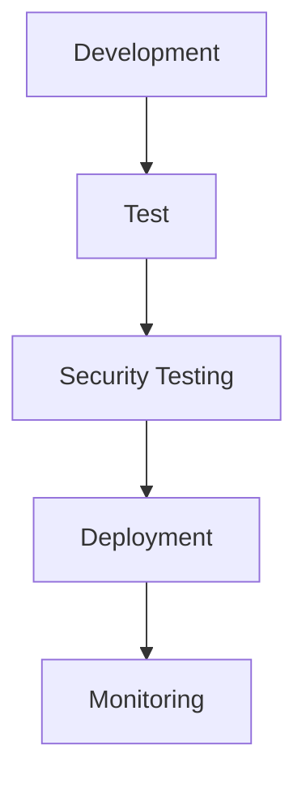
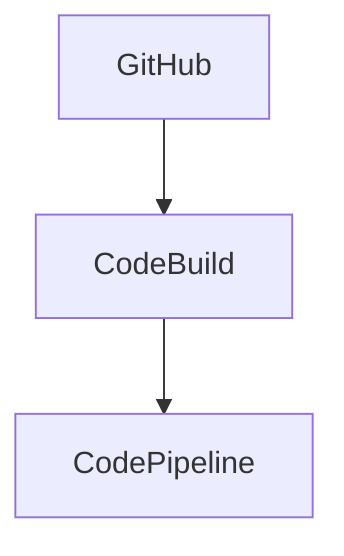

## Importance of Automated Security Testing in AWS Pipelines

Automated security testing is crucial in modern DevSecOps practices because it helps identify vulnerabilities and security issues early in the development process. By integrating security testing into your AWS pipelines, you can ensure that your applications are secure and compliant with industry standards.

### Why Integrate Security Testing?

1. **Early Detection**: Automated security testing allows you to catch security issues during the development phase, reducing the cost and complexity of fixing them later.
2. **Continuous Integration**: Integrating security testing into your CI/CD pipeline ensures that security checks are performed consistently and automatically.
3. **Compliance**: Many industries require compliance with specific security standards. Automated security testing helps ensure that your applications meet these requirements.
4. **Reduced Risk**: By identifying and addressing security vulnerabilities proactively, you reduce the risk of security breaches and data leaks.

### Real-World Example: Recent Breaches

Consider the recent breach of Capital One in 2019, where a misconfigured firewall allowed unauthorized access to sensitive customer data. Had automated security testing been integrated into their pipeline, such misconfigurations might have been caught earlier, preventing the breach.



### Components of an AWS Pipeline

An AWS pipeline typically consists of the following components:

1. **Source Control**: Where your code is stored (e.g., GitHub, Bitbucket).
2. **Build**: Compiling and building your application.
3. **Test**: Running unit tests, integration tests, and security tests.
4. **Deploy**: Deploying the application to production.
5. **Monitor**: Monitoring the deployed application for performance and security issues.

### Integrating Security Testing into an Existing AWS Pipeline

To integrate security testing into an existing AWS pipeline, you need to modify the pipeline to include security testing steps. This can be achieved using various tools and services.

#### Tools for Automated Security Testing

1. **Trivy**: An open-source vulnerability scanner for container images.
2. **SonarQube**: A static code analysis tool that detects bugs, vulnerabilities, and code smells.
3. **OWASP ZAP**: A free and open-source web application security scanner.
4. **Checkov**: A static analysis tool for finding security misconfigurations in infrastructure as code (IaC).

### Step-by-Step Guide to Modifying an AWS Pipeline

Let's walk through the process of modifying an existing AWS pipeline to include automated security testing.

#### Step 1: Set Up Source Control

Ensure your code is stored in a source control repository like GitHub. This is the starting point for your pipeline.



#### Step 2: Configure CodeBuild

Use AWS CodeBuild to compile and build your application. You can configure CodeBuild to run security tests as part of the build process.

```yaml
version: 0.2

phases:
  install:
    runtime-versions:
      python: 3.8
    commands:
      - pip install trivy sonarqube
  pre_build:
    commands:
      - echo "Pre-build phase"
  build:
    commands:
      - trivy image <your-docker-image>
      - sonar-scanner
  post_build:
    commands:
      - echo "Post-build phase"
artifacts:
  files:
    - '**/*'
```

#### Step 3: Configure CodePipeline

Set up AWS CodePipeline to orchestrate the entire build and deployment process. Include a stage for security testing.

```json
{
  "pipeline": {
    "name": "MyPipeline",
    "stages": [
      {
        "name": "Source",
        "actions": [
          {
            "name": "SourceAction",
            "actionTypeId": {
              "category": "Source",
              "owner": "AWS",
              "provider": "CodeCommit",
              "version": "1"
            },
            "configuration": {
              "RepositoryName": "my-repo",
              "BranchName": "main"
            }
          }
        ]
      },
      {
        "name": "Build",
        "actions": [
          {
            "name": "BuildAction",
            "actionTypeId": {
              "category": "Build",
              "owner": "AWS",
              "provider": "CodeBuild",
              "version": "1"
            },
            "configuration": {
              "ProjectName": "my-project"
            }
          }
        ]
      },
      {
        "name": "SecurityTest",
        "actions": [
          {
            "name": "SecurityTestAction",
            "actionTypeId": {
              "category": "Test",
              "owner": "Custom",
              "provider": "SecurityTest",
              "version": "1"
            },
            "configuration": {
              "TestCommand": "trivy image <your-docker-image>"
            }
          }
        ]
      },
      {
        "name": "Deploy",
        "actions": [
          {
            "name": "DeployAction",
            "actionTypeId": {
              "category": "Deploy",
              "owner": "AWS",
              "provider": "CodeDeploy",
              "version": "1"
            },
            "configuration": {
              "ApplicationName": "my-application",
              "DeploymentGroupName": "my-deployment-group"
            }
          }
        ]
      }
    ]
  }
}
```

#### Step 4: Run Security Tests

Configure your pipeline to run security tests using tools like Trivy and SonarQube. These tools will scan your code and infrastructure for vulnerabilities and misconfigurations.

```bash
# Example Trivy command
trivy image <your-docker-image>

# Example SonarQube command
sonar-scanner
```

### Common Pitfalls and How to Avoid Them

1. **Incomplete Coverage**: Ensure that your security tests cover all aspects of your application, including code, infrastructure, and dependencies.
2. **False Positives/Negatives**: Fine-tune your security tools to minimize false positives and negatives. Regularly review and update your security policies.
3. **Manual Intervention**: Automate as much of the security testing process as possible to avoid manual intervention, which can introduce human error.

### How to Prevent / Defend

#### Detection

- **Regular Scans**: Schedule regular scans using tools like Trivy and SonarQube to detect vulnerabilities.
- **Monitoring**: Use AWS CloudTrail and CloudWatch to monitor your environment for suspicious activity.

#### Prevention

- **Secure Coding Practices**: Follow secure coding guidelines and use tools like SonarQube to enforce these practices.
- **Infrastructure as Code (IaC)**: Use IaC tools like Terraform and Ansible to manage your infrastructure and apply security best practices.

#### Secure-Coding Fixes

Compare the vulnerable code with the secure version:

**Vulnerable Code**
```python
import os
from flask import Flask, request

app = Flask(__name__)

@app.route('/login', methods=['POST'])
def login():
    username = request.form['username']
    password = request.form['password']
    if username == 'admin' and password == 'password':
        return 'Login successful'
    else:
        return 'Login failed'

if __name__ == '__main__':
    app.run(host='0.0.0.0', port=5000)
```

**Secure Code**
```python
import os
from flask import Flask, request
from werkzeug.security import check_password_hash

app = Flask(__name__)
users = {'admin': '$2b$12$YRZjJzJzJzJzJzJzJzJzJzJzJzJzJzJz'}

@app.route('/login', methods=['POST'])
def login():
    username = request.form['username']
    password = request.form['password']
    if username in users and check_password_hash(users[username], password):
        return 'Login successful'
    else:
        return 'Login failed'

if __name__ == '__main__':
    app.run(host='0.0.0.0', port=5000)
```

#### Configuration Hardening

Harden your AWS configurations using tools like AWS Config and AWS Trusted Advisor.

```json
{
  "rules": [
    {
      "rule_id": "EC2_SECURITY_GROUP_OPEN_ALL",
      "description": "Checks if EC2 instances have security groups that allow all traffic.",
      "severity": "CRITICAL",
      "compliance_type": "AWS_CONFIG_RULE"
    },
    {
      "rule_id": "S3_BUCKET_PUBLIC_ACCESS",
      "description": "Checks if S3 buckets are publicly accessible.",
      "severity": "HIGH",
      "compliance_type": "AWS_CONFIG_RULE"
    }
  ]
}
```

### Hands-On Labs

For practical experience, consider the following labs:

- **PortSwigger Web Security Academy**: Focuses on web application security.
- **OWASP Juice Shop**: A deliberately insecure web application for practicing security testing.
- **DVWA (Damn Vulnerable Web Application)**: Another intentionally vulnerable web application for security testing.
- **CloudGoat**: A set of vulnerable AWS environments for practicing cloud security.

These labs provide real-world scenarios to practice integrating automated security testing into your AWS pipelines.

### Conclusion

In this module, we explored the importance of integrating automated security testing into AWS pipelines. We covered the steps to modify an existing pipeline to include security testing, discussed common pitfalls, and provided strategies for detection and prevention. By following these guidelines, you can ensure that your applications are secure and compliant with industry standards.

Stay tuned for the next module, where we will wrap up the course with a summary of key concepts and best practices.

---
<!-- nav -->
[[DevSecOps/DevSecOps Bootcamp/05-Application Security Testing/01-AWS and Automated Security Testing/01-Module Introduction/01-Introduction to AWS and Automated Security Testing|Introduction to AWS and Automated Security Testing]] | [[DevSecOps/DevSecOps Bootcamp/05-Application Security Testing/01-AWS and Automated Security Testing/01-Module Introduction/00-Overview|Overview]] | [[DevSecOps/DevSecOps Bootcamp/05-Application Security Testing/01-AWS and Automated Security Testing/01-Module Introduction/03-Practice Questions & Answers|Practice Questions & Answers]]
