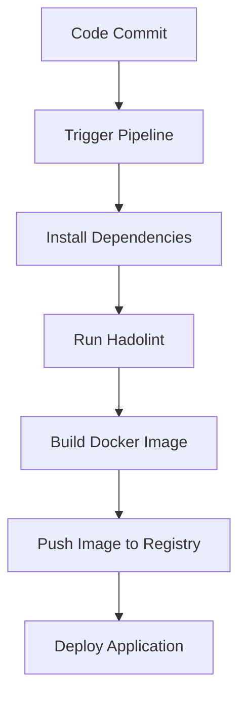

## Introduction to AWS and Automated Security Testing

In the realm of DevSecOps, integrating automated security testing into your continuous integration and delivery (CI/CD) pipelines is crucial for maintaining the security and integrity of your applications. This chapter delves into the specifics of adjusting a security test within an AWS environment, focusing on the use of Hadolint for Dockerfile linting. We'll cover the entire process, from modifying the build specification to pushing changes and verifying the pipeline execution.

### Background Theory

#### What is Hadolint?

Hadolint is a linter for Dockerfiles that helps you write better Dockerfiles by checking for common mistakes and enforcing best practices. It provides a set of rules that can be applied to Dockerfiles to ensure they are secure, efficient, and maintainable.

#### Why Use Hadolint?

Using Hadolint in your CI/CD pipeline ensures that your Dockerfiles adhere to best practices and security standards. This reduces the likelihood of introducing vulnerabilities and ensures consistency across your Docker images.

#### How Does Hadolint Work?

Hadolint works by parsing your Dockerfile and checking it against a set of predefined rules. These rules can be customized to suit your specific requirements. By default, Hadolint checks for issues such as:

- Use of `latest` tag in `FROM` statements
- Use of `RUN apt-get update` without `--no-install-recommends`
- Use of `COPY` instead of `ADD`

### Setting Up Hadolint in Your Build Spec

To integrate Hadolint into your CI/CD pipeline, you need to modify your build specification file. In this example, we'll use a `.buildspec.yml` file, which is commonly used in AWS CodeBuild.

#### Modifying the Build Specification File

Let's start by opening the build specification file in an editor. For this example, we'll use Emacs, but you can use any text editor of your choice.

```yaml
version: 0.2

phases:
  install:
    runtime-versions:
      python: 3.8
    commands:
      - pip install hadolint
  pre_build:
    commands:
      - hadolint --failure-threshold warn Dockerfile
```

In this build specification file, we have defined two phases: `install` and `pre_build`. During the `install` phase, we install Hadolint using `pip`. During the `pre_build` phase, we run Hadolint on the Dockerfile with the `--failure-threshold warn` flag.

#### Adding the Failure Threshold Flag

The `--failure-threshold warn` flag ensures that the Hadolint command will only fail if there are linting results of warning or higher. This means that if Hadolint finds any warnings or errors in the Dockerfile, the build will fail.

### Saving and Committing Changes

After modifying the build specification file, save the changes and switch to your console to commit them to your Git repository.

#### Using Git Commands

First, add the modified file to your Git repository using the `git add` command:

```bash
git add .buildspec.yml
```

Next, commit your changes using the `git commit` command with a descriptive commit message:

```bash
git commit -m "feature: only fail with warnings or higher"
```

Finally, push the changes to your remote repository using the `git push` command:

```bash
git push origin main
```

### Verifying Pipeline Execution

Once the changes are pushed, switch back to your browser to check the status of your pipeline.

#### Checking the Pipeline Status

Click on the pipeline that failed in the previous run. You should see that the pipeline is already executing and has picked up your changes as indicated by the commit message.

If the pipeline succeeds, it means that the Hadolint command passed the automated security tests. Click on the details to view the results.

#### Reviewing the Results

Scroll down to the results section to verify that the test was executed successfully. The results should indicate that the test passed because the Hadolint command only failed on linting results of warning or higher.

### Real-World Examples

#### Recent CVEs and Breaches

One recent example of a security breach related to Dockerfiles is the CVE-2021-21316, which affected Docker versions 19.03.14 and earlier. This vulnerability allowed attackers to bypass certain security restrictions by manipulating Dockerfile instructions. Integrating Hadolint into your CI/CD pipeline can help catch such issues early.

### Pitfalls and Common Mistakes

#### Common Mistakes

1. **Ignoring Warnings**: One common mistake is ignoring warnings from Hadolint. While warnings may not cause immediate failures, they often indicate potential issues that could become serious problems in the future.
2. **Incorrect Configuration**: Misconfiguring Hadolint can lead to false positives or negatives. Ensure that you understand the rules and customize them appropriately for your use case.

### How to Prevent / Defend

#### Detection

To detect issues with your Dockerfiles, regularly run Hadolint as part of your CI/CD pipeline. This ensures that any new issues are caught early in the development cycle.

#### Prevention

To prevent issues, follow these best practices:

1. **Customize Rules**: Customize Hadolint rules to match your organization's security policies.
2. **Regular Audits**: Perform regular audits of your Dockerfiles to ensure they comply with best practices.

#### Secure Coding Fixes

Here’s an example of a vulnerable Dockerfile and its secure version:

**Vulnerable Dockerfile**

```Dockerfile
FROM ubuntu:latest
RUN apt-get update && apt-get install -y curl
```

**Secure Dockerfile**

```Dockerfile
FROM ubuntu:20.04
RUN apt-get update && apt-get install -y --no-install-recommends curl
```

In the secure version, we specify a specific version of Ubuntu and use `--no-install-recommends` to avoid installing unnecessary packages.

### Complete Example

#### Full HTTP Request and Response

When interacting with AWS services, you might use HTTP requests to manage your resources. Here’s an example of a full HTTP request and response for pushing changes to an AWS CodeCommit repository:

**HTTP Request**

```http
POST /v1/repositories/my-repo/git/refs/heads/main HTTP/1.1
Host: git-codecommit.us-east-1.amazonaws.com
Authorization: Bearer <your-token>
Content-Type: application/json

{
  "ref": "refs/heads/main",
  "oldCommitId": "<previous-commit-id>",
  "newCommitId": "<new-commit-id>"
}
```

**HTTP Response**

```http
HTTP/1.1 200 OK
Date: Mon, 01 Jan 2024 00:00:00 GMT
Content-Type: application/json

{
  "ref": "refs/heads/main",
  "commitId": "<new-commit-id>"
}
```

### Mermaid Diagrams

#### Pipeline Topology

A mermaid diagram can help visualize the topology of your CI/CD pipeline:



### Hands-On Labs

For hands-on practice, consider the following labs:

- **PortSwigger Web Security Academy**: Offers a variety of labs focused on web application security.
- **OWASP Juice Shop**: A deliberately insecure web application for practicing web security skills.
- **CloudGoat**: A series of labs designed to help you learn about AWS security best practices.

These labs provide practical experience in integrating security tools like Hadolint into your CI/CD pipelines.

### Conclusion

Integrating Hadolint into your CI/CD pipeline is a powerful way to ensure that your Dockerfiles adhere to best practices and security standards. By customizing Hadolint rules and regularly auditing your Dockerfiles, you can significantly reduce the risk of introducing vulnerabilities into your applications.

---
<!-- nav -->
[[DevSecOps/DevSecOps Bootcamp/05-Application Security Testing/01-AWS and Automated Security Testing/02-Demo Adjusting a Security Test/00-Overview|Overview]] | [[DevSecOps/DevSecOps Bootcamp/05-Application Security Testing/01-AWS and Automated Security Testing/02-Demo Adjusting a Security Test/02-Practice Questions & Answers|Practice Questions & Answers]]
