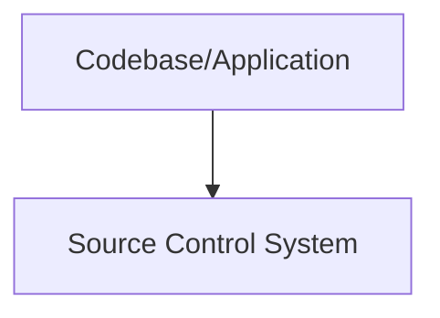
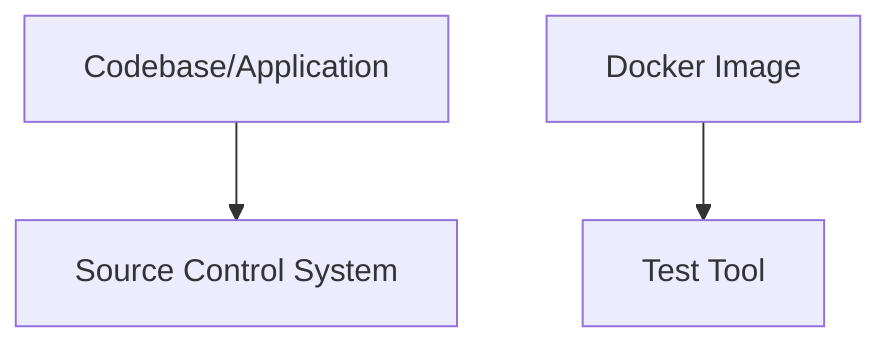
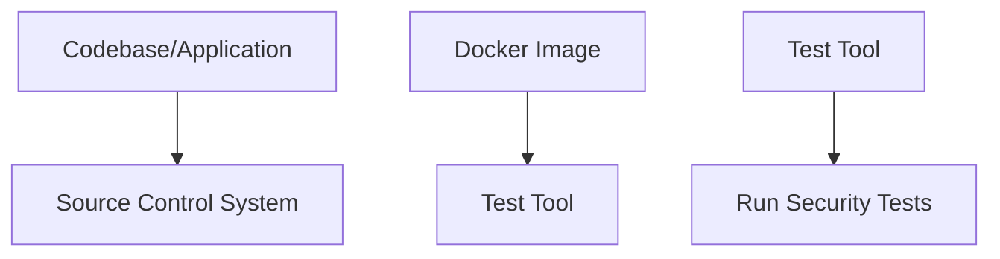
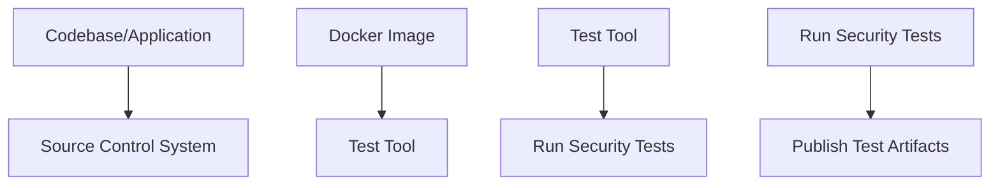
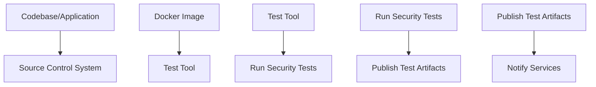

## Introduction to AWS and Automated Security Testing

In the realm of DevSecOps, integrating automated security testing into your Continuous Integration/Continuous Deployment (CI/CD) pipelines is crucial for ensuring that your applications are secure throughout their development lifecycle. This chapter focuses on integrating automated security testing with Amazon Web Services (AWS), specifically using AWS CodeBuild, a fully managed build service that supports defining builds and tests as code.

### What is AWS CodeBuild?

AWS CodeBuild is a fully managed build service that compiles source code, runs tests, and produces artifacts that are ready to deploy. It supports various programming languages, build tools, and operating systems. By using CodeBuild, you can automate your build process, making it faster and more reliable.

#### Why Use AWS CodeBuild?

- **Fully Managed**: AWS manages the underlying infrastructure, allowing you to focus on your application rather than managing servers.
- **Scalable**: CodeBuild automatically scales to meet the demands of your build jobs.
- **Flexible**: You can customize your build environment by specifying the build commands, build image, and build settings.
- **Integration**: CodeBuild integrates seamlessly with other AWS services like CodePipeline, CodeCommit, and S3.

### Integrating Automated Security Testing

Automated security testing involves using tools and scripts to automatically scan your codebase for vulnerabilities and security issues. This process helps identify potential security risks early in the development cycle, reducing the likelihood of security breaches.

#### Workflow Overview

The workflow for integrating automated security testing with AWS CodeBuild involves several key steps:

1. **Input Codebase/Application**: Provide the codebase or application that needs to be tested.
2. **Pull Test Tool Image**: Retrieve the Docker image containing the security testing tool.
3. **Perform Security Tests**: Run the security tests on the codebase/application.
4. **Publish Test Artifacts**: Optionally, store the test results in a location such as S3.
5. **Notify Services**: Optionally, notify other services about the test results.

### Detailed Workflow Steps

Let's break down each step in detail:

#### Step 1: Input Codebase/Application

The first step is to provide the codebase or application that needs to be tested. This could be a repository hosted on AWS CodeCommit, GitHub, or any other source control system.



#### Step 2: Pull Test Tool Image

Next, you need to pull the Docker image containing the security testing tool. This image should contain all the necessary dependencies and configurations required to run the security tests.



#### Step 3: Perform Security Tests

Once the Docker image is pulled, you can run the security tests on the codebase/application. This typically involves executing a series of commands that invoke the security testing tool.



#### Step  4: Publish Test Artifacts

After the security tests are completed, you can optionally publish the test artifacts. These artifacts might include reports, logs, and other outputs generated during the testing process.



#### Step 5: Notify Services

Finally, you can notify other services about the test results. This could involve sending notifications to monitoring systems, triggering alerts, or updating dashboards.



### Example: Using Trivy for Security Testing

Let's walk through an example of integrating Trivy, a popular open-source vulnerability scanner, into an AWS CodeBuild pipeline.

#### Step 1: Set Up Source Code Repository

First, set up a source code repository. For this example, we'll use AWS CodeCommit.

```bash
aws codecommit create-repository --repository-name my-security-test-repo
```

#### Step 2: Create a Build Spec File

Create a `buildspec.yml` file that defines the build and test commands. This file will be used by CodeBuild to execute the security tests.

```yaml
version: 0.2

phases:
  install:
    runtime-versions:
      docker: 19
    commands:
      - echo Installing dependencies...
      - docker pull aquasec/trivy:latest
  pre_build:
    commands:
      - echo Preparing to run security tests...
  build:
    commands:
      - echo Running security tests...
      - docker run --rm -v $(pwd):/src aquasec/trivy:latest /src
artifacts:
  files:
    - trivy_report.json
notifications:
  arn: arn:aws:sns:us-west-2:123456789012:my-notification-topic
```

#### Step 3: Create a CodeBuild Project

Create a CodeBuild project that uses the `buildspec.yml` file and points to the source code repository.

```bash
aws codebuild create-project \
  --name my-security-test-project \
  --source-type CODECOMMIT \
  --source-location arn:aws:codecommit:us-west-2:123456789012:my-security-test-repo \
  --artifacts-type NO_ARTIFACTS \
  --environment-type LINUX_CONTAINER \
  --environment-image-uri aws/codebuild/standard:4.0 \
  --service-role arn:aws:iam::123456789012:role/service-role/my-codebuild-service-role \
  --build-spec buildspec.yml
```

#### Step 4: Trigger the Build

Trigger the build by pushing changes to the source code repository or manually starting the build from the AWS Management Console.

```bash
aws codecommit put-file \
  --repository-name my-security-test-repo \
  --branch-name main \
  --file-path README.md \
  --content-file README.md \
  --commit-message "Initial commit"
```

### Real-World Examples and Recent CVEs

Integrating automated security testing into your CI/CD pipeline can help catch vulnerabilities early. Here are a few recent examples of CVEs that could have been caught with proper automated security testing:

- **CVE-2021-44228 (Log4Shell)**: This critical vulnerability in Apache Log4j was exploited widely. Automated security testing tools like Trivy could have identified this vulnerability in your codebase.
- **CVE-2022-22965 (Spring Framework RCE)**: This remote code execution vulnerability in Spring Framework could have been detected by static analysis tools integrated into your CI/CD pipeline.

### How to Prevent / Defend

To ensure your automated security testing is effective, follow these best practices:

#### Secure Coding Practices

Implement secure coding practices to reduce the likelihood of introducing vulnerabilities in the first place.

**Vulnerable Code Example:**
```python
import os
import subprocess

def execute_command(user_input):
    command = f"echo {user_input}"
    subprocess.run(command, shell=True)
```

**Secure Code Example:**
```python
import os
import subprocess

def execute_command(user_input):
    command = ["echo", user_input]
    subprocess.run(command)
```

#### Configuration Hardening

Ensure that your build environment is hardened against common security threats.

**Example:**
```yaml
version: 0.2

phases:
  install:
    runtime-versions:
      docker: 19
    commands:
      - echo Installing dependencies...
      - docker pull aquasec/trivy:latest
  pre_build:
    commands:
      - echo Preparing to run security tests...
  build:
    commands:
      - echo Running security tests...
      - docker run --rm -v $(pwd):/src aquasec/trivy:latest /src
artifacts:
  files:
    - trivy_report.json
notifications:
  arn: arn:aws:sns:us-west-2:12345672:my-notification-topic
```

#### Detection and Mitigation

Use tools like AWS Inspector to continuously monitor your environment for security issues.

**Example:**
```bash
aws inspector start-run --assessment-template-arn arn:aws:inspector:us-west-2:123456789012:target/0-abc123/template/0-def456
```

### Conclusion

Integrating automated security testing with AWS CodeBuild is a powerful way to ensure your applications are secure throughout their development lifecycle. By following the steps outlined in this chapter, you can effectively integrate security testing into your CI/CD pipeline, catch vulnerabilities early, and harden your applications against common security threats.

### Practice Labs

For hands-on practice, consider the following labs:

- **CloudGoat**: A cloud security training platform that includes labs for AWS security.
- **flaws.cloud**: A cloud-native security training platform that includes labs for AWS security.
- **AWS Official Workshops**: AWS provides official workshops and labs that cover various aspects of AWS security.

By completing these labs, you can gain practical experience in integrating automated security testing with AWS CodeBuild and other AWS services.

---
<!-- nav -->
[[DevSecOps/DevSecOps Bootcamp/05-Application Security Testing/01-AWS and Automated Security Testing/04-Integrating Automated Security Testing with AWS/00-Overview|Overview]] | [[02-Integrating Automated Security Testing with AWS|Integrating Automated Security Testing with AWS]]
