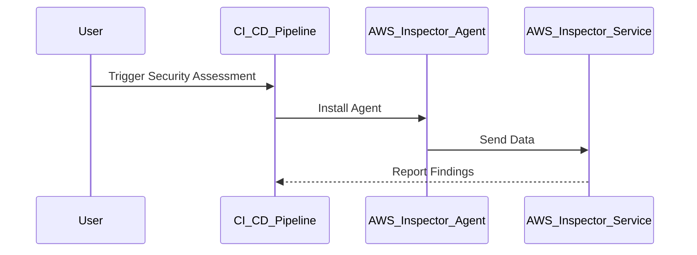
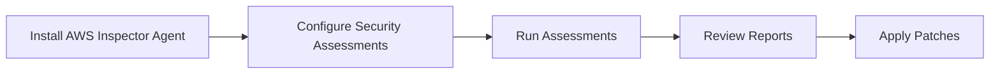
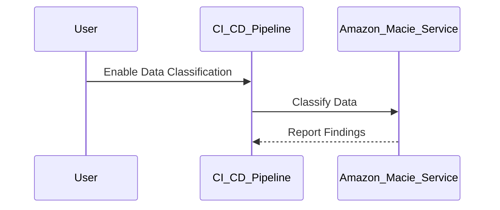
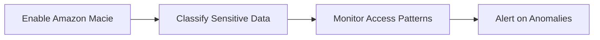
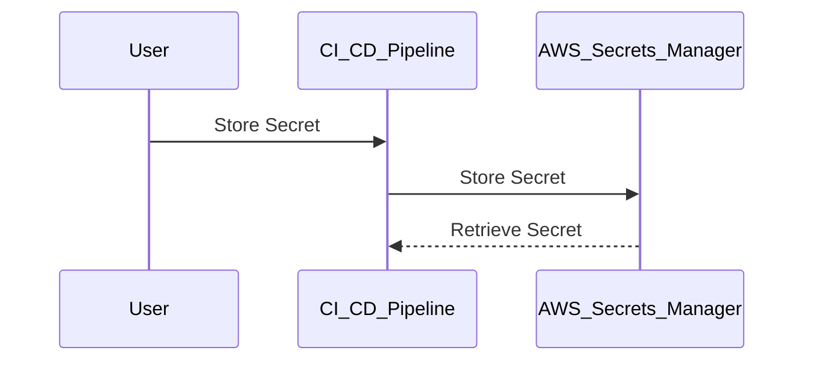
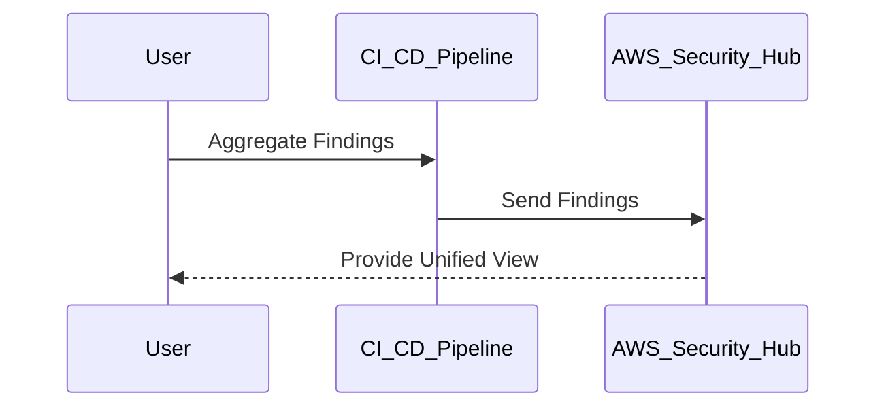

## AWS and Automated Security Testing

### Introduction

In the realm of DevSecOps, integrating automated security testing into your Continuous Integration/Continuous Deployment (CI/CD) pipeline is crucial for maintaining robust security practices. This chapter delves into the integration of automated security testing within an AWS environment, covering the theoretical foundations, practical implementations, and real-world examples.

### Background Theory

#### What is Automated Security Testing?

Automated security testing refers to the process of using tools and scripts to automatically scan and test systems, applications, and networks for vulnerabilities. This approach helps identify security issues early in the development lifecycle, reducing the likelihood of security breaches.

#### Why is Automated Security Testing Important?

Automated security testing is essential because it:

- **Reduces human error**: Manual testing can be time-consuming and prone to oversight.
- **Improves efficiency**: Automated tools can run tests faster and more frequently than manual testers.
- **Ensures consistency**: Automated tests provide consistent results across different environments and iterations.
- **Enables continuous monitoring**: Automated tools can continuously monitor systems for new vulnerabilities.

### AWS Services for Automated Security Testing

AWS provides several services that can be integrated into your CI/CD pipeline to perform automated security testing:

1. **AWS Inspector**
2. **Amazon Macie**
3. **AWS Secrets Manager**
4. **AWS Security Hub**

#### AWS Inspector

**What is AWS Inspector?**

AWS Inspector is an automated security assessment service that helps improve the security and compliance of applications deployed on AWS. It automatically assesses applications for vulnerabilities or deviations from best practices.

**How Does AWS Inspector Work?**

AWS Inspector uses agents installed on EC2 instances to collect data about the instance and its running processes. It then analyzes this data to identify potential security issues.



**Real-World Example: CVE-2021-3427**

CVE-2021-3427 is a critical vulnerability in the Apache Log4j library. AWS Inspector can detect such vulnerabilities by scanning EC2 instances for outdated versions of Log4j.

**Detection and Prevention**

To detect and prevent such vulnerabilities:

1. **Install AWS Inspector Agent**: Ensure the agent is installed on all relevant EC2 instances.
2. **Configure Security Assessments**: Set up regular assessments to check for known vulnerabilities.
3. **Review Reports**: Regularly review the findings and apply necessary patches.



#### Amazon Macie

**What is Amazon Macie?**

Amazon Macie is a fully managed data security and data privacy service that uses machine learning to discover and protect sensitive data stored in AWS.

**How Does Amazon Macie Work?**

Amazon Macie automatically discovers and classifies sensitive data, such as personally identifiable information (PII), protected health information (PHI), and intellectual property. It also monitors data access patterns to detect anomalies that might indicate unauthorized access.



**Real-World Example: Healthcare Data Breach**

In 2021, a healthcare provider suffered a data breach due to unsecured PHI. Amazon Macie could have detected and alerted on the exposure of sensitive data.

**Detection and Prevention**

To detect and prevent data breaches:

1. **Enable Amazon Macie**: Integrate Amazon Macie into your AWS environment.
2. **Classify Sensitive Data**: Automatically classify and label sensitive data.
3. **Monitor Access Patterns**: Monitor and alert on unusual data access patterns.



#### AWS Secrets Manager

**What is AWS Secrets Manager?**

AWS Secrets Manager is a service that helps you protect access to your applications, services, and IT resources without compromising security. It enables you to easily rotate, manage, and retrieve database credentials, API keys, and other secrets throughout their lifecycle.

**How Does AWS Secrets Manager Work?**

AWS Secrets Manager securely stores and manages secrets, such as database credentials and API keys. It integrates with AWS services and third-party applications to automate secret management.



**Real-World Example: API Key Exposure**

In 2020, a company exposed API keys in a public GitHub repository, leading to unauthorized access. AWS Secrets Manager could have securely stored and managed these keys.

**Detection and Prevention**

To detect and prevent secret exposure:

1. **Store Secrets Securely**: Use AWS Secrets Manager to store and manage secrets.
2. **Automate Secret Rotation**: Configure automatic rotation of secrets.
3. **Audit Access**: Regularly audit access to secrets to detect unauthorized usage.


#### AWS Security Hub

**What is AWS Security Hub?**

AWS Security Hub is a comprehensive view of your security state across your AWS environment. It provides a unified view of security alerts and compliance status generated by AWS services and integrated third-party partners.

**How Does AWS Security Hub Work?**

AWS Security Hub aggregates security findings from various sources, including AWS services and third-party security tools. It provides a centralized view of your security posture and helps prioritize remediation efforts.



**Real-World Example: Compliance Violation**

In 2021, a company faced a compliance violation due to misconfigured security settings. AWS Security Hub could have detected and alerted on these misconfigurations.

**Detection and Prevention**

To detect and prevent compliance violations:

1. **Integrate Security Tools**: Integrate various security tools with AWS Security Hub.
2. **Aggregate Findings**: Aggregate security findings from multiple sources.
3. **Prioritize Remediation**: Prioritize and address high-priority findings first.

```mermaid
graph LR
    A[Integrate Security Tools] --> B[Aggregate Findings]
    B --> C[P

---
<!-- nav -->
[[01-Introduction to Integrating Security Tests into AWS Pipelines|Introduction to Integrating Security Tests into AWS Pipelines]] | [[DevSecOps/DevSecOps Bootcamp/05-Application Security Testing/01-AWS and Automated Security Testing/05-Module Summary/00-Overview|Overview]] | [[DevSecOps/DevSecOps Bootcamp/05-Application Security Testing/01-AWS and Automated Security Testing/05-Module Summary/03-Practice Questions & Answers|Practice Questions & Answers]]
