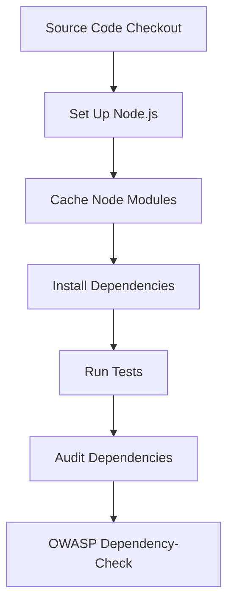

## Introduction to Application Vulnerability Scanning in CI Pipelines

In the realm of DevSecOps, integrating application vulnerability scanning into your Continuous Integration (CI) pipeline is crucial for ensuring that your applications are secure throughout their development lifecycle. This chapter will delve into the process of building a CI pipeline that includes vulnerability scanning, starting from a basic pipeline and optimizing it with caching mechanisms. We'll explore the theoretical foundations, practical implementation, and real-world examples to provide a comprehensive understanding of the topic.

### Background Theory

#### What is Continuous Integration (CI)?

Continuous Integration (CI) is a practice where developers frequently merge their code changes into a central repository, after which automated builds and tests are run. The primary goal of CI is to catch integration issues early, reducing the time and effort required to resolve them.

#### Why Integrate Vulnerability Scanning?

Integrating vulnerability scanning into your CI pipeline ensures that security checks are performed automatically and consistently. This helps in identifying and fixing security vulnerabilities early in the development cycle, thereby reducing the risk of deploying insecure code to production.

### Basic CI Pipeline

Let's start with a basic CI pipeline. A typical CI pipeline consists of several stages:

1. **Source Code Checkout**: Cloning the repository.
2. **Build**: Compiling the code.
3. **Test**: Running unit tests, integration tests, etc.
4. **Deploy**: Deploying the application to a staging environment.

Here’s an example of a basic CI pipeline using GitHub Actions:

```yaml
name: CI Pipeline

on:
  push:
    branches:
      - main
  pull_request:
    branches:
      - main

jobs:
  build:
    runs-on: ubuntu-latest

    steps:
    - name: Checkout code
      uses: actions/checkout@v3

    - name: Set up Node.js
      uses: actions/setup-node@v3
      with:
        node-version: '16'

    - name: Install dependencies
      run: npm install

    - name: Run tests
      run: npm test
```

### Optimizing the Pipeline with Caching

Caching is a technique used to speed up the CI pipeline by storing intermediate results and reusing them in subsequent builds. This reduces the time spent on repetitive tasks like downloading dependencies.

#### How Caching Works

When you enable caching, the CI system stores the output of certain steps (like dependency installation) and reuses it in future builds if the inputs haven’t changed. This significantly reduces the time taken for these steps.

Here’s how you can enable caching in the above pipeline:

```yaml
name: CI Pipeline

on:
  push:
    branches:
      - main
  pull_request:
    branches:
      - main

jobs:
  build:
    runs-on: ubuntu-latest

    steps:
    - name: Checkout code
      uses: actions/checkout@v3

    - name: Cache node modules
      id: cache
      uses: actions/cache@v3
      with:
        path: |
          node_modules
        key: ${{ runner.os }}-node-${{ hashFiles('**/package-lock.json') }}
        restore-keys: |
          ${{ runner.os }}-node-

    - name: Set up Node.js
      uses: actions/setup-node@v3
      with:
        node-version: '16'

    - name: Install dependencies
      if: steps.cache.outputs.cache-hit != 'true'
      run: npm install

    - name: Run tests
      run: npm test
```

### Adding Vulnerability Scanning to the Pipeline

Now that we have a basic CI pipeline with caching, let’s integrate vulnerability scanning. There are several tools available for this purpose, such as `npm audit`, `OWASP Dependency-Check`, and `Snyk`.

#### Using `npm audit` for Node.js Applications

`npm audit` is a built-in tool provided by npm to check for known vulnerabilities in your project’s dependencies.

Here’s how you can add `npm audit` to the pipeline:

```yaml
name: CI Pipeline

on:
  push:
    branches:
      - main
  pull_request:
    branches:
      - main

jobs:
  build:
    runs-on: ubuntu-latest

    steps:
    - name: Checkout code
      uses: actions/checkout@v3

    - name: Cache node modules
      id: cache
      uses: actions/cache@v3
      with:
        path: |
          node_modules
        key: ${{ runner.os }}-node-${{ hashFiles('**/package-lock.json') }}
        restore-keys: |
          ${{ runner.os }}-node-

    - name: Set up Node.js
      uses: actions/setup-node@v3
      with:
        node-version: '16'

    - name: Install dependencies
      if: steps.cache.outputs.cache-hit != 'true'
      run: npm install

    - name: Run tests
      run: npm test

    - name: Audit dependencies
      run: npm audit --audit-level=high
```

### Real-World Examples and Recent CVEs

#### Example: CVE-2021-44228 (Log4j)

The Log4j vulnerability (CVE-2021-44228) is a critical security flaw that affected many Java applications. Integrating vulnerability scanning into your CI pipeline could have helped identify and mitigate this issue early.

Here’s how you might configure a pipeline to scan for Log4j vulnerabilities using `OWASP Dependency-Check`:

```yaml
name: CI Pipeline

on:
  push:
    branches:
      - main
  pull_request:
    branches:
      - main

jobs:
  build:
    runs-on: ubuntu-latest

    steps:
    - name: Checkout code
      uses: actions/checkout@v3

    - name: Cache node modules
      id: cache
      uses: actions/cache@v3
      with:
        path: |
          node_modules
        key: ${{ runner.os }}-node-${{ hashFiles('**/package-lock.json') }}
        restore-keys: |
          ${{ runner.os }}-node-

    - name: Set up Node.js
      uses: actions/setup-node@v3
      with:
        node-version: '16'

    - name: Install dependencies
      if: steps.cache.outputs.cache-hit != 'true'
      run: npm install

    - name: Run tests
      run: npm test

    - name: Audit dependencies
      run: npm audit --audit-level=high

    - name: OWASP Dependency-Check
      uses: owasp/dependency-check-action@v3
      with:
        args: '--scan . --format ALL --out report.html'
```

### Pitfalls and Common Mistakes

#### Overlooking False Positives

One common mistake is treating all reported vulnerabilities as critical without verifying their relevance. Some tools may generate false positives, leading to unnecessary work.

#### Not Regularly Updating Scanning Tools

Another pitfall is not keeping your vulnerability scanning tools up-to-date. New vulnerabilities are discovered regularly, and outdated tools may miss these.

### How to Prevent / Defend

#### Detection

Regularly run vulnerability scans as part of your CI pipeline. Ensure that the tools are up-to-date and configured correctly.

#### Prevention

1. **Secure Coding Practices**: Follow secure coding guidelines to minimize the introduction of vulnerabilities.
2. **Dependency Management**: Use tools like `npm audit` to manage dependencies securely.
3. **Configuration Hardening**: Harden your application configurations to reduce the attack surface.

#### Secure-Coding Fixes

Here’s an example of a vulnerable code snippet and its secure version:

**Vulnerable Code:**

```javascript
const express = require('express');
const app = express();

app.get('/', function(req, res) {
  res.send(req.query.message);
});

app.listen(3000);
```

**Secure Code:**

```javascript
const express = require('express');
const app = express();
const { escapeHtml } = require('escape-html');

app.get('/', function(req, res) {
  const message = req.query.message || '';
  res.send(escapeHtml(message));
});

app.listen(3000);
```

### Complete Example with Full HTTP Request and Response

#### HTTP Request

```http
GET /?message=<script>alert('XSS')</script> HTTP/1.1
Host: localhost:3000
User-Agent: curl/7.74.0
Accept: */*
```

#### HTTP Response

**Vulnerable Response:**

```http
HTTP/1.1 200 OK
Date: Mon, 01 Jan 2024 00:00:00 GMT
Content-Type: text/html; charset=utf-8
Content-Length: 35

<script>alert('XSS')</script>
```

**Secure Response:**

```http
HTTP/1.1 200 OK
Date: Mon, 01 Jan 2024 00:00:00 GMT
Content-Type: text/html; charset=utf-8
Content-Length: 35

&lt;script&gt;alert('XSS')&lt;/script&gt;
```

### Mermaid Diagrams

#### CI Pipeline Architecture



### Hands-On Labs

For hands-on practice, consider the following labs:

- **PortSwigger Web Security Academy**: Offers interactive labs to learn about various web security topics.
- **OWASP Juice Shop**: An intentionally insecure web application for practicing web security skills.
- **DVWA (Damn Vulnerable Web Application)**: Another intentionally insecure web application for learning web security.

These labs provide practical experience in setting up CI pipelines with vulnerability scanning.

### Conclusion

Integrating vulnerability scanning into your CI pipeline is essential for maintaining the security of your applications. By following the steps outlined in this chapter, you can ensure that your pipeline is optimized and secure. Remember to regularly update your tools and follow secure coding practices to minimize the risk of introducing vulnerabilities.

---
<!-- nav -->
[[DevSecOps/DevSecOps Bootcamp/05-Application Security Testing/02-Application Vulnerability Scanning/Build a Continuous Integration Pipeline/00-Overview|Overview]] | [[02-Introduction to Application Vulnerability Scanning in CICD Pipelines Part 1|Introduction to Application Vulnerability Scanning in CICD Pipelines Part 1]]
