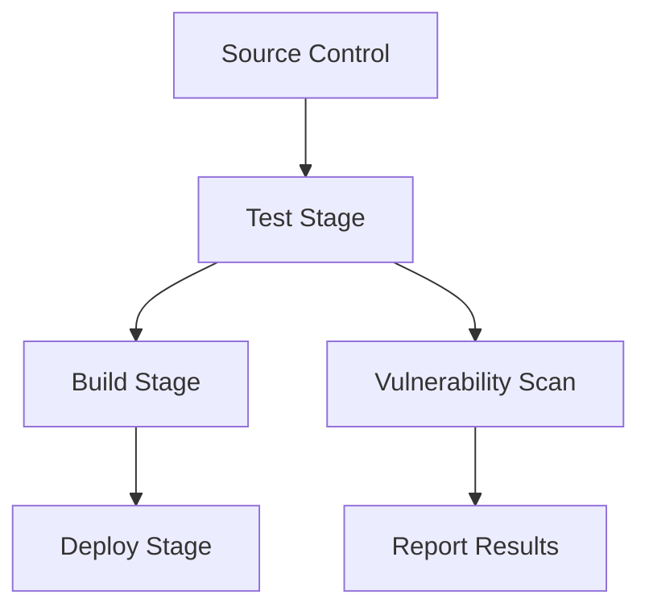
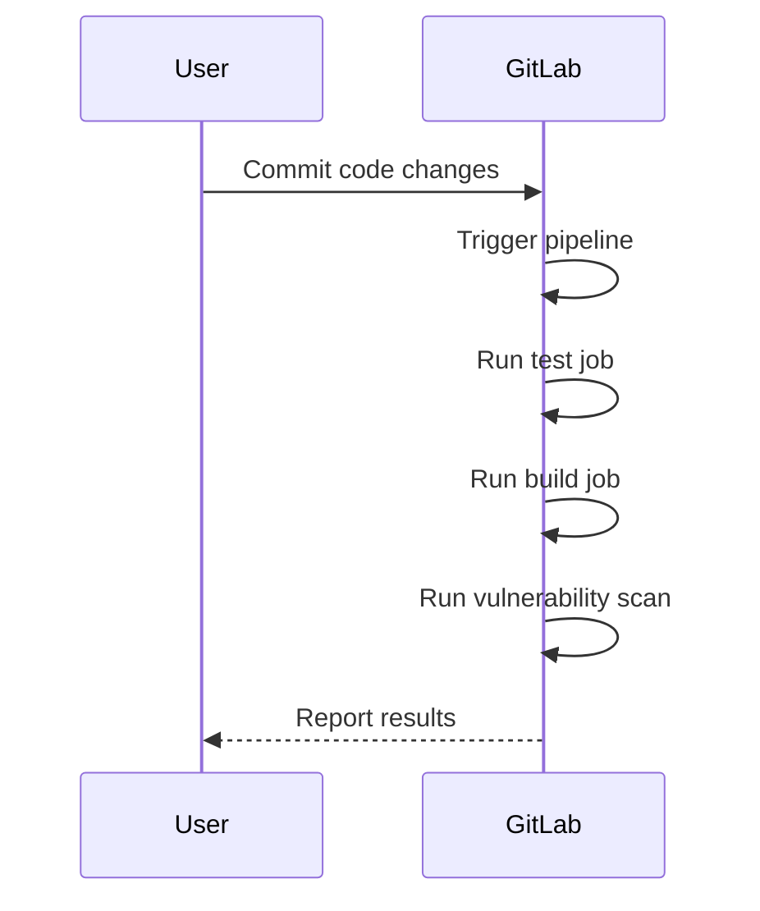

## Introduction to Application Vulnerability Scanning in CI/CD Pipelines

Application vulnerability scanning is a critical component of modern DevSecOps practices. It helps ensure that applications are free from vulnerabilities that could be exploited by attackers. Integrating vulnerability scanning into a continuous integration (CI) pipeline allows teams to catch and address issues early in the development cycle, reducing the risk of deploying insecure code.

### What is a CI Pipeline?

A CI pipeline is a series of steps that automate the process of building, testing, and deploying code changes. This automation ensures that code is integrated frequently and that issues are detected and resolved quickly. A typical CI pipeline includes stages such as:

- **Source Control Management**: Storing and managing code in a version control system like Git.
- **Build**: Compiling the code and packaging it into a deployable format.
- **Test**: Running automated tests to ensure the code works as expected.
- **Deploy**: Deploying the code to a staging or production environment.

### Why Integrate Vulnerability Scanning?

Integrating vulnerability scanning into a CI pipeline is essential because it helps identify and mitigate security risks early in the development process. This proactive approach reduces the likelihood of deploying vulnerable code and helps maintain the security posture of the application.

### How to Create a CI Pipeline with GitLab

To create a CI pipeline using GitLab, you need to create a `.gitlab-ci.yml` file in your repository. This file defines the stages and jobs that make up the pipeline.

#### Creating the `.gitlab-ci.yml` File

Let's walk through the process of creating a `.gitlab-ci.yml` file step-by-step.

1. **Create the File**:
   Open your code editor and create a new file named `.gitlab-ci.yml`. This file should be placed at the root of your repository.

```yaml
# .gitlab-ci.yml
```

2. **Define Stages**:
   In GitLab CI/CD, you can define different stages for your pipeline. Common stages include `test`, `build`, and `deploy`.

```yaml
stages:
  - test
  - build
  - deploy
```

3. **Define Jobs**:
   Each stage can have one or more jobs. For example, you might have a `yarn test` job in the `test` stage.

```yaml
stages:
  - test
  - build
  - deploy

test_job:
  stage: test
  script:
    - yarn install
    - yarn test
```

4. **Use Managed Shared Runners**:
   GitLab provides managed shared runners that you can use to run your jobs. This eliminates the need to set up your own runners, making it easier to get started.

```yaml
test_job:
  stage: test
  script:
    - yarn install
    - yarn test
  services:
    - docker:dind
  image: node:latest
```

### Understanding the Components

#### Stages

Stages are the high-level phases of your pipeline. Each stage can contain one or more jobs. The order of stages is important because jobs in later stages won't run until all jobs in earlier stages have completed successfully.

#### Jobs

Jobs are the individual tasks that run in each stage. They can include commands to install dependencies, run tests, build artifacts, and deploy code.

#### Services

Services are additional containers that can be used alongside your job. For example, you might use a `docker:dind` service to run Docker commands within your job.

#### Images

Images specify the base Docker image to use for your job. This determines the environment in which your job runs. For example, using `node:latest` ensures that your job runs in a Node.js environment.

### Example `.gitlab-ci.yml` File

Here is a complete example of a `.gitlab-ci.yml` file that includes a `test` stage and a `build` stage:

```yaml
stages:
  - test
  - build

test_job:
  stage: test
  script:
    - yarn install
    - yarn test
  services:
    - docker:dind
  image: node:latest

build_job:
  stage: build
  script:
    - yarn build
  services:
    - docker:dind
  image: node:latest
```

### Real-World Examples

#### Recent CVEs and Breaches

One recent example of a vulnerability that could have been caught by a CI pipeline is the Log4j vulnerability (CVE-2021-44228). This vulnerability affected many Java applications and could have been detected by a vulnerability scanner integrated into a CI pipeline.

#### Real-World Applications

Consider a web application built with Node.js and React. By integrating a vulnerability scanner into the CI pipeline, the team can catch issues like outdated dependencies, missing security headers, and other vulnerabilities early in the development process.

### Pitfalls and Best Practices

#### Common Mistakes

- **Not Using Secure Images**: Always use trusted and secure base images for your jobs.
- **Ignoring Test Failures**: Ensure that your pipeline fails if tests fail, preventing insecure code from being deployed.
- **Not Regularly Updating Dependencies**: Keep your dependencies up-to-date to avoid known vulnerabilities.

#### Best Practices

- **Use Trusted Images**: Use official and trusted Docker images for your jobs.
- **Fail Fast**: Configure your pipeline to fail fast if tests or scans fail.
- **Regular Updates**: Regularly update your dependencies and scan for vulnerabilities.

### How to Prevent / Defend

#### Detection

- **Vulnerability Scanners**: Use tools like Snyk, Trivy, or OWASP Dependency-Check to scan for vulnerabilities.
- **Security Headers**: Use tools like `helmet` to ensure secure headers are set in your application.

#### Prevention

- **Secure Coding Practices**: Follow secure coding guidelines and best practices.
- **Dependency Management**: Use tools like `npm audit` to manage and update dependencies securely.

#### Secure Code Fix

Here is an example of a vulnerable code snippet and its secure version:

**Vulnerable Code**

```javascript
const express = require('express');
const app = express();

app.get('/', (req, res) => {
  res.send('Hello, World!');
});

app.listen(3000);
```

**Secure Code**

```javascript
const express = require('express');
const helmet = require('helmet');
const app = express();

app.use(helmet());

app.get('/', (req, res) => {
  res.send('Hello, World!');
});

app.listen(3000);
```

### Complete Example with Raw HTTP Messages

#### Full HTTP Request and Response

Here is an example of a full HTTP request and response:

**HTTP Request**

```http
GET /api/v1/users HTTP/1.1
Host: example.com
User-Agent: curl/7.64.1
Accept: */*
```

**HTTP Response**

```http
HTTP/1.1 200 OK
Date: Mon, 20 Nov 2023 12:00:00 GMT
Content-Type: application/json
Content-Length: 100
Connection: keep-alive

[
  { "id": 1, "name": "John Doe" },
  { "id": 2, "name": "Jane Smith" }
]
```

### Mermaid Diagrams

#### Pipeline Architecture



#### Job Sequence Diagram



### Hands-On Labs

For hands-on practice with application vulnerability scanning in CI/CD pipelines, consider the following labs:

- **PortSwigger Web Security Academy**: Offers interactive labs for web application security.
- **OWASP Juice Shop**: A deliberately insecure web application for practicing security skills.
- **DVWA (Damn Vulnerable Web Application)**: A PHP/MySQL web application that demonstrates web application vulnerabilities.
- **WebGoat**: An interactive training application designed to teach web application security lessons.

By integrating vulnerability scanning into your CI pipeline, you can significantly improve the security of your applications and reduce the risk of deploying vulnerable code.

---
<!-- nav -->
[[DevSecOps/DevSecOps Bootcamp/05-Application Security Testing/02-Application Vulnerability Scanning/Build a Continuous Integration Pipeline/01-Introduction to Application Vulnerability Scanning in CI Pipelines|Introduction to Application Vulnerability Scanning in CI Pipelines]] | [[DevSecOps/DevSecOps Bootcamp/05-Application Security Testing/02-Application Vulnerability Scanning/Build a Continuous Integration Pipeline/00-Overview|Overview]] | [[03-Introduction to Application Vulnerability Scanning in CICD Pipelines Part 2|Introduction to Application Vulnerability Scanning in CICD Pipelines Part 2]]
