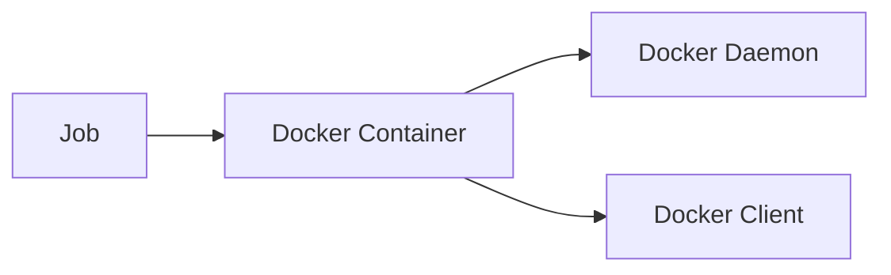
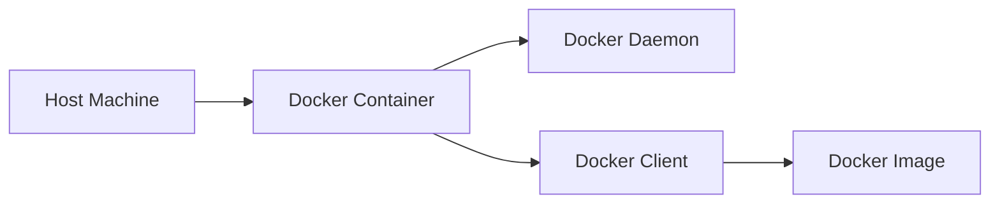

## Introduction to Application Vulnerability Scanning in CI/CD Pipelines

In the realm of DevSecOps, integrating security practices into the continuous integration and continuous deployment (CI/CD) pipeline is crucial. One key aspect of this integration is the inclusion of application vulnerability scanning. This ensures that the software being developed is free from known vulnerabilities and adheres to security best practices.

### Understanding the Docker Executor and Shared Runners

To effectively implement application vulnerability scanning within a CI/CD pipeline, we often utilize Docker executors and shared runners. These tools provide a consistent and isolated environment for executing tasks, ensuring that the results are reliable and reproducible.

#### What is a Docker Executor?

A Docker executor is a type of runner that uses Docker containers to execute jobs. This means that each job runs in its own Docker container, providing a clean and isolated environment. This is particularly useful when different jobs require different dependencies or configurations.

#### What are Shared Runners?

Shared runners are runners that can be used by multiple projects. They are typically managed by a central server and can be configured to run jobs for any project that is authorized to use them. This allows for efficient resource utilization and reduces the overhead of managing individual runners for each project.

#### Why Use Docker Executors and Shared Runners?

Using Docker executors and shared runners offers several benefits:

- **Consistency**: Each job runs in a fresh Docker container, ensuring that the environment is consistent across different runs.
- **Isolation**: Jobs do not interfere with each other, as each runs in its own container.
- **Resource Efficiency**: Shared runners can be reused across multiple projects, reducing the need for dedicated runners for each project.

### Setting Up the Docker Environment

To set up a Docker environment for running jobs that require Docker commands, we need to define an appropriate Docker image. This image should contain the necessary tools and dependencies required to execute the jobs.

#### Defining the Docker Image

The Docker image we choose should include both the Docker daemon and the Docker client. This is because we need to be able to build Docker images and push them to a repository, which requires both the daemon and the client.



#### Using Docker-in-Docker (DinD)

To achieve this, we use a Docker image that supports Docker-in-Docker (DinD). DinD allows us to run Docker inside a Docker container, providing the necessary environment to build and push Docker images.



#### Example Docker Image Configuration

Here is an example of how to configure a Docker image for DinD:

```yaml
image: docker:24-dind

services:
  - docker:24-dind

before_script:
  - docker info
```

This configuration specifies the `docker:24-dind` image and sets up a service using the same image. The `before_script` section runs a `docker info` command to verify that the Docker daemon is running correctly.

### Building and Pushing Docker Images

Once the Docker environment is set up, we can proceed to build and push Docker images. This involves defining the necessary commands in the CI/CD pipeline.

#### Defining the Build and Push Commands

The build and push commands are typically defined in the `script` section of the CI/CD pipeline configuration. Here is an example of how to define these commands:

```yaml
script:
  - docker build -t my-image .
  - docker login -u $DOCKER_USER -p $DOCKER_PASS
  - docker push my-image
```

This configuration performs the following steps:

1. Builds the Docker image using the `docker build` command.
2. Logs in to the Docker registry using the `docker login` command.
3. Pushes the built image to the registry using the `docker push` command.

#### Example Dockerfile

The Dockerfile used in the build process might look like this:

```Dockerfile
FROM node:16-alpine

WORKDIR /app

COPY package*.json ./
RUN npm install

COPY . .

CMD ["npm", "start"]
```

This Dockerfile sets up a Node.js application using the `node:16-alpine` base image, copies the application files, installs the dependencies, and sets the default command to start the application.

### Application Vulnerability Scanning

To integrate application vulnerability scanning into the CI/CD pipeline, we can use various tools such as Trivy, Clair, or Aqua Security. These tools scan the Docker images for known vulnerabilities and provide reports that can be used to identify and fix issues.

#### Example Vulnerability Scan Configuration

Here is an example of how to configure a vulnerability scan using Trivy:

```yaml
script:
  - docker build -t my-image .
  - docker login -u $DOCKER_USER -p $DOCKER_PASS
  - docker push my-image
  - trivy image my-image
```

This configuration adds a step to run Trivy on the built Docker image to scan for vulnerabilities.

#### Example Trivy Output

The output of Trivy might look like this:

```plaintext
2023-10-01T12:00:00Z        INFO    Completed scanning image: my-image
Total: 1 (UNKNOWN: 0, LOW: 0, MEDIUM: 1, HIGH: 0, CRITICAL: 0)
```

This output indicates that the image contains one medium-severity vulnerability.

### How to Prevent / Defend Against Vulnerabilities

To prevent and defend against vulnerabilities, it is essential to follow best practices and implement security measures at various stages of the development process.

#### Secure Coding Practices

Secure coding practices involve writing code that is less susceptible to common vulnerabilities. This includes:

- Input validation: Ensure that all user inputs are validated and sanitized.
- Error handling: Handle errors gracefully and avoid exposing sensitive information.
- Authentication and authorization: Implement strong authentication mechanisms and enforce proper authorization checks.

#### Example of Secure Coding

Here is an example of secure coding practices in a Node.js application:

```javascript
const express = require('express');
const app = express();

app.use(express.json());

app.post('/login', (req, res) => {
    const { username, password } = req.body;
    
    // Validate input
    if (!username || !password) {
        return res.status(400).send('Invalid input');
    }

    // Authenticate user
    const authenticated = authenticateUser(username, password);
    if (!authenticated) {
        return res.status(401).send('Unauthorized');
    }

    // Set session or token
    res.send('Login successful');
});

function authenticateUser(username, password) {
    // Placeholder for actual authentication logic
    return true;
}

app.listen(3000, () => {
    console.log('Server started on port 3000');
});
```

This example demonstrates input validation and proper error handling.

#### Hardening the Docker Image

Hardening the Docker image involves removing unnecessary components and securing the runtime environment. This includes:

- Removing unused packages and dependencies.
- Disabling unnecessary services.
- Configuring the runtime environment securely.

#### Example of Hardened Dockerfile

Here is an example of a hardened Dockerfile:

```Dockerfile
FROM node:16-alpine

# Remove unnecessary packages
RUN apk del --no-cache <unnecessary-packages>

WORKDIR /app

COPY package*.json ./
RUN npm install --production

COPY . .

CMD ["npm", "start"]
```

This Dockerfile removes unnecessary packages and installs only production dependencies.

### Real-World Examples and Recent Breaches

Recent breaches and vulnerabilities have highlighted the importance of integrating security into the CI/CD pipeline. For example, the Log4j vulnerability (CVE-2021-44228) affected numerous applications and systems, emphasizing the need for regular vulnerability scans and updates.

#### Example of a Real-World Breach

In the case of the SolarWinds breach (CVE-2020-1014), attackers exploited a vulnerability in the SolarWinds Orion software to compromise multiple organizations. This breach underscores the importance of monitoring and securing third-party software and dependencies.

### Conclusion

Integrating application vulnerability scanning into the CI/CD pipeline is a critical component of DevSecOps. By setting up a Docker environment, building and pushing Docker images, and performing regular vulnerability scans, we can ensure that our applications are secure and free from known vulnerabilities. Following best practices and implementing security measures at various stages of the development process further enhances the security of our applications.

### Practice Labs

For hands-on practice with application vulnerability scanning in CI/CD pipelines, consider the following labs:

- **PortSwigger Web Security Academy**: Offers interactive labs for learning web security concepts, including vulnerability scanning.
- **OWASP Juice Shop**: A deliberately insecure web application for practicing web security skills.
- **DVWA (Damn Vulnerable Web Application)**: A PHP/MySQL web application that is riddled with vulnerabilities for educational purposes.
- **WebGoat**: An interactive training application designed to teach web application security lessons.

These labs provide practical experience in identifying and mitigating vulnerabilities in web applications, making them valuable resources for mastering DevSecOps principles.

---
<!-- nav -->
[[03-Introduction to Application Vulnerability Scanning in CICD Pipelines Part 2|Introduction to Application Vulnerability Scanning in CICD Pipelines Part 2]] | [[DevSecOps/DevSecOps Bootcamp/05-Application Security Testing/02-Application Vulnerability Scanning/Build a Continuous Integration Pipeline/00-Overview|Overview]] | [[05-Introduction to Application Vulnerability Scanning in CICD Pipelines Part 4|Introduction to Application Vulnerability Scanning in CICD Pipelines Part 4]]
