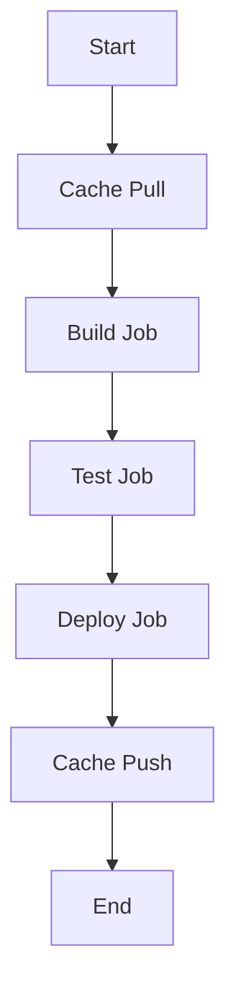

## Introduction to Application Vulnerability Scanning in CI/CD Pipelines

Application vulnerability scanning is an essential component of modern DevSecOps practices. It helps identify potential security weaknesses in your application code before it reaches production, thereby reducing the risk of exploitation. In this chapter, we will delve into the process of integrating vulnerability scanning into a Continuous Integration (CI) pipeline, focusing specifically on caching mechanisms and their role in optimizing build times.

### Background Theory

Before diving into the specifics, it's important to understand the context and the underlying principles of CI/CD pipelines and vulnerability scanning.

#### Continuous Integration (CI)

Continuous Integration is a development practice where developers frequently merge their code changes into a central repository, followed by automated builds and tests. The goal is to catch integration issues early and reduce the time and effort required to resolve them.

#### Continuous Delivery (CD)

Continuous Delivery extends CI by ensuring that the software can be released to production at any time. This involves automating the deployment process so that the software can be deployed to production with minimal human intervention.

#### Vulnerability Scanning

Vulnerability scanning is the process of identifying security weaknesses in software applications. This can be done through static analysis (analyzing the code without executing it) or dynamic analysis (testing the application while it is running).

### Caching Mechanisms in CI/CD Pipelines

Caching is a technique used to store the results of expensive operations so that they can be reused later, thus saving time and resources. In the context of CI/CD pipelines, caching can significantly speed up build times by reusing previously downloaded dependencies.

#### Cache Configuration

In the given transcript, we are configuring caching for a `yarn` installation. Let's break down the steps involved:

1. **Hidden Folder for Yarn**: We create a hidden folder named `.yarn`, which will be used to store the cached dependencies.
2. **Policy Attribute**: We define a policy attribute and set it to `pull-push`. This means that the cache will be both pulled (downloaded) and pushed (uploaded) during the build process.

```yaml
cache:
  key: yarn-cache
  paths:
    - .yarn/
  policy: pull-push
```

#### Explanation of the Policy

- **Pull-Push Policy**: 
  - **Pull**: The cache is downloaded from the remote storage (in this case, GitLab) at the beginning of the build process.
  - **Push**: The cache is uploaded back to the remote storage at the end of the build process.

This ensures that subsequent builds can reuse the cached dependencies, thereby reducing the time required to download and install them.

### Full Example of Cache Configuration

Let's look at a complete example of how this cache configuration would be integrated into a `.gitlab-ci.yml` file:

```yaml
stages:
  - build
  - test
  - deploy

cache:
  key: yarn-cache
  paths:
    - .yarn/
  policy: pull-push

build_job:
  stage: build
  script:
    - yarn install
    - yarn build

test_job:
  stage: test
  script:
    - yarn test

deploy_job:
  stage: deploy
  script:
    - yarn deploy
```

### Detailed Workflow

To better understand the workflow, let's visualize it using a Mermaid diagram:



### Pitfalls and Common Mistakes

While caching can significantly improve build times, there are several pitfalls to be aware of:

1. **Stale Cache**: If the cache is not properly invalidated, it may contain outdated dependencies, leading to build failures.
2. **Incorrect Cache Key**: Using an incorrect cache key can result in the cache being recreated unnecessarily, negating the benefits of caching.
3. **Large Cache Size**: Storing large amounts of data in the cache can lead to increased storage costs and slower build times.

### How to Prevent / Defend

To ensure that caching is effective and secure, follow these best practices:

1. **Use Unique Cache Keys**: Ensure that the cache key is unique for each build to avoid stale cache issues.
2. **Automate Cache Invalidation**: Implement logic to automatically invalidate the cache when dependencies change.
3. **Monitor Cache Usage**: Regularly monitor the size and usage of the cache to ensure it remains within acceptable limits.

### Real-World Examples

Recent vulnerabilities and breaches often highlight the importance of proper CI/CD pipeline management. For instance, the Log4j vulnerability (CVE-2021-44228) affected numerous applications due to outdated dependencies. Proper caching and dependency management could have helped mitigate this issue.

### Complete Example with Vulnerability Scanning

Let's integrate vulnerability scanning into our pipeline. We will use a tool like `npm audit` to scan for vulnerabilities in our `yarn` dependencies.

```yaml
stages:
  - build
  - test
  - vulnerability-scan
  - deploy

cache:
  key: yarn-cache
  paths:
    - .yarn/
  policy: pull-push

build_job:
  stage: build
  script:
    - yarn install
    - yarn build

test_job:
  stage: test
  script:
    - yarn test

vulnerability_scan_job:
  stage: vulnerability-scan
  script:
    - yarn audit

deploy_job:
  stage: deploy
  script:
    - yarn deploy
```

### Full HTTP Request and Response Example

When integrating with external services, such as vulnerability scanners, it's crucial to understand the HTTP requests and responses involved. Here’s an example of a request to a hypothetical vulnerability scanner API:

```http
POST /api/v1/scan HTTP/1.1
Host: scanner.example.com
Content-Type: application/json
Authorization: Bearer <your-token>

{
  "repository": "https://github.com/user/repo",
  "branch": "main"
}
```

Response:

```http
HTTP/1.1 200 OK
Content-Type: application/json

{
  "status": "success",
  "results": [
    {
      "dependency": "lodash",
      "version": "4.17.21",
      "vulnerabilities": [
        {
          "id": "CVE-2021-44228",
          "severity": "high",
          "description": "Log4j vulnerability"
        }
      ]
    }
  ]
}
```

### Secure Coding Practices

To prevent vulnerabilities, it's essential to follow secure coding practices. Here’s an example of a vulnerable code snippet and its secure counterpart:

**Vulnerable Code:**

```javascript
const express = require('express');
const app = express();

app.get('/data', (req, res) => {
  const { id } = req.query;
  res.send(`Data for ${id}`);
});

app.listen(3000);
```

**Secure Code:**

```javascript
const express = require('express');
const app = express();
const { sanitize } = require('express-sanitize');

app.use(sanitize());

app.get('/data', (req, res) => {
  const { id } = req.query;
  res.send(`Data for ${sanitize(id)}`);
});

app.listen(3000);
```

### Hands-On Labs

For practical experience, consider the following labs:

- **PortSwigger Web Security Academy**: Offers comprehensive training on web application security.
- **OWASP Juice Shop**: A deliberately insecure web application for practicing security testing.
- **DVWA (Damn Vulnerable Web Application)**: Another popular web application for learning web security.

These labs provide real-world scenarios and challenges to help you master the concepts discussed in this chapter.

### Conclusion

Integrating vulnerability scanning into your CI/CD pipeline is crucial for maintaining the security of your applications. By leveraging caching mechanisms and following best practices, you can optimize build times and reduce the risk of security vulnerabilities. Always stay vigilant and continuously improve your security posture through regular audits and updates.

---
<!-- nav -->
[[08-Introduction to Application Vulnerability Scanning in CICD Pipelines Part 7|Introduction to Application Vulnerability Scanning in CICD Pipelines Part 7]] | [[DevSecOps/DevSecOps Bootcamp/05-Application Security Testing/02-Application Vulnerability Scanning/Build a Continuous Integration Pipeline/00-Overview|Overview]] | [[10-Introduction to Application Vulnerability Scanning in CICD Pipelines|Introduction to Application Vulnerability Scanning in CICD Pipelines]]
