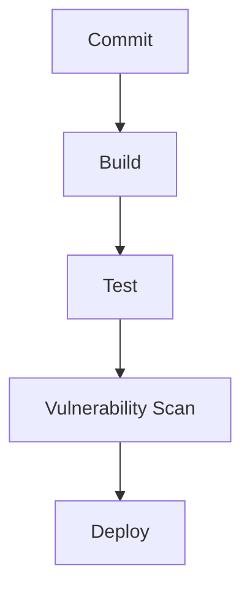

## Introduction to Application Vulnerability Scanning in CI/CD Pipelines

In the realm of DevSecOps, integrating security practices into the Continuous Integration and Continuous Deployment (CI/CD) pipeline is crucial. This ensures that applications are not only developed efficiently but also securely. One key aspect of this integration is the inclusion of application vulnerability scanning within the CI/CD pipeline. This chapter will delve into the process of building a CI/CD pipeline using GitLab, focusing on how to incorporate vulnerability scanning to enhance the security posture of your applications.

### Prerequisites and Background

Before diving into the specifics of creating a CI/CD pipeline with GitLab, it is essential to understand the foundational concepts of GitLab, CI/CD pipelines, and DevSecOps.

#### GitLab Overview

GitLab is a web-based DevOps lifecycle tool that provides a wide range of features for software development, including version control, issue tracking, code review, and CI/CD pipelines. GitLab is built around the Git version control system and offers a comprehensive platform for managing the entire software development lifecycle.

**Why GitLab?**
- **Integrated Environment:** GitLab provides an integrated environment where developers can manage their code, track issues, and automate their CI/CD processes.
- **Community and Enterprise Editions:** GitLab offers both community and enterprise editions, catering to different organizational needs.
- **Ease of Use:** GitLab is user-friendly and comes with extensive documentation and support, making it accessible even for beginners.

#### CI/CD Pipelines

Continuous Integration (CI) and Continuous Deployment (CD) are practices that aim to improve the efficiency and reliability of software development. CI involves automating the integration of code changes from multiple contributors, while CD extends this by automating the deployment of those changes.

**Key Components of CI/CD:**
- **Version Control System (VCS):** Typically Git, used to manage and track changes in the codebase.
- **Build Automation:** Tools like Jenkins, Travis CI, CircleCI, or GitLab CI/CD to automate the build process.
- **Testing Automation:** Automated tests to ensure the quality of the code.
- **Deployment Automation:** Automated deployment to various environments (development, staging, production).

#### DevSecOps

DevSecOps is the practice of integrating security into the DevOps workflow. It emphasizes the importance of security throughout the entire software development lifecycle, rather than treating it as an afterthought.

**Why DevSecOps?**
- **Security Early and Often:** By incorporating security practices early in the development process, vulnerabilities can be identified and addressed more effectively.
- **Collaboration:** DevSecOps promotes collaboration between development, operations, and security teams, ensuring that everyone is aligned towards a common goal of delivering secure software.
- **Automation:** Automating security checks and vulnerability scans helps in maintaining a consistent and reliable security posture.

### Setting Up a GitLab CI/CD Pipeline

To create a CI/CD pipeline in GitLab, you need to define a `.gitlab-ci.yml` file in your project repository. This file contains the configuration for your pipeline, specifying the jobs to be executed and their dependencies.

#### Creating the `.gitlab-ci.yml` File

The `.gitlab-ci.yml` file is a YAML file that defines the structure of your CI/CD pipeline. Each job in the pipeline is defined as a separate stage, and the stages are executed in a specific order.

```yaml
stages:
  - build
  - test
  - deploy

build_job:
  stage: build
  script:
    - echo "Building the application..."
    - docker build -t myapp .

test_job:
  stage: test
  script:
    - echo "Running tests..."
    - docker run myapp pytest

deploy_job:
  stage: deploy
  script:
    - echo "Deploying the application..."
    - docker tag myapp username/myapp
    - docker push username/myapp
```

**Explanation:**
- **Stages:** The `stages` keyword defines the different stages in the pipeline. In this example, we have three stages: `build`, `test`, and `deploy`.
- **Jobs:** Each job is defined under a specific stage. For example, `build_job` is defined under the `build` stage, `test_job` under the `test` stage, and `deploy_job` under the `deploy` stage.
- **Script:** The `script` keyword specifies the commands to be executed in each job. These commands can include shell commands, Docker commands, or any other commands required for the job.

#### Running the Pipeline

Once the `.gitlab-ci.yml` file is created and committed to the repository, GitLab will automatically trigger the pipeline whenever there is a new commit. The pipeline will execute the jobs in the specified order, and the results will be displayed in the GitLab UI.

### Incorporating Vulnerability Scanning

To enhance the security of your application, you can incorporate vulnerability scanning into your CI/CD pipeline. This involves using tools like Trivy, Clair, or Snyk to scan your application for known vulnerabilities.

#### Using Trivy for Vulnerability Scanning

Trivy is an open-source vulnerability scanner that supports various package managers and container images. To integrate Trivy into your GitLab CI/CD pipeline, you can add a new job to the `.gitlab-ci.yml` file.

```yaml
vulnerability_scan:
  stage: test
  script:
    - trivy image myapp
```

**Explanation:**
- **Job Definition:** The `vulnerability_scan` job is defined under the `test` stage.
- **Script:** The `script` keyword specifies the command to be executed. In this case, `trivy image myapp` scans the Docker image `myapp` for vulnerabilities.

#### Example of a Full `.gitlab-ci.yml` File

Here is an example of a full `.gitlab-ci.yml` file that includes vulnerability scanning:

```yaml
stages:
  - build
  - test
  - deploy

build_job:
  stage: build
  script:
    - echo "Building the application..."
    - docker build -t myapp .

test_job:
  stage: test
  script:
    - echo "Running tests..."
    - docker run myapp pytest

vulnerability_scan:
  stage: test
  script:
    - trivy image myapp

deploy_job:
  stage: deploy
  script:
    - echo "Deploying the application..."
    - docker tag myapp username/myapp
    - docker push username/myapp
```

### Real-World Examples and Recent CVEs

To illustrate the importance of vulnerability scanning, consider the following real-world examples and recent CVEs:

#### Example 1: Log4j Vulnerability (CVE-2021-44228)

The Log4j vulnerability, also known as Log4Shell, was a critical vulnerability discovered in December 2021. This vulnerability allowed attackers to execute arbitrary code on affected systems, leading to widespread exploitation.

**Impact:**
- **Exploitation:** Many organizations were affected, including major tech companies and government agencies.
- **Mitigation:** Organizations had to quickly patch their systems and conduct thorough vulnerability assessments.

**How to Prevent:**
- **Regular Updates:** Keep all software components up to date with the latest security patches.
- **Vulnerability Scanning:** Integrate vulnerability scanning tools into your CI/CD pipeline to identify and address vulnerabilities early.

#### Example 2: Spring Framework Vulnerability (CVE-2022-22965)

The Spring Framework vulnerability, also known as Spring4Shell, was another critical vulnerability discovered in March 2022. This vulnerability allowed attackers to execute arbitrary code on affected systems, similar to the Log4j vulnerability.

**Impact:**
- **Exploitation:** Many organizations were affected, leading to significant disruptions.
- **Mitigation:** Organizations had to quickly patch their systems and conduct thorough vulnerability assessments.

**How to Prevent:**
- **Regular Updates:** Keep all software components up to date with the latest security patches.
- **Vulnerability Scanning:** Integrate vulnerability scanning tools into your CI/CD pipeline to identify and address vulnerabilities early.

### Common Pitfalls and Best Practices

When setting up a CI/CD pipeline with vulnerability scanning, there are several common pitfalls to avoid:

#### Pitfall 1: Ignoring Vulnerability Reports

One common pitfall is ignoring vulnerability reports generated by scanning tools. This can lead to unpatched vulnerabilities in your application, increasing the risk of exploitation.

**Best Practice:**
- **Automate Remediation:** Integrate automated remediation steps into your pipeline to address vulnerabilities promptly.
- **Review Reports:** Regularly review vulnerability reports and take appropriate action to mitigate identified risks.

#### Pitfall 2: Overlooking Dependency Management

Another common pitfall is overlooking dependency management. Outdated or vulnerable dependencies can introduce security risks into your application.

**Best Practice:**
- **Dependency Management:** Use tools like Snyk or Dependabot to manage dependencies and keep them up to date.
- **Regular Audits:** Conduct regular audits of your dependencies to identify and address potential vulnerabilities.

### How to Prevent / Defend

To ensure the security of your application, it is essential to implement robust defense mechanisms. Here are some key strategies:

#### Secure Coding Practices

Secure coding practices involve writing code that is free from common vulnerabilities. This includes practices such as input validation, error handling, and secure configuration.

**Example:**
- **Input Validation:** Always validate user inputs to prevent injection attacks.
- **Error Handling:** Implement proper error handling to prevent information leakage.

#### Configuration Hardening

Configuration hardening involves securing the configuration settings of your application and infrastructure. This includes practices such as disabling unnecessary services, configuring firewalls, and enabling encryption.

**Example:**
- **Disable Unnecessary Services:** Disable any services that are not required for your application to function.
- **Configure Firewalls:** Configure firewalls to restrict access to your application and infrastructure.

#### Vulnerability Scanning

As discussed earlier, vulnerability scanning is a critical component of a secure CI/CD pipeline. This involves using tools like Trivy, Clair, or Snyk to scan your application for known vulnerabilities.

**Example:**
- **Integrate Scanning Tools:** Integrate vulnerability scanning tools into your CI/CD pipeline to identify and address vulnerabilities early.
- **Regular Scans:** Conduct regular vulnerability scans to ensure that your application remains secure.

### Complete Example of a CI/CD Pipeline with Vulnerability Scanning

Here is a complete example of a CI/CD pipeline with vulnerability scanning:

```yaml
stages:
  - build
  - test
  - deploy

build_job:
  stage: build
  script:
    - echo "Building the application..."
    - docker build -t myapp .

test_job:
  stage: test
  script:
    - echo "Running tests..."
    - docker run myapp pytest

vulnerability_scan:
  stage: test
  script:
    - trivy image myapp

deploy_job:
  stage: deploy
  script:
    - echo "Deploying the application..."
    - docker tag myapp username/myapp
    - docker push username/myapp
```

### Request + Response + Result

Here is an example of a full HTTP request and response for a vulnerability scan:

**HTTP Request:**

```http
POST /api/v1/scans HTTP/1.1
Host: trivy.example.com
Content-Type: application/json
Authorization: Bearer <token>

{
  "image": "myapp"
}
```

**HTTP Response:**

```http
HTTP/1.1 200 OK
Content-Type: application/json

{
  "image": "myapp",
  "vulnerabilities": [
    {
      "package": "log4j",
      "version": "2.14.1",
      "severity": "CRITICAL",
      "description": "Log4j vulnerability (CVE-2021-44228)"
    }
  ]
}
```

### Mermaid Diagrams

Here is a mermaid diagram illustrating the architecture of a CI/CD pipeline with vulnerability scanning:



### Hands-On Labs

To gain practical experience with setting up a CI/CD pipeline with vulnerability scanning, consider the following hands-on labs:

- **PortSwigger Web Security Academy:** Offers a variety of labs focused on web application security, including CI/CD pipeline setup.
- **OWASP Juice Shop:** A deliberately insecure web application for security training, which can be used to practice setting up a CI/CD pipeline with vulnerability scanning.
- **DVWA (Damn Vulnerable Web Application):** Another deliberately insecure web application for security training, which can be used to practice setting up a CI/CD pipeline with vulnerability scanning.

By following these steps and best practices, you can ensure that your application is developed and deployed securely, reducing the risk of vulnerabilities and enhancing the overall security posture of your organization.

---
<!-- nav -->
[[09-Introduction to Application Vulnerability Scanning in CICD Pipelines Part 8|Introduction to Application Vulnerability Scanning in CICD Pipelines Part 8]] | [[DevSecOps/DevSecOps Bootcamp/05-Application Security Testing/02-Application Vulnerability Scanning/Build a Continuous Integration Pipeline/00-Overview|Overview]] | [[11-Introduction to Application Vulnerability Scanning in Continuous Integration Pipelines Part 1|Introduction to Application Vulnerability Scanning in Continuous Integration Pipelines Part 1]]
