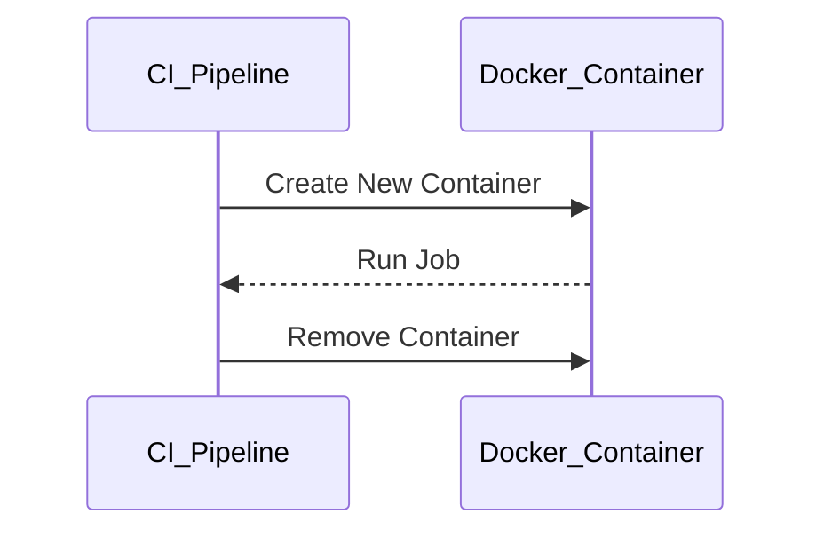
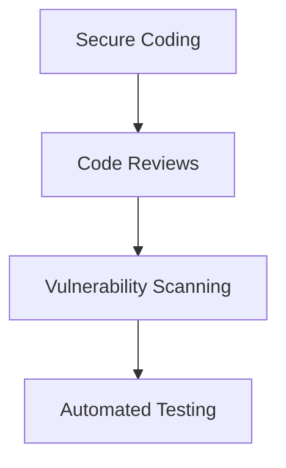

## Introduction to Application Vulnerability Scanning in Continuous Integration Pipelines

In the realm of DevSecOps, continuous integration (CI) pipelines play a crucial role in ensuring that applications are built, tested, and deployed efficiently and securely. One of the key aspects of a CI pipeline is the ability to perform application vulnerability scanning, which helps identify potential security weaknesses before they can be exploited.

### Understanding the CI Pipeline

A CI pipeline is a series of steps that automatically builds, tests, and deploys code changes. Each step in the pipeline is designed to ensure that the codebase remains stable and secure throughout the development process. In the context of the provided transcript, the pipeline includes steps such as installing dependencies, building the Docker image, and running tests.

#### Dependency Installation

Dependency installation is a critical step in the CI pipeline. Tools like `yarn` are commonly used to manage JavaScript dependencies. When you run `yarn install`, it fetches and installs all the necessary packages specified in your `package.json` file.

```bash
yarn install
```

This command ensures that all dependencies are available for subsequent steps in the pipeline, such as building and testing the application.

#### Docker Image Building

Docker images are used to package the application along with its dependencies into a portable format. This allows the application to be run consistently across different environments. The Docker image is built using a `Dockerfile`, which contains instructions for creating the image.

```Dockerfile
# Example Dockerfile
FROM node:14

WORKDIR /app

COPY package*.json ./
RUN yarn install

COPY . .

CMD ["yarn", "start"]
```

The `Dockerfile` specifies the base image (`node:14`), sets the working directory, copies the `package.json` files, runs `yarn install`, and then copies the rest of the application code. Finally, it specifies the command to start the application.

### Statelessness in CI Pipelines

One of the key characteristics of CI pipelines is their statelessness. Each job in the pipeline runs in a fresh environment, typically a new Docker container. This ensures that there are no unexpected interactions between different jobs or runs of the pipeline.



This stateless approach provides several advantages:

- **Consistency**: Each run starts from a clean slate, reducing the likelihood of unexpected behavior due to leftover artifacts from previous runs.
- **Isolation**: Jobs do not interfere with each other, ensuring that the results of one job do not affect the results of another.

However, this approach also has some disadvantages:

- **Performance**: Rebuilding the entire environment for each run can be time-consuming, especially if the environment setup involves downloading large dependencies or compiling code.
- **Resource Usage**: Creating and destroying containers for each job can be resource-intensive, particularly in terms of disk space and network bandwidth.

### Optimizing CI Pipelines with Caching

To address the performance issues associated with stateless pipelines, caching mechanisms can be employed. Caching allows certain artifacts, such as installed dependencies, to be stored and reused across pipeline runs.

#### Configuring Yarn Cache

Yarn supports caching through its `cache` feature. By configuring caching, you can store the dependencies downloaded during the `yarn install` step and reuse them in subsequent pipeline runs.

```yaml
# Example GitLab CI/CD configuration
stages:
  - build
  - test

build_job:
  stage: build
  script:
    - yarn install --cache-folder /path/to/cache
    - yarn build
  cache:
    key: "$CI_COMMIT_REF_SLUG"
    paths:
      - /path/to/cache

test_job:
  stage: test
  script:
    - yarn test
  dependencies:
    - build_job
```

In this example, the `yarn install` command is configured to use a specific cache folder. The cache is stored and reused across pipeline runs, significantly reducing the time required for dependency installation.

### Application Vulnerability Scanning

Application vulnerability scanning is an essential part of the CI pipeline. It involves using tools to analyze the application code and dependencies for known vulnerabilities. This helps ensure that the application is secure before it is deployed.

#### Tools for Vulnerability Scanning

Several tools are available for performing vulnerability scans in CI pipelines:

- **Snyk**: A popular tool for detecting vulnerabilities in open-source dependencies.
- **Trivy**: An open-source vulnerability scanner that supports various package managers and container images.
- **OWASP Dependency-Check**: A tool that identifies project dependencies with known vulnerabilities.

#### Integrating Vulnerability Scanning into the Pipeline

To integrate vulnerability scanning into the CI pipeline, you can add a dedicated job that runs the scanning tool. For example, using Trivy:

```yaml
vulnerability_scan:
  stage: test
  script:
    - trivy image --exit-code 1 <image-name>
```

This job runs Trivy to scan the Docker image for vulnerabilities. If any vulnerabilities are found, the job will fail, preventing the deployment of the insecure image.

### Real-World Examples and Recent Breaches

Recent breaches and vulnerabilities highlight the importance of vulnerability scanning in CI pipelines. For instance:

- **CVE-2021-44228 (Log4Shell)**: This vulnerability in the Apache Log4j library affected numerous applications and systems. Vulnerability scanning tools could have detected the presence of the vulnerable Log4j version in the application dependencies.
- **SolarWinds Supply Chain Attack**: This attack involved the compromise of SolarWinds software, which was then distributed to customers. Vulnerability scanning could have helped detect the malicious code in the software.

### How to Prevent / Defend

To effectively prevent and defend against vulnerabilities in CI pipelines, consider the following strategies:

#### Secure Coding Practices

Implement secure coding practices to reduce the likelihood of introducing vulnerabilities in the first place. For example, use secure coding guidelines and conduct regular code reviews.



#### Dependency Management

Manage dependencies carefully to avoid including vulnerable libraries. Use tools like Snyk or OWASP Dependency-Check to monitor dependencies for known vulnerabilities.

```yaml
dependency_check:
  stage: test
  script:
    - dependency-check --scan .
```

#### Regular Updates and Patching

Keep all dependencies and tools up to date with the latest security patches. Automate the process of updating dependencies to ensure that vulnerabilities are addressed promptly.

#### Monitoring and Logging

Implement monitoring and logging to detect and respond to security incidents. Use tools like Splunk or ELK Stack to collect and analyze logs from the CI pipeline.

### Conclusion

In conclusion, integrating application vulnerability scanning into CI pipelines is essential for ensuring the security of applications throughout the development lifecycle. By leveraging caching mechanisms and using tools like Snyk, Trivy, and OWASP Dependency-Check, you can detect and mitigate vulnerabilities early in the development process. This not only improves the security posture of the application but also enhances the overall efficiency of the CI pipeline.

### Practice Labs

For hands-on practice with application vulnerability scanning in CI pipelines, consider the following labs:

- **PortSwigger Web Security Academy**: Offers interactive labs for learning web security concepts, including vulnerability scanning.
- **OWASP Juice Shop**: A deliberately insecure web application for practicing web security skills.
- **DVWA (Damn Vulnerable Web Application)**: A PHP/MySQL web application that is riddled with vulnerabilities for educational purposes.

These labs provide practical experience in identifying and mitigating vulnerabilities in real-world applications.

---
<!-- nav -->
[[10-Introduction to Application Vulnerability Scanning in CICD Pipelines|Introduction to Application Vulnerability Scanning in CICD Pipelines]] | [[DevSecOps/DevSecOps Bootcamp/05-Application Security Testing/02-Application Vulnerability Scanning/Build a Continuous Integration Pipeline/00-Overview|Overview]] | [[12-Introduction to Application Vulnerability Scanning in Continuous Integration Pipelines Part 2|Introduction to Application Vulnerability Scanning in Continuous Integration Pipelines Part 2]]
