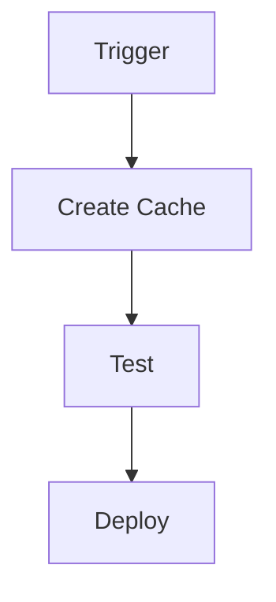
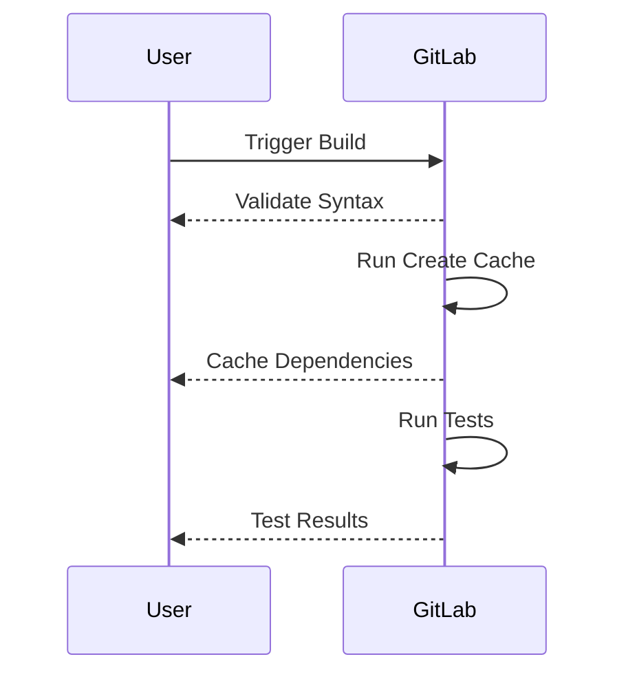

## Introduction to Application Vulnerability Scanning in Continuous Integration Pipelines

In the realm of DevSecOps, ensuring the security and integrity of applications throughout their development lifecycle is paramount. One critical aspect of this process is the integration of application vulnerability scanning into continuous integration (CI) pipelines. This ensures that vulnerabilities are detected and addressed early, reducing the risk of security breaches and enhancing overall application quality.

### Background Theory

Continuous Integration (CI) is a practice where developers frequently merge their code changes into a central repository, followed by automated builds and tests. This helps catch issues early and ensures that the codebase remains stable and functional. Integrating vulnerability scanning into this process allows teams to identify potential security weaknesses automatically, thereby improving the security posture of the application.

### Configuring Cache for Yarn Test

One of the key optimizations in a CI pipeline is configuring caching for dependency management tools like Yarn. Caching can significantly reduce build times by reusing previously downloaded dependencies rather than fetching them anew each time.

#### What is Caching?

Caching is a technique used to store frequently accessed data in a temporary storage area (cache) to speed up access times. In the context of CI pipelines, caching is used to store dependencies that are downloaded during the build process. This way, subsequent builds can reuse these cached dependencies, reducing the time required to download and install them.

#### Why Use Caching?

Using caching in CI pipelines offers several benefits:

1. **Reduced Build Times**: By reusing cached dependencies, the time required to download and install them is minimized, leading to faster build times.
2. **Consistency**: Ensures that the same versions of dependencies are used across different builds, reducing the likelihood of inconsistencies.
3. **Resource Efficiency**: Reduces the load on package repositories and network bandwidth, making the build process more efficient.

#### How Does Caching Work?

When a build runs, the CI system checks if the required dependencies are already present in the cache. If they are, the system uses the cached versions; otherwise, it downloads and installs the dependencies and stores them in the cache for future use.

### Configuring Cache in GitLab CI

Let's walk through the steps to configure caching for Yarn in a GitLab CI pipeline.

#### Step-by-Step Configuration

1. **Add a Stage for Caching**:
   - Create a new stage in your `.gitlab-ci.yml` file specifically for caching.
   - Name this stage `cache`.

2. **Define a Job for Creating Cache**:
   - Within the `cache` stage, define a job named `create_cache`.
   - This job will run the `yarn install` command to download and install dependencies.

3. **Configure Caching**:
   - Specify the paths to be cached, typically the `node_modules` directory.

Here is an example of how to configure caching in a GitLab CI pipeline:

```yaml
stages:
  - cache
  - test

create_cache:
  stage: cache
  script:
    - yarn install
  cache:
    paths:
      - node_modules/

test:
  stage: test
  script:
    - yarn test
```

#### Explanation of Each Component

- **Stages**: Defines the stages in the pipeline. Here, we have two stages: `cache` and `test`.
- **create_cache Job**: Runs the `yarn install` command to download and install dependencies.
- **Cache Configuration**: Specifies the `node_modules` directory to be cached.

### Syntax Validation in GitLab CI

GitLab provides real-time syntax validation for `.gitlab-ci.yml` files. This feature helps ensure that the pipeline configuration is correct and reduces the likelihood of errors.

#### Real-Time Syntax Validation

When you make changes to the pipeline configuration in the GitLab UI, GitLab automatically validates the syntax. If there are any errors, GitLab highlights them, allowing you to correct them immediately.

### Example of Full Raw HTTP Messages

While the primary focus here is on the CI pipeline configuration, it's important to understand how HTTP messages interact with the CI system. For instance, when a build is triggered, an HTTP request is sent to the CI server.

Here is an example of a full HTTP request and response for triggering a build:

#### HTTP Request

```http
POST /api/v4/projects/123456789/pipeline HTTP/1.1
Host: gitlab.com
Authorization: Bearer <your_access_token>
Content-Type: application/json

{
  "ref": "main"
}
```

#### HTTP Response

```http
HTTP/1.1 201 Created
Date: Tue, 01 Aug 2023 12:00:00 GMT
Content-Type: application/json
Content-Length: 123

{
  "id": 987654321,
  "status": "running",
  "ref": "main",
  "sha": "abc123def456ghi789jk"
}
```

### Common Pitfalls and How to Avoid Them

#### Pitfall 1: Incorrect Cache Paths

**Problem**: Specifying incorrect paths for caching can lead to unnecessary re-downloads of dependencies, negating the benefits of caching.

**Solution**: Ensure that the paths specified in the `cache` section are correct and include all necessary directories.

#### Pitfall 2: Over-Caching

**Problem**: Over-caching can lead to stale dependencies being used, potentially introducing bugs or security vulnerabilities.

**Solution**: Regularly clean the cache and update dependencies to ensure they are up-to-date.

### How to Prevent / Defend

#### Detection

- **Regular Audits**: Perform regular audits of the CI pipeline configuration to ensure that caching is correctly configured.
- **Monitoring**: Monitor the build times and cache usage to detect any anomalies.

#### Prevention

- **Secure Configuration**: Ensure that the CI pipeline configuration is secure and follows best practices.
- **Automated Testing**: Implement automated testing to catch any issues early.

#### Secure Coding Fixes

Here is an example of a vulnerable configuration and its secure counterpart:

**Vulnerable Configuration**

```yaml
stages:
  - cache
  - test

create_cache:
  stage: cache
  script:
    - yarn install
  cache:
    paths:
      - node_modules/
```

**Secure Configuration**

```yaml
stages:
  - cache
  - test

create_cache:
  stage: cache
  script:
    - yarn install
  cache:
    key: "$CI_COMMIT_REF_SLUG"
    paths:
      - node_modules/
```

### Recent Real-World Examples

#### Example 1: CVE-2021-44228 (Log4j)

The Log4j vulnerability (CVE-2021-44228) highlighted the importance of keeping dependencies up-to-date. Integrating vulnerability scanning into CI pipelines can help detect such vulnerabilities early.

#### Example 2: Data Breach Due to Outdated Dependencies

A recent data breach occurred due to outdated dependencies in a web application. Integrating vulnerability scanning into the CI pipeline could have helped detect and address this issue before it became a security risk.

### Mermaid Diagrams

#### Pipeline Topology



#### Sequence Diagram



### Practice Labs

For hands-on experience with integrating vulnerability scanning into CI pipelines, consider the following labs:

- **PortSwigger Web Security Academy**: Offers a comprehensive set of labs covering various aspects of web application security.
- **OWASP Juice Shop**: A deliberately insecure web application for practicing security testing.
- **DVWA (Damn Vulnerable Web Application)**: Another popular web application for learning and practicing web security.

By following these steps and best practices, you can effectively integrate vulnerability scanning into your CI pipelines, ensuring the security and integrity of your applications.

---
<!-- nav -->
[[11-Introduction to Application Vulnerability Scanning in Continuous Integration Pipelines Part 1|Introduction to Application Vulnerability Scanning in Continuous Integration Pipelines Part 1]] | [[DevSecOps/DevSecOps Bootcamp/05-Application Security Testing/02-Application Vulnerability Scanning/Build a Continuous Integration Pipeline/00-Overview|Overview]] | [[13-Introduction to Application Vulnerability Scanning in Continuous Integration Pipelines Part 3|Introduction to Application Vulnerability Scanning in Continuous Integration Pipelines Part 3]]
