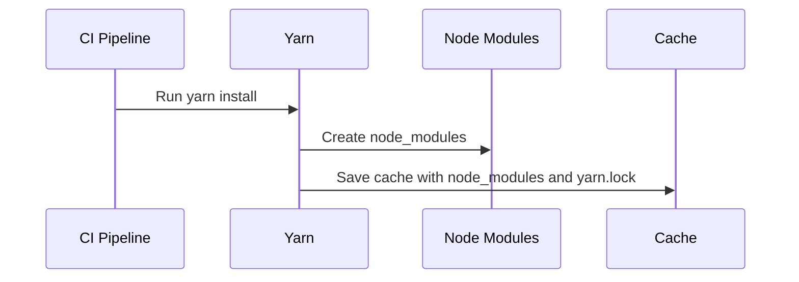
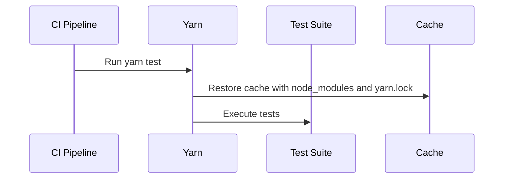
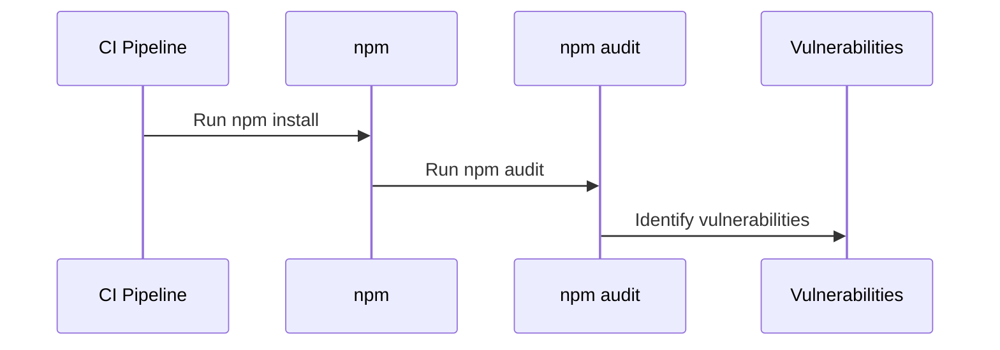

## Introduction to Application Vulnerability Scanning in Continuous Integration Pipelines

Application vulnerability scanning is an essential component of modern DevSecOps practices. It helps identify potential security weaknesses in applications during the development lifecycle, ensuring that vulnerabilities are caught early and can be addressed before the application reaches production. This chapter will delve into the process of integrating vulnerability scanning into a continuous integration (CI) pipeline, focusing on the specific example provided in the lecture transcript.

### Background Theory

Continuous Integration (CI) is a practice where developers frequently integrate their work into a shared repository, typically several times a day. Each integration is verified by an automated build and tests to detect integration errors as quickly as possible. This approach ensures that the codebase remains stable and reduces the chances of introducing bugs or vulnerabilities.

Vulnerability scanning, on the other hand, involves using automated tools to scan applications for known security vulnerabilities. These tools can analyze source code, binary files, or even running applications to identify potential issues such as SQL injection, cross-site scripting (XSS), and buffer overflows.

### Example Scenario: Node.js Application with Yarn

The lecture transcript describes a scenario involving a Node.js application using Yarn for package management. The CI pipeline includes steps for installing dependencies, running tests, and building Docker images. Let's break down each step and understand how vulnerability scanning can be integrated into this process.

#### Step 1: Installing Dependencies

In the given scenario, the `yarn install` command is used to install dependencies specified in the `package.json` file. This step is crucial because it ensures that all required packages are available for the subsequent steps.



#### Step 2: Running Tests

After installing dependencies, the pipeline runs tests using the `yarn test` command. This step ensures that the application functions correctly and meets the specified requirements.



### Integrating Vulnerability Scanning

To integrate vulnerability scanning into the CI pipeline, we can use tools like Snyk, WhiteSource, or npm audit. These tools can scan the `node_modules` directory and the `package.json` file to identify known vulnerabilities in the installed packages.

#### Using npm audit

`npm audit` is a built-in tool in npm that can be used to scan for vulnerabilities. Here’s how it can be integrated into the CI pipeline:



#### Example Code for npm audit

Here is a complete example of how to run `npm audit` in a CI pipeline:

```yaml
# .gitlab-ci.yml
stages:
  - install
  - test
  - audit

install_dependencies:
  stage: install
  script:
    - yarn install

run_tests:
  stage: test
  script:
    - yarn test

run_audit:
  stage: audit
  script:
    - npm audit --json > audit-report.json
  artifacts:
    paths:
      - audit-report.json
```

This configuration ensures that the `npm audit` command is run after the tests, and the results are stored as an artifact.

### Real-World Examples and Recent CVEs

Recent vulnerabilities in popular Node.js packages have highlighted the importance of regular vulnerability scanning. For example, the `lodash` package had a vulnerability (CVE-2021-21332) that could allow remote code execution if certain conditions were met. By integrating vulnerability scanning into the CI pipeline, these issues can be identified and addressed proactively.

### How to Prevent / Defend

#### Detection

Regularly running vulnerability scans is the first line of defense. Tools like `npm audit`, Snyk, and WhiteSource can help detect vulnerabilities in the dependencies.

#### Prevention

1. **Keep Dependencies Updated**: Regularly update dependencies to the latest versions to ensure that known vulnerabilities are patched.
2. **Use Secure Coding Practices**: Follow secure coding guidelines to avoid introducing vulnerabilities in the first place.
3. **Automate Scans**: Integrate vulnerability scanning into the CI pipeline to ensure that scans are run automatically with each build.

#### Secure-Coding Fixes

Here is an example of a vulnerable code snippet and its secure version:

**Vulnerable Code:**
```javascript
const fs = require('fs');
const path = require('path');

function readConfigFile(filename) {
    const filePath = path.join(__dirname, filename);
    return fs.readFileSync(filePath, 'utf8');
}
```

**Secure Code:**
```javascript
const fs = require('fs');
const path = require('path');

function readConfigFile(filename) {
    const filePath = path.resolve(__dirname, filename);
    if (!filePath.startsWith(__dirname)) {
        throw new Error('Invalid file path');
    }
    return fs.readFileSync(filePath, 'utf8');
}
```

### Complete Example: Full CI Pipeline Configuration

Here is a complete example of a `.gitlab-ci.yml` file that integrates vulnerability scanning into the CI pipeline:

```yaml
# .gitlab-ci.yml
stages:
  - install
  - test
  - audit
  - build

install_dependencies:
  stage: install
  script:
    - yarn install

run_tests:
  stage: test
  script:
    - yarn test

run_audit:
  stage: audit
  script:
    - npm audit --json > audit-report.json
  artifacts:
    paths:
      - audit-report.json

build_docker_image:
  stage: build
  script:
    - docker build -t myapp .
    - docker push myapp
```

### Pitfalls and Common Mistakes

1. **Ignoring Vulnerability Reports**: One common mistake is ignoring vulnerability reports generated by tools like `npm audit`. It is crucial to address these reports promptly.
2. **Outdated Dependencies**: Failing to keep dependencies updated can leave the application vulnerable to known exploits.
3. **Manual Scans Only**: Relying solely on manual scans can lead to missed vulnerabilities. Automating scans in the CI pipeline ensures that scans are run consistently.

### Conclusion

Integrating vulnerability scanning into a CI pipeline is a critical step in ensuring the security of applications. By automating scans and addressing vulnerabilities proactively, organizations can significantly reduce the risk of security breaches. The example provided in the lecture transcript demonstrates how this can be achieved in a practical scenario involving a Node.js application.

### Hands-On Labs

For hands-on practice with application vulnerability scanning in CI pipelines, consider the following labs:

- **PortSwigger Web Security Academy**: Offers interactive labs on various aspects of web security, including vulnerability scanning.
- **OWASP Juice Shop**: A deliberately insecure web application for security training purposes, which can be used to practice vulnerability scanning.
- **GitLab CI/CD**: Use GitLab's CI/CD features to set up a pipeline with vulnerability scanning.

By following the steps outlined in this chapter and practicing with real-world examples, you can gain a deep understanding of how to effectively integrate vulnerability scanning into your CI pipelines.

---
<!-- nav -->
[[12-Introduction to Application Vulnerability Scanning in Continuous Integration Pipelines Part 2|Introduction to Application Vulnerability Scanning in Continuous Integration Pipelines Part 2]] | [[DevSecOps/DevSecOps Bootcamp/05-Application Security Testing/02-Application Vulnerability Scanning/Build a Continuous Integration Pipeline/00-Overview|Overview]] | [[14-Introduction to Application Vulnerability Scanning in Continuous Integration Pipelines|Introduction to Application Vulnerability Scanning in Continuous Integration Pipelines]]
