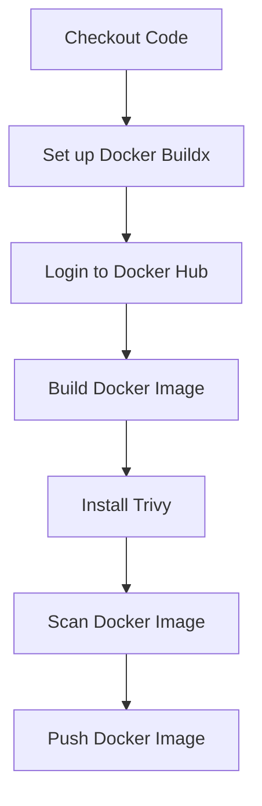

## Introduction to Application Vulnerability Scanning in Continuous Integration Pipelines

In the realm of DevSecOps, ensuring the security and integrity of applications throughout their development lifecycle is paramount. One critical aspect of this process is integrating application vulnerability scanning into continuous integration (CI) pipelines. This ensures that vulnerabilities are detected and addressed early in the development cycle, reducing the risk of security breaches and enhancing overall application security.

### Background Theory

Continuous Integration (CI) is a practice where developers integrate their code into a shared repository several times a day. Each integration is verified by an automated build and test process. This helps catch integration errors early and reduces the time and effort required to resolve them. Integrating vulnerability scanning into this process allows teams to automatically check for security issues as part of the build process.

### Docker Basics

Before diving into the specifics of vulnerability scanning, let's review some fundamental concepts related to Docker, which is a popular containerization platform used in many CI pipelines.

#### What is Docker?

Docker is a platform that uses OS-level virtualization to deliver software in packages called containers. Containers are lightweight and portable, allowing applications to run reliably across different computing environments. Docker provides a way to package and run applications in isolated environments, ensuring consistency and reproducibility.

#### Docker Images and Repositories

A Docker image is a lightweight, standalone, executable package that includes everything needed to run a piece of software, including the code, runtime, system tools, libraries, and settings. These images are stored in repositories, which can be either public or private.

- **Public Repository**: A repository that is accessible to everyone, such as Docker Hub.
- **Private Repository**: A repository that is accessible only to specific users, often used for sensitive or proprietary applications.

#### Tagging Docker Images

When building a Docker image, it is essential to tag it appropriately. Tagging allows you to specify the version of the image and helps in managing different versions of the same application. The general format for tagging a Docker image is:

```
<registry>/<repository>:<tag>
```

For example, if you are using Docker Hub and your username is `john`, your repository is `demo-app`, and you want to tag the image as `1.0`, the full name would be:

```
john/demo-app:1.0
```

### Setting Up a Private Docker Repository

To set up a private Docker repository, you need to follow these steps:

1. **Create a Docker Hub Account**:
   - Go to [Docker Hub](https://hub.docker.com/) and sign up for an account.
   - Once signed up, navigate to your profile and create a new private repository.

2. **Tagging the Image**:
   - After creating the repository, you need to tag your Docker image with the appropriate name and version.
   - For example, if your repository is named `demo-app` and you want to tag the image as `1.0`, you would use the following command:

```bash
docker tag <image-id> john/demo-app:1.0
```

3. **Pushing the Image to the Repository**:
   - Before pushing the image, you need to authenticate with Docker Hub using your credentials.

```bash
docker login -u john -p <password>
```

- Once authenticated, you can push the image to the repository using the following command:

```bash
docker push john/demo-app:1.0
```

### Vulnerability Scanning in CI Pipelines

Integrating vulnerability scanning into CI pipelines ensures that security checks are performed automatically and consistently. This helps in identifying and fixing security vulnerabilities early in the development process.

#### Tools for Vulnerability Scanning

Several tools are available for vulnerability scanning in CI pipelines:

- **Trivy**: An open-source vulnerability scanner that supports various package managers and container images.
- **Clair**: A static analysis tool that scans container images for vulnerabilities.
- **Snyk**: A commercial tool that integrates with CI/CD pipelines to scan for vulnerabilities in dependencies.

#### Example: Using Trivy in a CI Pipeline

Let's walk through an example of integrating Trivy into a CI pipeline using GitHub Actions.

1. **Install Trivy**:
   - Add Trivy to your CI pipeline. You can install it using the following command:

```yaml
- name: Install Trivy
  run: |
    wget https://github.com/aquasecurity/trivy/releases/download/v0.29.1/trivy_0.29.1_Linux-64bit.deb
    sudo dpkg -i trivy_0.29.1_Linux-64bit.deb
```

2. **Scan the Docker Image**:
   - After installing Trivy, you can scan the Docker image for vulnerabilities.

```yaml
- name: Scan Docker Image
  run: |
    trivy image --severity CRITICAL,HIGH john/demo-app:1.0
```

3. **Push the Image to Docker Hub**:
   - Finally, push the scanned image to Docker Hub.

```yaml
- name: Push Docker Image
  run: |
    docker push john/demo-app:1.0
```

### Full Example of a CI Pipeline with Vulnerability Scanning

Here is a complete example of a CI pipeline using GitHub Actions that includes vulnerability scanning with Trivy:

```yaml
name: CI Pipeline with Vulnerability Scanning

on:
  push:
    branches:
      - main

jobs:
  build-and-scan:
    runs-on: ubuntu-latest

    steps:
    - name: Checkout Code
      uses: actions/checkout@v3

    - name: Set up Docker Buildx
      uses: docker/setup-buildx-action@v2

    - name: Login to Docker Hub
      env:
        DOCKER_USERNAME: ${{ secrets.DOCKER_USERNAME }}
        DOCKER_PASSWORD: ${{ secrets.DOCKER_PASSWORD }}
      run: |
        echo "$DOCKER_PASSWORD" | docker login -u "$DOCKER_USERNAME" --password-stdin

    - name: Build Docker Image
      run: |
        docker build -t john/demo-app:1.0 .

    - name: Install Trivy
      run: |
        wget https://github.com/aquasecurity/trivy/releases/download/v0.29.1/trivy_0.29.1_Linux-64bit.deb
        sudo dpkg -i trivy_0.29.1_Linux-64bit.deb

    - name: Scan Docker Image
      run: |
        trivy image --severity CRITICAL,HIGH john/demo-app:1.0

    - name: Push Docker Image
      run: |
        docker push john/demo-app:1.0
```

### Mermaid Diagrams

To visualize the flow of the CI pipeline, we can use a mermaid diagram:



### Real-World Examples and Recent CVEs

Integrating vulnerability scanning into CI pipelines has become increasingly important due to recent security breaches and vulnerabilities. Here are a few examples:

- **CVE-2021-44228 (Log4Shell)**: This vulnerability affected Apache Log4j and allowed attackers to execute arbitrary code on the server. Integrating vulnerability scanners like Trivy can help detect and mitigate such vulnerabilities early in the development process.
- **CVE-2022-22965 (Spring Framework RCE)**: This vulnerability allowed remote code execution in Spring Framework applications. By integrating vulnerability scanning into CI pipelines, teams can ensure that their applications are not affected by such vulnerabilities.

### Common Pitfalls and How to Avoid Them

While integrating vulnerability scanning into CI pipelines offers significant benefits, there are several common pitfalls to be aware of:

- **False Positives**: Vulnerability scanners may sometimes report false positives, leading to unnecessary work. To avoid this, configure the scanner to focus on critical and high-severity vulnerabilities.
- **Performance Impact**: Running vulnerability scans can impact the performance of the CI pipeline. To mitigate this, schedule scans during off-peak hours or use incremental scanning techniques.
- **Ignoring Results**: Teams may ignore the results of vulnerability scans, leading to unaddressed vulnerabilities. Ensure that the results of vulnerability scans are reviewed and acted upon promptly.

### How to Prevent / Defend

To effectively prevent and defend against vulnerabilities in CI pipelines, follow these best practices:

- **Regularly Update Vulnerability Scanners**: Keep your vulnerability scanners up-to-date to ensure they can detect the latest vulnerabilities.
- **Automate Remediation**: Automate the remediation process for known vulnerabilities. This can be done using tools like Snyk or Trivy.
- **Secure Coding Practices**: Implement secure coding practices to reduce the likelihood of introducing vulnerabilities in the first place.
- **Regular Audits**: Conduct regular audits of your CI pipelines to ensure that they are configured correctly and are functioning as intended.

### Secure Coding Fixes

Here is an example of a vulnerable code snippet and its secure counterpart:

#### Vulnerable Code

```python
import os
import subprocess

def run_command(command):
    subprocess.run(command, shell=True)
```

#### Secure Code

```python
import os
import subprocess

def run_command(command):
    subprocess.run(command.split(), check=True)
```

### Configuration Hardening

Ensure that your CI pipeline configurations are hardened to prevent unauthorized access and ensure the integrity of the build process. Here is an example of a hardened Dockerfile:

#### Vulnerable Dockerfile

```Dockerfile
FROM python:3.9

WORKDIR /app

COPY . .

RUN pip install -r requirements.txt

CMD ["python", "app.py"]
```

#### Secure Dockerfile

```Dockerfile
FROM python:3.9-slim

WORKDIR /app

COPY requirements.txt .
RUN pip install --no-cache-dir -r requirements.txt

COPY . .

CMD ["python", "app.py"]
```

### Detection and Prevention

To detect and prevent vulnerabilities in CI pipelines, follow these steps:

1. **Use Vulnerability Scanners**: Integrate vulnerability scanners like Trivy or Clair into your CI pipeline.
2. **Review Scan Results**: Regularly review the results of vulnerability scans and address any reported issues.
3. **Implement Secure Coding Practices**: Follow secure coding practices to reduce the likelihood of introducing vulnerabilities.
4. **Conduct Regular Audits**: Conduct regular audits of your CI pipeline configurations to ensure they are secure and functioning as intended.

### Practice Labs

To gain hands-on experience with integrating vulnerability scanning into CI pipelines, consider the following practice labs:

- **PortSwigger Web Security Academy**: Offers a variety of labs focused on web application security, including vulnerability scanning.
- **OWASP Juice Shop**: A deliberately insecure web application for practicing web security skills.
- **DVWA (Damn Vulnerable Web Application)**: A PHP/MySQL web application that is riddled with vulnerabilities for educational purposes.

By following these guidelines and best practices, you can effectively integrate vulnerability scanning into your CI pipelines, ensuring the security and integrity of your applications throughout their development lifecycle.

---
<!-- nav -->
[[13-Introduction to Application Vulnerability Scanning in Continuous Integration Pipelines Part 3|Introduction to Application Vulnerability Scanning in Continuous Integration Pipelines Part 3]] | [[DevSecOps/DevSecOps Bootcamp/05-Application Security Testing/02-Application Vulnerability Scanning/Build a Continuous Integration Pipeline/00-Overview|Overview]] | [[15-Introduction to Application Vulnerability Scanning in a CI Pipeline|Introduction to Application Vulnerability Scanning in a CI Pipeline]]
