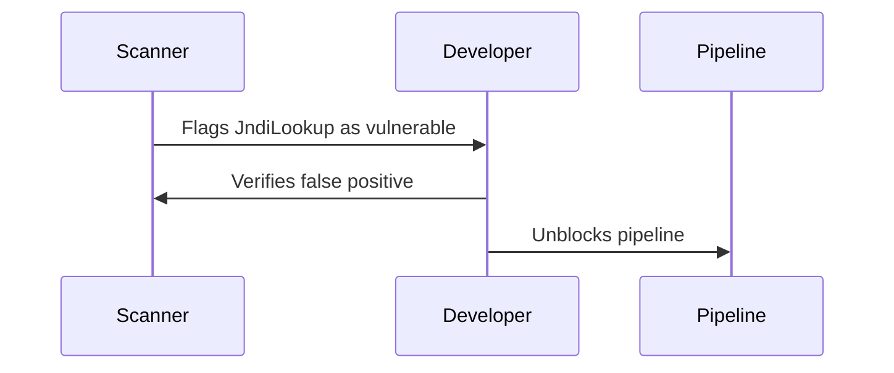
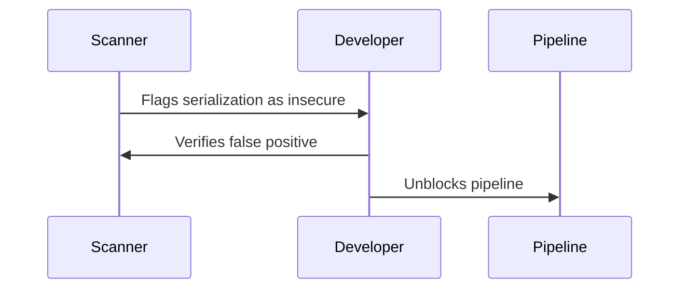
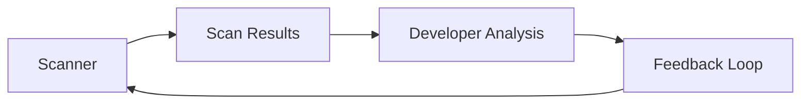

## Introduction to Application Vulnerability Scanning

Application vulnerability scanning is a critical component of modern DevSecOps practices. It involves using automated tools to identify potential security vulnerabilities within an application’s codebase, configurations, and dependencies. These tools help ensure that applications are secure against various types of attacks and comply with organizational security policies. However, one of the most significant challenges in vulnerability scanning is dealing with false positives—issues flagged by the scanner that are not actual vulnerabilities. This can lead to wasted developer time and unnecessary delays in the development pipeline.

### What Are False Positives?

False positives occur when a security tool incorrectly identifies a piece of code or configuration as a vulnerability when it is, in fact, benign. This can happen due to several reasons:

1. **Tool Limitations**: Automated scanners rely on predefined rules and heuristics to identify vulnerabilities. Sometimes, these rules may not account for specific coding patterns or configurations, leading to false positives.
2. **Complex Codebases**: Modern applications often have complex architectures and dependencies, making it difficult for scanners to accurately determine whether a particular issue is a true vulnerability.
3. **Configuration Issues**: Misconfigured scanners can also contribute to false positives. If the scanner is not properly tuned to the specific environment or application, it may flag benign issues as vulnerabilities.

### Why False Positives Matter

False positives can significantly impact the effectiveness of a DevSecOps pipeline. Here are some key reasons why they matter:

1. **Wasted Developer Time**: Developers spend valuable time analyzing and verifying false positives, which could otherwise be spent on productive tasks like coding and testing.
2. **Pipeline Delays**: False positives can cause the build pipeline to be unnecessarily blocked, delaying the release process and potentially impacting business operations.
3. **Loss of Trust**: Frequent false positives can erode trust in the security tools and processes, leading to complacency among developers and a reduced focus on security.

### Real-World Examples of False Positives

To understand the impact of false positives, let's consider some recent real-world examples:

#### Example 1: CVE-2021-44228 (Log4Shell)

The Log4Shell vulnerability (CVE-2021-44228) was a critical vulnerability in the Apache Log4j library. While many scanners correctly identified this vulnerability, some also flagged benign uses of the `JndiLookup` class as potential vulnerabilities. This led to unnecessary analysis and delays in fixing the actual vulnerability.



#### Example 2: Insecure Deserialization

Insecure deserialization is a common vulnerability where an attacker can manipulate serialized data to execute arbitrary code. Some scanners may flag legitimate uses of serialization libraries as insecure deserialization vulnerabilities, leading to false positives.



### How to Prevent and Mitigate False Positives

Dealing with false positives requires a multi-faceted approach. Here are some strategies to prevent and mitigate false positives:

#### 1. Fine-Tuning Scanners

Fine-tuning the security scanners to the specific environment and application can significantly reduce false positives. This involves configuring the scanner to ignore known benign issues and focusing on high-risk areas.

**Example Configuration:**

```yaml
# Example SonarQube configuration
sonar.projectKey=my-project
sonar.sources=src/main/java
sonar.exclusions=src/test/java/**/*.java
sonar.issue.ignore.multicriteria=1
sonar.issue.ignore.multicriteria.1.ruleKey=S2055
sonar.issue.ignore.multicriteria.1.resourceKey=src/main/java/com/example/MyClass.java
```

#### 2. Custom Rules and Policies

Developing custom rules and policies based on the specific application and environment can help reduce false positives. This involves creating rules that account for the unique characteristics of the application.

**Example Custom Rule:**

```json
{
  "rule": {
    "id": "customRule",
    "name": "Custom rule for JndiLookup",
    "description": "Ignore JndiLookup usage in specific packages",
    "severity": "INFO",
    "tags": ["security", "falsePositive"],
    "code": "if (node.type === 'Identifier' && node.name === 'JndiLookup') { return false; }"
  }
}
```

#### 3. Developer Training and Awareness

Training developers to recognize and handle false positives effectively can help reduce their impact. This involves educating developers on the common causes of false positives and how to verify them.

**Example Training Material:**

- **Understanding Common Causes**: Explain the common reasons for false positives, such as tool limitations and complex codebases.
- **Verification Techniques**: Teach developers how to verify false positives using manual code reviews and additional testing.
- **Reporting Mechanisms**: Provide mechanisms for developers to report false positives to the security team for further investigation.

#### 4. Continuous Monitoring and Feedback

Continuous monitoring of the security tools and feedback from developers can help improve the accuracy of the scans over time. This involves regularly reviewing the scan results and adjusting the scanner configurations accordingly.

**Example Monitoring Dashboard:**



### Secure Coding Practices to Avoid False Positives

Implementing secure coding practices can help reduce the likelihood of false positives by ensuring that the codebase is clean and follows best practices.

#### 1. Code Reviews

Regular code reviews can help catch potential issues early and ensure that the codebase is free from common vulnerabilities.

**Example Code Review Guidelines:**

- **Check for Common Vulnerabilities**: Ensure that the code does not contain common vulnerabilities such as SQL injection, cross-site scripting (XSS), and insecure deserialization.
- **Follow Best Practices**: Ensure that the code follows best practices for security, such as input validation, output encoding, and proper error handling.

#### 2. Dependency Management

Proper management of dependencies can help reduce the likelihood of false positives by ensuring that the application uses secure and up-to-date libraries.

**Example Dependency Management:**

```yaml
# Example Maven dependency management
<dependencies>
    <dependency>
        <groupId>org.apache.logging.log4j</groupId>
        <artifactId>log4j-core</artifactId>
        <version>2.17.1</version>
    </dependency>
</dependencies>
```

#### 3. Secure Configuration

Ensuring that the application is configured securely can help reduce the likelihood of false positives by ensuring that the application is not vulnerable to common configuration issues.

**Example Secure Configuration:**

```yaml
# Example Spring Boot configuration
spring:
  security:
    basic:
      enabled: true
  datasource:
    url: jdbc:mysql://localhost:3306/mydb
    username: myuser
    password: mypassword
```

### Detection and Prevention Strategies

Detecting and preventing false positives requires a combination of proactive measures and reactive techniques.

#### 1. Proactive Measures

Proactive measures involve taking steps to reduce the likelihood of false positives before they occur.

**Example Proactive Measures:**

- **Tool Selection**: Choose security tools that are well-suited to the specific environment and application.
- **Configuration Tuning**: Regularly review and adjust the scanner configurations to ensure that they are optimized for the specific environment.

#### 2. Reactive Techniques

Reactive techniques involve taking steps to address false positives after they occur.

**Example Reactive Techniques:**

- **False Positive Reporting**: Implement mechanisms for developers to report false positives to the security team for further investigation.
- **Feedback Loop**: Establish a feedback loop between the security team and developers to continuously improve the accuracy of the scans.

### Conclusion

False positives are a significant challenge in application vulnerability scanning. They can waste developer time, delay the build pipeline, and erode trust in the security tools and processes. By fine-tuning scanners, developing custom rules and policies, training developers, and implementing secure coding practices, organizations can reduce the impact of false positives and ensure that their applications are secure.

### Practice Labs

For hands-on experience with application vulnerability scanning and false positives, consider the following practice labs:

- **PortSwigger Web Security Academy**: Offers a comprehensive set of labs covering various aspects of web application security, including vulnerability scanning.
- **OWASP Juice Shop**: A deliberately insecure web application designed for security training and research.
- **DVWA (Damn Vulnerable Web Application)**: A PHP/MySQL web application that is intentionally vulnerable for security training purposes.

These labs provide practical experience in identifying and addressing false positives in real-world scenarios.

---
<!-- nav -->
[[DevSecOps/DevSecOps Bootcamp/05-Application Security Testing/02-Application Vulnerability Scanning/False Positives Fixing Security Vulnerabilities/01-Introduction to Application Vulnerability Scanning in DevSecOps|Introduction to Application Vulnerability Scanning in DevSecOps]] | [[DevSecOps/DevSecOps Bootcamp/05-Application Security Testing/02-Application Vulnerability Scanning/False Positives Fixing Security Vulnerabilities/00-Overview|Overview]] | [[DevSecOps/DevSecOps Bootcamp/05-Application Security Testing/02-Application Vulnerability Scanning/False Positives Fixing Security Vulnerabilities/03-Introduction to Application Vulnerability Scanning Part 2|Introduction to Application Vulnerability Scanning Part 2]]
