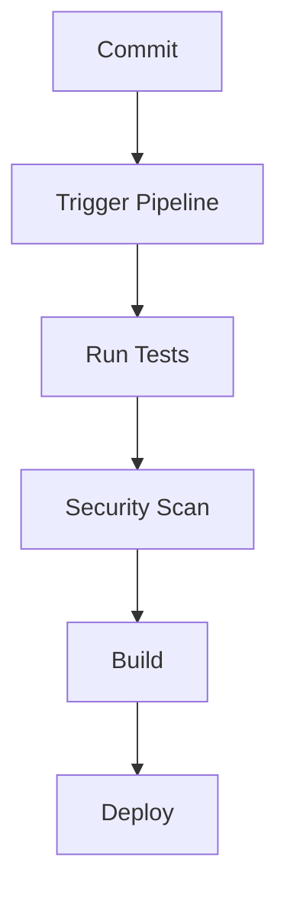

## Introduction to Application Vulnerability Scanning

Application vulnerability scanning is a critical component of DevSecOps, ensuring that applications are secure throughout their development lifecycle. This process involves using automated tools to identify potential security vulnerabilities within an application’s codebase. However, these tools often generate false positives—issues flagged as security vulnerabilities that are, in fact, benign. Addressing false positives is essential to maintain the integrity and effectiveness of the security pipeline.

### Importance of Reducing False Positives

False positives can significantly disrupt the development workflow by causing unnecessary delays and false alarms. Developers may become desensitized to security alerts if they frequently encounter false positives, leading to a decrease in the overall effectiveness of the security measures. Therefore, it is crucial to configure and tune vulnerability scanning tools to minimize false positives while ensuring that genuine security issues are identified and addressed.

### Integrating Vulnerability Scanning into the Pipeline

In a typical DevSecOps pipeline, vulnerability scanning tools are integrated to automatically analyze the codebase during the build process. The goal is to catch security issues early in the development cycle, reducing the cost and complexity of fixing them later. However, the decision to fail the build based on the results of these scans requires careful consideration.

#### Step-by-Step Integration Process

1. **Initial Integration**: Initially, the vulnerability scanning tool is integrated into the pipeline without failing the build upon finding issues. This allows developers to continue working while the tool identifies potential security vulnerabilities.
   
2. **Tweaking and Maturing the Tool**: Over time, the tool is refined through configuration adjustments and manual tuning to reduce false positives. This process ensures that the tool becomes more reliable and accurate in identifying genuine security issues.

3. **Final Configuration**: Once the tool is sufficiently mature, it can be configured to fail the build if critical or high-importance security issues are detected. This ensures that only secure code is deployed, maintaining the integrity of the application.

### Example: GitLeak Tool Integration

To illustrate this process, let's consider the integration of the GitLeak tool, which detects sensitive information (such as API keys, passwords, etc.) committed to a Git repository.

#### Initial Configuration

Initially, the GitLeak tool is added to the pipeline without failing the build if issues are found. This is achieved by setting the `allow_failure` flag to `true`.

```yaml
stages:
  - test

security_scan:
  stage: test
  script:
    - gitleak --scan .
  allow_failure: true
```

In this configuration, the `gitleak` command is run to scan the repository for sensitive information. The `allow_failure: true` flag ensures that the build does not fail even if the tool finds issues.

### Adjusting Tool Configuration

Once the initial setup is in place, the next step is to adjust the tool configuration to reduce false positives. This involves customizing the tool settings to better suit the specific application and environment.

#### Custom Configuration

Custom configurations can include ignoring certain files or directories, specifying patterns to exclude, or adjusting sensitivity levels. For example, you might want to ignore `.env` files that contain environment variables but are not considered sensitive.

```yaml
stages:
  - test

security_scan:
  stage: test
  script:
    - gitleak --ignore .env --scan .
  allow_failure: true
```

Here, the `--ignore .env` flag tells the tool to exclude `.env` files from the scan, reducing the likelihood of false positives.

### Real-World Examples and Recent Breaches

Recent breaches have highlighted the importance of effective vulnerability scanning and the need to address false positives. For instance, the SolarWinds breach (CVE-2020-1014) involved malicious code being injected into legitimate software updates. Effective vulnerability scanning could have potentially identified such anomalies earlier.

Another example is the Capital One data breach (CVE-2019-11510), where misconfigured access controls allowed unauthorized access to sensitive customer data. Properly tuned vulnerability scanning tools could have helped identify such misconfigurations.

### How to Prevent / Defend Against False Positives

#### Detection

To effectively detect false positives, it is essential to monitor the tool’s output and review the reported issues regularly. Automated tools can provide detailed reports, which should be reviewed by security experts to determine the validity of each issue.

#### Prevention

Preventing false positives involves configuring the tool to ignore known benign issues and fine-tuning its sensitivity. This can be achieved through:

1. **Ignoring Specific Files or Directories**: Exclude files or directories that are known to contain non-sensitive information.
2. **Adjusting Sensitivity Levels**: Modify the tool’s sensitivity settings to avoid flagging minor issues as critical.
3. **Custom Rules**: Implement custom rules to filter out known false positives.

#### Secure Coding Fixes

When addressing false positives, it is crucial to ensure that the code remains secure. Here is an example of a vulnerable code snippet and its secure counterpart:

**Vulnerable Code:**
```python
import os

def read_config():
    config_file = os.getenv('CONFIG_FILE', '/etc/app/config.json')
    with open(config_file, 'r') as f:
        return f.read()
```

**Secure Code:**
```python
import os
import json

def read_config():
    config_file = os.getenv('CONFIG_FILE', '/etc/app/config.json')
    if not os.path.isfile(config_file):
        raise FileNotFoundError(f"Config file {config_file} not found")
    with open(config_file, 'r') as f:
        return json.load(f)
```

In the secure version, the code checks if the file exists before attempting to read it, preventing potential errors and false positives.

### Complete Example: GitLeak Scan with Full HTTP Response

To demonstrate a complete example, let's consider a scenario where the GitLeak tool is run as part of a CI/CD pipeline, and the full HTTP response is captured.

#### HTTP Request

```http
POST /api/v4/projects/12345/pipelines HTTP/1.1
Host: gitlab.example.com
Authorization: Bearer <your_access_token>
Content-Type: application/json

{
  "ref": "main",
  "variables": [
    {
      "key": "SECURITY_SCAN",
      "value": "true"
    }
  ]
}
```

#### HTTP Response

```http
HTTP/1.1 201 Created
Date: Tue, 01 Aug 2023 12:00:00 GMT
Content-Type: application/json
Content-Length: 1234

{
  "id": 67890,
  "status": "running",
  "ref": "main",
  "sha": "abc123def456ghi789jk",
  "web_url": "https://gitlab.example.com/project/pipelines/67890"
}
```

The above request triggers a pipeline that includes a security scan using the GitLeak tool. The response indicates that the pipeline has started running.

### Mermaid Diagrams

#### Pipeline Architecture



This diagram illustrates the typical stages of a CI/CD pipeline, including the security scan step.

### Hands-On Labs

For practical experience with application vulnerability scanning, consider the following labs:

- **PortSwigger Web Security Academy**: Offers interactive labs to practice identifying and fixing security vulnerabilities.
- **OWASP Juice Shop**: A deliberately insecure web application for practicing security testing.
- **DVWA (Damn Vulnerable Web Application)**: Another intentionally vulnerable web app for security training.

These labs provide real-world scenarios to apply the concepts learned in this chapter.

### Conclusion

Effective application vulnerability scanning is a critical aspect of DevSecOps. By integrating vulnerability scanning tools into the pipeline and carefully managing false positives, organizations can ensure that their applications remain secure throughout the development lifecycle. Regular monitoring, customization, and fine-tuning of these tools are essential to achieve optimal results.

---
<!-- nav -->
[[DevSecOps/DevSecOps Bootcamp/05-Application Security Testing/02-Application Vulnerability Scanning/False Positives Fixing Security Vulnerabilities/02-Introduction to Application Vulnerability Scanning Part 1|Introduction to Application Vulnerability Scanning Part 1]] | [[DevSecOps/DevSecOps Bootcamp/05-Application Security Testing/02-Application Vulnerability Scanning/False Positives Fixing Security Vulnerabilities/00-Overview|Overview]] | [[DevSecOps/DevSecOps Bootcamp/05-Application Security Testing/02-Application Vulnerability Scanning/False Positives Fixing Security Vulnerabilities/04-Introduction to Application Vulnerability Scanning Part 3|Introduction to Application Vulnerability Scanning Part 3]]
